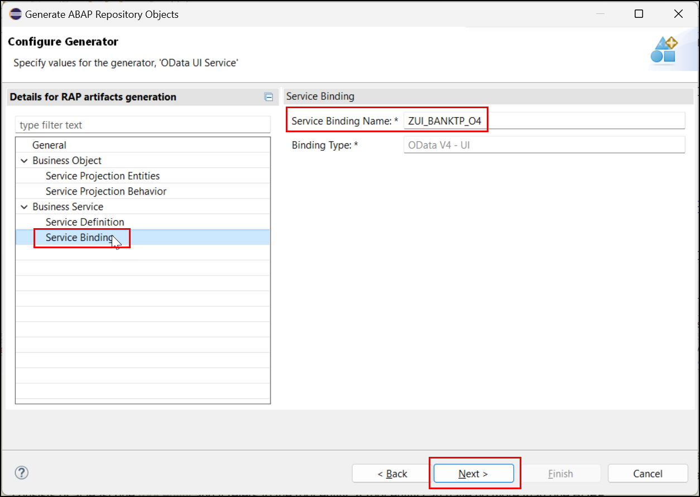

# Generate your own custom UI Service based on a Business Object Interface
<!-- description --> 
[Business Object Interfaces](https://help.sap.com/docs/abap-cloud/abap-rap/business-object-interface)  are provided by SAP in order to release business objects such as the business objects *SalesOrder* or *PurchaseRequistion* so that these business objects can used or extended by customers using the ABAP Cloud development model. By defining so called stability contracts it is thus possible to use such C1-released Business object interfaces within other software components. Also customers and partners can use this approach if they want to allow the usage of their business objects within other software components.
In order to make it easier for customers to build custom UI's on top the aforementioned released business objects SAP has provided a wizard as part of the ABAP Development Tools (ADT). 
This tutorial shows how you can use this wizard to generate your own custom UI on top of the SAP C1-released Business Object Interface `I_BankTP`. The same approach can be used for C1-released Business Object Interfaces that have been built by customers and partners.

## You will learn
- How do generate your own Custom UI Service based on a C1-released [Business Object Interface](https://help.sap.com/docs/abap-cloud/abap-rap/business-object-interface). For this tutorial we will use the Business Object Interface `I_BankTP` which is also available in SAP BTP ABAP Environment trial systems.  
- How to identify which authorization objects are needed to consume a SAP C1-released Business Object Interface.

## Prerequisites
- SAP BTP, ABAP Environment 
- SAP S/4HANA, ABAP Environment
- A package (e.g. `ZDEMO_UI_INTERFACE_###`) located in the software component ZLOCAL  

---

### Find the released Business Object Interface

  1. In the Project Explorer select the **Released Objects** tree and then the node `USE_IN_CLOUD_DEVELOPMENT`. Here you have to open the folder **Core Data Services** and then the folder **Behavior Definitions** where you find the C1-released Business Object Interface `I_BankTP`.

      

  2. Right-click on the interface  `I_BankTP` and select **Generate ABAP Repository Objects**  

      

  3. Select **OData UI Service** and then **Next**   

        

  4. Select the package `ZDEMO_UI_INTERFACE_###` by pressing the **Browse** button and press **Next**.

        

  5. The generator finishes with the *Configure Generator* screen. When you want to change the names of the repository objects that will be generated you can do so by selecting the entries **Service Projection Entities**, **Service Projection Behavior**, **Service Definition** and **Service Binding**.   
   
        
  
  6. When selecting **Service Projection Entities** you can change the suggested name of the CDS projection view(s).
     
        

  7. When selecting **Service Projection Behavior** you can change the suggested name of the **Behavior Implementation Class**. In addition you can decide whether your UI shall support draft as well when the underlying RAP business object provides draft, by checking **with draft**. 

        

  8. When selecting **Service Definition** you can change the suggested name of the **Service Definition Name**.

        

  9. When selecting **Service Binding** you can change the suggested name of the **Service Bindin Name**. By pressing **Next** you can start the generation process.  

        

  10. The wizard shows an overview of the repository objects that are going to be generated. Press **Next**.

        

  11. Select a transport or create a new transport and press **Finish** to start the generation of the repository objects.

        
    

### Publish service and test the application 

1. When the generation process is finished a new tab with the generated Service Binding will be opened. Click **Publish** to publish the service binding locally. In the project explorer you can see all objects that have been generated.    

      

      

2. Select the entity set `ZC_BankTP` and click **Preview** or double-click on the entity set `ZC_BankTP`. This will start the SAP Fiori Elements preview.  

      

3. In the preview of your app press the button **Create** to create a new bank.

      

4. Enter values in the fields **Bank Country / Region** e.g. `CZ` and **Bank Key** e.g. `1234` and press **Continue**.

      

5. The object page opens and you have to provide data for the remaining mandatory fields such as the **Bank Name**.  

        

### Troubleshooting

1. When your development user does not have the authorization to create new banks you will receive the following error message: **You are not authorized to create bank data for country/region CZ.**   

          

2. In order to identify the missing authorizations you can check the **Knowledge Transfer Document** of `I_BANKTP`. Either open it using the shortcut **Ctrl+Shift+A** or navigate to it in the Project Explorer as shown as shown below.  

      

3. As you can see the business object `I_BankTP` checks for the authorization objects `F_BNKA_MAO` and `F_BNKA_INT`.  

      

### More information

When you want to learn how to create authorizations please have a look at the following tutorial [Providing Authorization Control for a Business Configuration Maintenance Object](https://developers.sap.com/tutorials/abap-environment-authorization-control.html#603b6dda-dcfa-4b38-8734-fa03b8e70150).  

When you want to trace authorization checks please make use of *Display Authorization Trace* app.

### Test yourself

