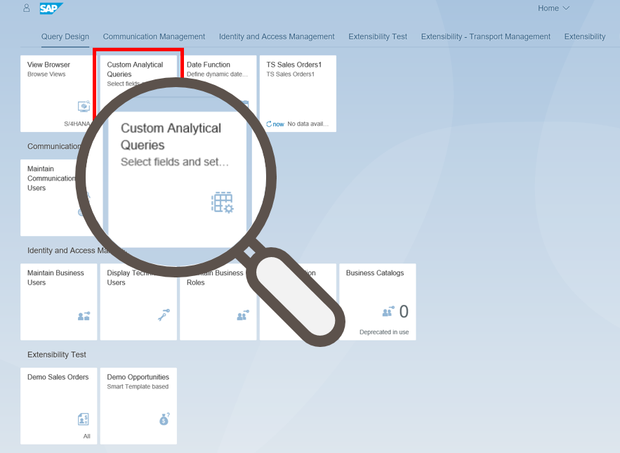
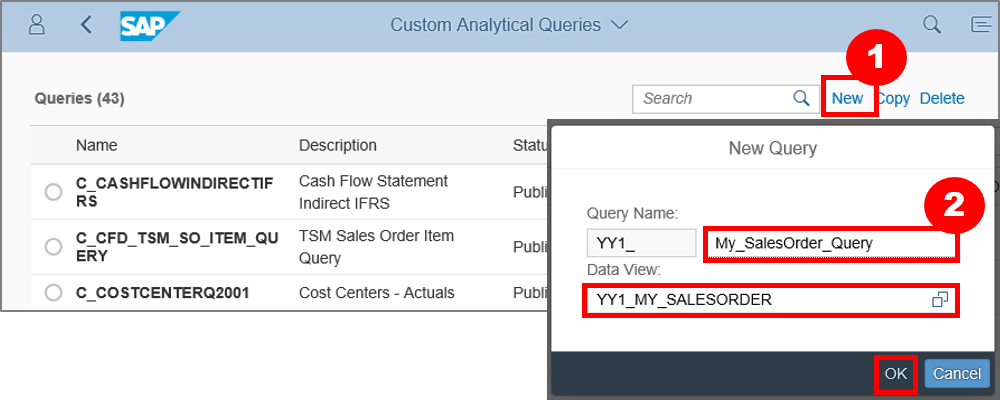
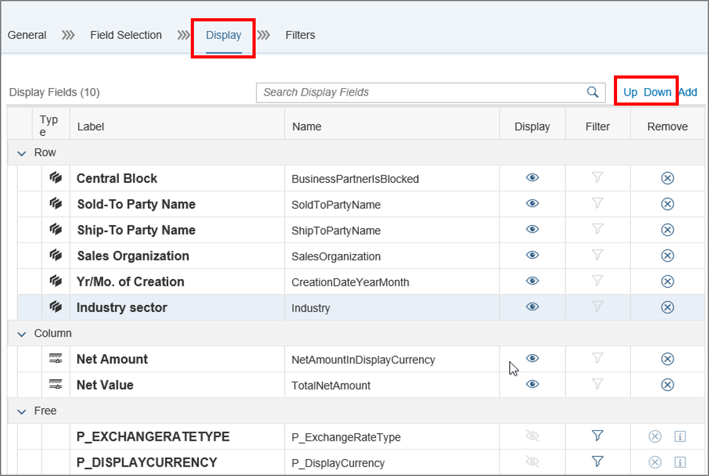
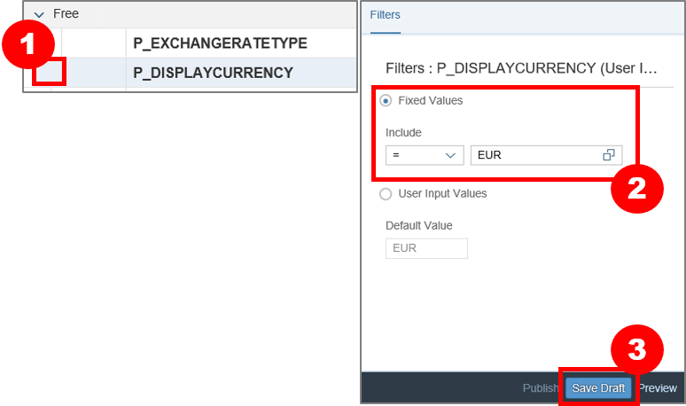

# Custom Reporting Analytical Query
<!-- description --> Create a Custom Query CDS View based on another Custom CDS View.

## Prerequisites  
The assignment of the Business Catalog **`SAP_CORE_BC_EXT`**, **`SAP_CA_BC_ANA_AQD_PC`** to your user and **`Abap Custom Reporting`** as tutorial represents the Prerequisites for the usage of Custom Reporting.

## Intro
Custom Analytical Queries is an application used for reporting and analysis. With this application you'll be able to transform and organize raw data from business documents into a meaningful grid. With Custom Analytical Queries you have the ability to select the required fields and set filters for your query. It allows you also to add restricted measures, calculate measures, and preview the query results.
## You will learn  
This tutorial teaches you how to publish a query based on another Custom CDS View. Before publishing you will be able to select fields in your query and set filters.
## Time to Complete
**15 Min**.

---
### Open Custom Analytical Queries Application

Open App **Custom Analytical Queries** in group **Query Design**.

### Add new Query

Click on **New** to search for the CDS View `YY1_My_SalesOrder` and also to select it.
Name this query as `YY1_My_SalesOrder_Query` and click afterwards on OK.

### Add Label to Query

Add in **General** tab add the label `My Sales Order Query based on Custom CDS View` to the query.

### Select Fields

In the tab **Field Selection** select the following fields for the query:

- `Central Block`
- `Yr/Mo. of Creation`
- `Industry sector`
- `Net Amount`
- `Sales Organization`
- `Ship-To Party Name`
- `Sold-To Party Name`
- `Net Value`

### Configure Display Attributes

On the tab **Display** configure the display attributes of the query by choosing
the up or down button. Take all labels from `Free` up to `Row` except for:

 - `P_EXCHANGERATETYPE` and
 - `P_DISPLAYCURRENCY`.

### Configure Filters

Configure filters for the fields in the **Filters** tab. Select `P_DISPLAYCURRENCY` and set `EUR` as a **Fixed Value**. Afterwards click on **Save**.

Result:
Query is saved as **Draft**.

### Publish Query

Select the query, which is saved as a draft and click on **Publish**.

Result:
This publishing step creates the required ODATA service and ensures that it can be used for KPI and Report Definition.

