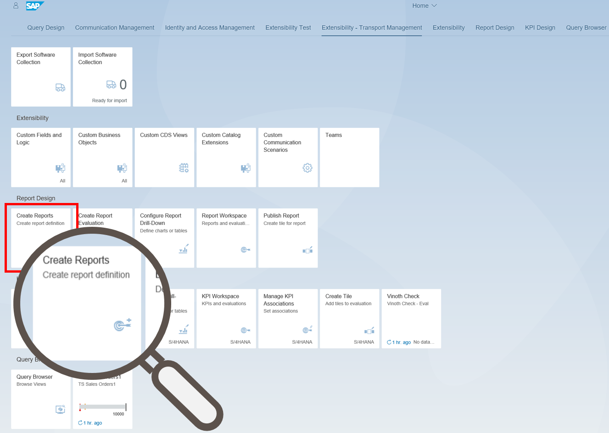
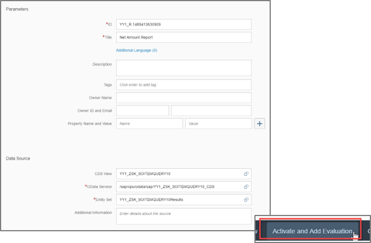
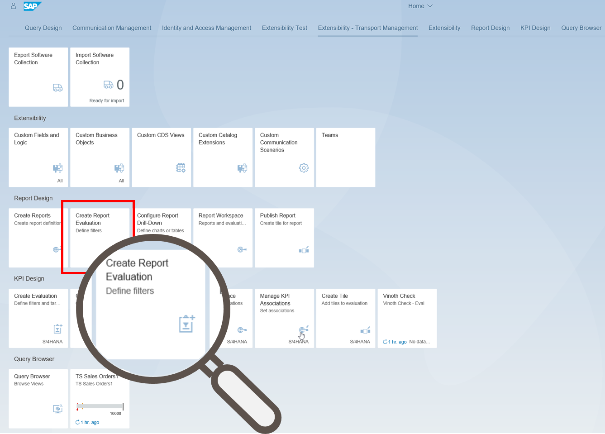
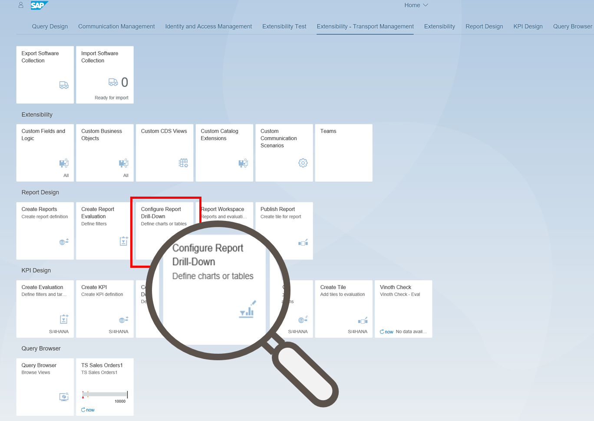
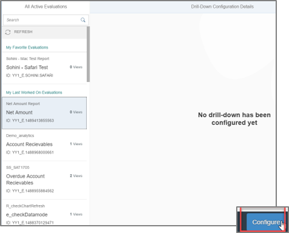
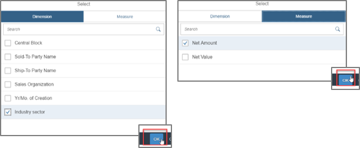
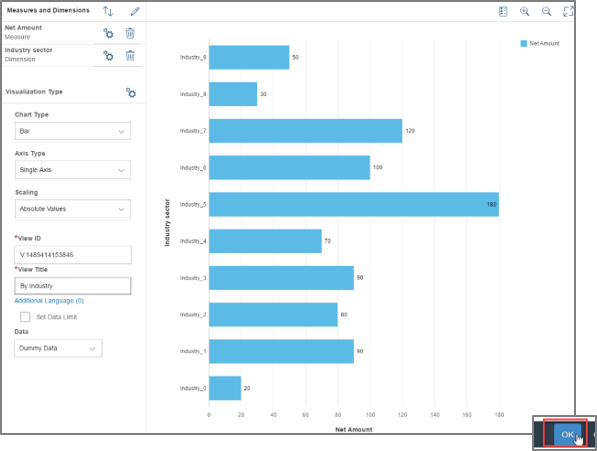
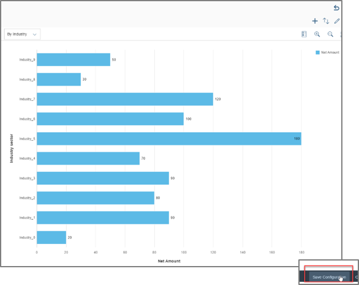
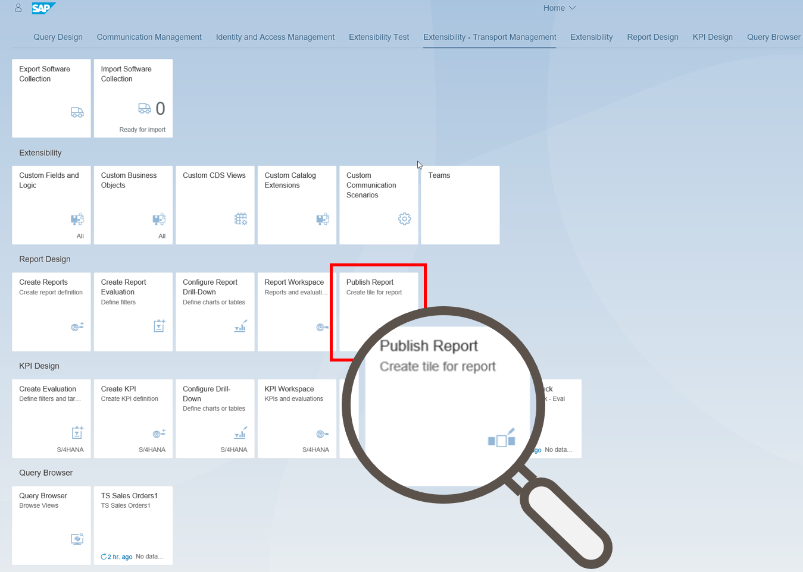
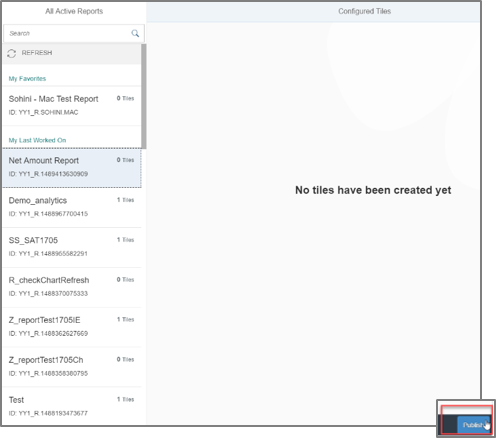

# Custom Reporting Design
<!-- description --> Using the Report Evaluation and Report Drill-Down to create basis for your report tile.

## Prerequisites  
The be able to realise this tutorial you need to assign the Business Catalog **`SAP_CA_BC_ANA_REP_PC`** to your user. Furthermore represents **`Abap Custom Reporting`** as tutorial the prerequisites for the usage of Custom Reporting.

## Intro
Custom Report are utilised to create and manage reports. With the Application Create Report Evaluation you are able to create and activate evaluations based on reports you have created by using the Create Reports Application. An evaluation combines parameters, filter settings and input parameters that you apply to a report. By using evaluations you can define, which information about your report is going to be displayed at runtime. The configuration of generic drill-down Application is enabled in the configure Report Drill-Down Application. By using the Application Publish Report you can create tiles for an active report.
## You will learn  
This tutorial is related to the creation and managing of reports. You also learn how to create an Report Evaluation, configure your Report Drill-Down Application and creating a tile for your active report.
## Time to Complete
**15 Min**.

---
### Open Create Reports Application

Open App **Create Reports** in group **Report Design**.

### Create Report

Create a report with the following data:

Title: `Sales Quantity Report`
CDS view: `YY1_MY_SALESORDER_QUERY`
Select the only available OData service and the only available Entity Set.

Click **Activate and Add Evaluation**.

### Create Report Evaluation

Open App **Create Report Evaluation** in group **Report Design**.

### Activate Report Evaluation

Add an Evaluation:
Evaluation: **Sales Quantity**

Click **Activate**.

### Configure Report Drill-Down

Open App **Configure Report Drill-Down** in group **Report Design**.

### Select Evaluation

Select the created Evaluation and click on **Configure**.

### Select Dimensions and Measures

Select dimensions and measures.

Click on **OK**.

### Define Title and Chart Type

Title: **By Customer Group**
Chart Type:  **Bar**

Click **OK**.

### Save

Click on Save Configuration.

### Open App Publish Report

Skip this step, if you are directly forwarded from **[5.2.3]**:
Open App **Publish Report** in group **Report Design**.

### Publish Report

Selected the created report and click on **Publish**.

### Save and Publish

Enter Semantic Object and Action.

Click on **Save and Publish**.

