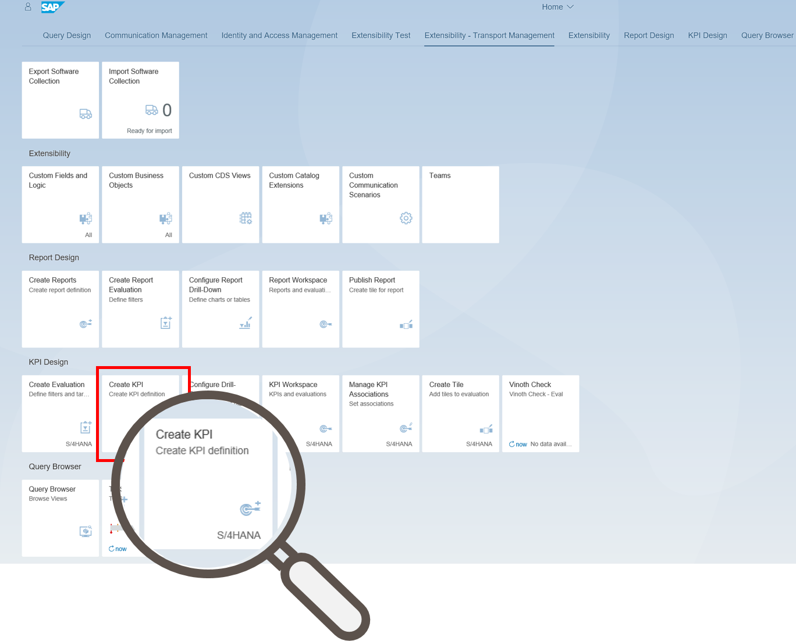
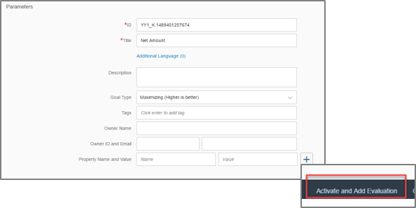
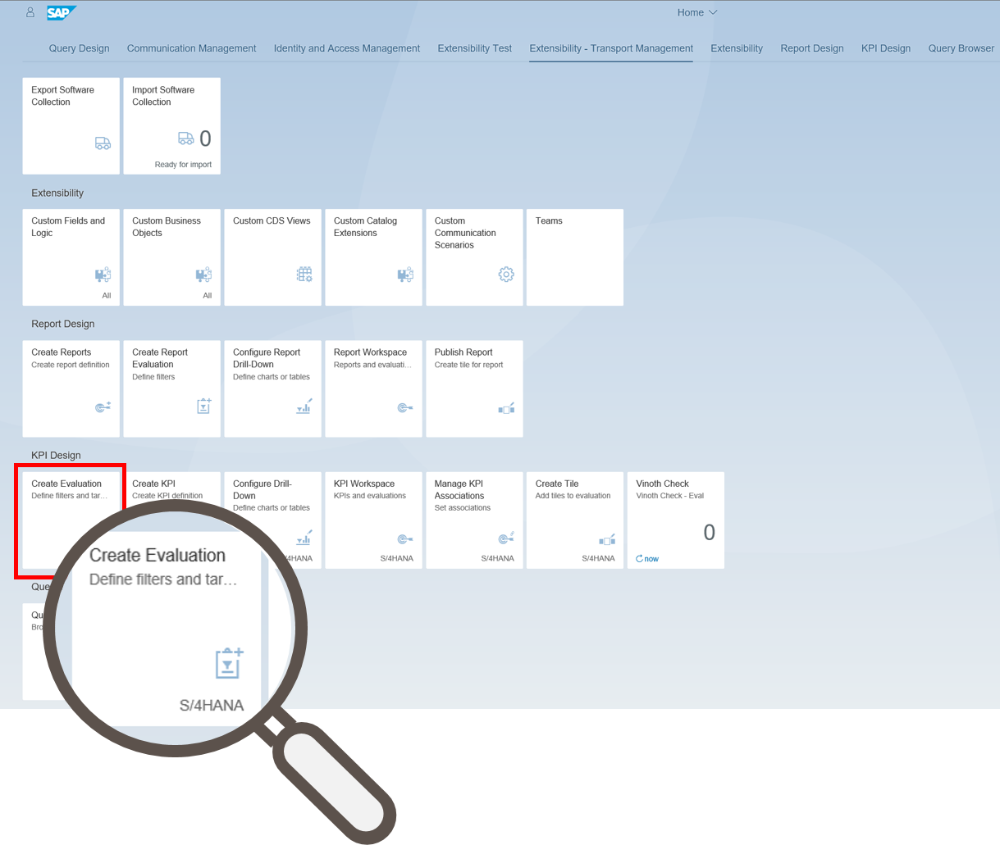
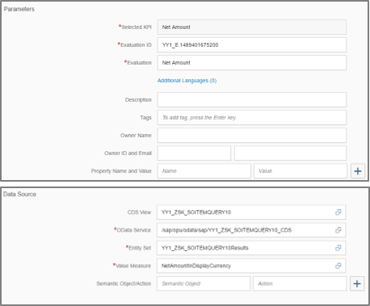
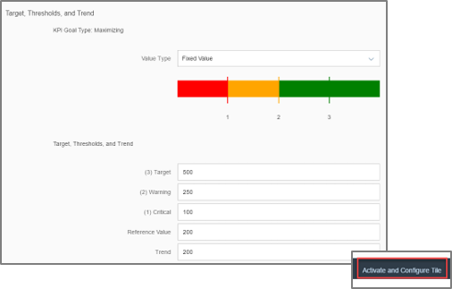
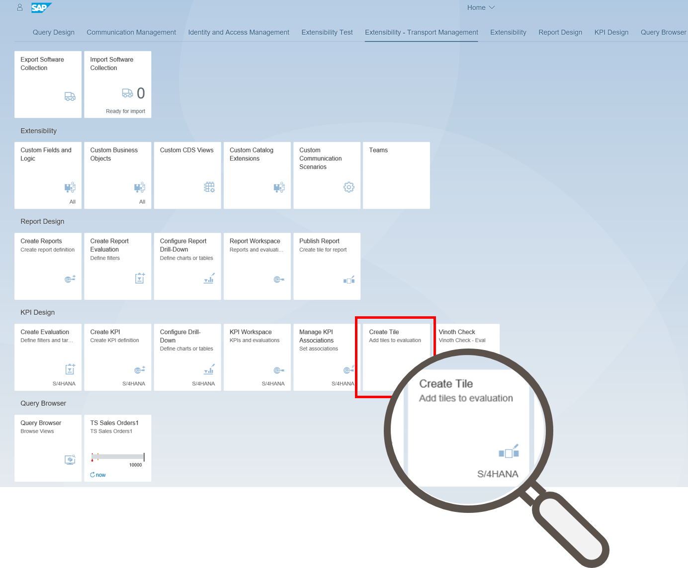
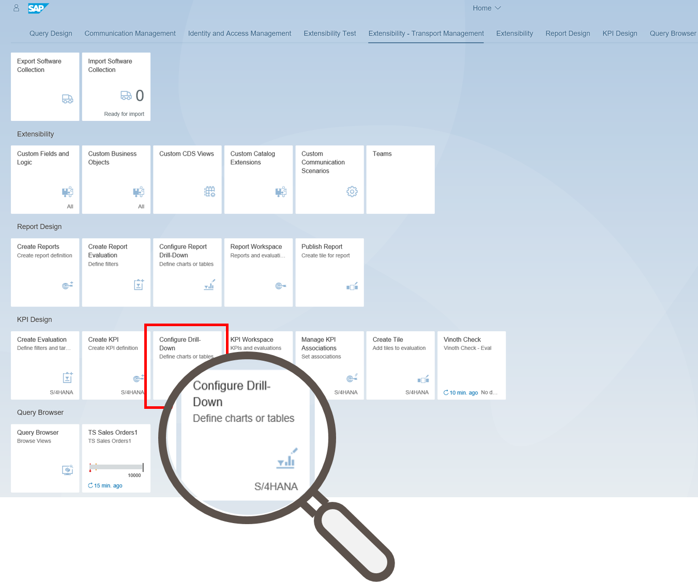
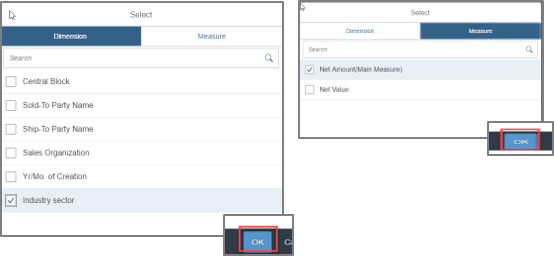
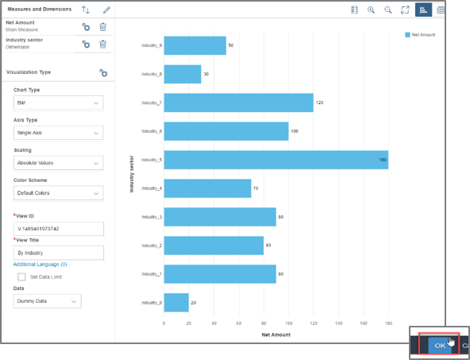
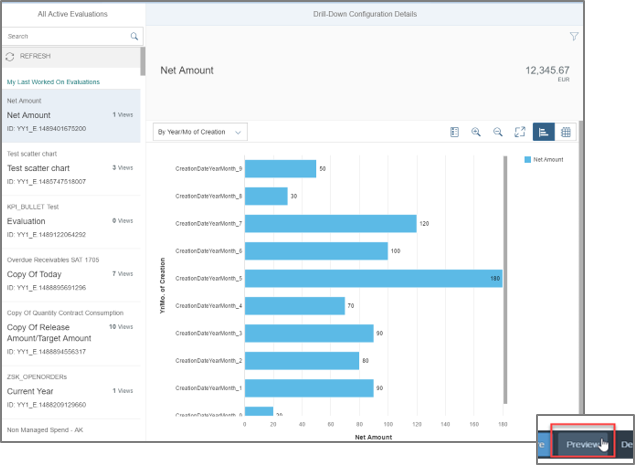

# Custom Reporting KPI Creation
<!-- description --> Create a new key performance indicator (`KPI`), evaluation and tile.

## Prerequisites  
You need to assign the Business Catalog **`SAP_CA_BC_SSB_PC`** to your user to have the ability of creating a key performance indicator (`KPI`). Reporting Design as Tutorial is a further Prerequisite for this tutorial.

## Intro
The Application Create KPI is used for creating new key performance indicators (`KPIs`) and to activate them as well. For `KPIs` you can also define evaluations, which you can create and activate by using the Application Create Evaluation. You can combine parameters, filter settings, input parameters and furthermore in your evaluation and apply this to a `KPI`. With the application Create Tile you are able to display an active evaluation and configure the drill-down navigation path for the tile. The generic drill-down application can be created by using the Create Dill-Down Application.
## You will learn  
This tutorial teaches you how to create `KPIs` and evaluations for them. You also learn how tiles and generic drill-down applications are created.
## Time to Complete
**15 Min**.

---
### Open Create KPI Application

Open App **Create KPI** in group **KPI Design**.

### Create KPI

Create a KPI with Title: **Net Amount** Goal Type: **Maximizing**
CDS view: **`YY1_ZSK_SOITEMQUERY10`**. Select the only available OData service
and the only available Entity Set. Value Measure: `NetAmountInDisplayCurrency`.

Click Activate and Add Evaluation.

### Create Evaluation

Skip this step, if you are directly forwarded from [5.1.1]:
Open App **Create Evaluation** in group **KPI Design**.

### Add Evaluation

Add an Evaluation Evaluation: **Sales Quantity** Value Type: **Fixed Value**
Target: **500** Warning: **250** Critical: **100** Reference Value: **200** Trend: **200**.

### Activate Tile

Click **Activate** and Configure Tile.

### Create Tile

Skip this step, if you are directly forwarded from [5.1.2]:
Open App **Create Tile** in group **KPI Design**.

### Add Attributes to Tile

Add a tile with the following attributes:

Tile Format: **Numeric Tile**
Title: **Net Amount**
Subtitle: **Net Amount**  
Keywords: **-**  
Cache Duration:  **1 Minutes**
Select Drill-Down: **Generic**
Semantic Object: **Net Amount**
Action: **Display**
Application Parameters: **-**.

Select **Save and Configure Drill-Down**.

### Configure Drill-Down

Skip this step, if you are directly forwarded from [5.1.3]:
Open App **Configure Drill-Down** in group **KPI Design**.

### Configure Evaluation

Select the created Evaluation and click on **Configure**.

### Select Dimension and Measure

Select a **dimension and measure**.

Click on OK.

### Choose View Title and View Type

Choose as View Title **By Industry** and as View Type **Bar**.

Click on **OK**.

### Save Configuration

Click on **Save Configuration**.

### Select Preview

Click on **Preview** to display the configured drill-down.

