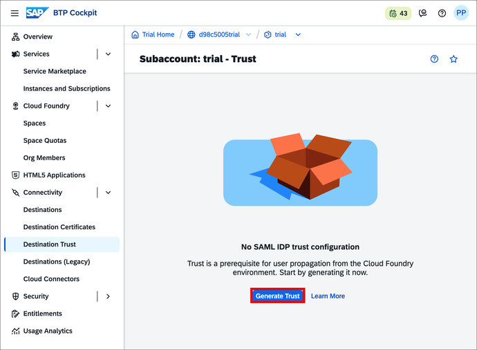
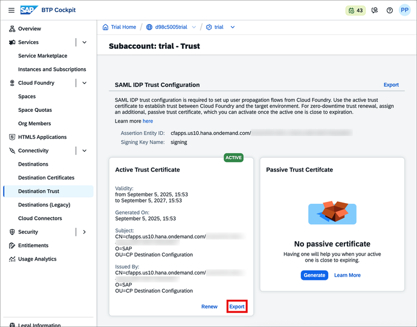

<!-- DONE with FYZ/100 and BTP Trial -->
# Connect SAP Business Application Studio and SAP S/4HANA Cloud System

<!-- description -->For key user extensibility connect SAP Business Application Studio and an SAP S/4HANA Cloud system using SAML assertion authentication to develop custom UIs.

## You will learn

- How to create an HTTP destination on SAP Business Technology Platform with SAML assertion authentication to an SAP S/4HANA Cloud system
- How to create a communication system for an SAP Business Application Studio subaccount in an SAP S/4HANA Cloud system

## Prerequisites

- You have an **SAP S/4HANA Cloud system** and a business user with **Communication Management** authorizations (this requires a business role with unrestricted write access containing business catalog `SAP_CORE_BC_COM` ).
- You have an **SAP Business Technology Platform Trial account** or customer account with an SAP Business Application Studio subscription
- You have set up mutual trust between the SAP BTP subaccount and the Identity Provider, see [Tutorial: Set Up Trust Between SAP Cloud Identity Services and SAP BTP Cloud Foundry Environment](abap-custom-ui-trust-cf)

#### Additional Infos

- If you want to create a custom SAP Fiori app with developer extensibility check out [Create a Shopping Cart Business Object](https://developers.sap.com/tutorials/abap-s4hanacloud-procurement-purchasereq-shop.html)
- Tutorial last checked for feasibility with SAP S/4HANA Cloud Release 2508
- Alternatively, see [Integrating SAP Business Application Studio](https://help.sap.com/viewer/0f69f8fb28ac4bf48d2b57b9637e81fa/latest/en-US/22bc724fd51a4aa4a4d1c5854db7e026.html) documentation for this tutorial's content with a customer account.

---

### Create destination to SAP S/4HANA Cloud system

SAP Business Application Studio requires connection information to request custom business object data from your SAP S/4HANA Cloud system and to deploy a UI into this system. That information is stored in the SAP Business Application Studio subaccount as a so-called destination. To create that destination, do the following:

Although this tutorial describes the flow with a trial account, the sequence is the same for a customer account after entering the subaccount of your choice.

1. In your web browser, open the SAP BTP Trial cockpit <https://account.hanatrial.ondemand.com> and **Go To Your Trial Account**, which is a so-called global account.

    

2. On your global account page, select default subaccount `trial`.

    

3. In the navigation pane expand the **Connectivity** section.

    

4. Select **Destinations**.

5. To simplify the destination creation and to reduce the risk of errors, this tutorial provides a template file for the destination. You can download [`SAML_ASSERTION_destination_template.json`](SAML_ASSERTION_destination_template.json) locally.

6. Create the destination either by uploading the text file via **Create → From File** (A) or if you want to input everything manually via **Create → From Scratch** (B).

7. In case of import (A) adapt the `Name` and `Description` to your needs and provide the mandatory value for `URL` and `Audience` and empty value for `Client Key` as shown below.

    In case of completely manual configuration (B) set the **Main Properties** as shown below.

    |  Field Name       | Value
    |  :--------------- | :-------------
    |  `Name`           | **`<YOUR_SYSTEMS_ID>_SAML_ASSERTION`**
    |  `Type`           | **`HTTP`**
    |  `Description`    | **`SAML Assertion Destination to SAP S/4HANA Cloud system <YOUR_SYSTEMS_ID>`**
    |  `URL`            | In the SAP S/4HANA Cloud system, navigate to the **Communication Systems** app, click the **Own SAP Cloud System** button, copy the **Host Name** and paste it with prefix `https://`, for example `https://my12345-api.s4hana.cloud.sap`
    |  `Proxy Type`     | **`Internet`**
    |  `Authentication` | **`SAMLAssertion`**

    Set the **SAML Properties** as follows:

    |  Field Name             | Value                                                                           | Remark
    |  :--------------------- | :-------------------------------------------------------------------------------| :-------------
    |  `AuthnContextClassRef` | **`urn:oasis:names:tc:SAML:2.0:ac:classes:PreviousSession`**                    |&nbsp;
    |  `Audience`             | Copy and paste the `OAuth 2.0 SAML2 Audience` from the **Own SAP Cloud System**.|&nbsp;
    |  `Client Key`           | Check _Set empty_ checkbox                                                      |&nbsp;
    |  `Name Id Format`       | **`urn:oasis:names:tc:SAML:1.1:nameid-format:emailAddress`**                    | Required in case your subaccount sends the e-mail address as SAML Subject Name Identifier for authentication (configured as **Subject Name Identifier** in its SAP Cloud Identity Service Application, see [Tutorial: Set Up Trust Between SAP Cloud Identity Services and SAP BTP Cloud Foundry Environment](abap-custom-ui-trust-cf)), although SAP S/4HANA Cloud system expects user login by default. **That is the case with a trial Account.** This also requires the e-mail address to be maintained for SAP S/4HANA Cloud system business users.

    Select **Add Property** and maintain the following **Additional Properties** and values.

    |  Field Name                      | Value                                                        | Remark
    |  :-------------------------------| :----------------------------------------------------------- | :-------------
    |  `HTML5.DynamicDestination`      | **`true`**                                                   |&nbsp;
    |  `HTML5.Timeout`                 | **`60000`**                                                  | value stated in milliseconds. 60000 equals 1 minute. Required as deployment needs longer than the standard of 30 seconds.
    |  `WebIDEEnabled`                 | **`true`**                                                   |&nbsp;
    |  `WebIDEUsage`                   | **`odata_abap,dev_abap`**                                    |&nbsp;

8. Make sure that the **Use default client trust store** checkbox is ticked in the Client Trust Store configuration.

    

9. Click **Save**.

### Download SAP BTP trust certificate

On the SAP S/4HANA Cloud system side, you need to allow SAP Business Application Studio to make inbound calls.

To set SAP Business Application Studio as a trusted caller in the SAP S/4HANA Cloud system, you first have to generate a SAML IDP Trust Configuration and thus an active trust certificate in the subaccount. The public part of this certificate is then exported and configured in the SAP S/4HANA Cloud system in the next step.

To do this, in the **Connectivity → Destination Trust** section, proceed as follows:

1. If the subaccount does not yet have a SAML Trust configuration for the Destination service, choose **Generate Trust**

    

2. Once generated, you have an active trust certificate, and its details are visible in the UI. **Export** the public part of this certificate, which downloads a certificate file in PEM format. Save this file for later.

    

The subaccount trust certificate might need to be renewed or rotated after a while. Please refer to [Manage Trust](https://help.sap.com/docs/connectivity/sap-btp-connectivity-cf/set-up-trust-between-systems?version=Cloud) in the SAP BTP Connectivity documentation for more information.

### Create communication system in SAP S/4HANA Cloud system

Regarding the overall trust settings, you will now make your SAP S/4HANA Cloud system trust your SAP Business Technology Platform subaccount.

That enables its SAP Business Application Studio to request data from the SAP S/4HANA Cloud system during Custom UI development and finally to deploy that UI to the SAP S/4HANA Cloud system. Both processes are so called inbound requests to the SAP S/4HANA Cloud system.

With the downloaded trust certificate from the SAP Business Application Studio subaccount, you can now maintain it as a communication system and by that as a trusted caller in the SAP S/4HANA Cloud system.

- Log on to your SAP S/4HANA Cloud system with the business user that is authorized for communication management.

- Start typing **Communication Systems** in the Launchpad search and open the App from the results.

    

- Select **New**.

    

- Enter a System ID and System Name, for example `BAS_<YOUR SUBACCOUNTS_SUBDOMAIN>` like `BAS_12AB34CDTRIAL` and choose **Create**.

    

### Configure communication system

This is how you have to configure the communication system that represents the SAP Business Application subaccount as a trusted caller.

- Navigate to **General > Technical Data**

    

- Tick the **Inbound Only** checkbox.

    

- Navigate to **General > Identity Provider** and slide the button for SAML Bearer Assertion Provider to **ON**.

    

- Choose **Upload Signing Certificate**, browse for the SAP BTP certificate and upload it.

    

- Set the **SAML Bearer Issuer** by inserting the CN attribute of the Signing Certificate Subject.

    

- Choose **Save**.

The connection is now set up and you can make use of the OData services of the SAP S/4HANA Cloud system in SAP Business Application Studio.  

### Test yourself

---
