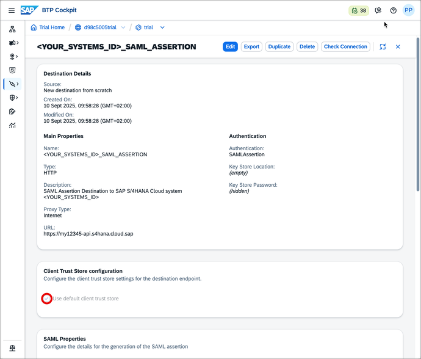
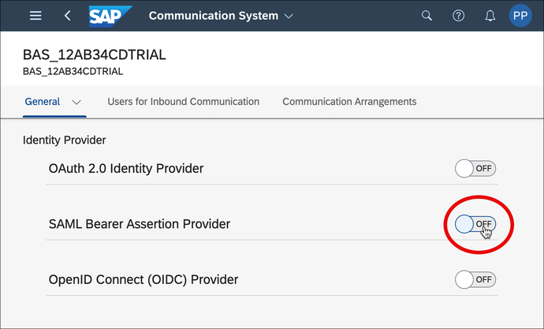
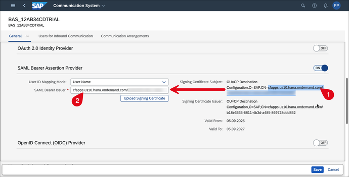

<!--DONE with E1Y-->
# Connect SAP Business Application Studio and SAP S/4HANA Cloud System
<!-- description --> Connect SAP Business Application Studio and an SAP S/4HANA Cloud system using SAML assertion authentication to develop custom UIs.

## Prerequisites
 - You have an **SAP S/4HANA Cloud system** and a business user with **Communication Management** authorizations (this requires a business role with unrestricted write access containing business catalog `SAP_CORE_BC_COM` ).
 - You have an **SAP Business Technology Platform trial account** with an SAP Business Application Studio subscription

## You will learn
- How to create an HTTP destination on SAP Business Technology Platform with SAML assertion authentication to an SAP S/4HANA Cloud system
- How to create a communication system for an SAP Business Application Studio subaccount in an SAP S/4HANA Cloud system

**Prerequisites for SAP BTP customer account**

To follow this tutorial, you can also use your customer account. However, for the customer account subaccount, you have to do the following additionally beforehand:

  - Set up mutual trust between the SAP BTP subaccount and the Identity Provider, see

    - [SAP BTP, ABAP environment documentation: Setup of a Custom Identity Service](https://help.sap.com/viewer/65de2977205c403bbc107264b8eccf4b/Cloud/en-US/550251abaf49432bbaa65147b65a1f39.html)

    - [Tutorial: Set Up Trust Between SAP Cloud Identity Services and SAP BTP Cloud Foundry Environment](abap-custom-ui-trust-cf)

    - [SAP BTP documentation: Trust and Federation with Identity Providers](https://help.sap.com/viewer/65de2977205c403bbc107264b8eccf4b/Cloud/en-US/cb1bc8f1bd5c482e891063960d7acd78.html)  

  - Assign the developer users permission for SAP Business Application Studio, see [SAP BTP, ABAP environment documentation: Assigning Permissions for SAP Business Application Studio](https://help.sap.com/viewer/65de2977205c403bbc107264b8eccf4b/Cloud/en-US/a08c1cb7def34798891b0a1ac6ddbd96.html)

Alternatively, see [Integrating SAP Business Application Studio](https://help.sap.com/viewer/0f69f8fb28ac4bf48d2b57b9637e81fa/latest/en-US/22bc724fd51a4aa4a4d1c5854db7e026.html) documentation for this tutorial's content with a customer account.

## Additional Information

>Tutorial last updated with SAP S/4HANA Cloud Release 2302

---

### Create destination to SAP S/4HANA Cloud system

SAP Business Application Studio requires connection information to request custom business object data from your SAP S/4HANA Cloud system and to deploy a UI into this system. That information is stored in the SAP Business Application Studio subaccount as a so-called destination. To create that destination, do the following:

Although this tutorial describes the flow with a trial account, the sequence is the same for a customer account after entering the subaccount of your choice.

1.  In your web browser, open the SAP BTP Trial cockpit <https://account.hanatrial.ondemand.com> and **Go To Your Trial Account**, which is a so-called global account.

    

2.  On your global account page, select default subaccount `trial`.

    

3.  In the navigation pane expand the **Connectivity** section.

    

4.  Select **Destinations**.

5.  To simplify the destination creation and to reduce the risk of errors, this tutorial provides a template text file for the destination. You can download [`YOUR_SYSTEMS_ID_SAML_ASSERTION_trial_s4hc_template_destination.txt`](https://raw.githubusercontent.com/sap-tutorials/abap-core-development/master/tutorials/abap-custom-ui-bas-connect-s4hc/YOUR_SYSTEMS_ID_SAML_ASSERTION_trial_s4hc_template_destination.txt) locally.

6.  Create the destination either by uploading the text file via **Import Destination** (A) or if you want to input everything manually via **New Destination** (B).

7.  In case of import (A) adapt the `Name` and `Description` to your needs and provide the mandatory value for `URL` and `Audience` as shown below.

    In case of completely manual configuration (B) set the values as shown below.

    |  Field Name     | Value
    |  :------------- | :-------------
    |  Name           | **`<YOUR_SYSTEMS_ID>_SAML_ASSERTION`**
    |  Type           | **`HTTP`**
    |  Description    | **`SAML Assertion Destination to SAP S/4HANA Cloud system <YOUR_SYSTEMS_ID>`**
    |  URL          | In the SAP S/4HANA Cloud system, navigate to the **Communication Systems** app and copy the **Host Name** from **Own SAP Cloud System** = `Yes`

 and paste it with prefix `https://` for example `https://my12345-api.s4hana.ondemand.com.`
    |  Proxy Type   | **`Internet`**
    |  Authentication | **`SAMLAssertion`**
    |  Audience   | Enter the URL of your system and remove `-api`, for example `https://my12345.s4hana.ondemand.com`.
    |  `AuthnContextClassRef` | **`urn:oasis:names:tc:SAML:2.0:ac:classes:PreviousSession`**

    Select **New Property** and maintain the following **Additional Properties** and values.

    |  Field Name     | Value          | Remark
    |  :------------- | :------------- | :-------------
    |  HTML5.DynamicDestination           | **`true`**   |&nbsp;
    |  HTML5.Timeout           | **`60000`**   | value stated in milliseconds. 60000 equals 1 minute. Required as deployment needs longer than the standard of 30 seconds.
    |  `WebIDEEnabled`    | **`true`**   |&nbsp;
    |  `WebIDEUsage`          | **`odata_abap,dev_abap`**   |&nbsp;
    |  `nameIDFormat`     | **`urn:oasis:names:tc:SAML:1.1:nameid-format:emailAddress`**  | Required in case your subaccount sends the e-mail address as SAML Subject Name Identifier for authentication (configured as **Subject Name Identifier** in its SAP Cloud Identity Service Application, see [Tutorial: SAP Business Technology Platform Neo Environment](abap-custom-ui-trust-settings)), although SAP S/4HANA Cloud system expects user login by default. **That is the case with a trial Account.** This also requires the e-mail address to be maintained for SAP S/4HANA Cloud system business users.

8.  Make sure that the **Use default JDK truststore** checkbox is ticked.

    

9.  Click **Save**.

### Download SAP BTP certificate

On the SAP S/4HANA Cloud system side, you need to allow SAP Business Application Studio to make inbound calls.

To set SAP Business Application Studio as a trusted caller in the SAP S/4HANA Cloud system, you first have to download the public key of the SAP Business Application Studio subaccount.

To do this, in the Destinations section, select **Download Trust**.

An untyped file with name `pk-\<your subaccounts ID\>` (for example `pk_9zy8xw7v-6u54-3tsr-21qp-1pqr234st56uv;`) is downloaded. Save this file for later.

### Create communication system in SAP S/4HANA Cloud system

Regarding the overall trust settings, you will now make your SAP S/4HANA Cloud system trust your SAP Business Technology Platform subaccount.

That enables its SAP Business Application Studio to request data from the SAP S/4HANA Cloud system during Custom UI development and finally to deploy that UI to the SAP S/4HANA Cloud system. Both processes are so called inbound requests to the SAP S/4HANA Cloud system.

With the downloaded public key from the SAP Business Application Studio subaccount, you can now maintain it as a communication system and by that as a trusted caller in the SAP S/4HANA Cloud system.

- Log on to your SAP S/4HANA Cloud system with the business user that is authorized for communication management.

- Start typing **Communication Systems** in the Launchpad search and open the App from the results.

    

- Select **New**.

    

- Enter a System ID and System Name, for example `BAS_<YOUR SUBACCOUNTS_SUBDOMAIN>` like `BAS_12AB34CDTRIAL` and choose **Create**.

    

### Configure communication system

This is how you have to configure the communication system that represents the SAP Business Application subaccount as a trusted caller.

- Navigate to **General > Technical Data**

    

- Tick the **Inbound Only** checkbox.

    

- Navigate to **General > SAML Bearer Assertion Provider** and slide the button to **ON**.

    

- Choose **Upload Signing Certificate**, browse for the SAP BTP certificate and upload it.

    

- Set the **Provider Name** by inserting the CN attribute of the Signing Certificate Subject.

    

- Choose **Save**.

The connection is now set up and you can make use of the custom business object OData services of the SAP S/4HANA Cloud system in SAP Business Application Studio.  

### Test yourself

---
