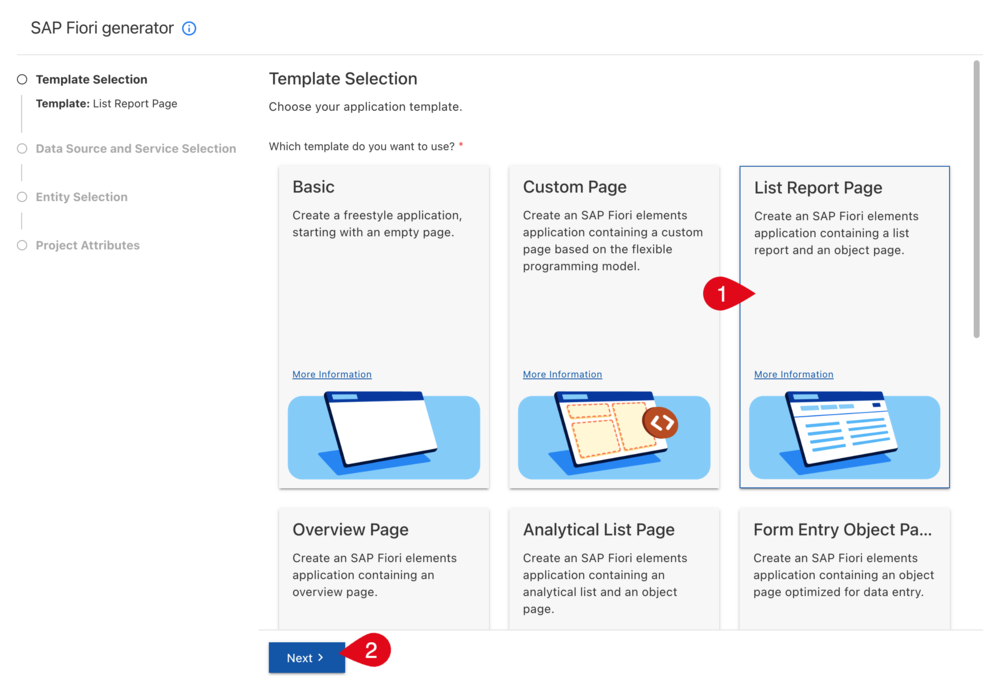
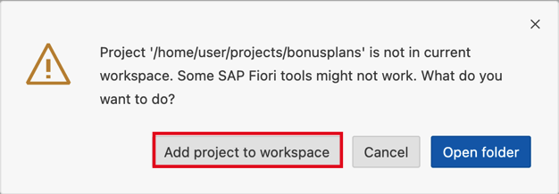

<!-- DONE with FYZ/100 and BTP Trial -->
# Develop a Custom UI for an SAP S/4HANA Cloud System

<!-- description -->As a key user develop a custom UI based on a custom business object OData service in SAP Business Application Studio for an SAP S/4HANA Cloud system.

## You will learn

- How to generate a Fiori elements list report with object page UI
- How to preview the UI
- How to deploy the UI as custom application to your SAP S/4HANA Cloud system
- This process of custom UI development is the way to go if the UI generated within the SAP S/4HANA Cloud system does not match your needs

## Prerequisites

- You have an **SAP S/4HANA Cloud system** for development and a business user with UI Development authorization. This requires a business role with unrestricted write access containing business catalog `SAP_CORE_BC_EXT_UI` (Extensibility - Fiori App Development).
- You have a custom business object with OData service running in the SAP S/4HANA Cloud system, for example `YY1_BONUSPLAN`, see [Create a Custom Business Object](abap-extensibility-cbo-create) as well as [Generate the UI for a Custom Business Object and grant Access](abap-extensibility-cbo-ui-generation). During creation of the custom business object, select the option to generate a Back End Service and deselect the option to generate a User Interface.
- You have an SAP Business Technology Platform (SAP BTP) Trial account with an SAP Business Application Studio subscription and a dev space within that, see preceding tutorials of this tutorial group.

#### Additional Info

- This tutorial illustrates all the needed steps to build a UI with all SAPUI5 options in SAP Business Application Studio, how to test it, and how deploy it into the SAP S/4HANA Cloud system. If your goal is simply to generate a user interface and make limited adjustments within the SAP S/4HANA Cloud system using in-app extensibility, refer to [Generate the UI for a Custom Business Object and grant Access](abap-extensibility-cbo-ui-generation) and [Adapt the UI of a Business Object](abap-extensibility-cbo-ui-adaptation).
- If you want to create a custom SAP Fiori app with developer extensibility check out [Create a Shopping Cart Business Object](abap-s4hanacloud-procurement-purchasereq-shop)
- Tutorial last checked for feasibility with SAP S/4HANA Cloud Release 2508

---

### Launch SAP Business Application Studio

**SAP Business Application Studio** is a subscription-based service in SAP BTP. The SAP trial account offers a Quick Tool Access directly from <https://account.hanatrial.ondemand.com>, however the following sequence describes the procedure via the global account in SAP BTP cockpit as needed for customer accounts. By choosing the trial specific **Quick Tool Access** (red dashed box) you can skip the following sequence.

1. In your web browser, open the SAP BTP Trial cockpit <https://account.hanatrial.ondemand.com> and **Go To Your Trial Account**, which is a so called global account.

    <!--border-->
    

2. On your global account page, select default subaccount `trial`.

    <!--border-->
    

3. In the navigation pane expand the **Services** section.

    <!--border-->
    

4. Select **Instances and Subscriptions**.

5. Click the link or the icon at the SAP Business Application Studio Subscription.

### Open UI project creation wizard

SAP Business Application Studio offers UI generators with a wizard approach to create UI projects.

1. Start your Dev Space in case it is not running

    <!--border-->
    

2. Open your Dev Space

    <!--border-->
    

3. Click the three lines on top of the navigation to open **View > Command Palette...**.

    <!--border-->
    

4. Search for command **>Fiori: Open Application Generator** and execute it.

    <!--border-->
    

### Select UI Project Template

As UI project template choose **List Report Page** (1) and click **Next** (2).

<!--border-->


### Select Data Source

During the **Data Source and Service Selection** step, you define which system and OData Service the UI is based on, so that data structure and action information is used to generate a UI. It's also used for the preview to show and change data.

<!--border-->


1. As your **Data Source**, select **Connect to a System**.

2. As your **System**, choose the destination you have created earlier in the tutorial [Connect SAP Business Application Studio and SAP S/4HANA Cloud system](abap-custom-ui-bas-connect-s4hc).

3. Select the OData service of your custom business object which ends with `_CDS`, for example `YY1_BONUSPLAN_CDS`.

4. Click **Next**.

### Select entity

In this step you define the root node for your UI in the OData service.

<!--border-->


1. As **Main Entity**, select the custom business object root node `YY1_BONUSPLAN`.

2. Choose **Next**.

### Set Project Attributes

In this step, you set project attributes and choose to add further optional configurations.

<!--border-->


1. Define a **Module name**, which will later be the folder name of the UI Project and - in combination with optional namespace - the application ID in SAP S/4HANA Cloud system. Example: `bonusplans`

2. Set the **Application title**, which will be visible as the browser tab title and title within the app. Example: `Bonus Plans`

3. Choose to **Add Deployment configuration** within the wizard by selecting `Yes`.

4. Choose to **Add FLP configuration** within the wizard by selecting `Yes`.

5. Select **Next**.

### Configure deployment settings

In this step, you define where you want the UI project to be deployed to as a runnable application.

<!--border-->


1. Leave the default `ABAP` as **target** platform and as **Destination** the one you have created earlier (see [Connect SAP Business Application Studio and SAP S/4HANA Cloud system](abap-custom-ui-bas-connect-s4hc)).

2. Enter a name for the **SAPUI5 ABAP Repository**. This is the repository that will be created and where the application will be deployed to. Example: `YY1_BONUSPLAN`. This repository name will be visible as your **Custom UI App ID** in your SAP S/4HANA Cloud system.

3. Enter a **Deployment Description** for the UI5 ABAP repository. This repository description will be visible as **Custom UI App Description** in your SAP S/4HANA Cloud system.

4. Select **Next**.

>Note that you can also configure the deployment later via the command line interface by using the following command:
>
>```Shell/Bash
>npx fiori add deploy-config
>```

### Configure SAP Fiori launchpad settings and generate

The SAP Fiori launchpad (FLP) configuration is required to embed your application as a tile into the FLP.

<!--border-->


1. Set a **Semantic Object**, for example `bonusplan`

2. Define the general **Action** that you want to be executed on the semantic object with the app, for example `manage`

3. Enter a **Title**, which will be displayed as the tile title in the FLP, for example `Manage Bonus Plans`

4. Select **Finish**.

The UI project is now being generated and dependencies are being installed. This may take a while and is displayed at the bottom right.

<!--border-->


Once the generation finished a pop up appears to ask if and how to open it. Choose **Add project to workspace**

<!--border-->


>Note that you can also configure the launchpad later via the command line interface by using the following command:
>
>```Shell/Bash
>npx fiori add flp-config
>```

### Open UI project folder (optional)

In case your SAP Business Application Studio's explorer does not show the project, do the following.

1. To view the newly created project in the explorer with all features, select **Open Folder**.

    <!--border-->
    

2. Choose the `home/user/projects` folder and select **OK**.

    <!--border-->
    

### Preview UI

In this step, you can test the UI with the preview functionality.

1. After Opening the project, Business Application Studio also opens an **Application Info** tab. Click the **Preview Application** tile.

    <!--border-->
    

    > Note that in case there is no Application Info tab you can open it from the context menu of the project:
    >
    > <!--border-->
    > 

2. Select the `start` option, which will perform a preview based on the configured data source system, retrieve real data and enable you to create, edit and delete data in that system.

    <!--border-->
    

    A terminal is opened that automatically executes the underlying command.

    <!--border-->
    

    Once the command has reached the required state, a new browser tab with the preview is opened.

    > Alternatively to Preview from Application Info tab, you can open a terminal for your project by right-clicking it and choosing **Open in Integrated Terminal** from the context menu.
    >
    ><!--border-->
    >
    >
    > In the `cli` (command line interface) terminal, enter the following command:
    >
    >```Shell/Bash
    >npm run start
    >```
    >
    >Press return.

3. To view existing entries, select **GO** or **Create** to add a new entry.

    <!--border-->
    

### Deploy UI to SAP S/4HANA Cloud system

Once the UI is set up to your needs, you can deploy it to the development SAP S/4HANA Cloud system, where it can be tested and transported to test or productive tenants.

1. In the **Application Info** tab, click the **Deploy** tile

    <!--border-->
    

    > Alternatively to Application Info, in the `cli` (command line interface) terminal, enter the following command:
    >
    >```Shell/Bash
    >npm run deploy
    >```
    ><!--border-->
    >
    >
    >Press return.

2. Check the deployment configuration.

    <!--border-->
    

3. Confirm the deployment by entering `y`

    <!--border-->
    

4. Deployment will start, which might take a while.

    <!--border-->
    

    Once the deployment is completed, a **Deployment Successful.** message is displayed in the log.

### Test yourself

---
