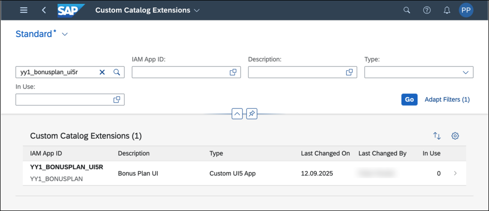
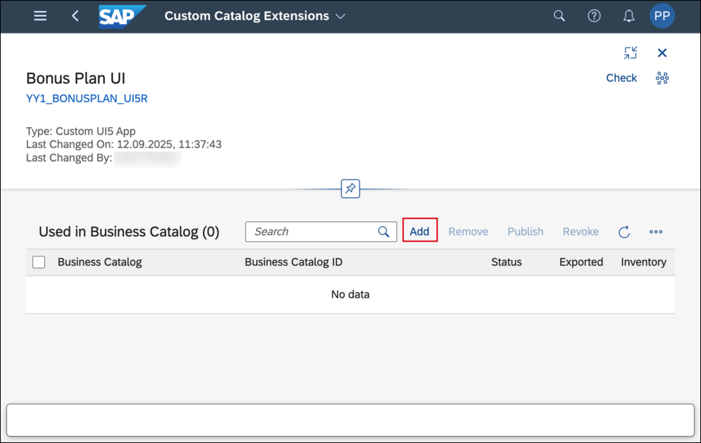

<!--a lot in common with abap-extensibility-cbo-ui-generation -->

#  Add Custom UI Application Tile to SAP Fiori Launchpad
<!-- description -->  Extend a business catalog with custom UI application.

## Prerequisites
- **Authorizations:** Your user needs a business role with business catalogs **Extensibility - Custom Business Objects** (ID: `SAP_CORE_BC_EXT_CBO`) and  **Extensibility - Custom Catalog Extensions** (ID: `SAP_CORE_BC_EXT_CCE`) in your **SAP S/4HANA Cloud** system

## You will learn
- How to make the custom UI visible as an application tile in SAP Fiori launchpad

## Intro
As application availability in Fiori Launchpad and authorization for it is managed via authorizing Business Catalogs, you will see how to extend such a business catalog with your new app.

>Tutorial last updated with SAP S/4HANA Cloud Release 2302

---

### Open custom catalog extensions

Start typing **Custom Catalog Extensions** in the Launchpad search and open the App from the results.

### Find and select application

Search your application and select it.

The ID of your application is the combination of the name that you gave when deploying it from SAP Business Technology Platform to S/4HANA Cloud including the prefix `YY1_` plus the suffix `_UI5R`. It is of type `Custom UI App`.  

### Extend business catalog

Press **Add** to start extending the business catalog that the new app shall be part of.

In the opening value help narrow down the result list by searching for `Custom Business`, select the Catalog with role ID `SAP_CORE_BC_EXT_CBO` and press **OK**.

>You could also choose another Catalog, but be aware that your user must have a Business Role containing that catalog to be able to access the created application.

**Select** the just added Catalog and **Publish** it.

This step takes some minutes, the screen refreshes automatically and once the status switches from unpublished to published, you can close this application's window and proceed.

### Open custom UI App

Start typing **Manage Bonus Plans** in the Launchpad search and open the App from the results.

The List Screen will open. As by default a list screen does not show the existing list entries you have to press the **Go** button to get these.

To get into the details screen of a Bonus Plan you can click its whole entry in the list.

### Test yourself

