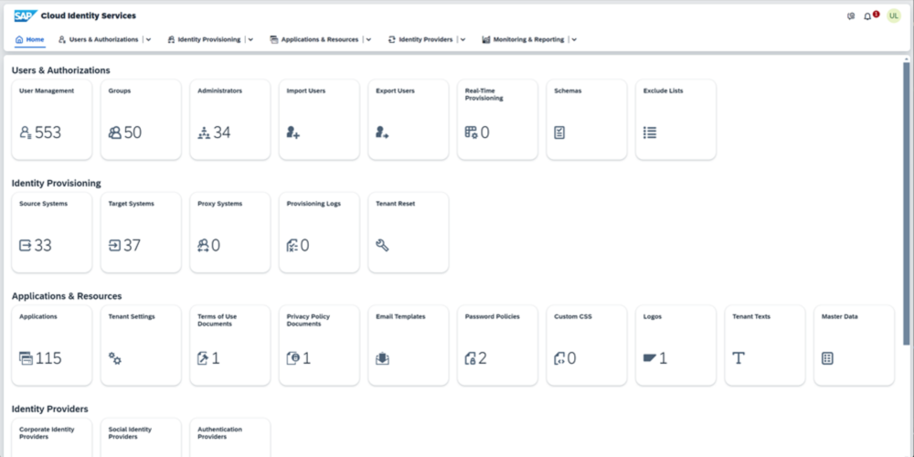
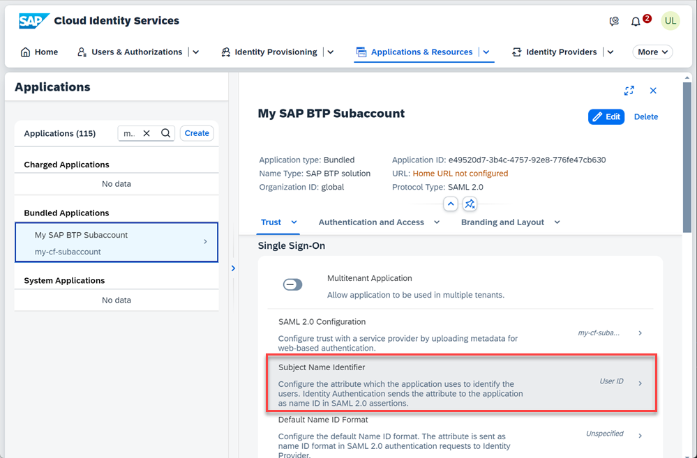
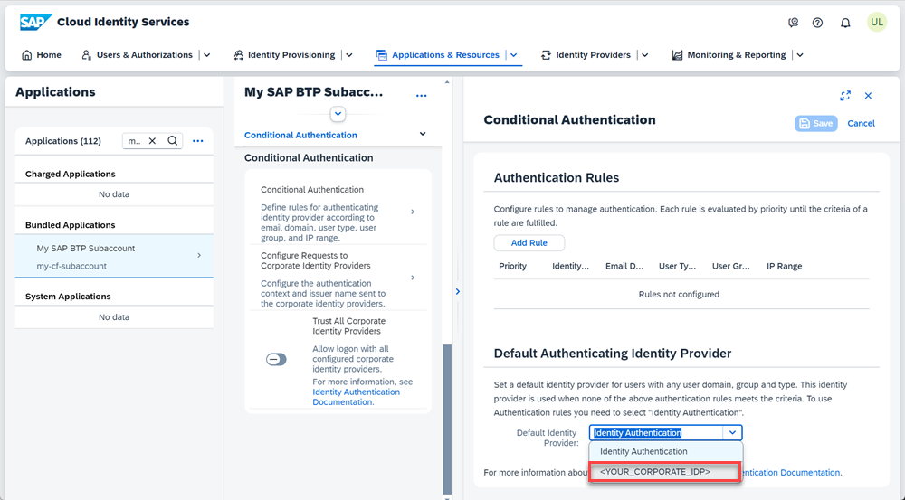

<!--done with Global Account: ABAP Environment Staging Consump > Subaccount: Integration Tests Staging (CF) https://canary.cockpit.btp.int.sap/cockpit/#/globalaccount/2fcd6ac6-b8e0-40e8-aa71-a357aa99585e/subaccount/f57f211e-2733-4cc6-b645-74f02d034a58/subaccountoverview-->
# Set Up Trust Between SAP Cloud Identity Services and SAP BTP Cloud Foundry Environment
<!-- description --> Set up trust between SAP Cloud Identity Services - Identity Authentication and SAP Business Technology Platform Cloud Foundry Environment for secure communication via SAML 2.0.

## Prerequisites
**Authorizations**: Your user needs
- Administrator access to your **SAP Business Technology Platform** Cloud Foundry subaccount
- Administrator access to your **SAP Cloud Identity Services tenant**

**Glossary**

*Identity*: individual people, but also computers, services, computational entities like processes and threads, or any group of such things

*Identity Provider*: system entity that creates, maintains, and manages identity information for identities

*Identity Authentication*: process of authenticating an identity

*SAP Cloud Identity Services*: SAP's solution to enable identity authentication

*SAP Cloud Identity Services tenant*: a customer's instance of the services

*SAP Cloud Identity Services console*: Web application to configure your tenant

## You will learn
- How to set up SAP Business Technology Platform subaccount for secure communication (with Security Assertion Markup Language = SAML 2.0)
- How to set up SAP Business Technology Platform subaccount on SAP Cloud Identity Services for secure communication
- How to get necessary information from your SAP Business Technology Platform subaccount and your SAP Cloud Identity Services tenant to set up the mutual trust between them

**Additional Information**
>Tutorial last updated in May 2023

- **Documentation:** [SAP Cloud Identity Services - Identity Authentication](https://help.sap.com/viewer/6d6d63354d1242d185ab4830fc04feb1/Cloud/en-US/d17a116432d24470930ebea41977a888.html)

>Be aware that in case of an integration with SAP S/4HANA Cloud the used Identity Authentication for the subaccount should be the very same as the one used for the SAP S/4HANA Cloud system.
>
>Your SAP S/4HANA Cloud system you got already delivered by SAP with a configured trust between it and your SAP Cloud Identity Services tenant. Now you will configure the trust between that and your SAP Business Technology Platform subaccount on your own.
>
>

---
<!--tested with https://canary.cockpit.btp.int.sap/cockpit/#/globalaccount/2fcd6ac6-b8e0-40e8-aa71-a357aa99585e/subaccount/f57f211e-2733-4cc6-b645-74f02d034a58/subaccountoverview (ABAP Environment Staging Consump -> Integration Tests Staging (CF))-->

### Get SAML metadata of SAP BTP subaccount

To set up the trust from Identity Authentication to the subaccount you need the subaccount's SAML metadata.

1. Enter the SAP Business Technology Platform subaccount as an administrator and expand the **Security** area.
   
2. Open **Trust Configuration**.
   
3. Click **SAML Metadata**.

### Enter SAP Cloud Identity Services administration console

Open the SAP Cloud Identity Services administration console with its URL which follows the pattern:

`https://<YOUR_TENANTS_ID>.accounts.ondemand.com/admin`

The Tenant ID is an automatically generated ID by the system. The first administrator created for the tenant receives an activation e-mail with an URL in it. This URL contains the tenant ID.

SAP Cloud Identity Services administration console entry screen looks (depending on authorizations) like that

### Add SAP BTP subaccount as application

The subaccount is represented in SAP Cloud Identity Services as Application.

Choose **Applications & Resources** (1) and go to **Applications** (2). Click **Create** (3) on the left hand panel and enter a **Display Name** (4) to represent your SAP Business Technology Platform subaccount. **Save** (5) your changes.

### Configure application's trust with subaccount

1. The newly created application will be shown, choose **SAML 2.0 Configuration**.

    

2. **Browse** for the metadata XML file of your SAP Business Technology Platform subaccount and upload it. By this all needed properties are gotten from the XML file.

    
   
3. **Save** the SAML 2.0 configuration.

### Set applications's Subject Name Identifier

Now you have to configure which attribute is used to identify users during `SAML2.0` secure communication. By default this is **`User ID`**, but as SAP S/4HANA Cloud by default works with **`Login Name`** it shall be switched to that.

1. Still being in your application's Trust settings select **Subject Name Identifier**.

    

2. Under Basic Configuration choose **Login Name** from the dropdown list for the attribute and save your changes.

    

### Configure application's Default Identity Provider

As most common use case the SAP Cloud Identity Services - Identity Authentication does not act as Identity Provider itself but as proxy for an already existing corporate identity provider. This has to be set now.

Still being in your application's Trust settings switch to **Conditional Authentication** and select it.

Select your corporate identity provider as **Default Identity Provider** and click **Save**.

### Get SAML metadata of SAP Cloud Identity Services tenant

To set the SAP Cloud Identity Services tenant as trusted identity provider in the SAP Business Technology Platform subaccount next, you need to get its SAML metadata first.

1. Choose **Applications & Resources**

2. Switch to **Tenant Settings**

3. Go to **Single Sign-On** section

4. Open **SAML 2.0 Configuration**

5. **Download Metadata file**
   
    

>Alternatively you can open the metadata XML by entering your tenant's web address for it which follows pattern `https://<YOUR_TENANTS_ID>.accounts.ondemand.com/saml2/metadata` and saving that XML to a file.

### Add SAP Cloud Identity Services tenant as SAP BTP subaccount's trusted identity provider

Switch back to your SAP Business Technology Platform cockpit and go to your trust configuration.

Choose **New Trust Configuration** to add a trusted identity provider.

Upload the metadata XML file of your SAP Cloud Identity tenant in the **Metadata File** field, give a **Name**, as for example the tenant id. **Save** your changes.

### Test yourself

