# Set Up Trust Between Identity Authentication and SAP Business Technology Platform Neo Environment
<!-- description --> Set up trust between SAP Cloud Identity Services - Identity Authentication and SAP Business Technology Platform for secure communication via SAML 2.0.

## Prerequisites
**Authorizations**: Your user needs
- Administrator access to your **SAP Business Technology Platform** (aka SAP BTP) Neo subaccount
- Administrator access to your **SAP Cloud Identity Services tenant**

**Glossary**

*Identity*: individual people, but also computers, services, computational entities like processes and threads, or any group of such things

*Identity Provider*: system entity that creates, maintains, and manages identity information for identities

*Identity Authentication*: process of authenticating an identity

*SAP Cloud Identity Services*: SAP's solution to enable identity authentication

*SAP Cloud Identity Services tenant*: a customer's instance of the services

*SAP Cloud Identity Services console*: Web application to configure your tenant

## You will learn
- How to set up SAP Business Technology Platform Subaccount for secure communication (with Security Assertion Markup Language = SAML 2.0)
- How to set up SAP Business Technology Platform Subaccount on SAP Cloud Identity Services - Identity Authentication for secure communication
- How to get necessary information from your SAP Business Technology Platform Subaccount and your SAP Cloud Identity Services - Identity Authentication tenant to set up the mutual trust between them

## Intro
>Be aware that in case of an integration with SAP S/4HANA Cloud the used Identity Authentication for the SAP BTP subaccount should be the very same as the one used for the SAP S/4HANA Cloud system.
>
>Your SAP S/4HANA Cloud system you got already delivered by SAP with a configured trust between it and your SAP Cloud Identity Services tenant. Now you will configure the trust between that and your SAP BTP subaccount on your own.
>
>

## Additional Information
- **Documentation:** [SAP Cloud Identity Services - Identity Authentication](https://help.sap.com/viewer/6d6d63354d1242d185ab4830fc04feb1/Cloud/en-US/d17a116432d24470930ebea41977a888.html)
- Tutorial last updated: November 2024
---

<!--tested with https://account.int.sap.eu2.hana.ondemand.com/neo/#/globalaccount/2fcd6ac6-b8e0-40e8-aa71-a357aa99585e/neosubaccount/33ab7aa1-3c4f-45dd-9b2d-8801b652cc8b/accountdashboard (ABAP Environment Staging Consumption -> Integration Tests Staging (Neo)) and IAS abapcp-staging.accounts400.ondemand.com; twin to abap-custom-ui-trust-cf-->

### Enter trust management of subaccount

Enter the SAP Business Technology Platform subaccount as an administrator and expand the **Security** area to open Trust Management by clicking the **Trust** section.

<!--border-->

### Set subaccount as service provider

To enable secure (Security Assertion Markup Language = SAML 2.0) communication the SAP Business Technology Platform Subaccount has to be set up as Service Provider.

Being in the trust management, click **Edit** to change the default Local Service Provider.

<!--border-->
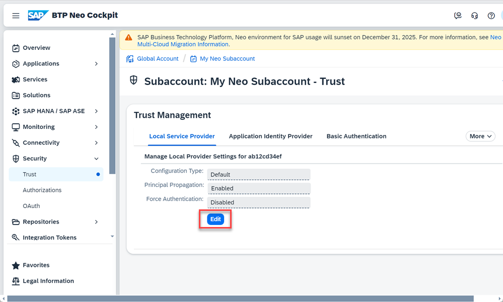

Change and add following information to your local provider:

| ------------------------------------------- | ------------------------------------------- |
|           **Configuration Type**            |                    `Custom`                   |
|           **Local Provider Name**           | `<platform region s URL>/<subaccount name>` (set automatically) |
|          **Principal Propagation**          |                 `Enabled`                 |
|          **Force Authentication**           |               `Disabled`            |

Click **Generate Key Pair**

<!--border-->
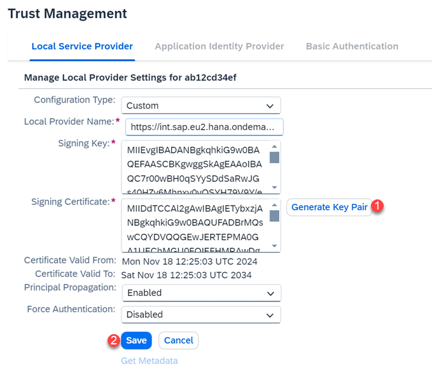

**Save** your changes.

**Confirm** the "Now you can proceed to configuring the trusted identity provider settings on the next tab." pop up.

### Get metadata of subaccount

To set up the trust from Identity Authentication to the Subaccount soon you need the subaccount's metadata.
Download the metadata by clicking **Get Metadata**.

<!--border-->
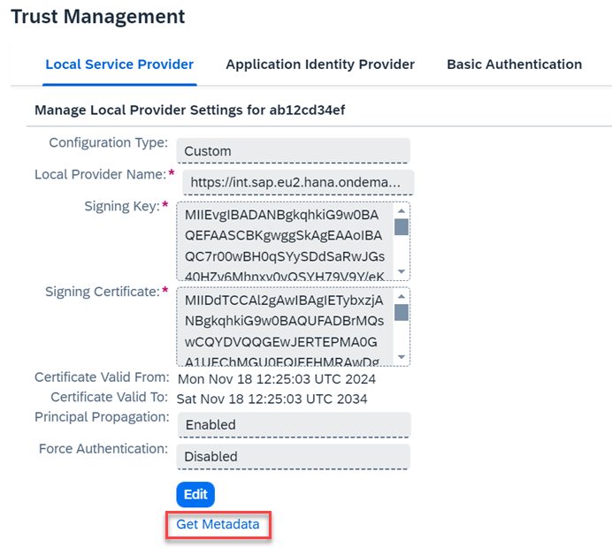

### Enter Identity Authentication Administration Console

Open the SAP Cloud Identity Services - Identity Authentication Administration Console with its URL which follows the pattern:

`https://<YOUR_TENANTS_ID>.accounts.ondemand.com/admin`

Tenant ID is an automatically generated ID by the system. The first administrator created for the tenant receives an activation e-mail with a URL in it. This URL contains the tenant ID.

SAP Cloud Identity Services - Identity Authentication Administration Console entry screen looks (depending on authorizations) like that

<!--border-->

### Add SAP BTP subaccount as an application

The SAP BTP subaccount is represented in SAP Cloud Identity Services as Application.

Choose **Applications & Resources** (1) and go to **Applications** (2). Click **Create** (3) on the left hand panel and enter a **Display Name** (4) to represent your SAP BTP subaccount. **Create** (5) the application.

<!--border-->
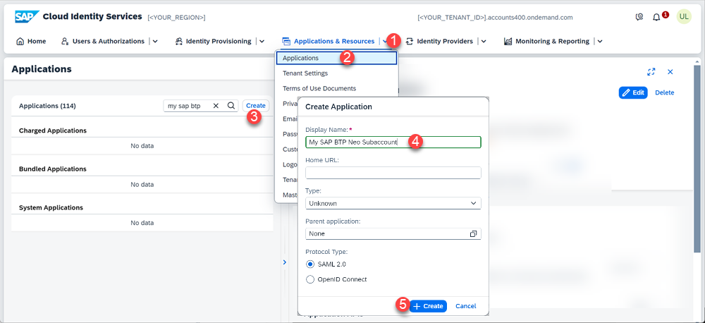

### Configure application's trust with SAP BTP subaccount

1. The newly created application will be shown, choose **SAML 2.0 Configuration**.

    <!--border-->
    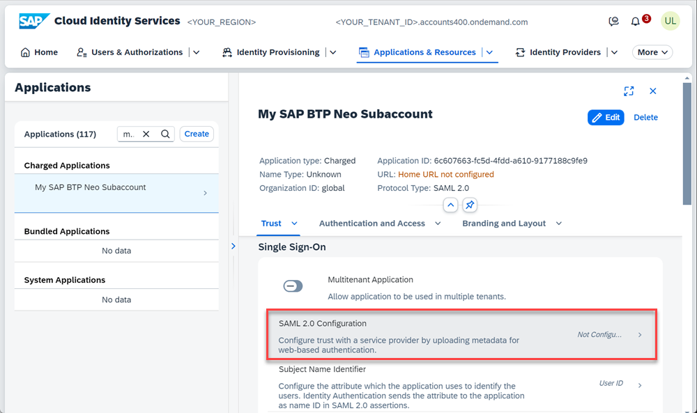

2. **Browse** (1) for the SAML metadata XML file of your SAP BTP subaccount that you downloaded before and upload it. 

    <!--border-->
    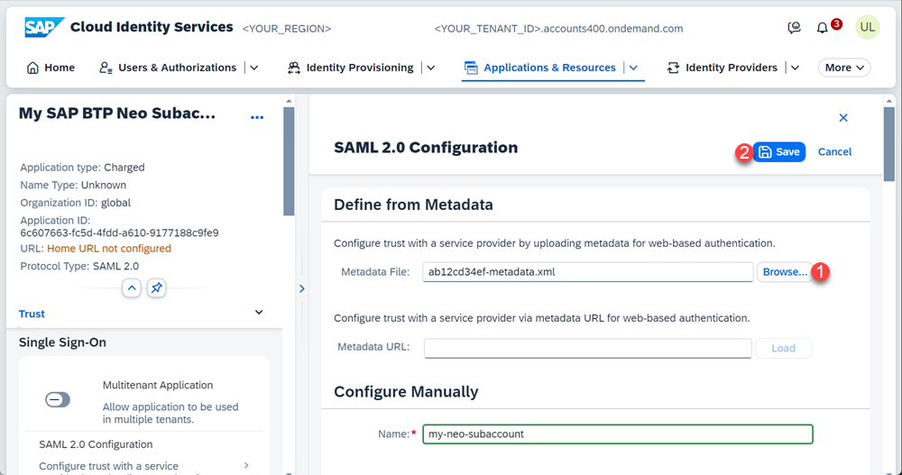

    All the needed properties will be automatically fetched from the XML file.
   
3. **Save** (2) the SAML 2.0 configuration.

### Set application's Subject Name Identifier

Now you have to configure which attribute is used to identify users during `SAML2.0` secure communication. By default this is **`User ID`**, but as SAP S/4HANA Cloud by default works with **`Login Name`** it shall be switched to that.

1. Still being in your application's Trust settings select **Subject Name Identifier**.

    <!--border-->
    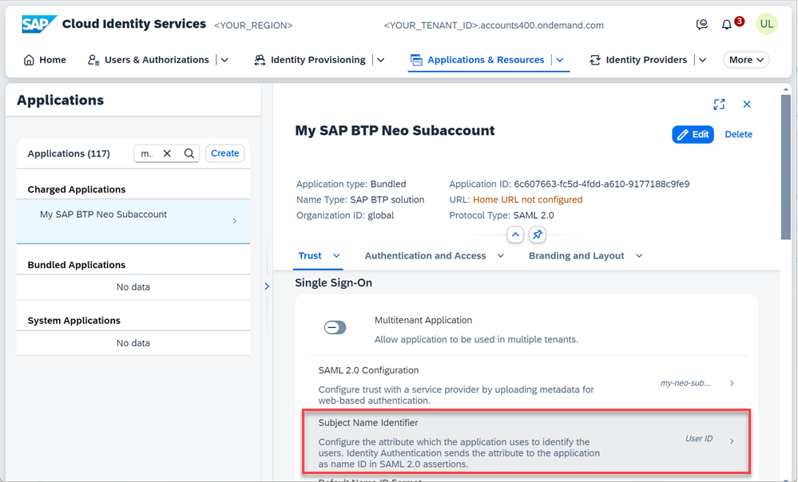

2. Under **Primary Attribute** use **Identity Directory** as **Source**, choose **Login Name** as **Value** and save your changes.

    <!--border-->
    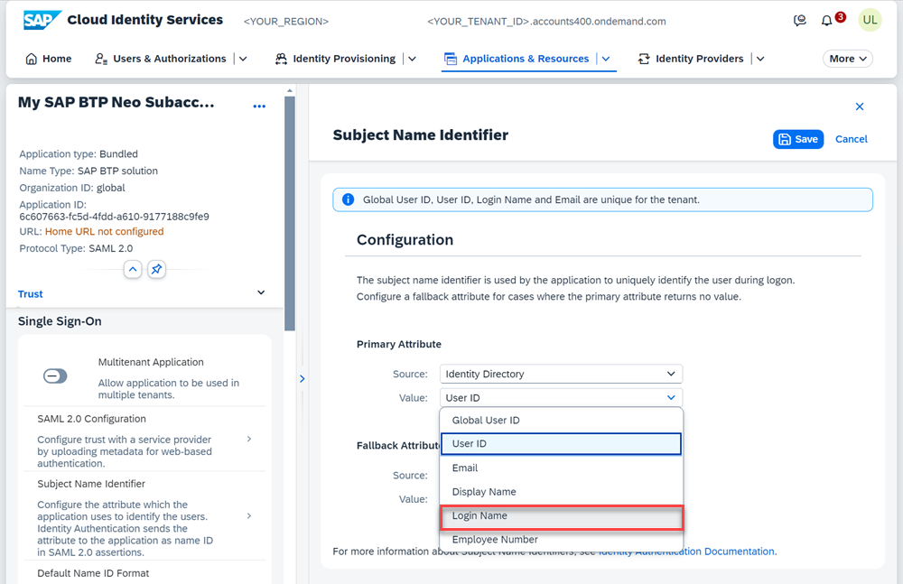

### Configure application's Default Identity Provider

As most common use case the SAP Cloud Identity Services - Identity Authentication does not act as Identity Provider itself but as proxy for an already existing corporate identity provider. This has to be set now.

Still being in your application's Trust settings scroll down and open **Conditional Authentication**.

<!--border-->
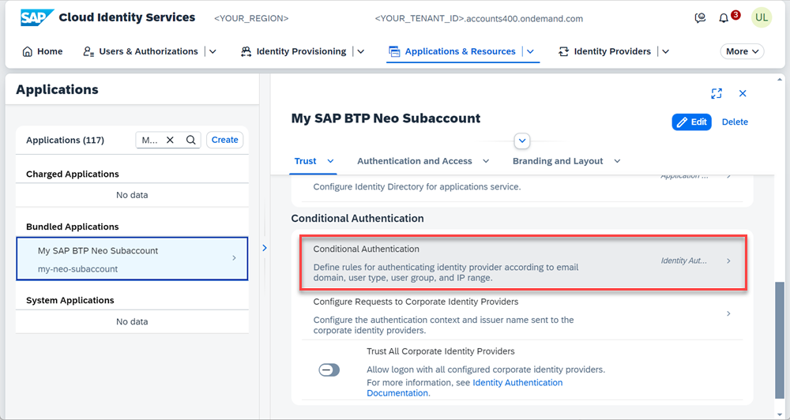

Under **Default Authenticating Identity Provider** select your corporate identity provider as **Default Identity Provider** and click **Save**.

<!--border-->

Save that XML to a file.
### Get SAML metadata of SAP Cloud Identity Services tenant

To set the SAP Cloud Identity Services tenant as trusted identity provider in the SAP BTP subaccount next, you need to get its SAML metadata first.

<!--border-->

1. Choose **Applications & Resources**

2. Switch to **Tenant Settings**

3. Go to **Single Sign-On** section

4. Open **SAML 2.0 Configuration**

5. Click the **Download Metadata file** button
   
    <!--border-->
    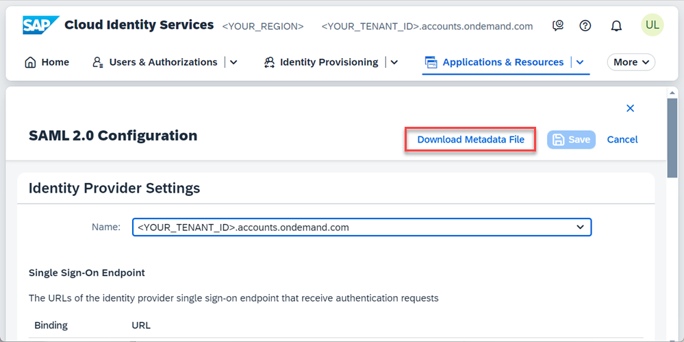

6. In the pop-up that opens, use **Default certificate** and press the **Download** button.

    <!--border-->
    

>Alternatively you can open the metadata XML by entering your tenant's web address for it which follows pattern `https://<YOUR_TENANTS_ID>.accounts.ondemand.com/saml2/metadata` and saving that XML to a file.

### Add SAP Cloud Identity Services tenant as SAP BTP subaccount's trusted identity provider

Switch back to your SAP BTP cockpit and the Neo subaccount's trust management.

Choose **Application Identity Provider** to add a trusted identity provider.

<!--border-->
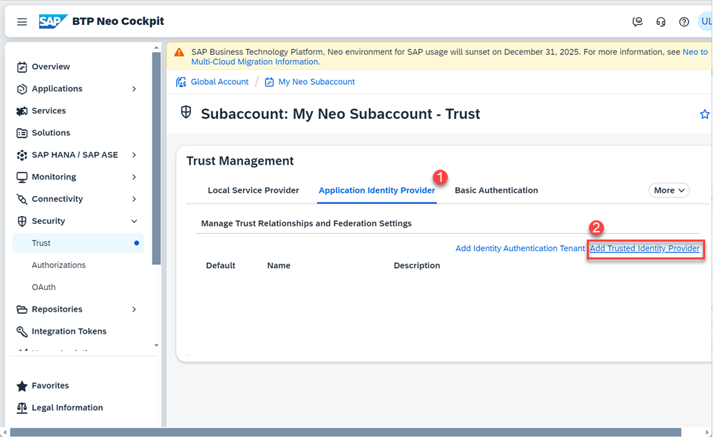

Upload metadata XML file of your SAP Cloud Identity Services tenant in the **Metadata File** field. **Add** it as identity provider.

<!--border-->
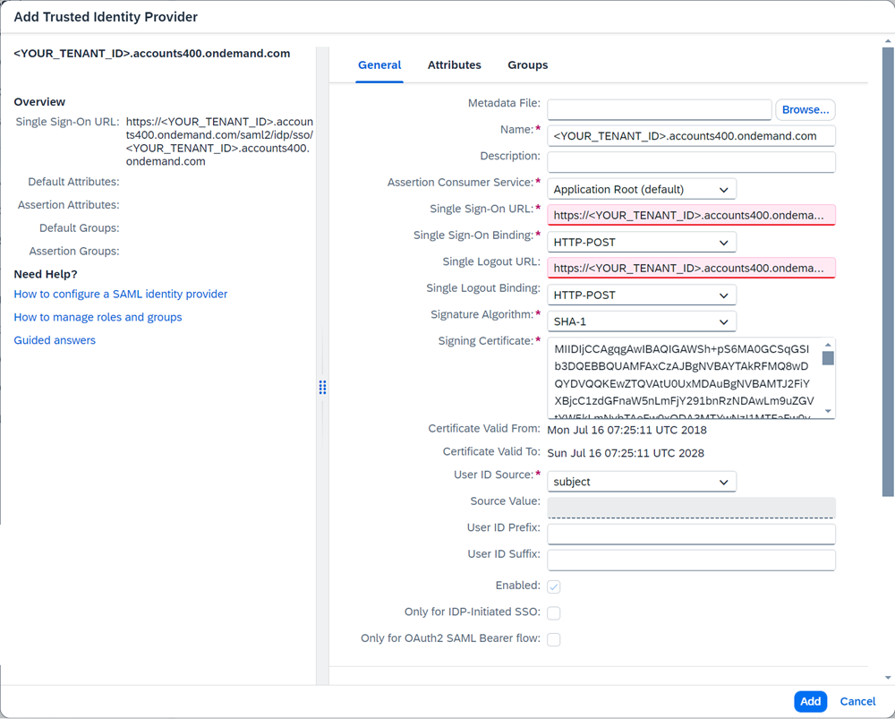

### Test yourself

