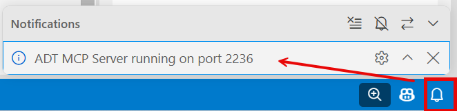
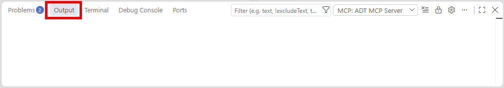
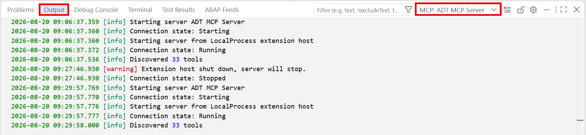
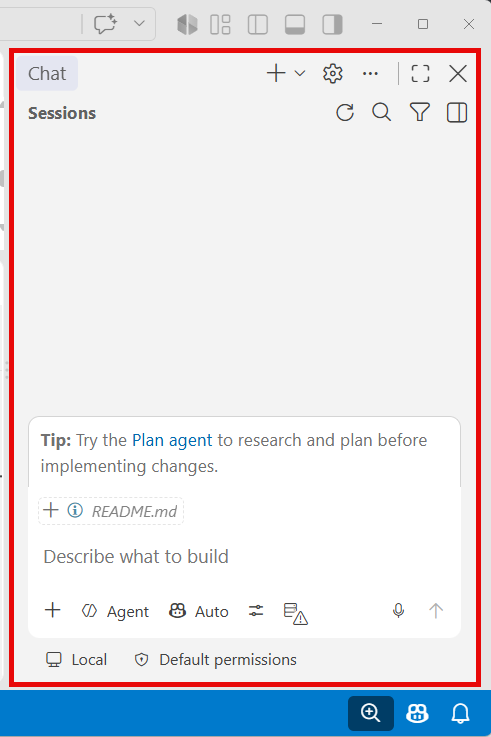
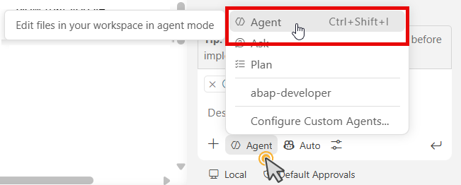
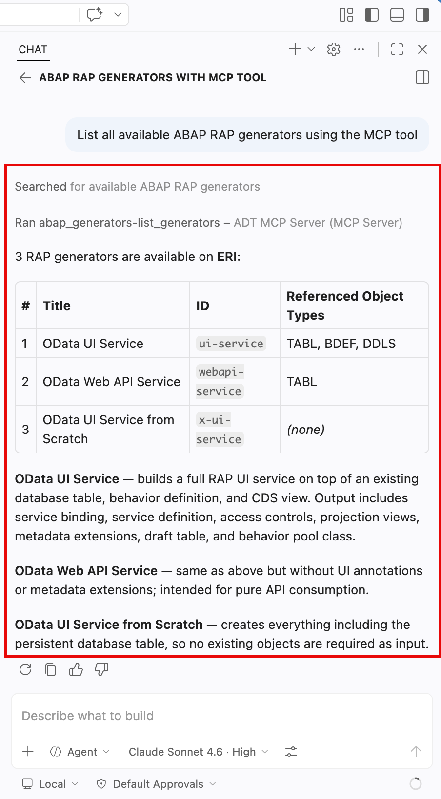

# Exercise: Enable the ADT MCP Server in ABAP Development Tools for VS Code 💎

## Introduction

In this tutorial, you will enable the **ADT MCP Server** that is built into **ABAP Development Tools for VS Code** and verify that the ADT MCP tools are available.

The ADT MCP Server exposes ABAP development capabilities as **[Model Context Protocol (MCP)**](https://modelcontextprotocol.io/), an open standard that allows AI assistants (like [GitHub Copilot](https://github.com/features/copilot))). It allows you to create packages, to create transport requests, to generate complete RAP applications, activate objects, and more through natural language prompts. For more information, see [Agentic AI for ABAP Development](https://help.sap.com/docs/abap-cloud/abap-development-tools-for-visual-studio-code/agentic-ai-development?locale=en-US)

### Exercises

- [1.1 - Enable the ADT MCP Server in the Visual Studio Code Settings](#exercise-11-enable-the-adt-mcp-server-in-the-visual-studio-code-settings)
- [1.2 - Verify the ADT MCP Server is Running](#exercise-12-verify-the-adt-mcp-server-is-running)
- [1.3 - Verify the ADT MCP Tools in your coding agent](#exercise-13-verify-the-adt-mcp-tools-in-your-coding-agent)
- [Summary & Next Exercise](#summary--next-exercise)

---

## About the ADT MCP Server 💎

The **ADT MCP Server** is a local HTTP server that runs inside and is part of the **ABAP Development Tools for Visual Studio Code** extension. It implements the Model Context Protocol (MCP) to call tools in a structured, authenticated way.

When enabled, the ADT MCP server exposes a set of ABAP development tools to any MCP-compatible AI assistant. In this workshop, the exercises use **GitHub Copilot** (see [Quickstart for GitHub Copilot](https://docs.github.com/en/copilot/get-started/quickstart)) as the client. Any coding agent that supports Visual Studio Code's virtual workspace filesystem is compatible — GitHub Copilot is confirmed; others are also supported.

**Key tools available through the ADT MCP Server:**  
For example, the following ADT MCP tools are available:

| Tool | Description |
|------|-------------|
|abap_activate_objects|Activates ABAP objects in the ABAP system|
|abap_atc_apply_ai|Start applying AI fixes for every eligible finding in an ATC worklist result|
|abap_atc_execute_deterministic_quickfixes|Executes the deterministic quick fixes|
|abap_atc_run|Gets the result of an ABAP Test Cockpit (ATC) run by its corresponding worklist|
|abap_createion-crate_object|Executes the creation of ABAP development objects|
|abap_creation-get_all_createable_objects|Gets a list of all ABAP createable objects|
|abap_creation-get_object_type_details|Gets details required for creating an ABAP object such as name, description|
|abap_generators-generate_objects|Validates and generates ABAP RAP objects using the RAP generator|
|abap_generators-list_generators|Lists the available ABAP RAP generators|
|abap_list_destinations|Gets a list of available destinations in an ABAP system|
|abap_run_unit_tests|Runs ABAP unit tests for a given set of objects|
|abap_transport-create|Creates a transport request|
|abap_transport-get|Validates and displays relevant transport requests for a given object|

> ℹ️ **Note**: See [ADT MCP Tools](https://help.sap.com/docs/abap-cloud/abap-development-tools-for-visual-studio-code/mcp-tools?locale=en-US) for the complete list of tools available.

> ⚠ **Warning regarding AI outputs** ⚠
> The ADT MCP Server is an **experimental feature** that may change at any time without notice. It is not intended for productive use. Please back up your data before using it.
> **Further reading**: [Security Considerations and Recommendations](https://help.sap.com/docs/abap-cloud/abap-development-tools-for-visual-studio-code/security-recommendations-and-considerations)

---

## Exercise 1.1: Enable the ADT MCP Server in the Visual Studio Code Settings
[^Top of page](#)

> Enable the built-in ADT MCP Server in the Visual Studio Code extension settings.

<details>
  <summary>🔵 Click to expand!</summary>

1. Open **Visual Studio Code Settings** as follows:  
   a. Open the **Command Palette** with **'Ctrl+Shift+P'** (macOS: **'Cmd+Shift+P'**)  
   b. Type **Preferences: Open Settings (UI)** and select the finding.

2. In the search bar, type:
   ```
   adt mcp
   ```
    The findings in the **Extensions > ABAP Development** node are displayed.

3.  Locate the **Adt: Enable MCP Server** setting (or similar) and enable it by checking the checkbox.

      > ℹ️ **Hint**: You can also switch to JSON mode (click the '{}' icon top-right in settings) and add:
       >```
      >json 'adt.mcpServer.enabled': true
      >```

4. Optionally, you can configure the **MCP server port** (default: '2236'). Note that you only change this if port 2236 is occupied on your machine. Proceed as follows:  
   a. Search for **ADT MCP port** in the Settings.
   b. Set it to any available port to '2236'.  
    > ℹ️ **Hint**: If the port is not available, set the value between '0' and '65535'.

5. **Reload Visual Studio Code** if prompted, or close and reopen the application.

   

> ⚠️ **Important**: Make sure your system destination is still added to the workspace. The MCP server only starts once a destination is active in the workspace.

</details>

---

## Exercise 1.2: Verify the ADT MCP Server is Running
[^Top of page](#)

> Confirm that the ADT MCP Server started successfully. See **Method 1**, step 1.

<details>
  <summary>🔵 Click to expand!</summary>

After enabling the setting and having a destination in the workspace, the server should start automatically.

### Method 1: Check for the startup notification

1. Look at the bottom-right corner for a notification in the status bar:
   ```
   ADT MCP Server running on port 2236.
   ```
   

   > ℹ️ If you don't see the notification, proceed to Method 2.

### Method 2: Check via MCP Server list

1. Open the **Command Palette** (**'Ctrl+Shift+P'**).

2. Type **MCP: List Servers**.

3. Select **'MCP: List Servers'** from the list.  

    You should then see an entry for **ADT MCP Server** in the quick pick list.

4. Select it and click **Start Server** if it is not already running.

   

### Method 3: Check the display in the Output view

5. Open the **Output** view beneath the editor.

   

6. Select **MCP: ADT MCP Servers** from the drop-down list. Then, the status will be displayed in the **Output** view.

   

### Troubleshooting

If the ADT MCP Server does not appear or fails to start:

1. Disable and re-enable the **Adt: Enable MCP Server** setting.

2. Remove the destination folder from the workspace and **add it back** from the Command Palette → 'ABAP: Add Destination as Folder to the Workspace...'.
3. Restart Visual Studio Code.

</details>

---

## Exercise 1.3: Verify the ADT MCP Tools in your coding agent
[^Top of page](#)

> Open the **Chat** view of your coding agent in agent mode and confirm that the ADT MCP tools are loaded and available.

<details>
  <summary>🔵 Click to expand!</summary>

1. If not displayed by default, open the **GitHub Copilot Chat** view in Visual Studio Code.

      

    You have the following possiblities:  
   - Click the **Copilot** icon in the **Activity Bar** (left),
   - choose *View* > *Chat* from the menu, or    
   - press **'Ctrl+Shift+I'** (macOS: **'Cmd+Shift+I'**)

2. Switch the chat mode to **Agent** in the chat dropdown.

   > ℹ️ **Note**: ADT MCP tools are only available in **Agent** mode — not in the standard **Ask** or **Plan** modes.
 
      

3. Click the **Configure Tools** (tools wrench icon) button in the Copilot chat input bar.

4. A quick pick list appears showing available tool providers. You should see the following node:
   - **ADT MCP Server** with a list of tools below it (e.g., 'abap_generators-list_generators', 'abap_creation-create_object', etc.)

   > ✅ If you see the ADT MCP Server and its tools listed, your setup is complete!

5. Check and ensure the ADT MCP Server tools are **checked/enabled** in the list.

6. **Sanity test** — type the following prompt in your coding agent's chat and press **Enter**:
   ```
   List all available ABAP RAP generators using the MCP tool.
   ```

   Your coding agent will request to call the 'abap_generators-list_generators' tool. **Allow** the tool call when prompted.

   You should see a list of available generators returned, including an entry for **'OData UI Service from Scratch'**.

   > ✅ If you see generator names returned, the ADT MCP Server is working correctly with your coding agent!
   
   

</details>

---
## Summary & Next Exercise
[^Top of page](#)

You have successfully:
- Enabeled and checked the availability of the ADT MCP servers and tools

   > ℹ️ **Hint**: To test and learn working with Agentic AI in ADT for VS Code, you can follow the [RAP130 - Build SAP Fiori Apps with ABAP Cloud and SAP Joule for Developers in Visual Studio Code](https://github.com/SAP-samples/abap-platform-rap130) tutorial.