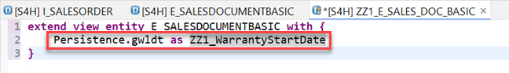
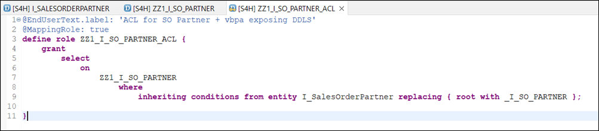

# Extend Released Data Sources by Database Fields That Are Not Exposed
<!--Done with temporary CAL instance of latest GOLDEN template, see [Wiki@SAP: CAL - How to create an appliance](https://wiki.one.int.sap/wiki/x/mVrt2Q) -->
<!-- description --> Find out what to do if a C1-released SAP data source (aka CDS view) does not expose a required database table field that you want to read in Cloud Development (ABAP Cloud Development). For example, data source I_SalesOrder only exposes roughly half of the fields of database table vbak.

## Prerequisites
- You have a license for an SAP S/4HANA or SAP S/4HANA Cloud, private edition release 2023 (both referred to as SAP S/4HANA from now on)
- You have a user in the system with full development authorizations and business role `SAP_BR_SALES_MANAGER`
- [You are connected to your SAP S/4HANA system in ABAP Development Tools for Eclipse (ADT)](abap-s4hanacloud-login)
- You understand the Clean Core Extensibility Guide, see SAP blog [ABAP Extensibility Guide – Clean Core for SAP S/4HANA Cloud - August 2025 Update](https://community.sap.com/t5/technology-blog-posts-by-sap/abap-extensibility-guide-clean-core-for-sap-s-4hana-cloud-august-2025/ba-p/14175399)
- You have set up developer extensibility as described in the official documentation [Set Up Developer Extensibility](https://help.sap.com/docs/ABAP_PLATFORM_NEW/b5670aaaa2364a29935f40b16499972d/31367ef6c3e947059e0d7c1cbfcaae93.html?version=202210.000). In particular: the `ZLOCAL` structure package is available.
- For productive use, you would develop your data source consumption in a development package below the productive structure package `ZCUSTOM_DEVELOPMENT` (ABAP for Cloud Development Language Version, ABAP Cloud Development) in your SAP S/4HANA system as suggested in the Developer Extensibility guidelines to [Create Structure Package](https://help.sap.com/docs/ABAP_PLATFORM_NEW/b5670aaaa2364a29935f40b16499972d/076bbbf3fe584439938b27f49daa6765.html?version=202210.000). Extensions you would develop in a dedicated development package of software component `HOME` (Standard ABAP Language Version, Custom Wrapper), for instance below structure package `ZAPI_ENABLEMENT`. For the scope of this tutorial, we follow a simplified approach using local development packages `ZMYLOCAL` within structure package `ZLOCAL` and `$TMP` rather than productive packages.

>We suggest following this tutorial using a [Fully-Activated Appliance](https://blogs.sap.com/2018/12/12/sap-s4hana-fully-activated-appliance-create-your-sap-s4hana-1809-system-in-a-fraction-of-the-usual-setup-time) in SAP Cloud Appliance Library for an easy start without the need for system setup, as the `ZLOCAL` structure package is automatically available.

## You will learn
- What are the 3 different ways to extend a data source 
- How to identify the 3 cases you must follow
- How to extend a data source which is key user data source extensible (case 1)
- How to extend a data source which is released for extend (case 2)
- How to extend a data source that is not released for extend (case 3)

**Additional info**
>Tutorial last updated with SAP S/4HANA release 2023 FPS03

---

### Verify that a Data Source is Usable in Cloud Development
Data sources that you want to use in cloud development (ABAP Cloud Development) need to have API State: Use System-Internally (Contract C1): Use in Cloud Development: Yes. This information can be found in the object's properties in ADT as in this example for data definition `I_SalesOrder`.


See also the documentation: [SAP - ABAP Development Tools: User Guide > Released APIs > Use System-Internally (C1)](https://help.sap.com/docs/abap-cloud/abap-development-tools-user-guide/use-system-internally-c1)

### Read a Data Source in Cloud Development (ABAP Cloud Development)

To test the consumption of the data source from ABAP Cloud Development we call it in a `classrun`.

1.	In package `ZMYLOCAL` create an ABAP class with name `ZCL_USE_EXTENDED_DDLS` that is implementing interface `IF_OO_ADT_CLASSRUN` and give the description `class to test calling extended data sources`.
    
    

2. Implement the method `main` of the interface to read the data source. In this example, the data source `I_SalesOrder` is protected but allows privileged access, make use of it, as shown here:

    ```ABAP
    METHOD if_oo_adt_classrun~main.
        out->write( |\nRead I_SalesOrder| ).
        SELECT FROM I_SalesOrder
        WITH PRIVILEGED ACCESS
        FIELDS SalesOrder, CreationDate
        INTO TABLE @DATA(lt_data)
        UP TO 5 ROWS.
        out->write( lt_data ).
    ENDMETHOD.
    ```

3.	Save and activate the class.

4.	Run the class as ABAP Application (Console) (quickest via `F9`).

5.	In the output you can see data for the selected fields:

    
 
### Check if the Field is Actually Missing

It can happen that you might not find the database field you're looking for immediately. In this example, we use example field `kdgrp` in data source `I_SalesOrder`:

 
 
This could be caused by the data source referring to it over an association and/or with an alias name. To exclude this possibility, check in ADT if any of the referenced data sources expose the database field over an association and/or with an alias name.

Have a look into the base data source `I_SalesDocument` of the data source definition `I_SalesOrder`:


<br><br>


 
This reveals that the field `kdgrp` is indeed exposed with an alias, namely `CustomerGroup`.

Once you know the right name to access the field, the code completion in ADT will find it too, and it will show the database name.


Next, we have an example of a data source being referenced via an association. Open data source `I_GLAccountLineItem`. You will find that it associates data source `I_CompanyCode` which itself exposes the field `land1` of database table `t001` with alias `Country`.
 

<br><br>


Once you know the association and name to access the field, the code completion in ADT will find it too and show the database name.


 
If neither an association and/or an alias name exposes the field, you must extend the data source. Be aware that this referencing can happen through a huge hierarchy of data source definitions.

### Identify the Extension Case for a Data Source

Find out the best of three ways to extend your data source. The three approaches are sorted from simplest to most complex and should be processed in that order if you want to identify the best approach for a data source you want to extend. For an ideal learning experience, please follow all cases.

A data source can be:

- **Case 1: Key User Data Source Extensible** 

    The simplest case to extend a data source is if it's enabled for data source extensibility within key user extensibility. This is the case if the data source can be found in the **Custom Fields** app > **Data Source Extensions**.

    1. Launch the **Custom Fields** app in the SAP Fiori Launchpad.

    2. Switch to the tab **Data Source Extensions**.

    3. Start creating a new data source extension, use the data source value help and search `I_GLAccountLineItem`. If it's found it's key user data source extensible

         

    In this case, the solution is to create a data source extension via key user app directly in ABAP Cloud Development. This will be shown in **Step 5: Case 1 - The Data Source is Key User Data Source Extensible (ABAP Cloud Development)**.

- **Case 2: Released for Extend (C0 contract, but not key user data source extensible)**

    If the data source is not enabled for key user data source extensibility, but is released for EXTEND (Contract C0) for use in cloud development or key user apps, then you can add the missing database field to the data source by creating a corresponding extension field from ADT in a Custom Wrapper using classic extensibility. 

    You can check if the data source is released for extend at the API state of a data source in ADT - as for `I_SalesOrder`.  

    Go to its properties and open API State.

     
 
    There, you can see if the data source is released for EXTEND (Contract C0) for use in cloud development or key user apps. If at least one is true, then the data source associates a so-called extension data source. 
    
    The solution is to create an extension for the extension data source and add this as extension to the actual data source in ADT using classic extensibility. This will be shown in **Step 6: Case 2.1 - The Data Source is Released for Extend (Custom Wrapper)** and following steps for case 2.

    >If you want to freely browse through data sources released for extend, you can create a repository tree view on released data source objects (see [YouTube video: Repository Trees in ADT. Configure your Project Explorer](https://youtu.be/kAilhfl2_Yg&t=190s)).
    See also the documentation: [SAP - ABAP Development Tools: User Guide > Released APIs > Extend (C0)](https://help.sap.com/docs/abap-cloud/abap-development-tools-user-guide/extend-c0)

- **Case 3: Not Released for Extend (no C0 contract)**

    In case the required data source has API State Contract C0: Not Released it's not enabled for extensibility.

    You can check that, for example, via the API release state of the data source `I_SalesOrderPartner` in ADT.

     
    
    In this case, the solution is to create a data source in ADT in a Custom Wrapper that is wrapping the database table and exposing its missing field. Release it for usage in ABAP Cloud Development and create another data source in ABAP Cloud Development, which combines the non-extensible data source with the wrapping one. This way the combining data source can be used instead of the non-extensible one. This will be shown in **Step 9: Case 3.1 - The Data Source is not Released for Extend** and following steps of case 3.

>Be aware that only read access is recommended for the added field as SAP might have determination and validation logic that changes the field again or bypasses needed checks after you changed it. This means that especially data definitions for transactional processing processing like `R_InspectionLotTP` (`@VDM.viewType #TRANSACTIONAL`) must not be extended at all as their main purpose is to offer the entire business object functionality.

> 
  
>For more information, see also the documentation: [SAP - ABAP RESTful Application Programming Model > Extensibility Architecture Overview](https://help.sap.com/docs/abap-cloud/abap-rap/extensibility-architecture-overview?version=s4_hana)


**Wrap-Up**

If a C1-released SAP Data Source (CDS View) does not include a standard field (delivered by SAP) but is required for ABAP Cloud Development, then you have the following options to add the field (in order of recommendation).

| Characteristic of the data source | Recommended Extension Technique | 
| -------- | -------- | 
| The data source is enabled for data source extensibility. You can see this in the Custom Fields app. You cannot see in ADT if the data source is enabled for data source extensibility. | Use the Custom Fields app to create a data source extension in ABAP Cloud Development.
| The data source is enabled for custom field extensibility. You can see this in ADT on the API State tab: the data source needs to be released for Extend (Contract C0) for use in cloud development or use in key user apps | Extend the extension data source (E_) by creating a view extension and add the missing standard field. In Custom Wrapper, create a view extension for the extensible data source and expose the new field that was added to the "Extension data source (E_)". |
The data source is neither enabled for data source nor custom field extensibility   | Create a wrapper for the data source that contains the missing field and release it for usage for ABAP Cloud Development, create a new data source combining the non-extensible data source with the wrapper. |
 


### Case 1 - The Data Source is Key User Data Source Extensible (ABAP Cloud Development)

In this example the data source `I_GLAccountingLineItem` is extended by the company's country code.

>Disclaimer: Be aware that for this example you should not need to work with this approach, as the field could be read via association with `\_CompanyCode-Country` as well.  We'll work with this example for demonstration purposes.

1.	Launch the **Custom Fields** app in the SAP Fiori launchpad.

2.	Switch to tab **Data Source Extensions**.

3.	Start creating a new data source extension, search for and choose the data source `I_GLAccountingLineItem`.

4.	Give the **Description** and the **Extension ID** `GEN_LEDGER_ACC_LITM` and click **Create**.

    
 
5.	In the opening editor and in the tab **Field Selection**, scroll down to `Company Code` > `Country/Region Key`, tick `Country/Region Key` (1), adapt the **Field Name** to `ZZ1_CompanyCountry` (2), enable **Custom Text** (3) to adapt the **Label** and **Tooltip** texts to `ZZ1 Company Country` (4), **Save** (5) and **Publish** (6). Note that publishing may take a while.

    
 
Now, you can make use of this field in read operations with the extended data source.

1.	Enhance the ABAP class from **Read a Data Source in Cloud Development (ABAP Cloud Development)** by a read via data source `I_GLAccountLineItem`

    ```ABAP
    out->write( |\nCase 1 - Key User extensibility on I_GLAccountLineItem + ZZ1_CompanyCountry | ).
    SELECT FROM I_GLAccountLineItem
    WITH PRIVILEGED ACCESS
    FIELDS CompanyCode, Company, ZZ1_CompanyCountry
    INTO TABLE @DATA(lt_data_case1) UP TO 5 ROWS.
    out->write( lt_data_case1 ).
    ```

2.	Run the ABAP class as Application and check that data is retrieved.

    In the output you can see data for the added field:

    
 
For more information, see also the documentation: [Creating Data Source Extensions](https://help.sap.com/docs/SAP_S4HANA_CLOUD/0f69f8fb28ac4bf48d2b57b9637e81fa/04cc9e89e0214fb3b9ae29e3b5854f4e.html).


### Case 2.1 - The Data Source is Released for Extend (Custom Wrapper)

In this example the data source `I_SalesOrder` is extended by `vbak` field `gwldt`.

Remember (see **Step 4: Identify the Extension Case for a Data Source**) that a data definition must not appear in the key user app for data source extensions for this to be the best approach. If it does appear there, follow **Step 5: Case 1 - The Data Source is Key User Data Source Extensible (ABAP Cloud Development)**.

Contract C0-released implies that the extensible data source associates a so-called extension data source, in case of SAP data sources with name `E_*`.

Open data source definition `I_SalesOrder` in ADT and search for `E_`. You will find `E_SalesDocumentBasic`.


 
Open `E_SalesDocumentBasic`. 

<!--border-->


This extension data source is of `@VDM.viewType #EXTENSION`. It exposes the database table `vbak`. You can choose additional fields from this database to extend the extensible data sources. The extension data source defines the alias `Persistence` for `vbak`.


### Case 2.2 - Extend the Extension Data Source

The first step is to extend the extension data source. This has to be done in a Custom Wrapper as database tables like `vbak` are not released for use in cloud development.

1.	Open the extension data definition `E_SalesDocumentBasic`.

2.	Right-click the extension data definition in the navigation tree and choose **New Data Definition** from its context menu.

    
 
    Give the package `$TMP`, the name `ZZ1_E_SALES_DOC_BASIC`, the description `I_SALESDOCUMENTBASIC extension` and click **Next**.

    <!--border-->
    
 
3.	Continue in the wizard until the **Templates** selection dialog and choose **Extend View Entity**.

    
 
    >Hint: If in contrast to `E_SalesDocumentBasic`, the extension data definition was a view and not a view entity, you could also choose **Extend View** instead. Be aware that a view can still be migrated to a view entity by SAP. Migrate an existing Extend View to an Extend View Entity to avoid issues.

4.	Complete the code of the data source by adding the field that you want to extend your extensible data source with.

    <!--border-->
    

    ```ABAP
    extend view entity E_SalesDocumentBasic with
    {
        Persistence.gwldt as ZZ1_WarrantyStartDate
    }
    ```

    Reminder: `Persistence` is the alias defined for database table `vbak` in the extension data source.

5.	Save and activate the data source. Note that this may take a few minutes.

For more information, see also the documentation: [CDS Views Extension](https://help.sap.com/docs/SAP_S4HANA_CLOUD/53b14a3c9f7d4837a9c1f271ee3b24a4/cb7a12b0faf44b41b9fc62e57fec55c5.html)


### Case 2.3 - Extend the Extensible Data Source

Follow the same steps as in **Step 7: Case 2.2 - Extend the Extension Data Source** for the extensible data definition.

1. Right-click the interface data definition `I_SALESORDER` in the navigation tree and choose **New Data Definition** from its context menu.

    

2. Give the package `$TMP` the name `ZZ1_E_SALESORDER` and the description `I_SALEORDER extension`.

    
 
    >Hint: If in contrast to `I_SALESORDER` the extensible data definition was released for extend (C0) in Cloud Development, the extending data definition of this step should be created in an ABAP Cloud Development package.

3.	Continue in the wizard until the **Templates** selection dialog and choose **Extend View**.

    

    >Hint: If in contrast to `I_SALESORDER` the extensible data definition was a view entity, you had to choose **Extend View Entity** instead. Be aware that a view can still be migrated to a view entity by SAP. Migrate the existing Extend View to an Extend View Entity to avoid issues.

4.	Complete the code of the data source by providing a value for annotation `@AbapCatalog.sqlViewAppendName`. Define the field that the interface data source should get extended by. 

    

    ```ABAP
    @AbapCatalog.sqlViewAppendName: 'ZZ1_E_SO'
    @EndUserText.label: 'I_SALESORDER extension'
    extend view I_SalesOrder with ZZ1_E_SALESORDER
    {
        _Extension.ZZ1_WarrantyStartDate as ZZ1_WarrantyStartDate
    }
    ```

5.	Save and activate the data source. Note that this may take up to an hour.

Now, data source `I_SalesOrder` will also return the database field.

1.	Enhance the ABAP class from **Step 2: Read a Data Source in Cloud Development (ABAP Cloud Development)** by a another read via data source `I_SalesOrder`

    ```ABAP
    out->write( |\nCase 2 - I_SalesOrder + ZZ1_WarrantyStartDate  | ).
    SELECT FROM I_SalesOrder
    WITH PRIVILEGED ACCESS
    FIELDS SalesOrder, CreationDate, ZZ1_WarrantyStartDate
    INTO TABLE @DATA(lt_data_case2)
    UP TO 5 ROWS.
    out->write( lt_data_case2 ).
    ```

2.	Run the ABAP class as Application and check if data is retrieved.
 
    


### Case 3.1 - The Data Source is Not Released for Extend

In this example the data source `I_SalesOrderPartner` is missing `vbpa` field `knref`.

Although this data source is not released for Extend (no C0 contract), you can still achieve an extension.

The approach is to wrap the database table in our data source in a Custom Wrapper, expose the missing fields in that data source and release it for system-internal usage (Contract C1) for ABAP Cloud Development. Afterwards, an ABAP Cloud Development data source is created which combines the original data source (missing a field) with the wrapper data source (exposing the missing field). With this, you can use the ABAP Cloud Development data source instead of the original one to get all its fields, adding the one that you've put in the wrapper.


 
This approach may require an object of type access control for the newly created combining data sources.


### Case 3.2 - Create the Database Wrapper (Custom Wrapper)

First, we create the data source that wraps the database table and exposes its missing field.

1.	Create a data definition that is based on the database table `vbpa` containing the field that is missing and needs to be exposed. Give the package `$TMP` the name `ZZ1_W_VBPA` and the description `VBPA wrapping and field exposing dta src`.

    
 
2.	Continue in the wizard until the **Templates** selection dialog and choose **Define View Entity**.

    
 
3.	Adapt the code of the data source by leaving only the key field `vbeln` and the field `knref` in the list of inserted fields. These two fields are the fields that the wrapper should expose to ABAP Cloud Development. Provide them with the human-readable aliases `SalesDocumentID` and `ZZ1_CustDescrOfPartnerPlant`.

    

    ```ABAP
    @AbapCatalog.viewEnhancementCategory: [#NONE]
    @AccessControl.authorizationCheck: #NOT_REQUIRED
    @EndUserText.label: 'VBPA wrapping and field exposing dta src'
    @Metadata.ignorePropagatedAnnotations: true
    @ObjectModel.usageType:{
        serviceQuality: #X,
        sizeCategory: #S,
        dataClass: #MIXED
    }
    define view entity ZZ1_W_VBPA as select from vbpa
    {
        key vbeln as SalesDocumentID ,
        knref as ZZ1_CustDescrOfPartnerPlant
    }
    ```

4.	Save and activate the data source.

5.	Release the data source.

    Go to **Properties**, open **API State** and add a release contract for system-internal usage (Contract C1) for use in Cloud development. Click **Next >**.

    
    <br><br>

    
 
    Continue in the wizard and click **Finish**.


### Case 3.3 - Create the Combining Data Source (ABAP Cloud Development)

Next, we create the interface data source for ABAP Cloud Development which combines the original and the wrapping/exposing data source and with that, exposes the fields of both.

1.      Select **New Data Definition** from the context menu of the original data source `I_SalesOrderPartner` that's missing the database field we need. 

2.	    Change the package to `ZMYLOCAL` and give the name `ZZ1_I_SO_PARTNER` and the description `comb I_SO_PARTNER+vbpa wrapper/exposure`. 

    

3.	    Continue in the wizard and choose the template **Define View Entity**.

    

4.	    Adapt the code of the data source:

    4.1.    As this data source should provide the very same protection as the original data source, change the value of the annotation `@AccessControl.authorizationCheck` from `#NOT_REQUIRED` to `#CHECK`.

    4.2.    Add the association for the original data source.

    ```ABAP
    association to I_SalesOrderPartner as _I_SO_PARTNER on $projection.SalesOrder = _I_SO_PARTNER.SalesOrder
    ```

    4.3.    Define a second association for the wrapper data source.

    ```ABAP
    association to ZZ1_W_VBPA as _vbpa_wrapper on $projection.SalesOrder = _vbpa_wrapper.SalesDocumentID
    ```

    4.4.    Add the additional database field that's exposed via the wrapper: `_vbpa_wrapper.ZZ1_CustDescrOfPartnerPlant`

    4.5.    Expose the association alias of the original data source: `_I_SO_PARTNER`

    
 
    ```ABAP
    @AbapCatalog.viewEnhancementCategory: [#NONE]
    @AccessControl.authorizationCheck: #CHECK
    @EndUserText.label: 'comb I_SO_PARTNER+vbpa wrapper/exposure'
    @Metadata.ignorePropagatedAnnotations: true
    @ObjectModel.usageType:{
        serviceQuality: #X,
        sizeCategory: #S,
        dataClass: #MIXED
    }
    define view entity ZZ1_I_SO_PARTNER
    as select from I_SalesOrderPartner
    association to I_SalesOrderPartner as _I_SO_PARTNER on $projection.SalesOrder = _I_SO_PARTNER.SalesOrder
    association to ZZ1_W_VBPA          as _vbpa_wrapper on $projection.SalesOrder = _vbpa_wrapper.SalesDocumentID
    {
    key SalesOrder,
    key PartnerFunction,
        _vbpa_wrapper.ZZ1_CustDescrOfPartnerPlant,
        Customer,
        Supplier,
        […]
        _PersonName,
        _SalesOrder,
        _I_SO_PARTNER
    }
    ```

5.	    Save and activate the data definition.


### Case 3.4 - Protect the Combining Data Source

Since the ABAP Cloud Development data source should provide the very same protection as the original data source, we'll now create an access control for it. This access control will simply inherit the access control from the original data source.

1.	Create an access control from the context menu of the ABAP Cloud Development data definition `ZZ1_I_SO_PARTNER`.

    
 
2.	Give the name `ZZ1_I_SO_PARTNER_ACL` and the description `ACL for SO Partner + vbpa exposing DDLS`

    
 
3.	Continue in the wizard until the **Templates** selection dialog and choose **Define Role with Inheriting Conditions**:

    

    Implement the `where` clause by giving the source entity `I_SalesOrderPartner` and adding a replacement for the root with the wrapper association.

    

    ```ABAP
    @EndUserText.label: 'ACL for SO Partner + vbpa exposing DDLS '
    @MappingRole: true
    define role ZZ1_I_SO_PARTNER_ACL {
        grant
            select
                on
                    ZZ1_I_SO_PARTNER
                        where
                            inheriting conditions from entity I_SalesOrderPartner replacing {root with _I_SO_PARTNER };
                            
    }
    ```

4.	Save and activate the access control.

The data source `ZZ1_I_SO_PARTNER` will also return the database field. 

1.	Enhance the ABAP class from **Step 2: Read a Data Source in Cloud Development (ABAP Cloud Development)** by a read via data source `ZZ1_I_SO_PARTNER`

    ```ABAP
    out->write( |\nCase 3 - ZZ1_I_SO_PARTNER associating I_SO_PARTNER and exposing Wrapper | ).
    SELECT FROM ZZ1_I_SO_PARTNER
    FIELDS SalesOrder, Partner, ZZ1_CustDescrOfPartnerPlant
    INTO TABLE @DATA(lt_data_case3)
    UP TO 5 ROWS.
    out->write( lt_data_case3 ).
    ```

2.	Run the ABAP class as Application and check if the data is retrieved. The data is retrieved even if the requested new field has no data.

    
 

If the select statement doesn't return any result row at all, your user may be lacking the authorizations needed for the inherited protection from Access Control `I_SalesOrderPartner`.
 
To retrieve data, assign the necessary authorizations. You can do this by assigning the business role `SAP_BR_SALES_MANAGER`, for example. Alternatively, call the select statement `WITH PRIVILEGED ACCESS`.


### Case 3.5 (Optional) - Restrict the Use of the Wrapper

If you want to restrict the use of the wrapper data source, you can protect it with an access control as well.

1.	In the data source code itself, change the value of the `@AccessControl.authorizationCheck` annotation from `#NOT_REQUIRED` to `#PRIVILEGED_ONLY`.
    This enables you to still use the data source in privileged mode, but forbids access when using it without privileged mode.

2.	Save and activate the data source.

3.	Right-click the data source `ZZ1_W_VBPA` in the navigation tree and select **New Access Control** from the context menu.

4.	Give the name `ZZ1_W_VBPA_ACL` and the description `ACL for vbpa wrapping + exposing DDLS`.

5.  Continue in the wizard until the **Templates** selection dialog and choose **Define Role with Simple Condition** and select Finish.

    
 
6.	Within the code of the access control you've created, adapt the value for the label notation if the description was longer than 40 characters and add a `where` clause which will never be true:
 
    
    
    ```ABAP
    @EndUserText.label: 'ACL for vbpa wrapping+exposing DDLS'
    @MappingRole: true
    define role ZZ1_W_VBPA_ACL {
        grant
            select
                on
                    ZZ1_W_VBPA
                        where //forbid direct access to wrapper data source by never occurring condition ( ineffective in privileged mode )
                            SalesDocumentID is not initial
                            and SalesDocumentID is initial
                    ;
                            
    }
    ```

7.	Save and activate the access control.


### Test yourself