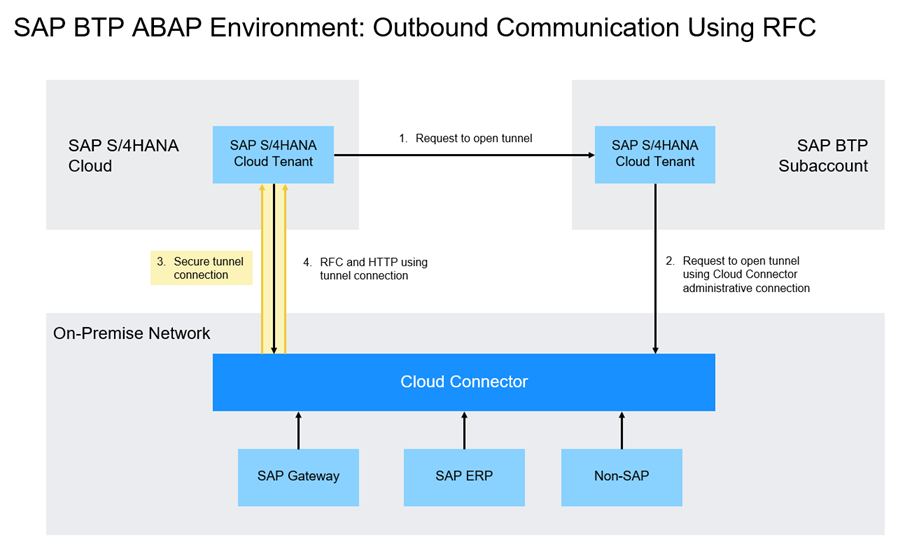

# Get Data from a Remote System Using a Remote Function Call (RFC): Scenario

<!-- description --> Get data from an on-premise system, such as a SAP S/4HANA System, by calling a Remote Function Module in SAP BTP ABAP Environment

## Prerequisites

- You have set up SAP Business Technology Platform (BTP), ABAP Environment, for example by using the relevant booster: [Using a Booster to Automate the Setup of the ABAP Environment](https://help.sap.com/viewer/65de2977205c403bbc107264b8eccf4b/Cloud/en-US/cd7e7e6108c24b5384b7d218c74e80b9.html)
- **Tutorial**: [Set Up SAP BTP, ABAP Environment and create Your First Console Application](abap-environment-trial-onboarding), for a licensed user, steps 1-2
-	You have a user in an ABAP on-premise system. Examples of such on-premise systems include:
    - [AS ABAP developer edition, latest version](https://blogs.sap.com/2019/07/01/as-abap-752-sp04-developer-edition-to-download/) or:
    - [SAP S/4HANA 1809 fully activated appliance](https://blogs.sap.com/2018/12/12/sap-s4hana-fully-activated-appliance-create-your-sap-s4hana-1809-system-in-a-fraction-of-the-usual-setup-time/)
- You have connected **SAP Cloud Connector**, to your BTP subaccount
- You have assigned the business catalog **``**SAP_CORE_BC_COM** in a business role assigned to your user, e.g. **`SAP_BR_ADMINISTRATOR (Administrator)`**; you will need it to create communication artifacts
- You may need to define the relevant homepage structure that should be exposed to the launchpad. In Manage Launchpad Settings, set the relevant value for EXPOSURE_HOMEPAGE_STRUCTURE. See Manage Launchpad Settings

  
## You will learn

  - How to create a secure RFC connection between your SAP BTP, ABAP Environment and an on-premise SAP System, e.g. SAP S/4HANA
  - How to test the connection using an ABAP handler class

- **IMPORTANT**: This tutorial cannot be completed on a trial account. If you want to explore some of the concepts of this mission on a trial account, using OData or SOAP rather than RFC, see the following workshop: [SAP BTP, ABAP Environment: Connectivity and Integration](https://github.com/SAP-samples/teched2020-DEV268)

This tutorial mission was written for SAP BTP ABAP Environment. However, you should also be able to use it in SAP S/4HANA Cloud Environment in the same way.

Throughout this tutorial, replace `000` with your initials or group number.

**The challenge:**

There are two challenges when setting up connectivity between the SAP BTP, ABAP Environment and an on-premise ABAP System:

- The ABAP Environment is generally located in front of any firewall, but customer on-premise systems are generally behind it
- Remote Function Call (RFC) is not internet-enabled

**The solution:** 

Set up a secure connection from the on-premise system to the SAP BTP, ABAP Environment.
Technically: 

1. SAP Cloud Connector opens a tunnel connection to the ABAP environment tenant using its public tenant URL
2. After the tunnel is established, it can be used for actual data connection using the RFC or HTTP(S) protocols. 

<!-- border -->

### Test yourself

### More Information

This tutorial is based on an excellent blog post by André Fischer:

- [How to call a remote function module in your on-premise SAP system...](https://blogs.sap.com/2019/02/28/how-to-call-a-remote-function-module-in-your-on-premise-sap-system-from-sap-cloud-platform-abap-environment/)

For OData services in general:

- Mission: [Take a Deep Dive into OData](mission.scp-3-odata)

For SAP Gateway in general, see:

- [OData service development with SAP Gateway using CDS](https://blogs.sap.com/2016/06/01/odata-service-development-with-sap-gateway-using-cds-via-referenced-data-sources/) - pertains to on-premise Systems, but contains lots of useful background information on the relationships between CDS views and OData services

For connectivity in this context, see:
- SAP Help Portal: [SAP Cloud Connector](https://help.sap.com/docs/connectivity/sap-btp-connectivity-cf/cloud-connector)

- SAP Help Portal: [RFC Communication via Communication Arrangements](https://help.sap.com/docs/btp/sap-business-technology-platform/rfc-communication-via-communication-arrangements)

For SAP Business Technology Platform (BTP):

- SAP Help Portal: [What is SAP Business Technology Platform (BTP)](https://help.sap.com/docs/btp/sap-business-technology-platform/btp-basic-platform-concepts)

- SAP Help Portal: [Getting Started With a Customer Account](https://help.sap.com/docs/btp/sap-business-technology-platform/getting-started-with-customer-account-in-abap-environment) - If you use the booster, these steps are performed automatically for you, but you may be interested in the background information
  
---