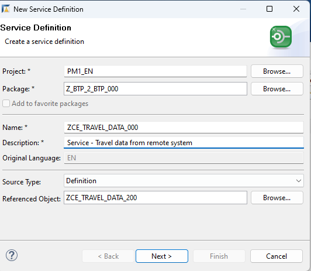
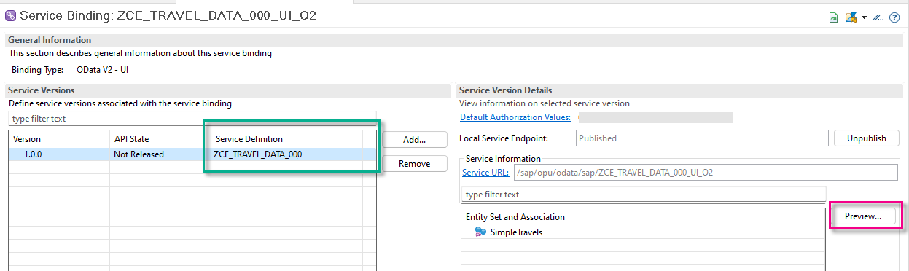

# Implement a Custom Entity and Query Implementation Class 
<!-- description --> In the SAP Business Technology Platform, ABAP Environment, implement a CDS custom entity and query implementation class; then display the output in a Fiori Elements preview

##Prerequisites
- **IMPORTANT**: This tutorial cannot be completed on a trial account
- **IMPORTANT**: This tutorial is part of a mission. You must complete the previous parts first; otherwise, you may experience errors or unexpected behavior. The link to the mission is available at the top right of the screen, immediately above the list of steps

## You will learn
  - How to implement a query manually for your CDS custom entity
  - How to display the data retrieved in a Fiori Elements preview


This tutorial is based on:

  - [Using a CDS Custom Entity for Data Modeling](https://help.sap.com/viewer/923180ddb98240829d935862025004d6/Cloud/en-US/6436a50d7d284f01af2cca7a76c7116a.html)
  - [Implementing the Query for Service Consumption](https://help.sap.com/viewer/923180ddb98240829d935862025004d6/Cloud/en-US/c33503ae1e794e3aad0d2e122f465611.html)
  - [Implementing Data and Count Retrieval](https://help.sap.com/viewer/923180ddb98240829d935862025004d6/Cloud/en-US/33497472ad294918b8a0184d9d8369bd.html)

Therefore, this tutorial will only cover in detail those aspects that are different. In this case, you are not including both remote and local data, you are only retrieving local data. Therefore, you do not include the local calculated fields,  `DiscountPct` and `DiscountAbs`.

---


### Add query provider interface to class

You have already tested the connection by displaying data in an ABAP Console app. You will now display this data in a Fiori Elements preview, using a custom entity.
1. First, open the class **`ZCL_PROXY_TRAVELS_000`** and add the interface **`IF_RAP_QUERY_PROVIDER`** to the class definition.

    ```ABAP
      INTERFACES:   if_oo_adt_classrun,
                    if_rap_query_provider.
    
    ```

    > The signature of the method `IF_RAP_QUERY_PROVIDER~SELECT` contains the import parameter `io_request`. This parameter represents the OData query options that are delegated from the UI and used as input for the SELECT method. Whenever the OData client requests data, the query implementation class must return the data that matches the request, or throw an exception if the request cannot be fulfilled.

2. You will get a warning: "Implementation missing for method `IF_RAP_QUERY_PROVIDER~SELECT`." Select the warning and choose **Quick Fix (`Ctrl+1`)** from the context menu. Then choose the fix **Add implementation for select**. 

    An empty method implementation is added.

3. Format, save, and activate ( **Sh+F1, Ctrl+S, Ctrl+F3** ) your class.


### Specify class in your custom entity

1. Open your CDS custom entity by choosing **Core Data Services > Data Definitions** > **`ZCE_TRAVEL_DATA_000`**, which you created in [Create a Service Consumption Model](abap-environment-create-service-consumption-model).

2. Add the following annotation to the view (immediately after the '@EndUserText.label' annotation), pointing to the class you have just created - **IMPORTANT: Use upper case!**

    ```CDS

    @ObjectModel.query.implementedBy: 'ABAP:ZCL_PROXY_TRAVELS_000'
    ```


### Implement SELECT method in query implementation class

You will retrieve the travel data using the same method **`get_travels`** as before. This time, however, you will output the data to a Fiori Elements preview, by  implementing the method **`if_rap_query_provider~select`**

1. Add the following statements to **`METHODS get_travels`** in the **CLASS ... DEFINITION**.

    ```ABAP
    IMPORTING
      top              TYPE i OPTIONAL
      skip             TYPE i OPTIONAL

    ```

2. Now add the following code to the method **`if_rap_query_provider~select.`** in the **CLASS...IMPLEMENTATION**.

    ```ABAP
      METHOD if_rap_query_provider~select.
    DATA business_data TYPE TABLE OF zce_travel_data_000.
    DATA(top)     = io_request->get_paging( )->get_page_size( ).
    DATA(skip)    = io_request->get_paging( )->get_offset( ).
    DATA(requested_fields)  = io_request->get_requested_elements( ).
    DATA(sort_order)    = io_request->get_sort_elements( ).

    TRY.
        get_travels(

          EXPORTING
                     top               = CONV i( top )
                     skip              = CONV i( skip )
          IMPORTING
            et_business_data  = business_data
          ) .

        io_response->set_total_number_of_records( lines( business_data ) ).
        io_response->set_data( business_data ).

      CATCH cx_root INTO DATA(exception).
        DATA(exception_message) = cl_message_helper=>get_latest_t100_exception( exception )->if_message~get_longtext( ).

    ENDTRY.


      ENDMETHOD.

    ```

3. Format, save and activate ( **`Sh+F1, Ctrl+S, Ctrl+F3`** ) the class.


### Check the code for your query implementation class

```ABAP
CLASS ZCL_PROXY_TRAVELS_000 DEFINITION
  PUBLIC
  FINAL
  CREATE PUBLIC .

  PUBLIC SECTION.

    TYPES t_business_data TYPE TABLE OF zz000_simpletravel.

    METHODS get_travels
      IMPORTING
        top              TYPE i OPTIONAL
        skip             TYPE i OPTIONAL

      EXPORTING
        et_business_data TYPE t_business_data

      RAISING
        /iwbep/cx_cp_remote
        /iwbep/cx_gateway
        cx_web_http_client_error
        cx_http_dest_provider_error
      .
    INTERFACES: if_oo_adt_classrun,
      if_rap_query_provider.
  PROTECTED SECTION.
  PRIVATE SECTION.
ENDCLASS.


CLASS ZCL_PROXY_TRAVELS_000 IMPLEMENTATION.


  METHOD get_travels.

    DATA:

      lo_http_client  TYPE REF TO if_web_http_client,
      lo_client_proxy TYPE REF TO /iwbep/if_cp_client_proxy,
      lo_request      TYPE REF TO /iwbep/if_cp_request_read_list,
      lo_response     TYPE REF TO /iwbep/if_cp_response_read_lst.


    " 1. Get the destination of foreign system; Create http client
    DATA(lo_destination) = cl_http_destination_provider=>create_by_comm_arrangement(
                comm_scenario   = 'Z_OUTBOUND_000_REST_CSCEN' " MANDATORY, created in CLI, points to Comm Arr, Comm System, Comm User
                comm_system_id  = 'Z000_TO_PRV_CSYS'          " recommended = points to Comm Sys
                service_id      = 'Z_OUTBOUND_000_REST'       " recommended = created in ADT, points to COM Outbound Service


                                                  ).
    lo_http_client = cl_web_http_client_manager=>create_by_http_destination( lo_destination ).

    "2. create client proxy
    lo_client_proxy = cl_web_odata_client_factory=>create_v2_remote_proxy(
     EXPORTING
       iv_service_definition_name = 'Z000_MODEL_TRAVELS_API_O2'                 "service definition generated with Service Consumption Model (EDMX file)
       io_http_client             = lo_http_client
       iv_relative_service_root   = '/sap/opu/odata/sap/Z_C_TRAVEL_API_O2_000'  " = the service endpoint in the service binding in PRV
        ).

    "3. Navigate to the resource and create a request for the read operation
    lo_request = lo_client_proxy->create_resource_for_entity_set( 'SIMPLETRAVEL' )->create_request_for_read( ).

    lo_request->set_top( top )->set_skip( skip ).

    "4. Execute the request and retrieve the business data
    lo_response = lo_request->execute( ).
    lo_response->get_business_data( IMPORTING et_business_data = et_business_data ).

  ENDMETHOD.


  METHOD if_oo_adt_classrun~main.
    DATA business_data TYPE TABLE OF zz000_simpletravel.


    TRY.
        get_travels(

          IMPORTING
            et_business_data  = business_data
          ) .
        out->write( business_data ).
      CATCH cx_root INTO DATA(exception).
        out->write( cl_message_helper=>get_latest_t100_exception( exception )->if_message~get_text( ) ).


    ENDTRY.
  ENDMETHOD.

  METHOD if_rap_query_provider~select.
    DATA business_data TYPE TABLE OF zce_travel_data_000.
    DATA(top)     = io_request->get_paging( )->get_page_size( ).
    DATA(skip)    = io_request->get_paging( )->get_offset( ).
    DATA(requested_fields)  = io_request->get_requested_elements( ).
    DATA(sort_order)    = io_request->get_sort_elements( ).

    TRY.
        get_travels(

          EXPORTING
                     top               = CONV i( top )
                     skip              = CONV i( skip )
          IMPORTING
            et_business_data  = business_data
          ) .

        io_response->set_total_number_of_records( lines( business_data ) ).
        io_response->set_data( business_data ).

      CATCH cx_root INTO DATA(exception).
        DATA(exception_message) = cl_message_helper=>get_latest_t100_exception( exception )->if_message~get_longtext( ).

    ENDTRY.


  ENDMETHOD.

ENDCLASS.
```

### Create service definition

1. Select your custom entity **`ZCE_TRAVEL_DATA_000`** and choose **New > Create Service Definition** from the context menu.

2. In the wizard, enter the following:
    - Name: **`ZCE_TRAVEL_DATA_000`** 
    - Description **Service - Travel data from remote system**
    - Source Type: Definition
    - (The referenced object: **`ZCE_TRAVEL_DATA_000`** should be entered automatically)
    - Choose **Next**

    <!-- border -->
        

3. Accept the transport request and choose **Finish**.    

    The service definition opens in a new editor.

4. Choose **Save** and **Activate**.

> Generally, the custom entity and service definition are part of the same business object and have the same name.


### Create service binding

1. Select your service definition, **`ZCE_TRAVEL_DATA_000`** and choose **New > Create Service Binding** from the context menu.

    <!-- border -->
    

2. In the wizard:
    - Enter a name: **`ZCE_TRAVEL_DATA_000_UI_O2`** and description **Endpoint for ZCE_TRAVEL_DATA_000**
    - Enter the binding type: **`ODATA V2 - UI`**
    - Choose **Next**

    <!-- border -->
    

3. Accept the transport request and choose **Finish**.    

    The service binding opens in a new editor.

4. Choose **Activate**.

    On the left is the Service Definition, `ZCE_TRAVEL_DATA_000`.
    On the right, is the active service, including the Entity Set and the Service URL.

5. Select the entity Set **Travel** and choose **Preview**.

    <!-- border -->
    

    The Fiori Elements preview for your remote OData service appears in the browser, but without any data.

6. Choose **Settings > Select All > OK**, then choose **Go**.

    Your Fiori Elements preview should look roughly like this:

    <!-- border -->
    


### Check the code for your custom entity

Your code should now look like this.

```ABAP
@EndUserText.label: 'Travel data custom entity from PRV'
@ObjectModel.query.implementedBy: 'ABAP:ZCL_PROXY_TRAVELS_000'

define custom entity ZCE_TRAVEL_DATA_000

 {

    @UI.lineItem: [ { position: 10 } ]
    key TravelID               : abap.numc( 8 );

    @UI.lineItem: [ { position: 20 } ]
    AgencyID               : abap.numc( 6 );
    @UI.lineItem: [ { position: 30 } ]
    CustomerID             : abap.numc( 6 );

    @UI.lineItem: [ { position: 40, label: 'Start Date'} ]
    BeginDate              : rap_cp_odata_v2_edm_datetime;

    @UI.lineItem: [ { position: 50, label: 'End Date'} ]      
    EndDate                : rap_cp_odata_v2_edm_datetime;

    @Semantics.amount.currencyCode: 'CurrencyCode'
    BookingFee             : abap.dec( 16, 2 );

    @Semantics.amount.currencyCode: 'CurrencyCode'
    TotalPrice             : abap.dec( 16, 2 );

    @Semantics.currencyCode: true
    CurrencyCode           : abap.cuky( 5 );
    Description            : abap.char( 1024 );   //renamed element
    Status                 : abap.char( 1 );
    LastChangedAt          : tzntstmpl;

    CalculatedEtag         : abap.string( 0 );
}


```
The SAP Fiori elements preview should now open looking like this.

<!-- border -->


### Test yourself


---
