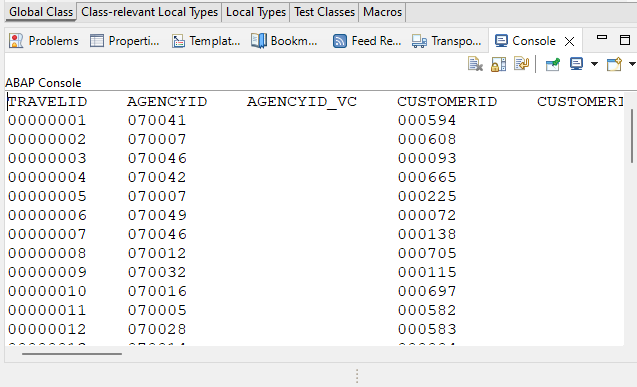

# Create a Remote Client Proxy and Console Application in an SAP BTP ABAP Environment Service 
<!-- description --> In the SAP Business Technology Platform, ABAP Environment, in your consuming system, create an ABAP Console application (ABAP class) that instantiates a proxy, which passes an OData request to a remote service.

##Prerequisites
- **IMPORTANT**: This tutorial cannot be completed on a trial account
- **IMPORTANT**: This tutorial is part of a mission. You must complete the previous parts first; otherwise, you may experience errors or unexpected behavior. The link to the mission is available at the top right of the screen, immediately above the list of steps  

## You will learn
  - How to create an HTTP client in an ABAP class
  - How to instantiate a client proxy in this class that fetches data from your provisioning system
  - How to output that data in an ABAP Console app

This tutorial is based on: [SAP Help Portal: Creating a Remote Client Proxy](https://help.sap.com/viewer/923180ddb98240829d935862025004d6/Cloud/en-US/08603b70390a411cb984f8a8107a7525.html).

Therefore, this tutorial will only cover in detail those aspects that are different, such as using the `cl_http_destination_provider=>create_by_comm_arrangement` method.

---


### Create a class for the remote client proxy and the ABAP Console app

First, in the **consuming system**, you create the class that instantiates the client proxy.

1. In ADT, open your package **`Z_BTP_2_BTP_000`** and choose **New > ABAP Class**.

2. Enter the following, then choose **Next**.
 and description:
    - Name: **`ZCL_PROXY_TRAVELS_000`**
    - Description: **Get travel data from PRV**, *where PRV = your provisioning system*
    - Add interface: **`if_oo_adt_classrun`** *This will enable you to test your connection by outputting your results to the ABAP console first, before you create the artifacts for the Fiori app.

3. Choose the transport request, then choose **Finish**.


### Copy code

1. Replace the skeleton code with the following.
<!-- provide details later; add images in folder
sort top, skip -->


    ```ABAP
    CLASS zcl_get_travels_000 DEFINITION
      PUBLIC
      FINAL
      CREATE PUBLIC .

      PUBLIC SECTION.
        TYPES t_business_data TYPE TABLE OF z000_model_travels=>tys_simple_travel_type.

        METHODS get_travels
          IMPORTING
            top              TYPE i OPTIONAL
            skip             TYPE i OPTIONAL

          EXPORTING
            et_business_data TYPE t_business_data

    *
    *      RAISING
    *        /iwbep/cx_cp_remote
    *        /iwbep/cx_gateway
    *        cx_web_http_client_error
    *        cx_http_dest_provider_error
          .

        INTERFACES if_oo_adt_classrun .
        INTERFACES if_rap_query_provider .
      PROTECTED SECTION.
      PRIVATE SECTION.
    ENDCLASS.


    CLASS zcl_get_travels_000 IMPLEMENTATION.

      METHOD get_travels.

        " Variables for http_client and client_proxy
        DATA:
              lo_http_client  TYPE REF TO if_web_http_client,
              lo_client_proxy TYPE REF TO /iwbep/if_cp_client_proxy,
              lo_request      TYPE REF TO /iwbep/if_cp_request_read_list,
              lo_response     TYPE REF TO /iwbep/if_cp_response_read_lst.

        " 1. Get the destination of remote system; Create http client
        DATA(lo_destination) = cl_http_destination_provider=>create_by_comm_arrangement(
                                                    comm_scenario  = '<Comm Scenario ID'
    **                                                comm_system_id = '<Comm System ID>'
    *                                                 service_id     = ''
    ).
        lo_http_client = cl_web_http_client_manager=>create_by_http_destination( lo_destination ).

        "2. create client proxy
        lo_client_proxy = /iwbep/cl_cp_factory_remote=>create_v2_remote_proxy(
          EXPORTING
              is_proxy_model_key       = VALUE #( repository_id       = 'DEFAULT'
                                                  proxy_model_id      = 'Z000_MODEL_TRAVELS'
                                                  proxy_model_version = '0001' )
            io_http_client             = lo_http_client
            iv_relative_service_root   = '/sap/opu/odata/sap/Z_C_TRAVEL_API_O2_000'  " = the service endpoint in the service binding in PRV' ).
            ).
        ASSERT lo_http_client IS BOUND .

        " 3. Navigate to the resource and create a request for the read operation
        lo_request = lo_client_proxy->create_resource_for_entity_set( 'SIMPLE_TRAVEL' )->create_request_for_read( ).
        lo_request->set_top( 50 )->set_skip( 0 ).

        " 4. Execute the request and retrieve the business data
        lo_response = lo_request->execute( ). 
        lo_response->get_business_data( IMPORTING et_business_data = et_business_data ).


        " Handle remote Exception

      ENDMETHOD.

      METHOD if_oo_adt_classrun~main.
        DATA business_data TYPE TABLE OF z000_model_travels=>tys_simple_travel_type.

        TRY.
            get_travels(

              IMPORTING
                et_business_data  = business_data
              ) .
            out->write( business_data ).
          CATCH cx_root INTO DATA(exception).
            out->write( cl_message_helper=>get_latest_t100_exception( exception )->if_message~get_text( ) ).


        ENDTRY.
      ENDMETHOD.


      METHOD if_rap_query_provider~select.
      ENDMETHOD.


    ENDCLASS.

    ```

2. Format, save and activate your class ( **`Shift+F1`, `Ctrl+S`, `Ctrl+F3`** ).


### Test connection by running Console app
Select your class in the **Project Explorer** and choose **Run as...> Application Console (F9)** from the context menu.

Your output should look like this:

  <!-- border -->
  


### Test yourself

---
