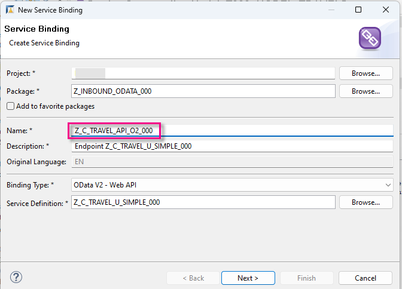
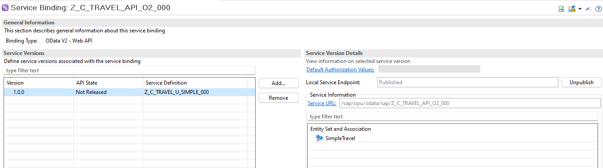
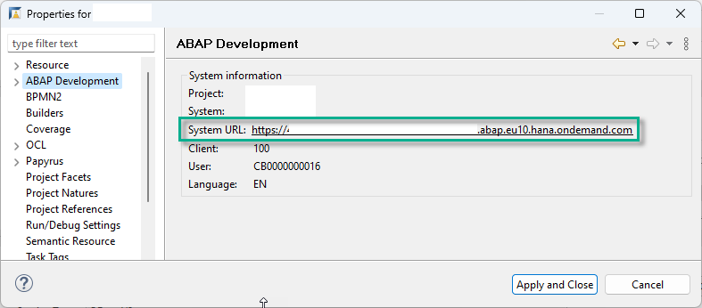
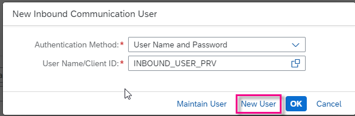
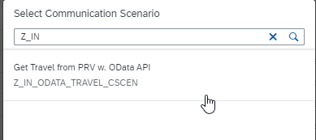
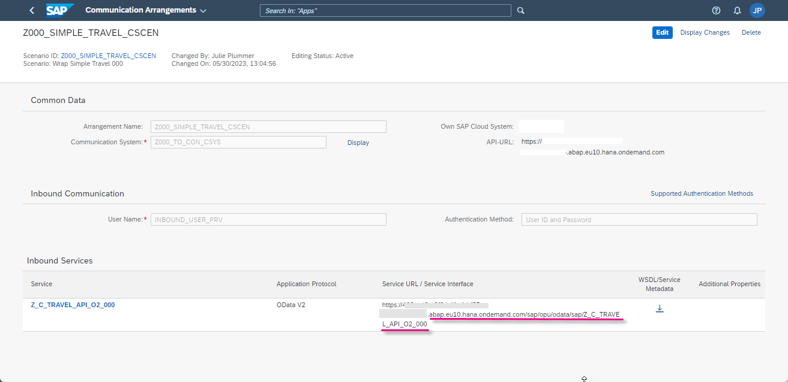

# Provision a Remote OData Service from an SAP BTP ABAP Environment Service
<!-- description --> Create an inbound communication scenario, arrangement, system, and user in the provisioning system of SAP BTP, ABAP Environment. You will use these in a later tutorial to enable a connection to this system from a consuming system, here also of SAP BTP, ABAP Environment. 

## Prerequisites

- **IMPORTANT**: This tutorial cannot be completed on a trial account
- You have set up 2 instances of SAP Business Technology Platform, ABAP Environment, a **provisioning system** and a **consuming system**, for example by using the relevant booster: [Using a Booster to Automate the Setup of the ABAP Environment](https://help.sap.com/viewer/65de2977205c403bbc107264b8eccf4b/Cloud/en-US/cd7e7e6108c24b5384b7d218c74e80b9.html)
- **Tutorial**: [Create Your First Console Application](abap-environment-trial-onboarding), for a licensed user, steps 1-2, for both instances
- In the provisioning system:
    - You have developer authorization for the apps for communication artifacts (i.e. business catalog **`SAP_CORE_BC_COM`** is assigned to your user)
    - You have created a business object projection (i.e. service projection) from a base business object. Here, we created **`Z_C_TRAVEL_U_SIMPLE_000`** as a projection on **`/DMO/I_TRAVEL_U`** from the [ABAP Flight Reference Scenario](https://help.sap.com/viewer/923180ddb98240829d935862025004d6/Cloud/en-US/def316685ad14033b051fc4b88db07c8.html)
    - You have created a service definition from this service projection. Here, we created **`Z_C_TRAVEL_U_SIMPLE_000`**
- You have installed the latest version of [ABAP Development Tools (ADT)](https://tools.hana.ondemand.com/#abap).
- You have read [Developing a UI Service with Access to a Remote Service](https://help.sap.com/viewer/923180ddb98240829d935862025004d6/Cloud/en-US/f4969e551d3049c59715210cbeb4ef56.html) and its [Scenario Description](https://help.sap.com/viewer/923180ddb98240829d935862025004d6/Cloud/en-US/4f539da657fe427f868a95c0bc1b3cfa.html), since this mission is based on this tutorial series
- Optional: You have installed the [Postman API Platform](https://www.getpostman.com/)

## You will learn

- In the **provisioning** system, how to expose a CDS view as an OData service using a **Service Binding**
- How to wrap this OData service in an inbound communication scenario, so that it can be accessed from another instance of SAP BTP, ABAP environment
- How to make the provisioning system service available for connection from other ABAP systems
- How to test your service URL in Postman (optional)
- How to create an XML metadata file representing the remote service

This approach involves some overhead for one consumer; however, the advantage is that you can add several consumer systems, or users (for example, with different authentication) pointing to the same HTTP service, wrapped in the same Communication Scenario.

This tutorial mission was written for SAP BTP ABAP Environment. However, you should also be able to use it in SAP S/4HANA Cloud Environment in the same way.

**Mission Scenario**:

You want to get data that is only available in a remote instance of SAP BTP, ABAP Environment ( **provisioning system** ) and display it in a second instance ( **consuming system** ).

In the mission, you will learn:
1. In the **provisioning system**, create inbound communication artifacts for an OData Service 
2. Create a **Service Consumption Model** and save this locally as a `$metadata` XML file. From this you will create proxy artifacts in the consuming system, representing the remote service, and use this model to generate an **abstract entity**
3. In the **consuming system**, create outbound communication artifacts for an OData Service 
4. Create a Remote Client Proxy that passes the OData requests to the remote service
5. Build a new OData service in the consuming system, using a CDS custom entity and query implementation class
6. Display the remote data in an ABAP Console app
7. Finally, display the remote data in Fiori Elements preview in your browser.

> Throughout this tutorial, replace `000` with your initials or group number.

<!-- border -->

---

### Create package in provisioning system
You start in your **provisioning** system by creating the ABAP artifacts in ABAP Development Tools (ADT), starting with a package.

1. select the ABAP Cloud Project and choose **New > ABAP Package** from the context menu.

2. Enter the following and choose **Next**:
    - Name = **`Z_BTP_2_BTP_000`**
    - Description = **Connect 2 instances of BTP ABAP**
    - Package type = **Development**

3. Choose **Create new transport request**, enter a description, such as **Connect 2 instances of BTP ABAP**, then choose **Finish**.

4. Add it to **Favorite Packages**.

### Create OData service endpoint (service binding)

First, you need to expose your service definition (based on your service projection, e.g. **`Z_C_TRAVEL_U_SIMPLE_000`**) as an endpoint so that the **consuming system** can access it. To do this, create a service binding of type **Web API**, OData version 2. (The type **UI** is not suitable for creating the other objects you will derive from it later.) 

When naming, remember to comply with the [Naming Conventions for RAP Business Objects](https://help.sap.com/docs/SAP_S4HANA_CLOUD/e5522a8a7b174979913c99268bc03f1a/8b8f9d8f3cb948b2841d6045a255e503.html?q=naming%20convention&version=2302.500).

1. Create a new **Service Binding** from the service definition by selecting it and choosing **New Service Binding** from the context menu. 

    <!-- border -->
    

2. In the wizard:

    - **IMPORTANT**: Choose the correct package, that is, **your** package, not **`/DMO/...`**
    - Delete the namespace `/DMO/` and enter the following:
    - Name: **`Z_C_TRAVEL_API_O2_000`** 
    - Description **`Endpoint Z_C_TRAVEL_U_SIMPLE_000`**
    - Enter the binding type: **`ODATA V2 - Web API`**
    - Make sure that the service definition = **`Z_C_TRAVEL_U_SIMPLE_000`**
    - Choose **Next**

    <!-- border -->
    

3. Accept the transport request and choose **Finish**.    

The service binding opens in a new editor.

4. Choose **Activate `( Ctrl+F3 )`** , then choose **Publish**.

    <!-- border -->
    

### Create inbound Communication Scenario

1. Choose **New > Other Repository Object...** from the context menu.

2. Add the filter **`scen`**, then choose **Communication Scenario**, then choose **Next**.
    
3. Enter the following, choose a transport request, then choose **Finish**.

    - Name: **`Z_IN_ODATA_TRAVEL_CSCEN`** 
    - Description **Get Travel w. OData API** 

Your Communication Scenario appears in a new editor.

### Add service binding

1. On the **Inbound** tab, choose **Add...**.

    <!-- border -->
    

2. **IMPORTANT**: Choose **Browse**. You cannot simply enter the name. Then add a filter, such as **`Z000_`**, select your service binding - (with the ending `IWSG` or `G4BA` added automatically) then choose **Finish**.

    <!-- border -->
    

3. Your service binding **`Z_C_TRAVEL_API_O2_000_IWSG`** appears. Save, then choose **Publish Locally**.

    <!-- border -->
    

> `IWSG` refers to OData 2.0; 
 
`G4BA` refers to OData 4.0.

### Create Communication System

Now you will create several communication artifacts using the appropriate Fiori app.

1. Open the Fiori dashboard for your provisioning system in a browser. You can find the URL for the dashboard by selecting your system (that is, ABAP Project in Project Explorer), then choosing **Properties > ABAP Development > System URL** from the context menu.

    <!-- border -->
    

2. From the Dashboard Home screen, choose From **Communication Management > Communication Systems**.

3. Choose **New**.

    <!-- border -->
    

4. Enter a System ID, **`Z000_TO_CON_CSYS`** (where **CON** is your consuming system; accept the default (identical) System name; then choose **Create**.

    <!-- border -->
    

5. In **Technical Data**:

    - Switch **Destination Service** to **OFF**.

    - Switch **Cloud Connector** to **OFF**.

    - In **Host Name**, enter the base URL of your provisioning system in the form **`<GUID>.abap.<region>.hana.ondemand.com`**. Again, you can find the URL for the dashboard by selecting your system (that is, ABAP Project in Project Explorer), then choosing **Properties > ABAP Development** from the context menu.

        > IMPORTANT:  
         
        Remove the protocol (e.g. `https://`) from the start and `/` from the end of the host name.
         
        Make sure the domain starts with `abap`, not `abap-web`

    <!-- LATER: UI Host Name; Inbound Only ??? 
    - Business System = **dummy**?
    Ask Sevdiye -->

    - Port = **443**

    <!-- border -->
    

6. Scroll down to **Users for Inbound Communication**, then create a new user by choosing the **+** icon.
    
    <!-- border -->
    

7. Choose **New User** and the **Authentication Method: User name and password**.

    <!-- border -->
    

8. Enter a name, **`INBOUND_USER_PRV`**, and description, then choose **Propose password**, then choose **Create > OK > Save**. `PRV` is the name of the provisioning system, that is, this system. 

    > **IMPORTANT**: Save the proposed password, since you will need it later.

9. Save your changes.

### Create inbound communication arrangement

1. From **Communication Management**, choose **Communication Arrangement**. Then choose **New**.

    <!-- border -->
    

2. Choose your scenario, **`Z_IN_ODATA_TRAVEL_CSCEN`** from the drop-down list. Accept the default (identical) Arrangement name.

    <!-- border -->
    

3. From the dropdown list, choose your communication system **`Z000_TO_CON_CSYS`**

4. Save your changes.

Your Communication Arrangement should look roughly like this. 

> The information from the Communication System is filled in automatically. The Service URL / Service Interface = < Base URL of provisioning system > + relative path of your Inbound Service, here `/sap/opu/odata/sap/Z_C_TRAVEL_API_O2_000_IWSG`.

<!-- border -->

### Check service URL in Postman (Optional)

1. Open Postman. In the **Authorization** tab, enter your authorization credentials:

    - Type = Basic Auth.
    - Username = `INBOUND_USER_PRV`
    - Password = The generated password you noted down

2. Stick with the default **GET** and paste the complete path of your service, Base URL and relative path, into the input field, then choose **Send**.

3. The response appears in the **Body** field, along with the status **200 OK**.

    <!-- border -->
    

### Create service metadata file

On the left is the Service Definition, `/DMO/TRAVEL_U`.

Now, on the right, is the active service, including the Entity Set and the Service URL.

<!-- border -->

You will now create a metadata file for this service, which you will access later in your consuming system.

1. Click on the link **Service URL**. The `XML` file is shown in the browser.

2. Add the suffix **`/$metadata`** to the Service URL (deleting parameters, such as `sap-client`).

    <!-- border -->
    

    The service metadata appears.

3. Choose **Save As...** from the context menu. 

    > IMPORTANT: Make sure the file name is pre-filled as **`$metadata.xml`**. Otherwise, it is not a valid metadata file.

4. Navigate to an appropriate folder and choose **Save**.

### Test yourself

### More Information
[Postman: Video Tutorials](https://www.youtube.com/playlist?list=PLM-7VG-sgbtAgGq_pef5y_ruIUBPpUgNJ)

SAP Help Portal:[Service Consumption via Communication Arrangements](https://help.sap.com/docs/btp/sap-business-technology-platform/service-consumption-via-communication-arrangements)

---
