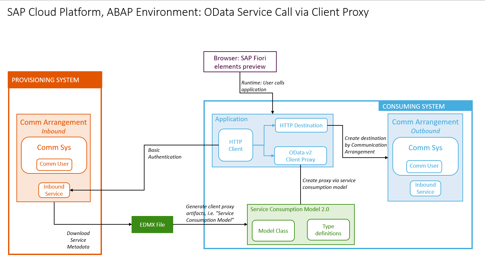

# Publish an OData service for remote consumption as an API
<!-- description --> Enable another system, such as STP, to securely access data by creating: an inbound communication scenario, arrangement, system, and user in the provisioning system of SAP BTP, ABAP Environment; and by providing a service metadata file  

## Prerequisites

- You have created an OData service, e.g. by completing the tutorial group: [Build an SAP Fiori elements App Using the ABAP RESTful Application Programming Model (RAP) [RAP100]](/group.abap-build-fiori-element-rap.html)

## You will learn

- In the **provisioning** system, how to expose a CDS view as an OData service using a **Service Binding**
- How to wrap this OData service in an inbound communication scenario, so that it can be accessed from another instance of SAP BTP, ABAP environment
- How to make the provisioning system service available for connection from other ABAP systems
- How to create an XML metadata file representing the remote service

This approach involves some overhead for one consumer; however, the advantage is that you can add several consumer systems, or users (for example, with different authentication) pointing to the same HTTP service, wrapped in the same Communication Scenario.

This tutorial mission was written for SAP BTP ABAP Environment. However, you should also be able to use it in SAP S/4HANA Cloud Environment in the same way.

> Throughout this tutorial, replace `###` or `000` with your initials or group number.

<!-- border -->

---

### Create package in provisioning system
You start in your **provisioning** system by creating the ABAP artifacts in ABAP Development Tools (ADT), starting with a package.

1. select the ABAP Cloud Project and choose **New > ABAP Package** from the context menu.

2. Enter the following and choose **Next**:
    - Name = **`Z_INBOUND_ODATA_###`**
    - Description = **Provide access from remote system - OData**
    - Package type = **Development**

1. Choose **Create new transport request**, enter a description, such as **Provide access from remote system - OData**, then choose **Finish**.

2. Add it to **Favorite Packages**.

### Create inbound Communication Scenario

1. Select the package and choose **New > Other Repository Object...** from the context menu.

2. Add the filter **`scen`**, then choose **Communication Scenario**, then choose **Next**.
    
3. Enter the following, choose a transport request, then choose **Finish**.

    - Name: **`Z_IN_ODATA_TRAVEL_CSCEN`** 
    - Description **Get Travel w. OData API** 

Your Communication Scenario appears in a new editor.

### Add service binding

1. On the **Inbound** tab, choose **Add...**.

    <!-- border -->
    

2. **IMPORTANT**: Choose **Browse**. You cannot simply enter the name. Then add a filter, such as **`Z###_`**, select your service binding - (with the ending `IWSG` or `G4BA` added automatically) then choose **Finish**.

    <!-- border -->
    

3. Your service binding **`Z_C_TRAVEL_API_O2_###_IWSG`** appears. Save, then choose **Publish Locally**.

    <!-- border -->
    

> `IWSG` refers to OData 2.0; 
 
`G4BA` refers to OData 4.0.

### Create Communication System

Now you will create several communication artifacts using the appropriate Fiori app.

1. Open the Fiori dashboard for your provisioning system in a browser. You can find the URL for the dashboard as follows: 
   
   - Select your system (that is, ABAP Project in Project Explorer)
   - Choose **Properties > ABAP Development > System URL** from the context menu
   - Copy this URL into your browser and choose **Enter**. 
   - **IMPORTANT**: Check that the URL does **not** contain the string **`-api`**. If it does, delete it.

    <!-- border -->
    

2. From the Dashboard Home screen, choose From **Communication Management > Communication Systems**.

3. Choose **New**.

    <!-- border -->
    

4. Enter a System ID, **`Z###_TO_CON_CSYS`**, where **CON** is your consuming system; accept the default (identical) System name; then choose **Create**.

    <!-- border -->
    

5. In **Technical Data**:

    - Switch **Destination Service** to **OFF**.

    - Switch **Cloud Connector** to **OFF**.

    - In **Host Name**, enter the base URL of your provisioning system in the form **`<GUID>.abap.<region>.hana.ondemand.com`**. Again, you can find the URL for the dashboard by selecting your system (that is, ABAP Project in Project Explorer), then choosing **Properties > ABAP Development** from the context menu.

        > IMPORTANT:  
         
        Remove the protocol (e.g. `https://`) from the start and `/` from the end of the host name.
         
        Make sure the domain starts with `abap`, not `abap-web`

    - Port = **443**

    <!-- border -->
    

6. Scroll down to **Users for Inbound Communication**, then create a new user by choosing the **+** icon.
    
    <!-- border -->
    

7. Choose **New User** and the **Authentication Method: User name and password**.

    <!-- border -->
    

8. Enter a name, **`INBOUND_USER_PRV`**, and description, then choose **Propose password**, then choose **Create > OK > Save**. `PRV` is the name of the provisioning system, that is, this system. 

    > **IMPORTANT**: Save the proposed password, since you will need it later.

9. Save your changes.

### Create inbound communication arrangement

1. From **Communication Management**, choose **Communication Arrangement**. Then choose **New**.

    <!-- border -->
    

2. Choose your scenario, **`Z_IN_ODATA_TRAVEL_CSCEN`** from the drop-down list. Accept the default (identical) Arrangement name.

    <!-- border -->
    

3. From the dropdown list, choose your communication system **`Z###_TO_CON_CSYS`**

4. Save your changes.

Your Communication Arrangement should look roughly like this. 

> The information from the Communication System is filled in automatically. The Service URL / Service Interface = < Base URL of provisioning system > + relative path of your Inbound Service, here `/sap/opu/odata/sap/Z_C_TRAVEL_API_O2_###_IWSG`.

<!-- border -->

<!-- 
SORT BORDER
### Check service URL in Postman (Optional)

1. Open Postman. In the **Authorization** tab, enter your authorization credentials:

    - Type = Basic Auth.
    - Username = `INBOUND_USER_PRV`
    - Password = The generated password you noted down

2. Stick with the default **GET** and paste the complete path of your service, Base URL and relative path, into the input field, then choose **Send**.

3. The response appears in the **Body** field, along with the status **200 OK**.

Add image later
-->

### Create service metadata file

On the left is the Service Definition, `/DMO/TRAVEL_U`.

Now, on the right, is the active service, including the Entity Set and the Service URL.

<!-- border -->

You will now create a metadata file for this service, which you will access later in your consuming system.

1. Click on the link **Service URL**. The `XML` file is shown in the browser.

2. Add the suffix **`/$metadata`** to the Service URL (deleting parameters, such as `sap-client`).

    <!-- border -->
    

    The service metadata appears.

3. Choose **Save As...** from the context menu. 

    > IMPORTANT: Make sure the file name is pre-filled as **`$metadata.xml`**. Otherwise, it is not a valid metadata file.

4. Navigate to an appropriate folder and choose **Save**.

### Test yourself

### Next steps

Optional: You can now consume a custom OData Service such as the one described in:
[Integrate the SAP BTP, ABAP environment with SAP S/4HANA Cloud, public edition](https://developers.sap.com/group.sap-btp-abap-s4hana-integrate.html)

---
