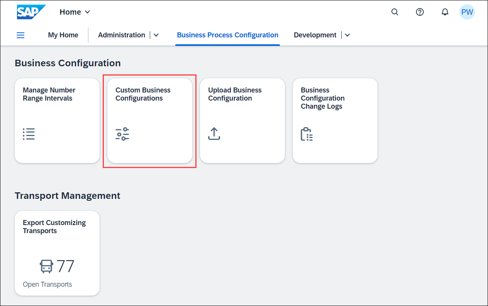
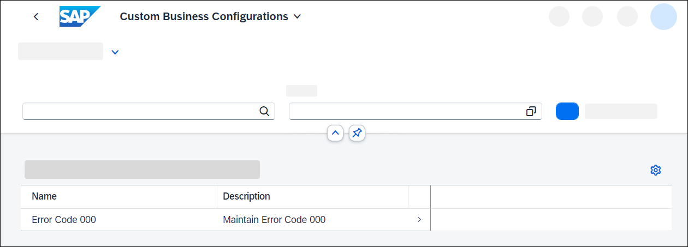
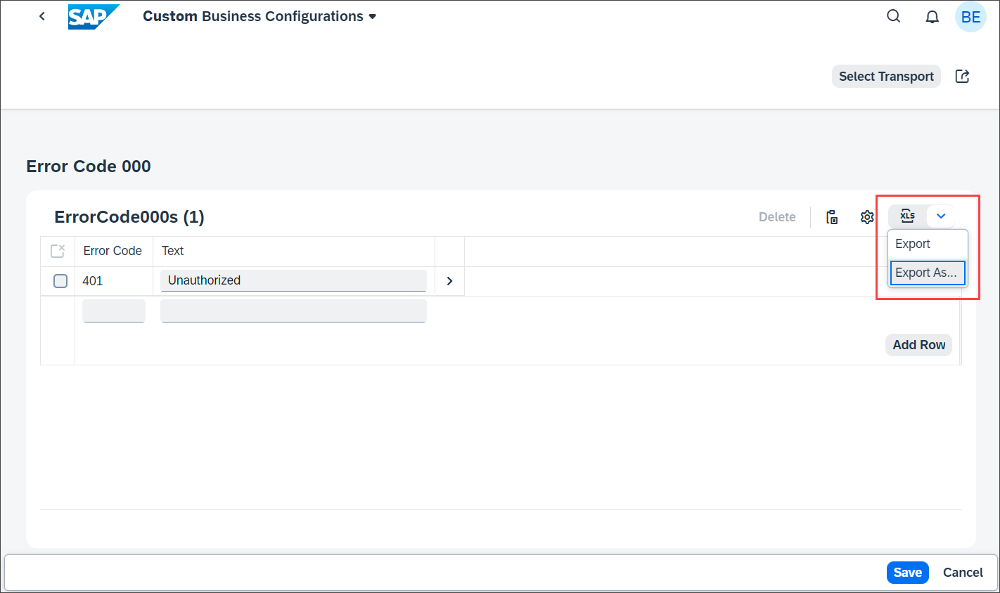
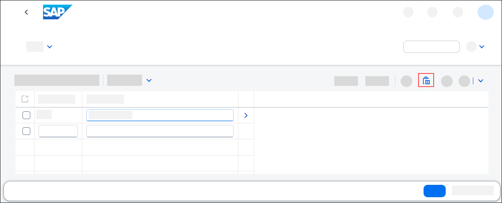
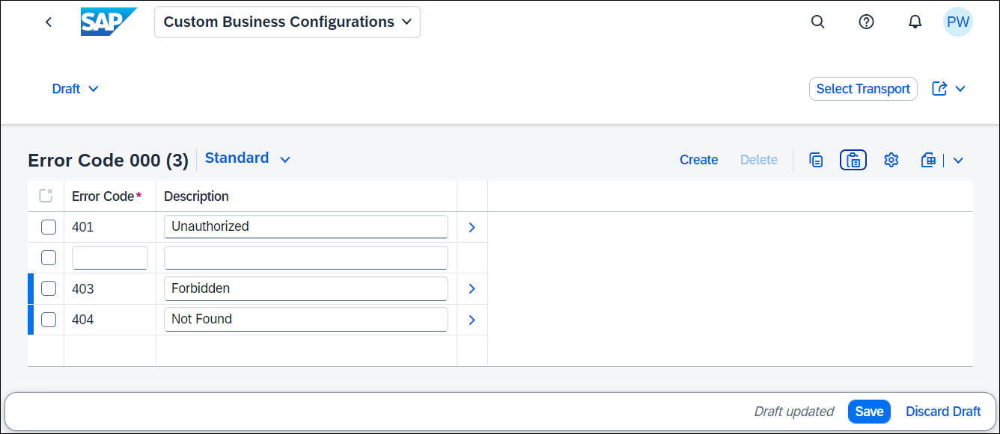
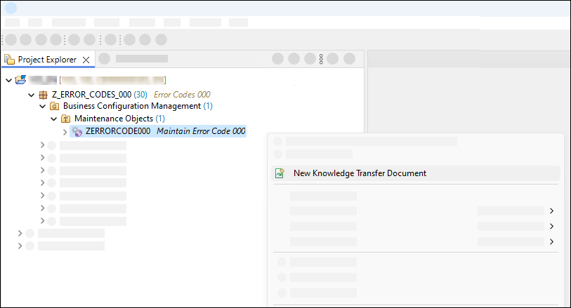
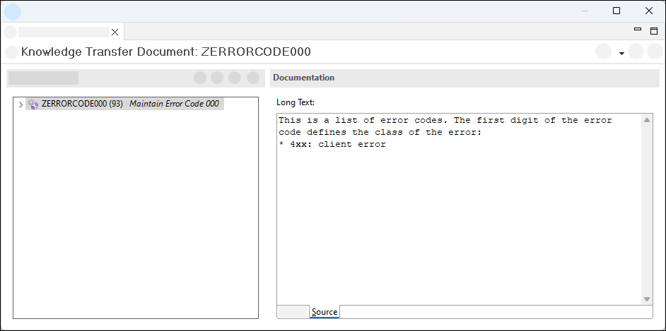
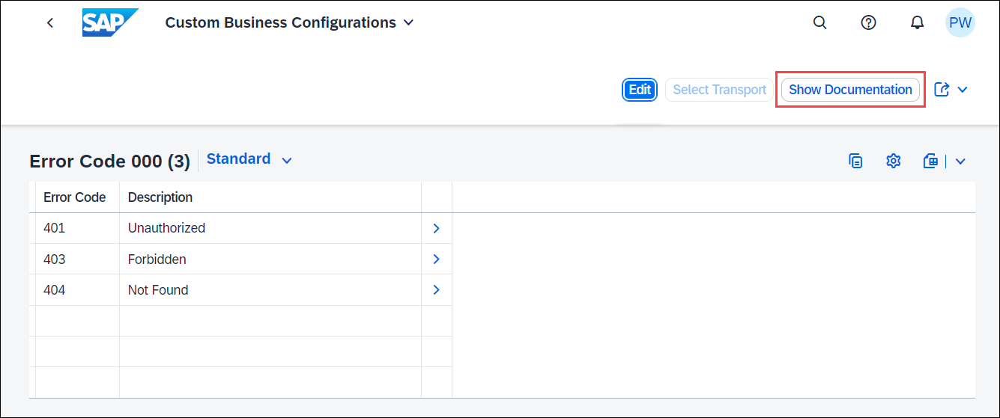
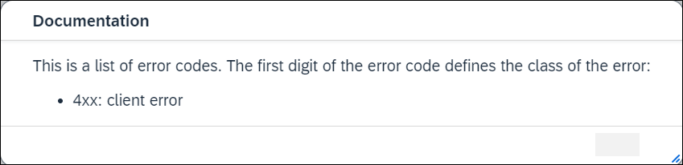

# Explore additional features of the Custom Business Configurations app
<!-- description --> Learn how to copy and paste data from spreadsheet applications. Learn how to create business configuration documentation and use intent navigation.

## Prerequisites  
- You need an SAP BTP, ABAP environment license or a [trial user](abap-environment-trial-onboarding).
- This tutorial also works in an SAP S/4HANA Cloud, public edition system.
- This is the fourth tutorial of group [Create a SAP Fiori based Table Maintenance app](group.abap-env-factory). You must complete the tutorials in the given order.

## You will learn  
- How to copy and paste data from spreadsheet applications
- How to create business configuration documentation
- How to use of intent navigation

---
### Copy and paste data from spreadsheet applications

You can add multiple error codes by copying and pasting them from a [spreadsheet application](https://ui5.sap.com/#/topic/f6a8fd2812d9442a9bba2f6fb296c42e).

  1. Start the **Custom Business Configurations** app.

      

  2. Select your business configuration.

      

  3. Click **Edit**.

  4. Click on the **spreadsheet icon** and select **Export as**.

      

  5. Export current table content to spreadsheet:
     - File Name: **`ErrorCode###s`**
     - Format: **`Spreadsheet`**
     - Split cells with multiple values: **`true`**

  6. Open the downloaded file and **Enable Editing**.

  7. Add two new lines with the following data:
    - Error Code: **`403`**, Description: **`Forbidden`**
    - Error Code: **`404`**, Description: **`Not Found`**

  8. Select and copy both lines

  9. In the **Custom Business Configurations** app, click **Paste**.

      

10. When prompted, click **Allow**.

11. After the insertion, the new lines are displayed. Select a transport and click **Save**.

      

### Create business configuration documentation

You want to provide the user of the app **Custom Business Configurations** with detailed [documentation](https://help.sap.com/docs/btp/sap-business-technology-platform/custom-business-configurations-app#show-documentation) of the business configuration.

  1. Open your ABAP package in ADT, right-click your Business Configuration Maintenance Object, and choose **New Knowledge Transfer Document**.

      

  2. Create a new knowledge transfer document called **`ZERRORCODE###`**

  3. Complete the wizard.

  4. Write the documentation in the markdown language.

      

  5. Activate the Knowledge Transfer Document.

  6. Reload the **Custom Business Configurations** app. A new action is now displayed in the upper right corner.

      

  7. Click **Show Documentation**.

      

### Make use of intent navigation

You want to navigate from your SAP Fiori app to the maintenance view of a business configuration maintenance object.

For this [intent navigation](https://help.sap.com/docs/BTP/65de2977205c403bbc107264b8eccf4b/76384d8e68e646d6ae5ce8977412cbb4.html#intent-navigation), you can use the parameter `TechnicalIdentifier` for the semantic object `BusinessConfiguration` with the action `maintain`.

You can test this in the browser:

 - `/ui#BusinessConfiguration-maintain` navigates to the List Report of the **Custom Business Configurations** app
 - `/ui#BusinessConfiguration-maintain?TechnicalIdentifier=ZERRORCODE###` directly navigates to the maintenance view of the Business Configuration Maintenance Object `ZERRORCODE###`

### Test yourself

---
