# ABAP Core Tools for Visual Studio Code
<!-- description --> You will explore the ABAP Development Tool (ADT) functionality in Visual Studio Code which do not require Agentic AI capabilities.

## Introduction
ABAP development tools for Visual Studio Code provides an efficient and feature-rich set of tools for ABAP development within the ABAP Cloud development model. It brings modern ABAP development to your editor, enabling you to create, edit, debug, and manage ABAP artifacts directly in VS Code. You need to set up your development environment in **Visual Studio Code** and connect it to your ABAP system.   

This tutorial focus on non-Agentic AI capabilities and do not need any coding agent extension in Visual Studio Code (for e.g: GitHub Copilot)

## Prerequisites  
You have connected an ABAP system to Visual Studio Code following the tutorial.

## You will learn
    - How to explore and adjust the generated artifacts (CDS views, behavior definitions, metadata extensions) directly in Visual Studio Code
    - How to publish the service binding and preview the SAP Fiori elements app in the browser
    - How to run ABAP unit tests from Visual Studio Code 
    - How to debug the SAP Fiori App from Visual Studio Code

### Add package as folder to workspace in VS Code

You need to have a package created in ADT. This package can be added as a folder to workspace.

1. Open the **Command Palette** or **`Ctrl+Shift+P`**.
       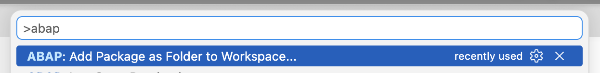
2. Type `ABAP: Add Package as folder to Workspace` 
3. Search the package you have created in ADT.
       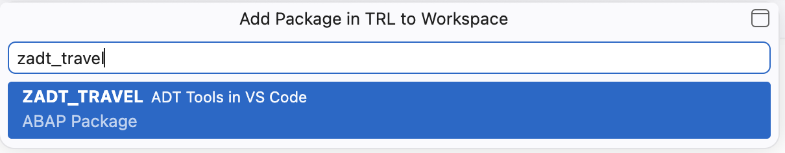 
4. Enter Workspace folder name.
       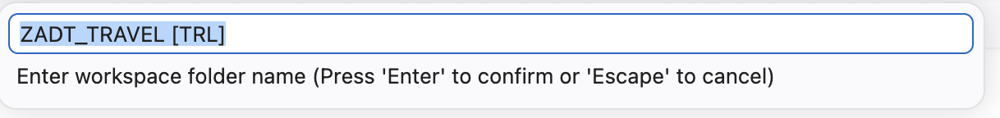
5. Folder is added to Workspace
       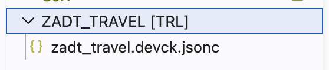

### Logon to Destination

During any time if you have been logged out of system, you need to Log On to the Destination to continue the work by following options:

1. Right click on the Package which is added as a Folder to Workspace and choose "Log On to Destination"
   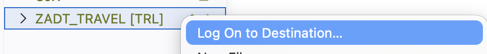 
   OR
1. Open the **Command Palette** or **`Ctrl+Shift+P`**.
2. Type `ABAP: Log On to Destination` 
   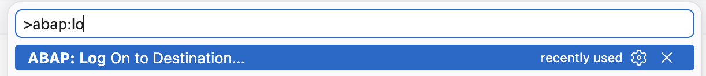 
3. Select the Destination. This will prompt to open the system in  browser to enter the logon credentials
   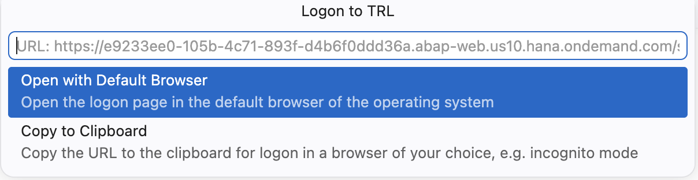 

### Open object

1. Open the **Command Palette** or **`Ctrl+Shift+P`**.
2. Type `ABAP: Open Object` 
   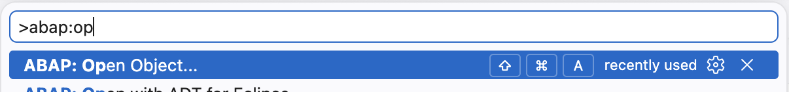
3. Give the name of the object. E.g "I_Currency". You can search for class, data definition. 
   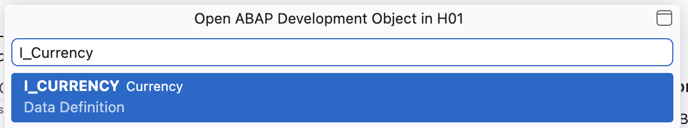
4. You can analyse the opened object.
   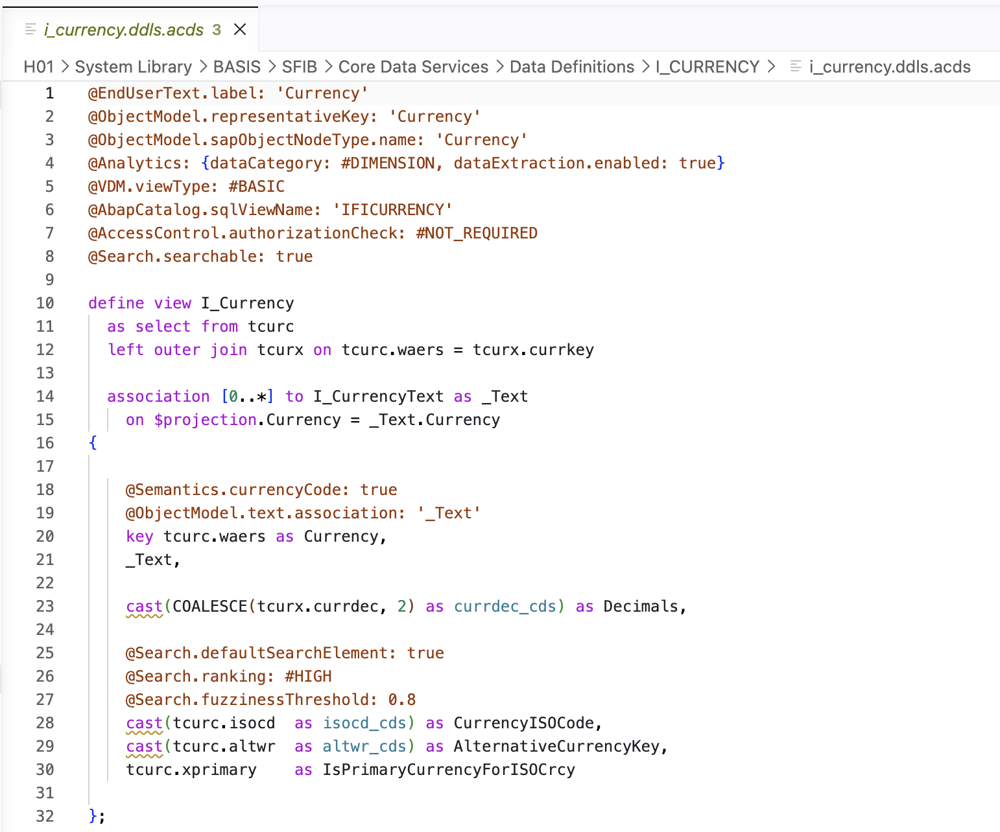
5. Objects with unsaved backend changes are marked **(L)** — they must be **activated** (**`Ctrl+F3`**) to become active in the system.

### Create new Databse table

1. Open the **Command Palette** or **`Ctrl+Shift+P`**.

2. Type `ABAP: Create New ABAP Object` 
   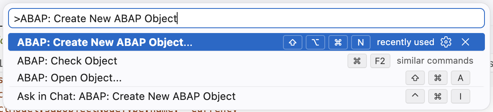

3. You can choose the object type that you want to create. Choose 'Database Table'.
   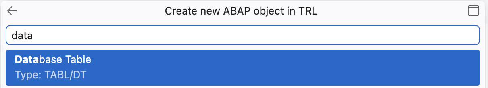

4. Choose the package name that was used in the previous step.
   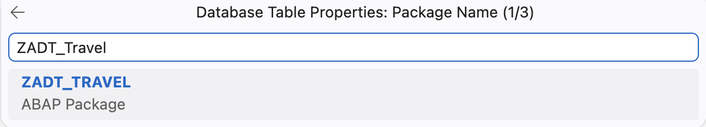

5. Enter the name of the Database Table 'ZADT_Travel_###'to be created and press Enter to confirm. 
   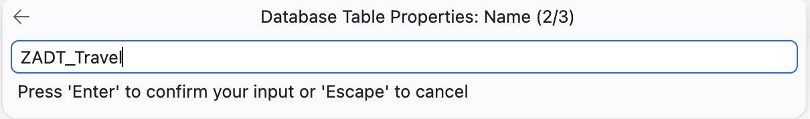

6. Give a Description
   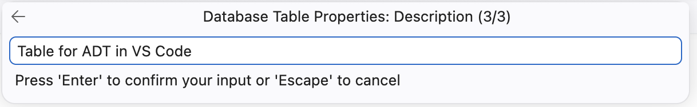

7. A new 'Database Table' will be created.

8. Copy the below code and replace it in the Database table. Replace '###' with the unique number that you have given.

    ```CDS
      @EndUserText.label : 'Table for ADT in VS Code'
      @AbapCatalog.enhancement.category : #NOT_EXTENSIBLE
      @AbapCatalog.tableCategory : #TRANSPARENT
      @AbapCatalog.deliveryClass : #A
      @AbapCatalog.dataMaintenance : #RESTRICTED
      define table zadt_travel_### {

         key client            : abap.clnt not null;
         key travel_id         : /dmo/travel_id not null;
         agency_id             : /dmo/agency_id;
         customer_id           : /dmo/customer_id;
         begin_date            : /dmo/begin_date;
         end_date              : /dmo/end_date;
         @Semantics.amount.currencyCode : 'zadt_travel_###.currency_code'
         booking_fee           : /dmo/booking_fee;
         @Semantics.amount.currencyCode : 'zadt_travel_###.currency_code'
         total_price           : /dmo/total_price;
         currency_code         : /dmo/currency_code;
         description           : /dmo/description;
         overall_status        : /dmo/overall_status;
         created_by            : abp_creation_user;
         created_at            : abp_creation_tstmpl;
         local_last_changed_by : abp_locinst_lastchange_user;
         local_last_changed_at : abp_locinst_lastchange_tstmpl;
         last_changed_at       : abp_lastchange_tstmpl;

      }
    ```
### Check and Activate Object

1. Open the **Command Palette** or **`Ctrl+Shift+P`**.

2. Type `ABAP: Check Object`. This will run the syntax check on the opened object. The message 'Running Syntax check' appears in the Status bar 
   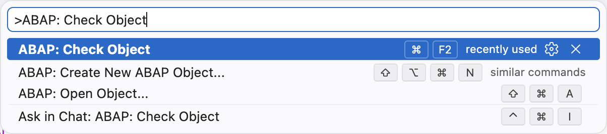

3. To Activate an object: open the **Command Palette** **`Ctrl+Shift+P`** and Type `ABAP: Activate`. 
   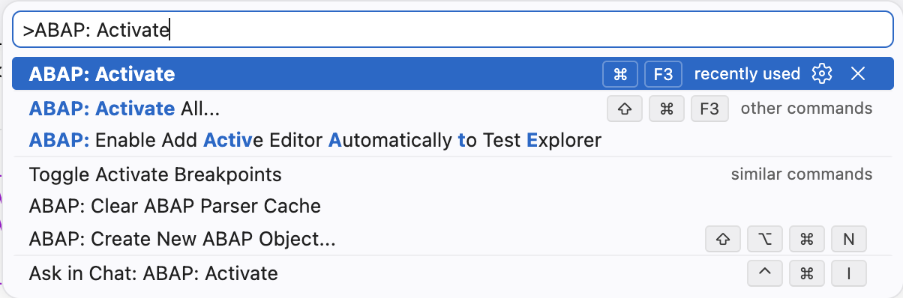

    You can also use **`Ctrl+F3`**. Activate icon is also available on top of the editor window.

   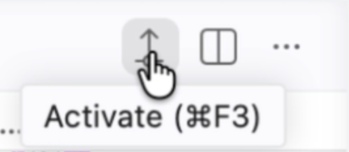 

### Create a data generator Class

1. Open the **Command Palette** or **`Ctrl+Shift+P`**.
2. Type `ABAP: Create New ABAP Object` 
   
3. You can choose the object type that you want to create. Choose 'Class'.
   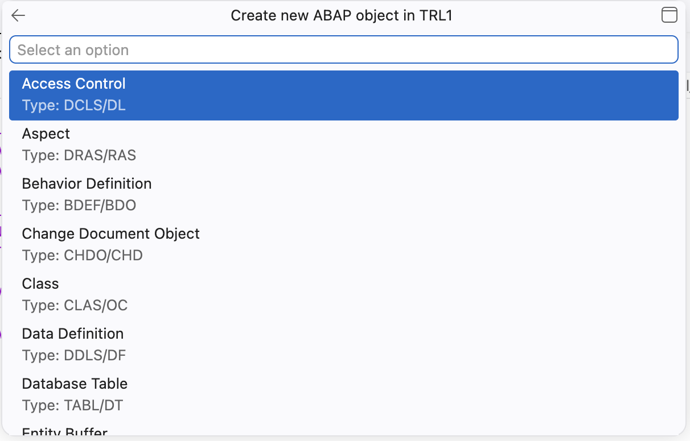
4. Choose the package name that was used in the previous step.
   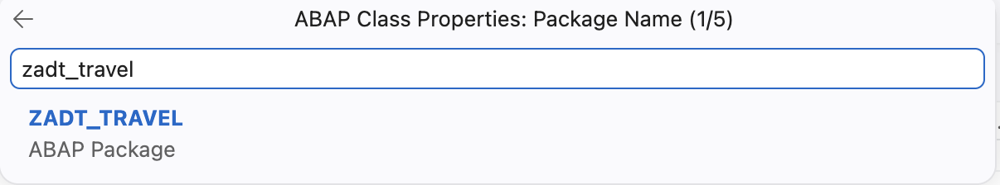
5. Enter the name of the Class to be created and press Enter to confirm. 
   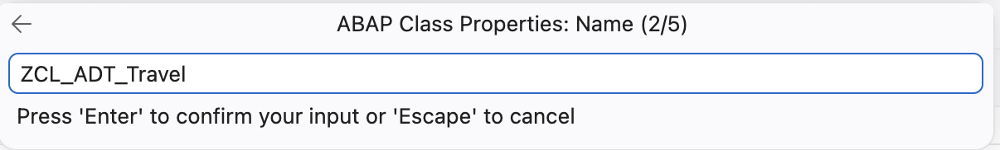 
6. Give a Description
   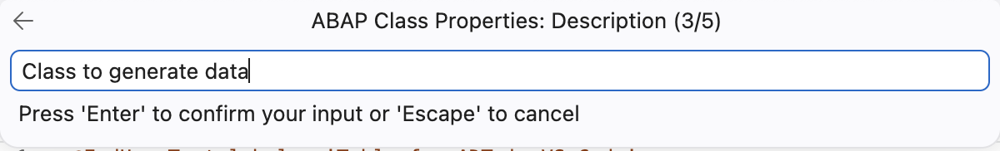 
7. Choose a Super Class and interface if required.
   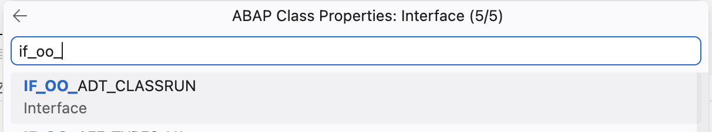
8. A new 'Class' will be created.
   
9. Copy the below code and replace it in the Class. Replace '###' with the unique number that you have given.

    ```ABAP
      CLASS zcl_adt_travel_### DEFINITION
      PUBLIC
      FINAL
      CREATE PUBLIC .

      PUBLIC SECTION.

         INTERFACES if_oo_adt_classrun .
      PROTECTED SECTION.
      PRIVATE SECTION.
      ENDCLASS.

      CLASS zcl_adt_travel_### IMPLEMENTATION.

      METHOD if_oo_adt_classrun~main.
         DATA:
            group_id   TYPE string VALUE '###'.

      * clear data
         DELETE FROM zadt_travel_###.
      * DELETE FROM zadt_travel_###.

         "insert travel demo data
         INSERT zadt_travel_### FROM (
                  SELECT
                  FROM /dmo/travel AS travel
                  FIELDS
                     travel~travel_id        AS travel_id,
                     travel~agency_id        AS agency_id,
                     travel~customer_id      AS customer_id,
                     travel~begin_date       AS begin_date,
                     travel~end_date         AS end_date,
                     travel~booking_fee      AS booking_fee,
                     travel~total_price      AS total_price,
                     travel~currency_code    AS currency_code,
                     travel~description      AS description,
                     CASE travel~status    "[N(New) | P(Planned) | B(Booked) | X(Cancelled)]
                        WHEN 'N' THEN 'O'
                        WHEN 'P' THEN 'O'
                        WHEN 'B' THEN 'A'
                        ELSE 'X'
                     END                     AS overall_status,
                     travel~createdby        AS created_by,
                     travel~createdat        AS created_at,
                     travel~lastchangedby    AS last_changed_by,
                     travel~lastchangedat    AS last_changed_at,
                     travel~lastchangedat    AS local_last_changed_at
                     ORDER BY travel_id UP TO 10 ROWS
               ).
         COMMIT WORK.
         out->write( | Demo data generated for table zadt_travel_{ group_id }. | ).
      ENDMETHOD.
      ENDCLASS.
    ```
10. To Format the document, right click on the class and choose Format Document.
   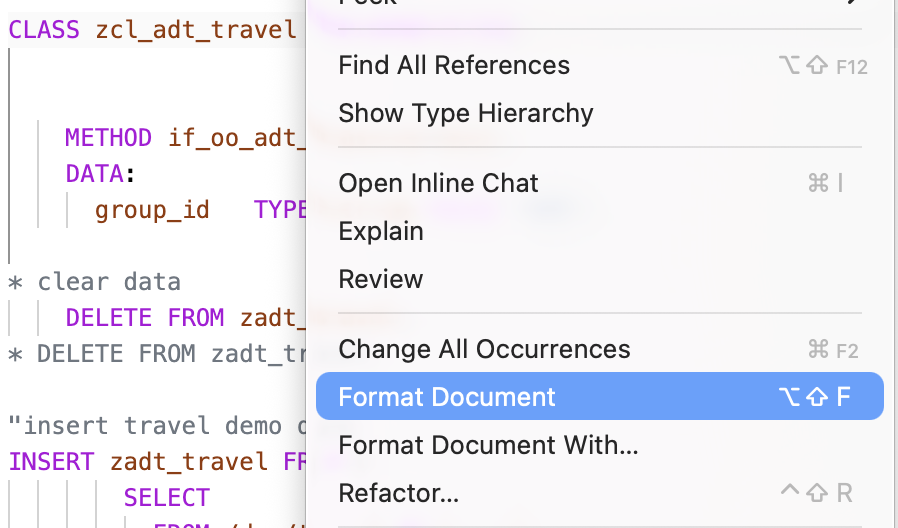
11. Save and Activate the new Class by following Step 5.
12. Now execute your class by hitting F5 or Type `ABAP: Open with ADT for Eclipse` in the Command Palette. 
   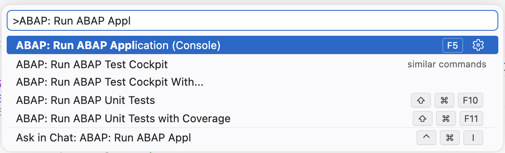
13. You will get a message 'Demo data generated for table zadt_travel_###' in the console.


### Create new CDS View

1. Open the **Command Palette** or **`Ctrl+Shift+P`**.
2. Type `ABAP: Create New ABAP Object` 
   
3. You can choose the object type that you want to create. Choose 'Data Definition'.
   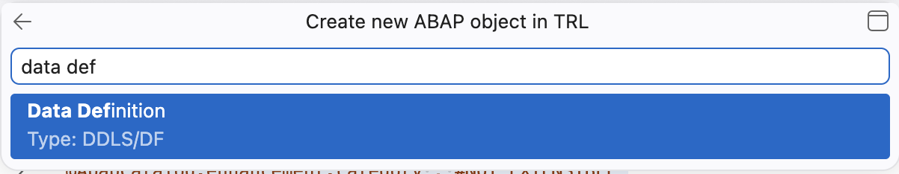 
4. Choose the package name that was used in the previous step.
   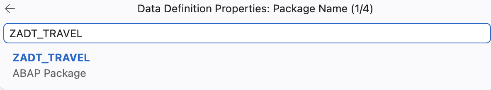
5. Enter the name of the Database Definition 'ZI_ADT_Travel_###'to be created and press Enter to confirm. 
   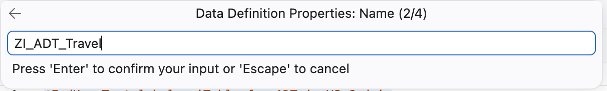
6. Give a Description
7. In the next step you can choose the reference object for the new CDS view to be build
   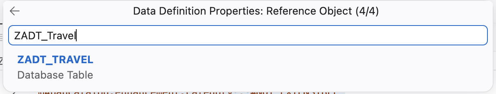
8. A new 'Data Definition' will be created.
9. Copy the below code and replace it in the CDS View Entity. Replace '###' with the unique number that you have given.

    ```CDS
      @AbapCatalog.viewEnhancementCategory: [#NONE]
      @AccessControl.authorizationCheck: #NOT_REQUIRED
      @EndUserText.label: 'CDS view for ADT Tools'
      @Metadata.ignorePropagatedAnnotations: true
      define view entity ZI_ADT_Travel_### as select from ZADT_TRAVEL_###
      {
         key travel_id as TravelId,
         agency_id as AgencyId,
         customer_id as CustomerId,
         begin_date as BeginDate,
         end_date as EndDate,
         @semantics.amount.currencyCode: 'CurrencyCode'
         booking_fee as BookingFee,
         @semantics.amount.currencyCode: 'CurrencyCode'
         total_price as TotalPrice,
         currency_code as CurrencyCode,
         description as Description,
         overall_status as OverallStatus,
         created_by as CreatedBy,
         created_at as CreatedAt,
         local_last_changed_by as LocalLastChangedBy,
         local_last_changed_at as LocalLastChangedAt,
         last_changed_at as LastChangedAt
      }
    ```
10. Activate the new CDS View Entity by following Step 5

### Open with ADT for Eclipse
We will open the newly created CDS view in ADT for Eclipse.

1. Open the **Command Palette** or **`Ctrl+Shift+P`**.
2. Type `ABAP: Open with ADT for Eclipse` 
   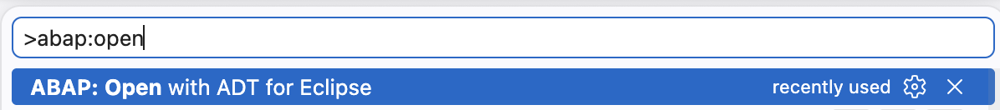 
3. CDS View Entity is opened in ADT for Eclipse. 

### Preview of a Fiori Application
1. Open the **Command Palette** or **`Ctrl+Shift+P`**.
2. Type `ABAP: Open Object` 
   
3. Search for the Service Binding '/DMO/UI_TRAVEL_APPR_M_O2'
   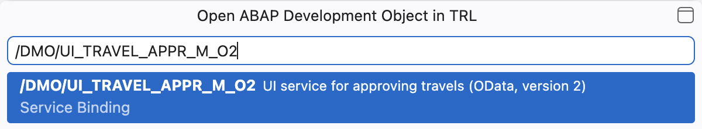
4. Object opens and there are 3 options. 
   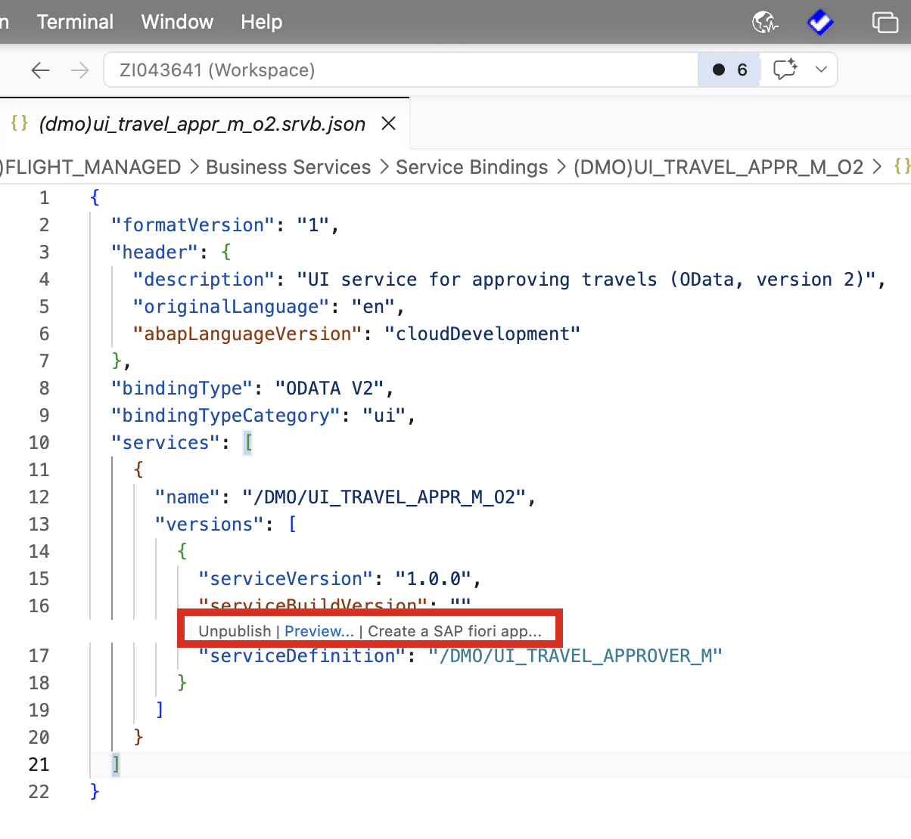
      - Publish/Unpublish depending if the Service binding is Published or not
      - Preview: To preview the Fiori Application
      - Create a SAP Fiori app
5. Click on Preview
6. This will launch Fiori Application in Preview mode.

### Create a new class method to display 10 records

1. First create a new class **`ZCL_ADTVSCODE_###`** by following the same steps in **Create a data generator Class** section until Step 4. In the newly created class we will add a new method to display 10 rows from the table **`/dmo/carrier`**. Copy the below code and replace it with the code in the new class.

    ```ABAP
      CLASS zcl_adtvscode_### DEFINITION
      PUBLIC
      FINAL
      CREATE PUBLIC .
      
      PUBLIC SECTION.
         INTERFACES if_oo_adt_classrun.
      PROTECTED SECTION.
      PRIVATE SECTION.
         TYPES tt_carriers TYPE STANDARD TABLE OF /dmo/carrier WITH DEFAULT KEY.
         METHODS get_carriers RETURNING VALUE(rt_carriers) TYPE tt_carriers.
      ENDCLASS.
      
      CLASS zcl_adtvscode_### IMPLEMENTATION.
      METHOD if_oo_adt_classrun~main.
         out->write( get_carriers(  ) ).
      ENDMETHOD.
      
      METHOD get_carriers.
         SELECT * FROM /dmo/carrier INTO TABLE @rt_carriers UP TO 10 ROWS.
      ENDMETHOD.
      ENDCLASS.
    ```
2. To view the result in the console, Open the Output from View option.
   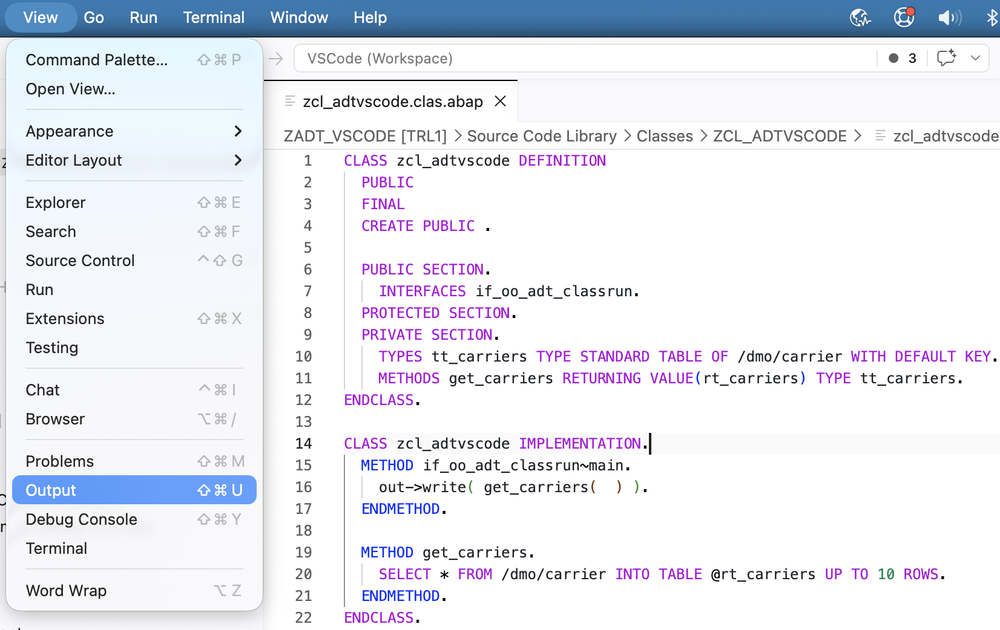

3. Run the class to see the output. Open the **Command Palette** **`Ctrl+Shift+P`**.

4. Type `ABAP: Run ABAP Application(Console)` 
   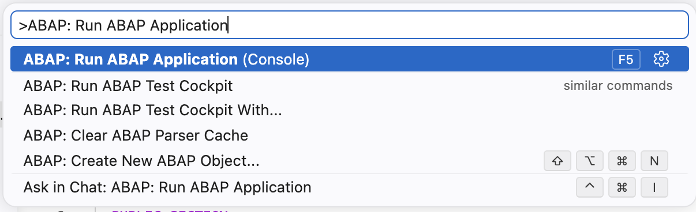

5. You can see the result under Output tab.
   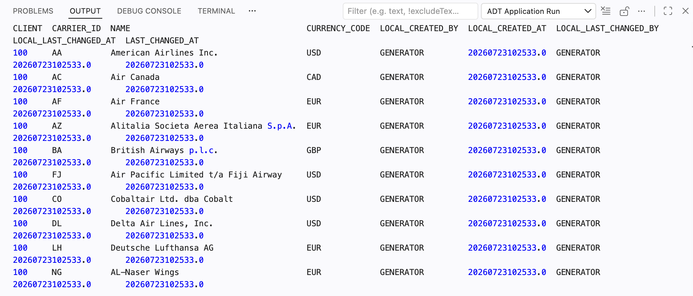

### Debug a method

1. To debug let us use a the same class created in the previous step. First put a Breakpoint at the `SELECT` statement by clicking to the left of the line number as shown in the below screenshot.
   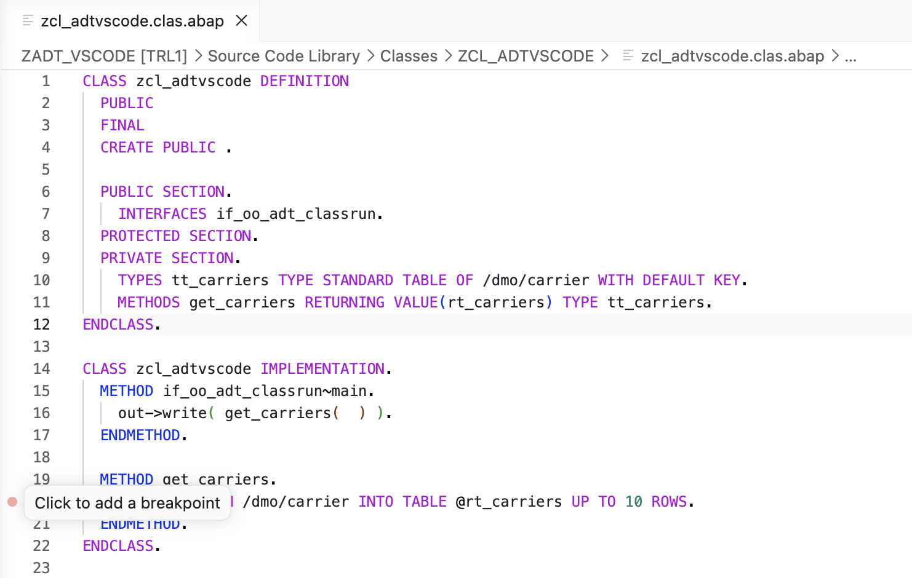 

2. Once the breakpoint is set, it'll be highlighted.

3. To Run the ABAP Application, you can right click on the editor and choose Run ABAP Application (Console).
   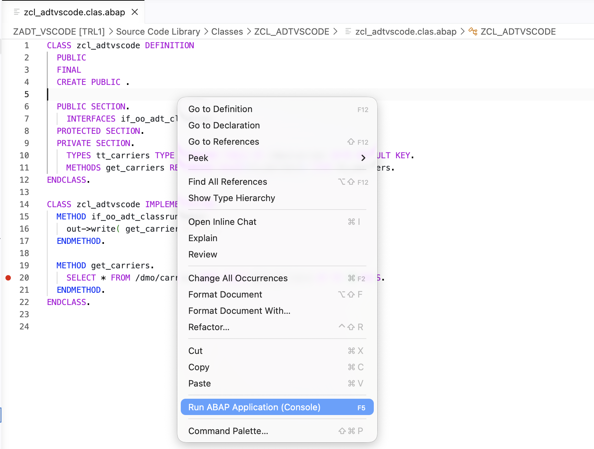

4. Run and Debug view will be opened to the left of the editor. You will see the parameter `RT_CARRIERS` which doesnt have any entries now. 
   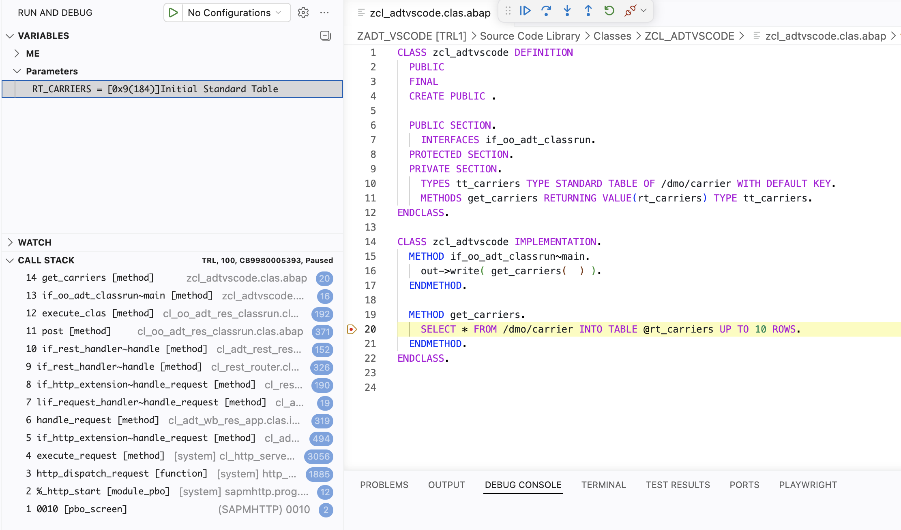

5. Now let us execute the select statement by clicking on **`Step Into`** or **`F11`**.
   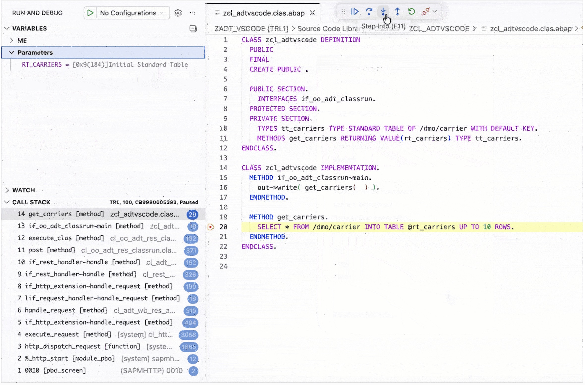

6. After executing the select statement we can see that `RT_CARRIERS` now has 10 entries.
   We can open each record to analyze the data.
   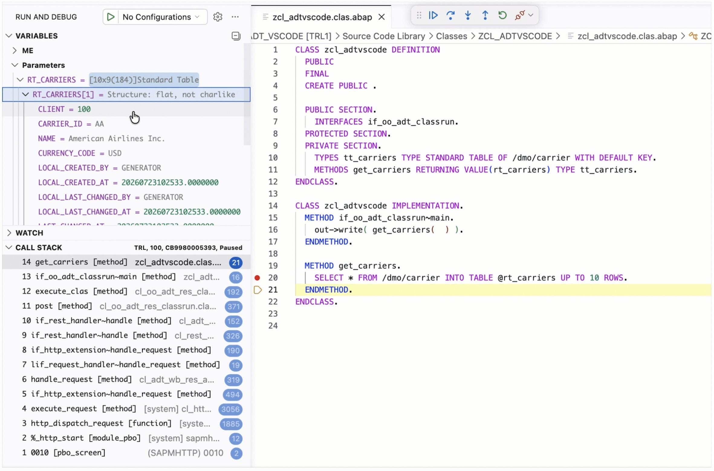  


### Run ABAP Test Cockpit (ATC) Checks.
Using ATC you can detect the quality issues with regards to performance, security & programming conventions by regularly executing static and dynamic checks. We will run ATC Checks on the same class used to Debug in the above step.

1. Open the **Command Palette** **`Ctrl+Shift+P`**.
2. Type `ABAP: Run ABAP Test Cockpit` or **`Ctrl+Shift+F10`**
   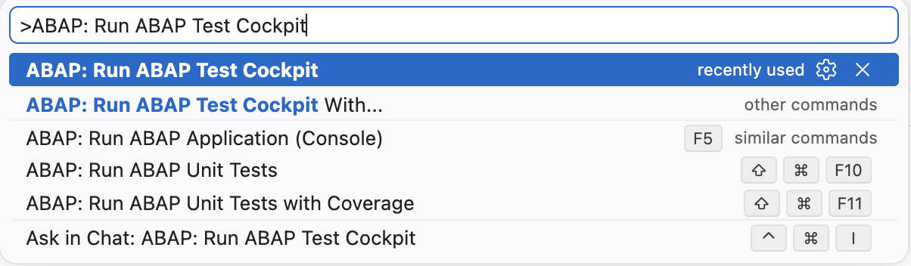
3. Check the `Problems` tab to view the ATC findings as shown below.
   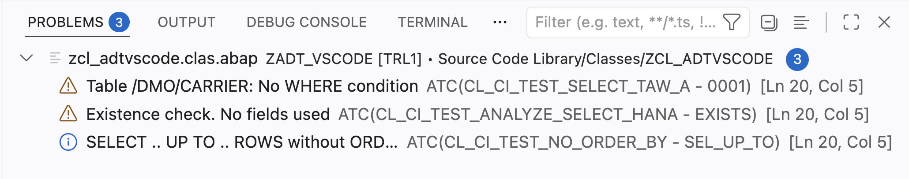

### Run Unit Test

1. Enhance the CDS view **`ZI_ADT_Travel_###`** created in Step 7 to include a new **`DiscountedFlightPrice`** field. 
    
    Add the following code lines for the field **`DiscountedFlightPrice`** to provide **10%** discount on the total price if **`total_price is > 1000`**.

    ```ABAP
       case
         when total_price > 1000 then cast(total_price as abap.dec(16,2)) * cast('0.90' as abap.dec(5,2))
         else cast(total_price as abap.dec(16,2))
       end as DiscountedFlightPrice,
    ```

2. Your CDS data definition  **`ZI_ADT_Travel_###`** should look like this:

    ```CDS
       @AbapCatalog.viewEnhancementCategory: [#NONE]
       @AccessControl.authorizationCheck: #NOT_REQUIRED
       @EndUserText.label: 'CDS view for ADT Tools'
       @Metadata.ignorePropagatedAnnotations: true
       define view entity ZI_ADT_Travel_###
         as select from zadt_travel_###
          {
            key travel_id         as TravelId,
            agency_id             as AgencyId,
            customer_id           as CustomerId,
            begin_date            as BeginDate,
            end_date              as EndDate,
            @Semantics.amount.currencyCode: 'CurrencyCode'
            booking_fee           as BookingFee,
            @Semantics.amount.currencyCode: 'CurrencyCode'
            total_price           as TotalPrice,
            case
               when total_price > 1000 then cast(total_price as abap.dec(16,2)) * cast('0.90' as abap.dec(5,2))
               else cast(total_price as abap.dec(16,2))
            end                   as DiscountedFlightPrice,
         currency_code         as CurrencyCode,
         description           as Description,
         overall_status        as OverallStatus,
         created_by            as CreatedBy,
         created_at            as CreatedAt,
         local_last_changed_by as LocalLastChangedBy,
         local_last_changed_at as LocalLastChangedAt,
         last_changed_at       as LastChangedAt
      }
    ```
3. Save  **Ctrl+S** and activate  the changes.
4. Now switch to Eclipse and create a unit test class for the CDS view above.  
In the **Project Explorer**, right-click on the CDS data definition **`ZI_ADT_Travel_###`** and select **New ABAP Test Class** from the context menu.

5. Enter the information below in the popup for the new ABAP Class that will be created and click on **Next**. 
    - Name: **`ZCL_TEST_CDS_TRAVEL_###`**
    - Description: ***`Test Class for CDS View ZI_ADT_Travel_###`***   

6. The popup now displays the SQL dependencies for the CDS Test Double Framework. 
       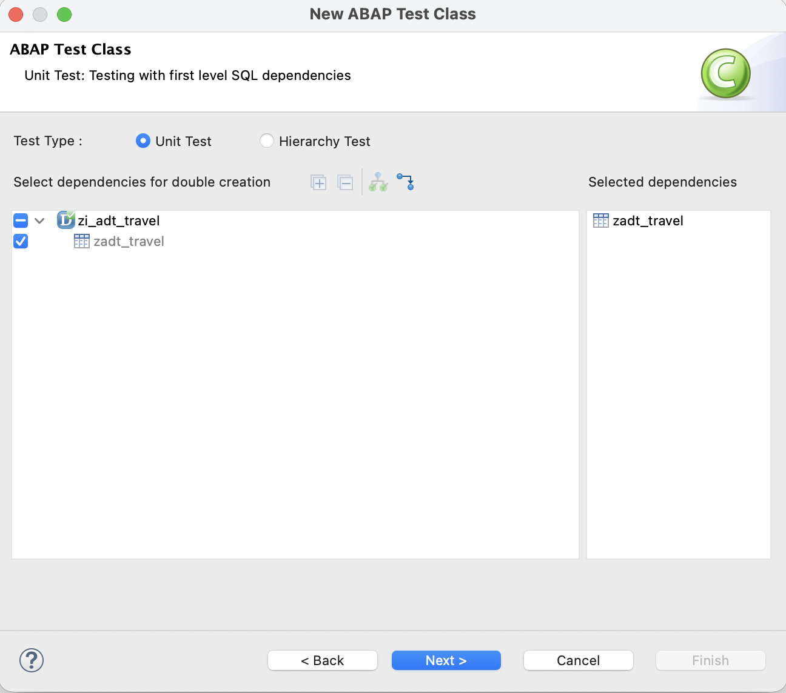

7. Click on **Next** 2 times and finally click on **Finish**.
8. Copy and replace the entire code inside the test class with the code below:

    ```ABAP
    "!@testing ZI_ADT_TRAVEL
       CLASS ltc_zi_adt_travel DEFINITION FINAL
       FOR TESTING RISK LEVEL HARMLESS DURATION SHORT.

       PRIVATE SECTION.
       CLASS-DATA environment TYPE REF TO if_cds_test_environment.

       DATA td_zadt_travel TYPE STANDARD TABLE OF zadt_travel WITH EMPTY KEY.
       DATA act_results TYPE STANDARD TABLE OF zi_adt_travel WITH EMPTY KEY.
       DATA exp_results TYPE STANDARD TABLE OF zi_adt_travel WITH EMPTY KEY.

        "! In CLASS_SETUP, corresponding doubles and clone(s) for the CDS view under test and its dependencies are created.
       CLASS-METHODS class_setup RAISING cx_static_check.
       "! In CLASS_TEARDOWN, Generated database entities (doubles & clones) should be deleted at the end of test class execution.
       CLASS-METHODS class_teardown.

       "! SETUP method creates a common start state for each test method,
       "! clear_doubles clears the test data for all the doubles used in the test method before each test method execution.
       METHODS setup RAISING cx_static_check.

       "! In this method test data is inserted into the generated double(s) for test case
       "! "Calculate DISCOUNTEDFLIGHTPRICE field"
       METHODS td_calc_discountedflightprice.
       "! In this method test data is inserted into the generated double(s) for test case
       "! "When total_price > 1000"
       METHODS td_total_price_gt_1000.

       "! <strong>Test Case:</strong> Calculate DISCOUNTEDFLIGHTPRICE field <br><br>
       "! Test calculation of DISCOUNTEDFLIGHTPRICE field.
       "! <br><br> The results should be asserted with the actuals.
       METHODS calc_discountedflightprice FOR TESTING RAISING cx_static_check.
       "! <strong>Test Case:</strong> When total_price > 1000 <br><br>
       "! Test a CDS View when the CASE condition When total_price > 1000 is satisfied.
       "! <br><br> The results should be asserted with the actuals.
       METHODS total_price_gt_1000 FOR TESTING RAISING cx_static_check.
      ENDCLASS.


      CLASS ltc_ZI_ADT_TRAVEL IMPLEMENTATION.

      METHOD class_setup.
         environment = cl_cds_test_environment=>create( i_for_entity = 'ZI_ADT_TRAVEL_###' ).
      ENDMETHOD.

      METHOD setup.
         environment->clear_doubles( ).
      ENDMETHOD.

      METHOD class_teardown.
         environment->destroy( ).
      ENDMETHOD.

      METHOD calc_discountedflightprice.
         td_calc_discountedflightprice( ).
      SELECT * FROM zi_adt_travel_### INTO TABLE @act_results.

      cl_abap_unit_assert=>assert_equals( exp = lines( exp_results ) act = lines( act_results ) msg = 'Test Generated using AI: Recheck test data' ).
      LOOP AT exp_results INTO DATA(exp_result).
         cl_abap_unit_assert=>assert_equals( exp = exp_result-discountedflightprice
                                          act = act_results[ sy-tabix ]-discountedflightprice
                                          msg = 'Test Generated using AI: Expected result for field DISCOUNTEDFLIGHTPRICE is incorrect. Recheck test data.' ).
      ENDLOOP.
      ENDMETHOD.

      METHOD td_calc_discountedflightprice.
      " Prepare test data for 'ZADT_TRAVEL_###'
      td_zadt_travel = VALUE #(
      (
        client = '100'
        travel_id = '00000001'
        total_price = '1200.00'
      ) ).
      environment->insert_test_data( i_data = td_zadt_travel ).

      " Prepare test data for 'zi_adt_travel_###'
      exp_results = VALUE #(
      (
           travelid = '00000001'
           totalprice = '1200.00'
           discountedflightprice = '1080.00'
      ) ).
      ENDMETHOD.

      METHOD total_price_gt_1000.
         td_total_price_gt_1000( ).
      SELECT * FROM zi_adt_travel_### INTO TABLE @act_results.

      cl_abap_unit_assert=>assert_equals( exp = lines( exp_results ) act = lines( act_results ) msg = 'Test Generated using AI: Recheck test data' ).
      LOOP AT exp_results INTO DATA(exp_result).
      cl_abap_unit_assert=>assert_equals( exp = exp_result-DiscountedFlightPrice
                                          act = act_results[ sy-tabix ]-DiscountedFlightPrice
                                          msg = 'Test Generated using AI: Expected result for field DiscountedFlightPrice is incorrect. Recheck test data.' ).
      ENDLOOP.
      ENDMETHOD.

      METHOD td_total_price_gt_1000.
      " Prepare test data for 'ZADT_TRAVEL_###'
      td_zadt_travel = VALUE #(
      (
        client = '100'
        travel_id = '00000001'
        total_price = '1200.00'
      ) ).
      environment->insert_test_data( i_data = td_zadt_travel ).

      " Prepare test data for 'zi_adt_travel_###'
      exp_results = VALUE #(
      (
           travelid = '00000001'
           totalprice = '1200.00'
           discountedflightprice = '1080.00'
      ) ).
      ENDMETHOD.
    ENDCLASS.
    ```

9. Save  **Ctrl+S** and activate  the changes.

9. Now switch back to Visual Studio code and open the class `zcl_test_cds_travel_###.clas.testclasses.abap` file in editor as shown below.
   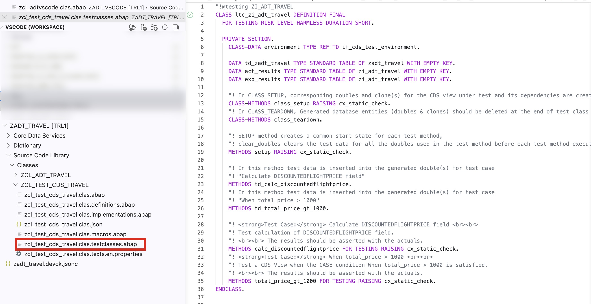 

10. Run the Unit Test by hitting **`Ctrl+Shift+F10`** or Type **`ABAP: Run ABAP Unit Tests`**.
   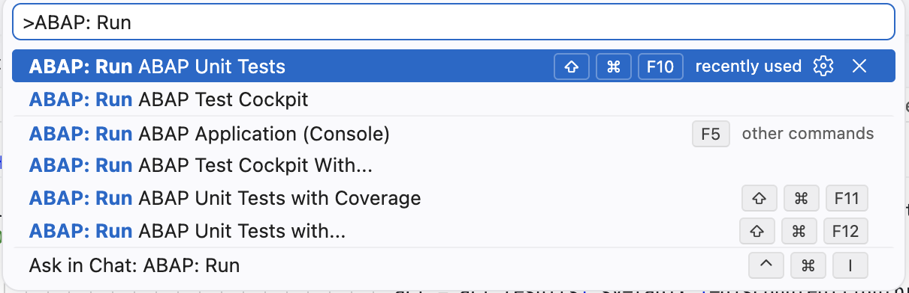  

11. The unit test results will be shown as below:
   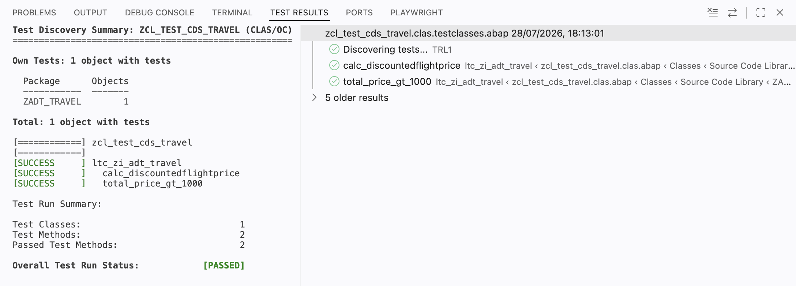 

### Test yourself
