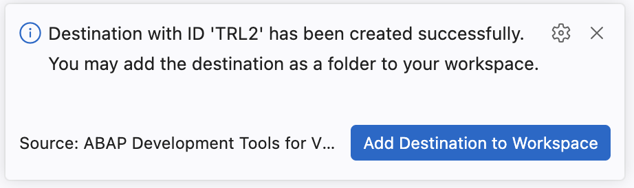
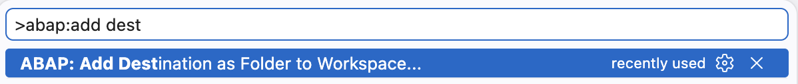
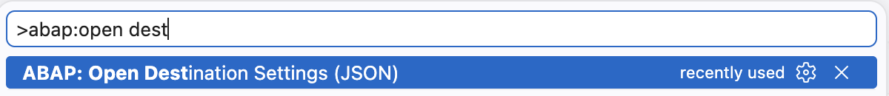
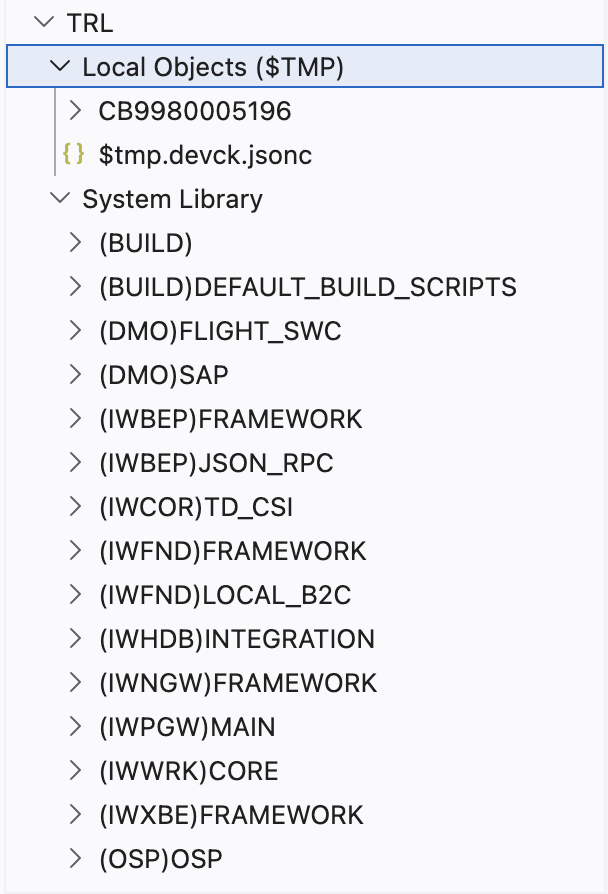

# ABAP Development Tools for Visual Studio Code
<!-- description --> You will learn how to set up ABAP Development Tool (ADT) in Visual Studio Code.

## Introduction     

In this tutorial, you will install Visual Studio Code, install the ADT for Visual Studio Code extension, and establish a connection to your ABAP system.

This tutorial was written for SAP BTP ABAP Environment. However, you should also be able to use it in SAP S/4HANA Cloud Environment in the same way. 
Always replace `###` with your initials or group number.

## Prerequisites  
- Visual Studio Code — Download from <https://code.visualstudio.com/>
- ADT for Visual Studio Code — ADT for Visual Studio Code includes the built-in ADT MCP Server. Here is the [link] (https://marketplace.visualstudio.com/items?itemName=SAPSE.adt-vscode) to download the extension 
- You need to have access to an SAP BTP, ABAP environment, or SAP S/4HANA Cloud, ABAP environment or SAP S/4HANA (release 2025 or higher) system. 
  For example, you can create a free [trial user](https://developers.sap.com/tutorials/abap-environment-trial-onboarding.html) on SAP BTP, ABAP environment.
- You have downloaded and installed the [latest ABAP Development Tools (ADT)] (https://tools.hana.ondemand.com/#abap) on the latest Eclipse© platform.
- You have created an [ABAP Cloud Project](https://developers.sap.com/tutorials/abap-environment-create-abap-cloud-project.html).
- Your system has the ABAP flight reference scenario. If your system hasn't this scenario. You can download it [here](https://github.com/SAP-samples/abap-platform-refscen-flight). The trial systems have the flight scenario included.
  
## You will learn

  - How to set up Visual Studio Code with the ADT for Visual Studio Code extension and connect to your ABAP Cloud system
  

### Install Visual Studio Code

Download and install Visual Studio Code on your system if you have not already done so.

  1. Open a browser and go to <https://code.visualstudio.com/>

  2. Download the installer for your operating system (Windows, macOS, or Linux).

  3. Run the installer and follow the on-screen instructions.

  4. Launch **Visual Studio Code** once installation is complete.

  ℹ️ **Hint**: Ensure you are running a recent stable version of Visual Studio Code. Go to **Help > About** to check your version.

### Install the ADT for Visual Studio Code Extension

Install the **ABAP Development Tools (ADT)** extension for Visual Studio Code from the Visual Studio Marketplace. This extension connects Visual Studio Code to your ABAP backend and includes the built-in **ADT MCP Server** that you will use in Exercise 1. If you are accessing it from any event like 'We are Developers' the Visual Studio Code and ADT Extension will already be installed in the available machines.Changes here

**Install from the Visual Studio Code Marketplace**

1. Open **Visual Studio Code**.

2. Open the **Extensions** view:
      - Press **`Ctrl+Shift+X`** (macOS: **`Cmd+Shift+X`**), or
      - Click the **Extensions** icon in the Activity Bar (left edge)

3. In the search bar, type 'ABAP Development Tools'

4. Locate the **"ABAP Development Tools"** extension published by **SAP** and click **Install**.

5. Wait for the installation to complete.

    ✅ **Success**: You should see "ABAP Development Tools" listed under **Installed** extensions.

    

**Verify the installation**

1. Open the **Command Palette** **`Ctrl+Shift+P`** and type `ABAP`. You should see ABAP-specific commands such as:
   - `ABAP: New Destination...`
   - `ABAP: Open Object...`
   - `ABAP: Create New ABAP Object...`
   - `ABAP: Activate`

   ✅ If you see these commands, the extension is installed correctly.

   


### Connect Visual Studio Code to Your ABAP System

Create a **destination** in Visual Studio Code to connect to your ABAP system, then add it to your workspace.

Choose the connection type that matches your system:
- **HTTP** — SAP BTP ABAP Environment or SAP S/4HANA Cloud Public Edition
- **RFC** — SAP S/4HANA on-premise or SAP S/4HANA Cloud Private Edition (requires SAP Logon configured on your machine)

**Option A: HTTP destination (Cloud systems)**

1. Open the **Command Palette** **`Ctrl+Shift+P`**.

2. Type `ABAP: New Destination` and select **"ABAP: New Destination..."**.

3. Select **HTTP** as the connection type.

4. Enter the **system URL** of your ABAP Cloud system. The URL format is:
   ```
   https://<system-id>.abap.<region>.hana.ondemand.com
   ```

5. Press **Enter**, then enter a short **ID** for this destination (e.g., `BTP_DEV`).

6. Press **Enter**. The connection is established.

      ```
      Command Palette → "ABAP: New Destination..."
        ↓
      Connection Type → HTTP
        ↓
      System URL → https://<system-id>.abap.<region>.hana.ondemand.com
        ↓
      Destination ID → BTP_DEV
        ↓
      ✅ Connection established!
      ```

**Option B: RFC destination (On-premise systems)**

>ℹ️ **Prerequisite**: Your system must be configured in **SAP Logon** (SAP GUI) with RFC connectivity before proceeding.

1. Open the **Command Palette** **`Ctrl+Shift+P`**.

2. Type `ABAP: New Destination` and select **"ABAP: New Destination..."**.

3. Select **RFC** as the connection type.

4. A list of systems from your **SAP Logon** configuration is displayed. Select your target system.

5. Enter your **username** and press **Enter**.

6. Enter the **client number** (e.g., `100`) and press **Enter**.

7. Enter your **login language** (e.g., `EN`) and press **Enter**.

8. The connection is established.

      ```
      Command Palette → "ABAP: New Destination..."
        ↓
      Connection Type → RFC
        ↓
      System → <SID>
        ↓
      Username → <username>
        ↓
      Client → 100
        ↓
      Language → EN
        ↓
      ✅ Connection established!
      ``` 

9. As soon as the connection is established you should be able to see a visual feedback that the destination was created successfully and a notification pop-up with a button which directly adds it as a folder to your workspace.
       

10. If you missed adding the destination to the workspace using the above popup please continue with Step 4.

### Add the destination to your workspace

1. Open the **Command Palette** **`Ctrl+Shift+P`**.
       
2. Type `ABAP: Add Destination as Folder` and select **"ABAP: Add Destination as Folder to the Workspace..."**.

3. Select your newly created destination.

4. For **HTTP** systems: a browser window opens — log in with your ABAP system credentials.  
   For **RFC** systems: the connection is established immediately using your SAP Logon credentials.

5. After login, your system connection appears as a **folder** in the Visual Studio Code Explorer view (left sidebar).

6. Open Destination settings to see the details of the added system
       

### Navigating your ABAP system 

1. In the **Explorer** view, expand the folder for your system connection.
       
2. Navigate through the package hierarchy to find objects.

### Explore the Visual Studio Code User Interface for ABAP Development

> Get familiar with the key Visual Studio Code areas you will use throughout this tutorial.

**Key UI areas for ABAP development**

| Area | Location | Purpose |
|------|----------|---------|
| **Activity Bar** | Far left | Switch between Explorer, Search, Source Control, Run & Debug, Extensions |
| **Explorer (Workspace)** | Left sidebar | Navigate your ABAP system hierarchy — packages, object types, objects |
| **Editor** | Center | Edit ABAP source code (classes, CDS views, behavior definitions, etc.) |
| **Problems Panel** | Bottom | Syntax errors and warnings |
| **Terminal** | Bottom | Integrated shell |
| **Status Bar** | Very bottom | Current line/column, language, connected system |


**Essential keyboard shortcuts**

| Action | Windows/Linux | macOS |
|--------|---------------|-------|
| Command Palette | **`Ctrl+Shift+P`** | **`Cmd+Shift+P`** |
| Open ABAP Object | **`Ctrl+Shift+A`** | **`Cmd+Shift+A`** |
| Create ABAP Object | **`Ctrl+Shift+Alt+N`** | **`Cmd+Shift+Option+N`** |
| Activate object | **`Ctrl+F3`** | **`Cmd+F3`** |
| Activate all inactive | **`Ctrl+Shift+F3`** | **`Cmd+Shift+F3`** |
| Save | **`Ctrl+S`** | **`Cmd+S`** |
| Find/Replace | **`Ctrl+H`** | **`Cmd+H`** |
| Run ABAP Unit Tests | **`Ctrl+Shift+F10`** | **`Cmd+Shift+F10`** |

### Test yourself
