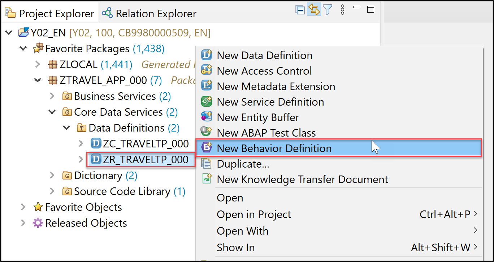
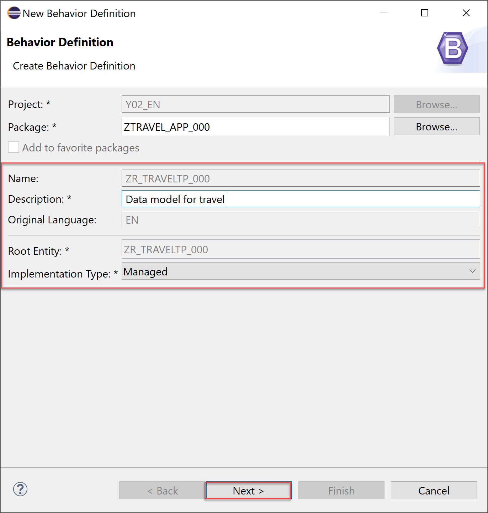
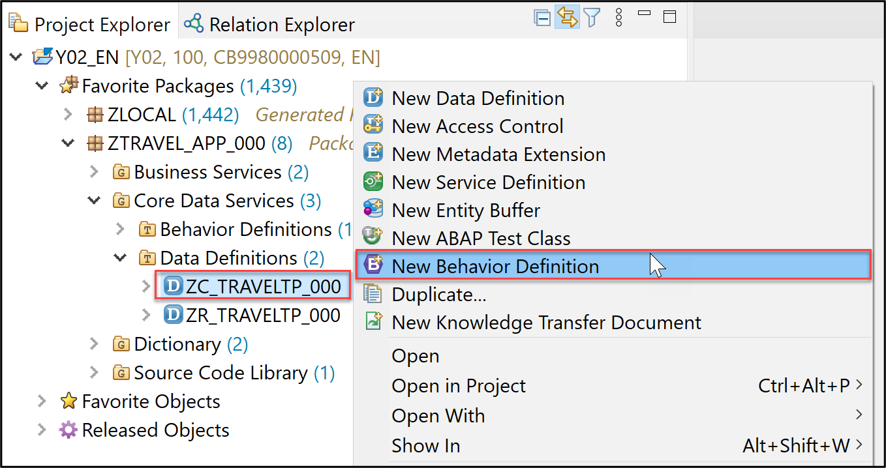
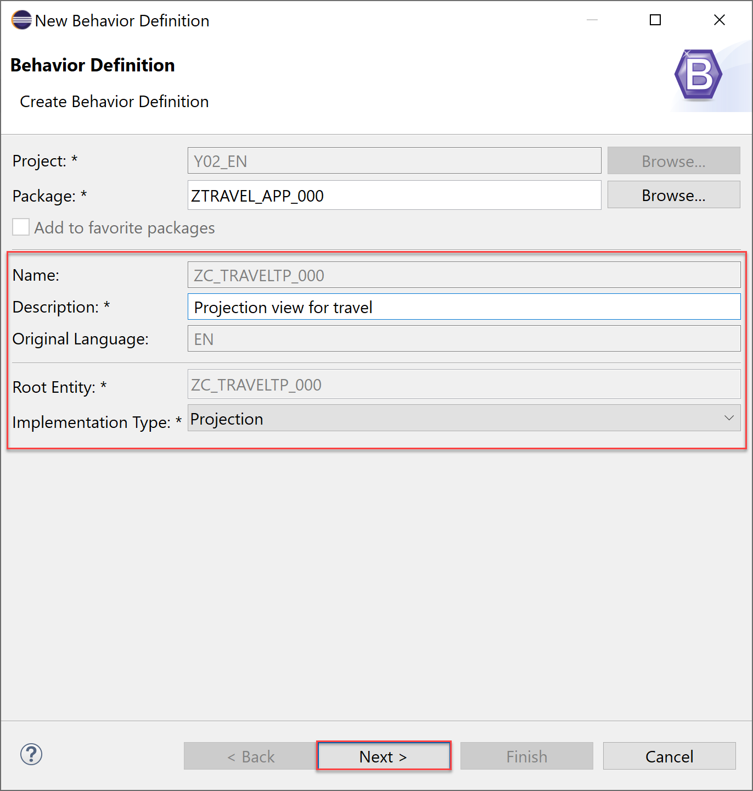
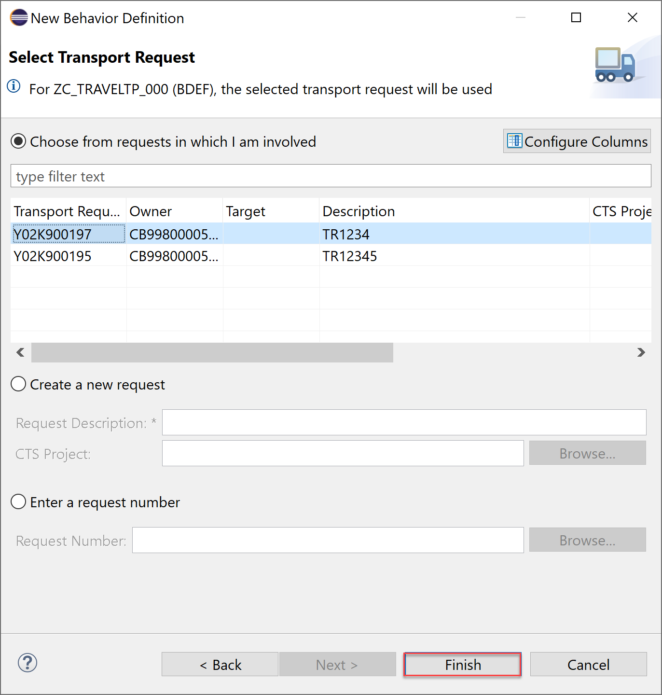

# Create Behavior Definition for Managed Scenario
<!-- description --> Create behavior definition and implementation for managed scenario.

## Prerequisites  
<<<<<<< HEAD
- You need an SAP BTP, ABAP environment [trial user](abap-environment-trial-onboarding) or a license.
- You have downloaded and installed the [latest ABAP Development Tools (ADT)] (https://tools.hana.ondemand.com/#abap).
=======
- You need to have access to an SAP BTP, ABAP environment, or SAP S/4HANA Cloud, ABAP environment or SAP S/4HANA (release 2021 or higher) system.
For example, you can create [free trial user on SAP BTP, ABAP environment](abap-environment-trial-onboarding).
- You have downloaded and installed the [latest ABAP Development Tools (ADT)] (https://tools.hana.ondemand.com/#abap) on the latest Eclipse© platform.
- If you are using a **licensed system** make sure, that the flight scenario is available in your system. If not, you should follow these [steps](https://help.sap.com/docs/btp/sap-abap-restful-application-programming-model/downloading-abap-flight-reference-scenario) in your licensed system. The flight scenario is already in the trial systems.
>>>>>>> 59f95048a11e62962d5c8eb49e89b6f027533a25

## You will learn  
  - How to create behavior definition
  - How to create behavior implementation
  - How to create behavior definition for projection view

## Intro
<<<<<<< HEAD
In this tutorial, wherever XXX appears, use a number (e.g. 000).
=======
In this tutorial, wherever ### appears, use a number (e.g. 000).
>>>>>>> 59f95048a11e62962d5c8eb49e89b6f027533a25

---

### Create behavior definition

<<<<<<< HEAD
  1. Right-click on your data definition `ZI_TRAVEL_M_XXX` and select **New Behavior Definition**. 
=======
  1. Right-click on your data definition `ZR_TRAVELTP_###` and select **New Behavior Definition**. 
>>>>>>> 59f95048a11e62962d5c8eb49e89b6f027533a25

      

  2. Check your behavior definition. Your **implementation type** is **managed**.

     Click **Next >**.

      

  3. Click **Finish** to use your transport request.

      

  4. Replace your code with following.

    ```ABAP
<<<<<<< HEAD
    managed implementation in class zbp_i_travel_m_xxx unique;

    define behavior for ZI_TRAVEL_M_XXX alias Travel
    persistent table ztravel_xxx
    etag master last_changed_at
=======
    managed implementation in class zbp_r_traveltp_### unique;
    strict ( 2 );

    define behavior for ZR_TravelTP_### alias Travel
    persistent table zatravel_###
    authorization master ( instance )
    etag master lastchangedat
>>>>>>> 59f95048a11e62962d5c8eb49e89b6f027533a25
    lock master
    {

      // semantic key is calculated in a determination
<<<<<<< HEAD
      field ( readonly ) travel_id;

      // administrative fields (read only)
      field ( readonly ) last_changed_at, last_changed_by, created_at, created_by;

      // mandatory fields that are required to create a travel
      field ( mandatory ) agency_id, overall_status, booking_fee, currency_code;

      // mandatory fields that are required to create a travel
      field ( mandatory ) Begin_Date, End_Date, Customer_ID;
=======
      field ( readonly ) travelid;

      // administrative fields (read only)
      field ( readonly ) lastchangedat, lastchangedby, createdat, createdby;

      // mandatory fields that are required to create a travel
      field ( mandatory ) agencyid, overallstatus, bookingfee, currencycode;

      // mandatory fields that are required to create a travel
      field ( mandatory ) BeginDate, EndDate, CustomerID;
>>>>>>> 59f95048a11e62962d5c8eb49e89b6f027533a25

      // standard operations for travel entity
      create;
      update;
      delete;
<<<<<<< HEAD
    }  
    ```
=======
    }
    ```
 
>>>>>>> 59f95048a11e62962d5c8eb49e89b6f027533a25

  5. Save and activate.

      

    A warning will appear first, but after the creation of the behavior implementation it will disappear.  

    Now the **behavior definition** is created and determines the create, update and delete functionality for travel booking.

<<<<<<< HEAD


### Create behavior definition for projection view

  1. Right-click on your data definition `ZC_TRAVEL_M_XXX` and select **New Behavior Definition**.
=======
 
   
### Create behavior definition for projection view

  1. Right-click on your data definition `ZC_TRAVELTP_###` and select **New Behavior Definition**.
>>>>>>> 59f95048a11e62962d5c8eb49e89b6f027533a25

      

  2. Check your behavior definition. Your implementation type is projection.

     Click **Next >**.
<<<<<<< HEAD

=======
 
>>>>>>> 59f95048a11e62962d5c8eb49e89b6f027533a25
      

  3. Click **Finish** to use your transport request.

      

<<<<<<< HEAD
  4. Replace your code with following:

    ```ABAP
    projection;

    define behavior for ZC_TRAVEL_M_XXX alias TravelProcessor
    use etag
=======
  4. Add your alias to the behavior definition for the projection view. Replace your code with following:

    ```ABAP
    projection;
    strict ( 1 ); 

    define behavior for ZC_TravelTP_### alias TravelProcessor
>>>>>>> 59f95048a11e62962d5c8eb49e89b6f027533a25
    {
      use create;
      use update;
      use delete;
    }
    ```

  5. Save and activate.

      

<<<<<<< HEAD
  6. Now switch to your service binding and activate your service binding again.

     

  7. Double-click on `TravelProcessor` to start your preview.

      

  7. **Refresh** your browser and check your result.

    >**HINT**: If you don't see the create and delete buttons, then please unpublish your service binding, activate and publish it again.
     The create and delete button appears on the UI because of the managed scenario.
     You can create and edit travel bookings or you' re able to delete existing ones.

     Please note that the semantic key Travel ID is not calculated yet. We will do this in the next tutorial.

      
=======
>>>>>>> 59f95048a11e62962d5c8eb49e89b6f027533a25


### Test yourself


---
