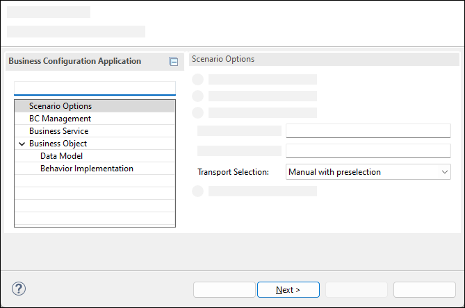

# Create Business Configuration Maintenance Object
<!-- description --> Create a Business Configuration Maintenance Object using the ABAP Repository Object Generator.

## Prerequisites  
- You need an SAP BTP, ABAP environment license or a [trial user](abap-environment-trial-onboarding).
- This tutorial also works in an SAP S/4HANA Cloud, public edition system.
- This is the first tutorial of group [Create a SAP Fiori based Table Maintenance app](group.abap-env-factory). You must complete the tutorials in the specified order.
- Install [ABAP Development Tools](https://tools.hana.ondemand.com/#abap) (3.26.2 or higher). You can also follow **step 1** of this [tutorial](abap-install-adt) to install ADT.

## You will learn  
- How to enable Log Changes
- How to generate a Business Configuration Maintenance Object

## Intro
This tutorial shows you how to create an **SAP Fiori based Table Maintenance app** using the [**ABAP RESTful Application Programming Model**](https://help.sap.com/viewer/923180ddb98240829d935862025004d6/Cloud/en-US/289477a81eec4d4e84c0302fb6835035.html) (RAP) and the [**Custom Business Configurations**](https://help.sap.com/viewer/65de2977205c403bbc107264b8eccf4b/Cloud/en-US/76384d8e68e646d6ae5ce8977412cbb4.html) (CUBCO) app. This tutorial is based on a simplified error code database model: a table to store the error codes and a table to store the language-dependent error code descriptions.

You first create the database tables and then use the [ABAP Repository Generator](https://help.sap.com/docs/BTP/65de2977205c403bbc107264b8eccf4b/047e01c3bcdd4303a60b61364bd5b31d.html?version=Cloud) to create the required repository objects.

>**Hint:** For more information, see the [documentation for this programming model](https://help.sap.com/docs/btp/sap-business-technology-platform/creating-business-configuration-apps-with-abap-restful-application-programming-model-and-custom-business-configurations-app). 

>**Hint:** Do not forget to replace all occurrences of the ### placeholder with your ID of your choice in the subsequent exercise steps. To do this, you can use the ADT function Replace All (`Ctrl+F`).

---
### Create Package


  1. Open your **ABAP Development Tools**, log on to your **ABAP system**, right-click **`ZLOCAL`** (or **`$TMP`**) and choose **New** > **ABAP Package**.

      

  2. Create a new package:
     - Name: **`Z_ERROR_CODES_###`**
     - Description: **`Error Codes ###`**
     - Super package: **`ZLOCAL`**
     - Select **Add to favorite packages**

      

      Click **Next >**.

  3. Enter a new transport request and click **Finish**.

      


### Create Data Elements


  1. Right-click **`Z_ERROR_CODES_###`** and choose **New** > **Other ABAP Repository Object**.

      

  2. Search for **`Data Element`**, select it, and click **Next >**.

      

  3. Create a data element. You use data elements instead of predefined ABAP types because the field labels on the user interface are derived from the data element definition. In addition, a data element is required to define a foreign key relationship between two tables.
     - Name: **`Z_ERROR_CODE_###`**
     - Description: **`Error Code`**

     

      Click **Next >**.

  4. Select the previously created transport request and click **Finish**.

      

  5. Select **`Predefined Type`** as **Category**, **`NUMC`** as **Data type**, 3 as **Length** and enter **`Error Code`** as **Field Labels**:

      

  6. Save and activate.

  7. Repeat **steps 2.1. - 2.5** to create a second Data Element:

      - Name:  **`Z_CODE_DESCRIPTION_###`**
      - Description: **`Error Code Description`**
      - Category: **`Predefined Type`**
      - Data Type: **`CHAR`**
      - Length: **`120`**
      - Short Field Label: **`Text`**
      - Other Field Labels: **`Description`**

     
  8. Save and activate.


### Create Database Tables


  1. Right-click Type Group **Dictionary** in package **`Z_ERROR_CODES_###`** and choose **New** > **Database Table**.

      

  2. Create the error code database table:
     - Name: **`ZERRCODE_###`**
     - Description: **`Error Code ###`**

      

      Click **Next >**.

  3. Select a transport request and click **Finish**.

  4. Replace your code as follows. The timestamp fields are used for optimistic concurrency control for [draft processing](https://help.sap.com/docs/btp/sap-abap-restful-application-programming-model/total-etag) and [OData consumer](https://help.sap.com/docs/btp/sap-abap-restful-application-programming-model/optimistic-concurrency-control). If you add the field `CONFIGDEPRECATIONCODE` of type `CONFIG_DEPRECATION_CODE` to the database table, the ABAP generator that you use in step 5 can extend the generated RAP BO to manage the validity of the configuration entries.

    ```ABAP
    @EndUserText.label : 'Error Code ###'
    @AbapCatalog.enhancement.category : #NOT_EXTENSIBLE
    @AbapCatalog.tableCategory : #TRANSPARENT
    @AbapCatalog.deliveryClass : #C
    @AbapCatalog.dataMaintenance : #ALLOWED
    define table zerrcode_### {
      key client            : abap.clnt not null;
      key error_code        : z_error_code_### not null;
      last_changed_at       : abp_lastchange_tstmpl;
      local_last_changed_at : abp_locinst_lastchange_tstmpl;
    }
    ```

  5. Save and activate.

  6. Repeat the steps **3.1.- 3.4** and create the database table for the error code description. An additional database table is considered as a text table by the ABAP generator that you use in step 5 if the annotation **`@AbapCatalog.foreignKey.keyType : #TEXT_KEY`** is used.

     - Name: **`ZERRCODET_###`**
     - Description: **`Error Code Description ###`**

    ```ABAP
    @EndUserText.label : 'Error Code Description ###'
    @AbapCatalog.enhancement.category : #NOT_EXTENSIBLE
    @AbapCatalog.tableCategory : #TRANSPARENT
    @AbapCatalog.deliveryClass : #C
    @AbapCatalog.dataMaintenance : #ALLOWED
    define table zerrcodet_### {
      key client            : abap.clnt not null;
      @AbapCatalog.textLanguage
      key langu             : abap.lang not null;
      @AbapCatalog.foreignKey.keyType : #TEXT_KEY
      @AbapCatalog.foreignKey.screenCheck : false
      key error_code        : z_error_code_### not null
        with foreign key [0..*,1] zerrcode_###
          where client = zerrcodet_###.client
            and error_code = zerrcodet_###.error_code;
      description           : z_code_description_###;
      local_last_changed_at : abp_locinst_lastchange_tstmpl;
    }
    ```

  7. Save and activate.


### Activate Log Changes


To use the [**Business Configuration Change Logs**](https://help.sap.com/viewer/65de2977205c403bbc107264b8eccf4b/Cloud/en-US/5c6cf20499894f1083e80dba7c5963d4.html) app, enable the Log Changes function to track configuration changes in your business configuration tables.

>In client-specific Customizing tables, buffering is usually switched on using a generic key with a number of key fields equal to 1. In client-specific Customizing text tables, buffering is usually switched on using a generic key with the number of key fields equal to 2 to include the language key field.

>Read operations on the CDS view entities do not benefit from the table buffer, but have their own buffer mechanism, see this [blog](https://blogs.sap.com/2022/01/27/buffering-cds-view-entities/). Consider reading directly from the buffered customizing tables in your application code.

In the technical settings of the table, the indicator **Log Changes** must be activated:


Save and activate.


### Create Business Configuration Maintenance Object


A [**Business Configuration Maintenance Object**](https://help.sap.com/products/BTP/65de2977205c403bbc107264b8eccf4b/61159c4dc45b45619b46b4620615c357.html) declares a [Service Binding](https://help.sap.com/viewer/923180ddb98240829d935862025004d6/Cloud/en-US/b58a3c27df4e406f9335d4b346f6be04.html) as relevant for business configuration. They are listed in the [**Custom Business Configurations**](https://help.sap.com/viewer/65de2977205c403bbc107264b8eccf4b/Cloud/en-US/76384d8e68e646d6ae5ce8977412cbb4.html) app. Selecting an entry in the app renders an SAP Fiori elements-based UI to maintain the business configuration.

[ABAP Repository Generator](https://help.sap.com/docs/BTP/65de2977205c403bbc107264b8eccf4b/047e01c3bcdd4303a60b61364bd5b31d.html?version=Cloud) allows you to create the required repository objects, including RAP business object, service binding, and business configuration maintenance object.

>**Hint:** For more information, see [ABAP Repository Generator documentation](https://help.sap.com/docs/BTP/65de2977205c403bbc107264b8eccf4b/047e01c3bcdd4303a60b61364bd5b31d.html?version=Cloud).

  1. Right-click the **`ZERRCODE_###`** table and choose **Generate ABAP Repository Objects...**.

      

  2. Select **`Business Configuration Maintenance Object`** and click **Next >**. On the next screen, click **Next >** to confirm the target package.

     

  3. The system generates a proposal for all input fields based on the description of the table by following these [naming conventions](https://help.sap.com/viewer/923180ddb98240829d935862025004d6/Cloud/en-US/8b8f9d8f3cb948b2841d6045a255e503.html). If you receive an error message stating that a specific object already exists, change the corresponding name in the wizard.


      Click **Next >**.

      

  4. The list of repository objects that are generated is displayed. Click **Next >**.

  5. Select a transport request and click **Finish**.

  6. When the generation is complete, the new business configuration maintenance object is displayed. Refresh your Project Explorer and check the other generated objects. In the next tutorial, you will create the necessary authorization objects for using the business configuration maintenance object in the CUBCO app. You can adapt the generated RAP BO to your needs, see also [CDS Annotations for Metadata-Driven UIs](https://help.sap.com/viewer/923180ddb98240829d935862025004d6/Cloud/en-US/9b4aa865c1e84634b6e105173fc3a5e7.html). For example, you can adjust the visibility, positioning, and labels of the fields.

  7. If you have a license for SAP BTP, ABAP environment or you are working in an SAP S/4HANA Cloud, public edition system, you can now set this step to **Done** and continue with the next step **Test yourself**. 
  Only if you have an SAP BTP trial account, you need to make the following adjustments because you cannot create customizing transport requests or business user roles. You can then also skip the following tutorial [Provide authorization control for a Business Configuration Maintenance Object](abap-environment-authorization-control) and continue with tutorial [Use Custom Business Configurations app](abap-environment-maintain-bc-app).
      - Edit class `ZBP_I_ERRORCODE###_S`, section **Local Types**. Delete the content of the following methods. Then save and activate the class.
        - `LHC_ZI_ERRORCODE###_S→GET_GLOBAL_AUTHORIZATIONS`
        - `LSC_ZI_ERRORCODE###_S→SAVE_MODIFIED`
        - `LHC_ZI_ERRORCODE###→VALIDATETRANSPORTREQUEST`
        - `LHC_ZI_ERRORCODE###TEXT→VALIDATETRANSPORTREQUEST`

      - Delete the generated `Access Control` objects

      

      - Publish the `Local Service Endpoint` of the `ZUI_ERRORCODE###_O4` service binding

      


### Test yourself


---
