# Integrate SAP BTP, ABAP environment and SAP S/4HANA Cloud, public edition using Basic Authentication

<!-- description --> Expose the Business Partner (A2X) OData service in SAP S/4HANA Cloud, public edition and create a communication user to access this service. Consume the same service from SAP BTP ABAP environment using Basic Authentication as the authentication method.

## Prerequisites

- This is the second tutorial of this tutorial group. Please complete the tutorial [Implement an Outbound Service Call in SAP BTP ABAP environment](abap-environment-business-partner-outbound-call) before proceeding. The prerequisites of the previous part apply.
- To access communication management apps, your business user has to be assigned to a business role containing business catalog `SAP_CORE_BC_COM`, e.g. business role `SAP_BR_ADMINISTRATOR`. This must be done in the following systems:
    <ol type="a"><li>The SAP BTP, ABAP environment system
    </li><li>The customizing tenant (100) of the SAP S/4 HANA Cloud, public edition development system</li></ol>
- To access the **Manage Business Partner Master Data** in the SAP S/4 HANA Cloud, public edition system, your business user in the customizing tenant (100) has to be assigned to business role `SAP_BR_BUPA_MASTER_SPECIALIST`.  Thus you are able to test the implementation.

## You will learn

- How to perform communication management for both inbound and outbound connectivity.
- How to use a technical communication user to authenticate using Basic Authentication.

## Intro
>In this tutorial, all activities on S/4HANA Cloud side will be performed in the **customizing tenant** (100) of your **development system**.

### Create a Communication User in SAP S/4HANA Cloud, public edition

Create a communication user in SAP S/4HANA Cloud, public edition. This technical user will be used for the inbound connectivity of SAP S/4HANA Cloud, public edition and outbound connectivity of the SAP BTP, ABAP environment.

1. Open the SAP Fiori Launchpad of the customizing tenant (100) of your SAP S/4HANA Cloud, public edition development system.

2. Access the **Maintain Communication Users** app

3. Choose button **New**

4. Provide **User Name** `ZBPA2X_COM_USER` and **Description** `Communication User to create Business Partners`

5. Choose button **Propose Password**

6. Store proposed password for later use.

    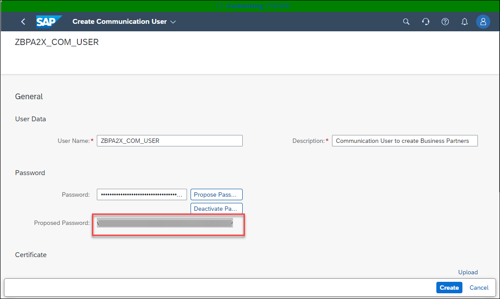

### Create a Communication System in SAP S/4HANA Cloud, public edition

Create a communication system in SAP S/4HANA Cloud, public edition. This is used to model the external communication partner and to specify the authentication methods and users which are allowed.

1. Access the **Communication Systems** app

2. Choose button **New**

3. Provide **System ID** `ZBPA2X_COM_SYS` and **System Name** `ZBPA2X_COM_SYS`

    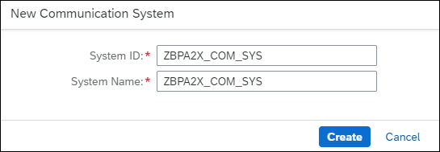

4. Choose button **Create**

5. In the **Section General** tab provide the following information:
    <ol type="a"><li>Logical System: `ZBPA2X`
    </li><li>Business System: `ZBPA2X`
    </li><li>Choose **Inbound Only**
    
    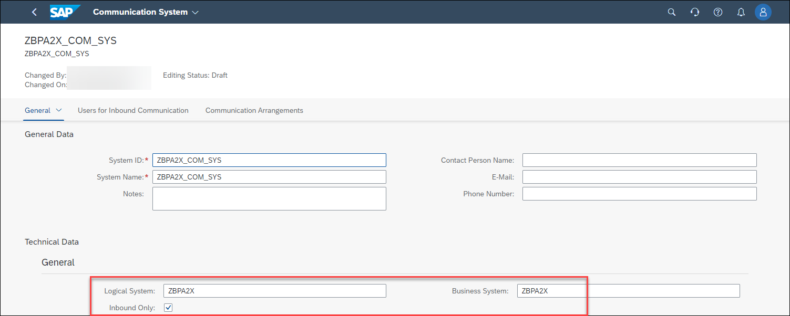</li></ol>

6. In the **Users for Inbound Communication** tab provide the following information:
    <ol type="a"><li>Choose `+` to add an Inbound User
    </li><li>Choose Authentication Method: User Name and Password
    </li><li>Provide **User Name / Client ID**: `ZBPA2X_COM_USER`
    </li><li>Choose button **OK**

    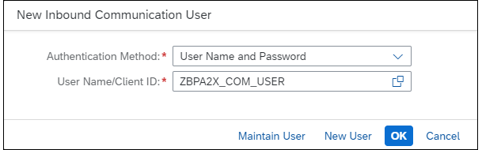

    </li><li>The result is that the user created in the previous step is now added as inbound communication user

    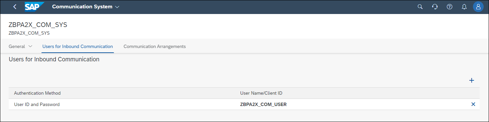</li></ol>

7. Choose **Save** to save the communication system.

### Create the Communication Arrangement in SAP S/4HANA Cloud, public edition

Create a communication arrangement based on the communication scenario `SAP_COM_0008` in SAP S/4HANA Cloud, public edition. The **Business Partner (A2X)** API is part of this standard scenario. You will use the previously created communication system and user, thus defining how to authenticate and authorize against the exposed service.

1. Access the **Communication Arrangements** app

2. Choose button **New**

3. Choose Scenario `SAP_COM_0008`

4. Provide **Arrangement Name**: `ZBPA2X_CA_INBOUND`

5. Choose button **Create**

    

6. On the next screen provide the following information:
    <ol type="a"><li>Communication System: `ZBPA2X_COM_SYS`. For inbound communication the User Name and Authentication Method is set automatically from the communication system.

    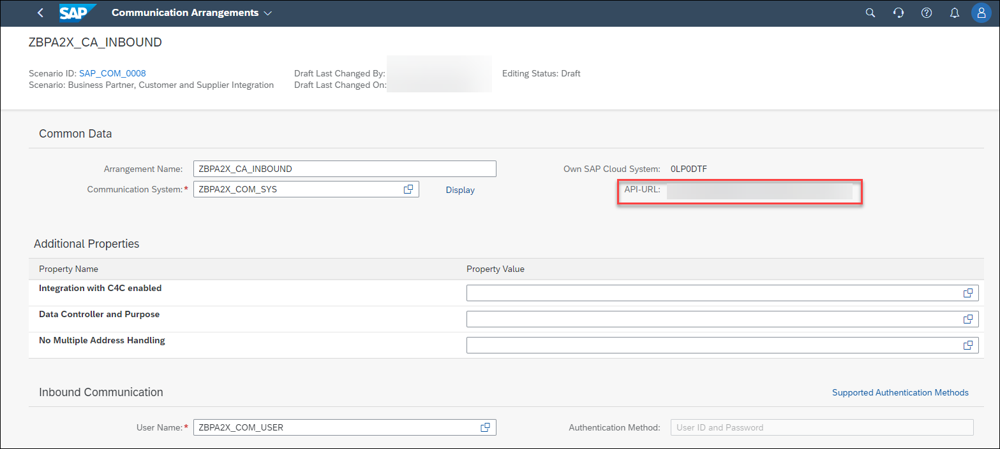

    </li><li>Store **API-URL** for later use
    </li><li>Deactivate all Outbound Services. Explanation: The outbound services are used to support a different scenario, which is to synchronize business partners between SAP S/4HANA systems via SOAP. This is not done in this tutorial. We are using the service to expose it as an API. ( **Business Partner (A2X)** ). Example for a deactivated Outbound Service:

    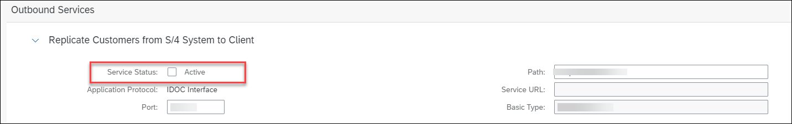

    </li><li>Choose **Save**</li></ol>

>You can download the metadata of the service also in the communication arrangement. This is helpful in case you extended the API with custom fields. To download the metadata, navigate to **Inbound Services** and choose Download WSDL/Service Metadata:
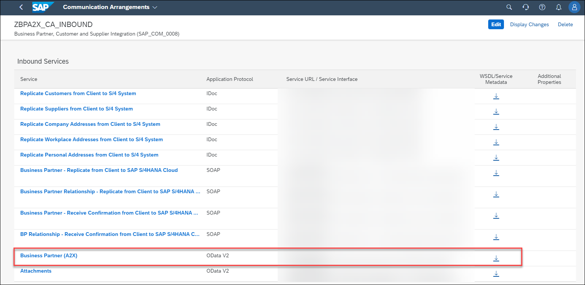

### Create a Communication Arrangement and Communication System in SAP BTP, ABAP environment

Configure the outbound connectivity in SAP BTP, ABAP environment. Create a communication arrangement based on your custom communication scenario, as well as a communication system and an outbound communication user. The communication system will contain the target host of the SAP S/4HANA Cloud, public edition system, while the communication user will need to match the inbound user defined in the target system.

1. Open SAP Fiori Launchpad of your SAP BTP ABAP environment system.  

2. Access the **Communication Arrangements** app

3. Choose button **New**

4. Choose Scenario `ZBPA2X_CS_BUPA` created before

5. Provide Arrangement Name: `ZBPA2X_CA_OUTBOUND`

6. Choose button **Create**
    
    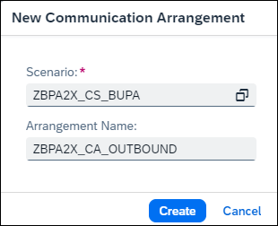

7. Choose button **New** to create a new Communication System

    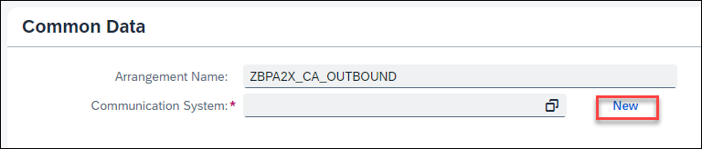

8. Provide:
    <ol type="a"><li>System ID: `ZBPA2X_COM_SYS_S4H`
    </li><li>System Name: `ZBPA2X_COM_SYS_S4H`

    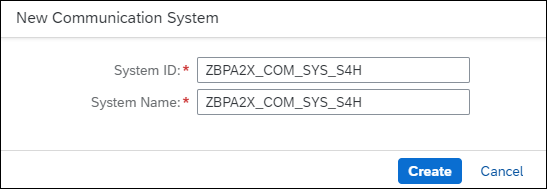</li></ol>

9. In the **Communication System** screen, **General** section, provide:
    <ol type="a"><li>Host Name: **API-URL** stored in STEP 3. Remove the `https://` from the URL.
    </li><li>Business System: `ZBPA2X`
    
    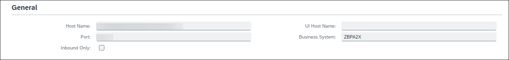</li></ol>

10. In the **Users for Outbound Communication** section
    <ol type="a"><li>Choose `+`
    </li><li>Provide **User Name / Client ID**: User created in STEP 1 (`ZBPA2X_COM_USER`)
    </li><li>Provide Password: Password created and stored in STEP 1
    
    

    </li><li> Choose button **Create**</li></ol>

11. Choose **Save** to save the **Communication System**

12. Verify the Authentication Method is User ID and Password

    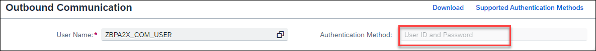

13. Choose **Save** to save the **Communication Arrangement**

You have now successfully integrated SAP BTP, ABAP Environment and your SAP S/4HANA Cloud, public edition system using Basic Authentication.

### Execute Business Partner Service Call

As a developer in SAP BTP, ABAP environment, you can now execute the console application.

1. In ADT, open the project for your SAP BTP ABAP environment system.

2. Navigate to the Console Application `ZBPA2X_CL_CLASSRUN`

3. Right click on the class and choose **Run As** > **ABAP Application (Console)**

4. Note down the Business Partner number that is written to the Console for later use

    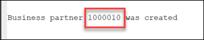

### Verify Business Partner

You should now verify that the business partner was successfully created in your SAP S/4HANA Cloud, public edition system.

1. Open the SAP Fiori Launchpad of the customizing tenant (100) of your SAP S/4HANA Cloud, public edition development system.

2. Access the **Manage Business Partner Master Data** app

3. Enter the previously created Business Partner number in the related field and press enter.

    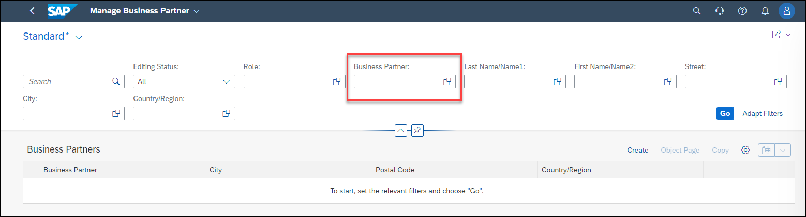

4. Display column **Created By** via the settings button.

    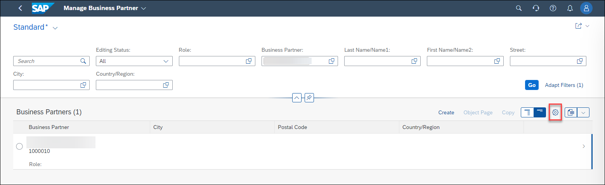

    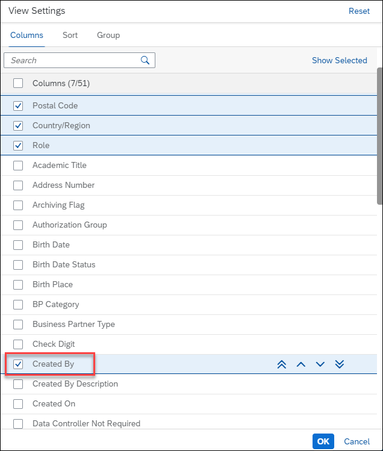
    
5. Check the  data of the created business partner. See that the user was created by the technical communication user, and not by your own business user:

    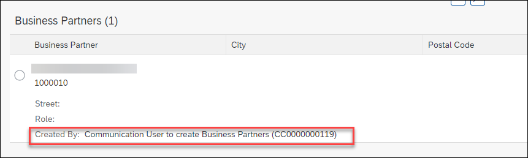

You have now verified that the integration of SAP BTP, ABAP environment and your SAP S/4HANA Cloud, public edition system, which uses Basic Authentication as the authentication mechanism, indeed works.

You saw that the business partner was created by the technical communication user, and not by your own business user. In fact, you do not even require a business user in the S/4HANA Cloud system for the remote service call to succeed. The communication user receives the necessary authorization for creating business partners via the communication arrangement for scenario `SAP_COM_0008`.

### Test yourself

---
