# Integrate SAP BTP ABAP Environment and SAP S/4HANA Cloud, public edition using the OAuth 2.0 SAML Bearer Assertion Flow

<!-- description --> Integrate SAP BTP, ABAP environment and SAP S/4HANA Cloud, public edition using the OAuth 2.0 SAML Bearer Assertion Flow. This tutorial takes an existing integration based on Basic Authentication and configures the more complex authentication mechanism to enable the usage of principal propagation.

## Prerequisites

- This is the third tutorial of this tutorial group. Please complete the tutorial [Implement an Outbound Service Call in SAP BTP ABAP environment](abap-environment-business-partner-outbound-call) and the tutorial [Integrating an SAP BTP, ABAP Environment and an SAP S/4HANA Cloud, public edition System using Basic Authentication](abap-environment-business-partner-basic-auth) before proceeding. The prerequisites of the previous tutorials apply.
- The custom communication scenario that is used must be enabled for outbound connectivity using **OAuth 2.0**, with **SAML 2.0 Bearer Assertion** as the grant type.

## You will learn

- How to configure **OAuth 2.0** for outbound connectivity.
- How to configure an **OAuth 2.0 Identity Provider** for inbound connectivity.
  
## Intro
>
>In this tutorial, all activities on S/4HANA Cloud side will be performed in the **customizing tenant** (100) of your **development system**.

### Understand the OAuth 2.0 SAML Bearer Assertion Flow

The **OAuth 2.0 SAML Bearer Assertion** flow works as follows:

At design time, the OAuth 2.0 client, in our case a system in the SAP BTP, ABAP environment, is signed up to the authorization server, in our case the SAP S/4HANA Cloud, public edition system. The authorization server provides the clients credentials.

At run time, the OAuth 2.0 client sends the following information to the token endpoint of the authorization server (1):

- SAML Bearer Assertion (authorization grant)
- Client ID
- Client secret or client certificate

The authorization server authenticates the OAuth 2.0 client with its credentials (client id and client secret or client certificate), validates the SAML Bearer assertion, and, if the SAML Bearer assertion is validated successfully, the authorization server issues an access token (2).  

The OAuth 2.0 client sends the access token to the resource server – in our case the SAP S/4HANA Cloud, public edition system – to access the protected resource (3). The protected resource validates the access token and, if valid, grants access.

The SAML Bearer Assertion is an XML document. It contains the information about the principal to be propagated. This information is stored in the `<saml.Subject><saml:NameID>` element of the XML document. It provides the actual ID and its format.

To validate the SAML Bearer Assertion, the authorization server needs to trust the issuer of the SAML Bearer assertion – in our case, the system in the SAP BTP, ABAP Environment.

### Get OAuth 2.0 Endpoint Information

As an administrator in SAP S/4HANA Cloud, public edition system, you will derive the information of the endpoint and audience needed to set up the OAuth 2.0 communication.

1. Open the SAP Fiori Launchpad of your SAP S/4HANA Cloud, public edition system

2. Open the **Communication Systems** app and access the **Own SAP Cloud System**. You can filter for the **Own SAP Cloud System** via the **Adapt Filters** button.

    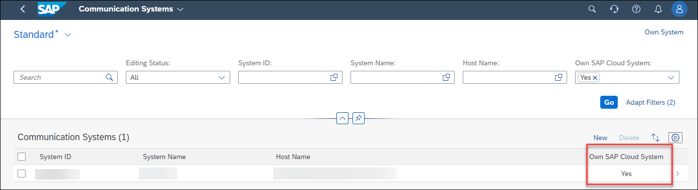

3. In the General section copy the **OAuth 2.0 SAML2 Audience** and **OAuth 2.0 Confidential Client Token Service URL**. Store it for later use.

    

### Add OAuth 2.0 Client to Communication System in SAP BTP ABAP environment

As an administrator in SAP BTP ABAP environment, adjust your communication system to support the **OAuth 2.0** authentication method for outbound connectivity.

1. Open SAP Fiori Launchpad of your SAP BTP ABAP environment system.  

2. Open the **Communication Systems** app and access Communication System `ZBPA2X_COM_SYS_S4H`

3. Choose **Edit**

4. In section **OAuth 2.0 Settings** set
    <ol type="a"><li>Token Endpoint: **OAuth 2.0 Confidential Client Token Service URL** (derived in STEP 1)
    </li><li>Audience: **OAuth 2.0 SAML2 Audience** (derived in STEP 1)

    </li></ol>

5. In section **Users for Outbound Communication**
    <ol type="a"><li>Choose `+`
    </li><li>Choose Authentication Method **OAuth 2.0**
    </li><li>Provide OAuth 2.0 Client ID: Username of communication user created in [Step 'Create a Communication User' of the previous tutorial](abap-environment-business-partner-basic-auth) (`ZBPA2X_COM_USER`)
    </li><li>Provide Client Secret: Password of communication user created in [Step 'Create a Communication User' of the previous tutorial](abap-environment-business-partner-basic-auth). Here you reuse the communication user in order to sign up to the OAuth 2.0 client.

    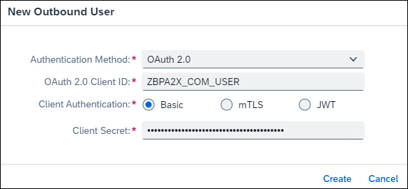

    </li><li>Choose **Create**</li></ol>

6. Choose **Save** to save the communication system

### Modify Communication Arrangement in SAP BTP ABAP environment to use Authentication OAuth 2.0

As an administrator in SAP BTP ABAP environment, configure your communication arrangement to use the authentication **OAuth 2.0** for outbound connectivity.

1. In the SAP Fiori Launchpad, open the **Communication Arrangements** app

2. Navigate to Communication Arrangement `ZBPA2X_CA_OUTBOUND`

3. Choose **Edit**

4. In Section **Outbound Communication**:
    <ol type="a"><li>Select newly maintained outbound communication user of type OAuth 2.0 for Outbound Communication

    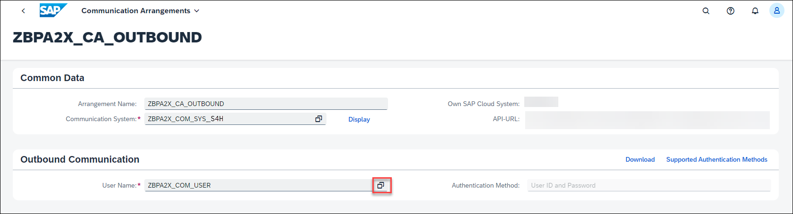

    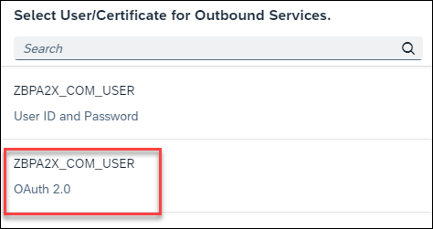

    </li><li>Note down the **SAML2 Issuer**, make sure SAML2 Identifier is **E-Mail**

    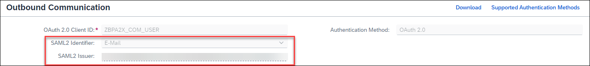</li></ol>

5. Choose **Save** to save the Communication Arrangement

### Obtain Signing Certificate

As an administrator in SAP BTP ABAP environment, obtain a signing certificate for the system. This certificate will allow the SAP S/4HANA Cloud, public edition system to trust the SAP BTP ABAP environment system.

1. Stay in communication arrangement `ZBPA2X_CA_OUTBOUND`

2. Choose button **Download** > **Download Signing Certificate**

    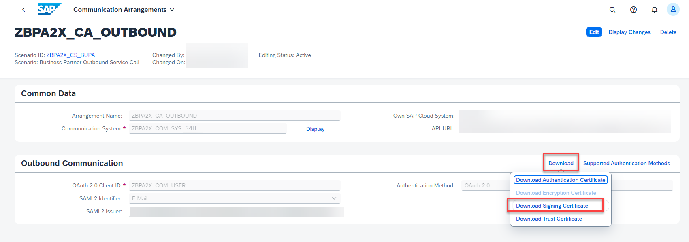

3. Note down where the file was saved, for later use

### Upload Signing Certificate in Communication System in SAP S/4HANA Cloud, public edition

As an administrator in SAP S/4HANA Cloud, public edition, configure your communication system to trust the **OAuth 2.0 Identity Provider** of the SAP BTP, ABAP environment system using the previously obtained signing certificate. This will enable **OAuth 2.0** authentication for the exposed remote service.

1. Open the SAP Fiori Launchpad of the customizing tenant (100) of your SAP S/4HANA Cloud, public edition development system.

2. Access the **Communication Systems** app and open communication system `ZBPA2X_COM_SYS`

3. Choose **Edit**

4. Enable OAuth2.0 Identity Provider section
    <ol type="a"><li>Provide **OAuth 2.0 SAML Issuer**: Noted down in STEP 4
    </li><li>Choose **Upload Signing Certificate** button
    </li><li>Upload the certificate obtained in STEP 5
        
    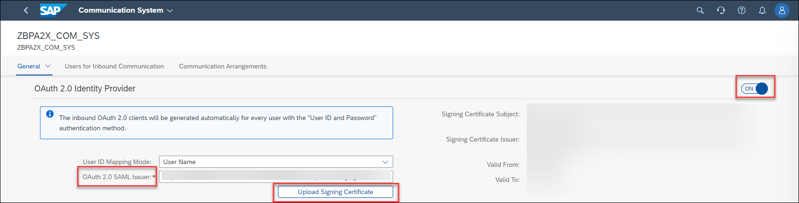</li></ol>

5. Choose **Save** to save the Communication System

6. An additional User for Inbound Communication with Authentication Method OAuth 2.0 is created automatically

    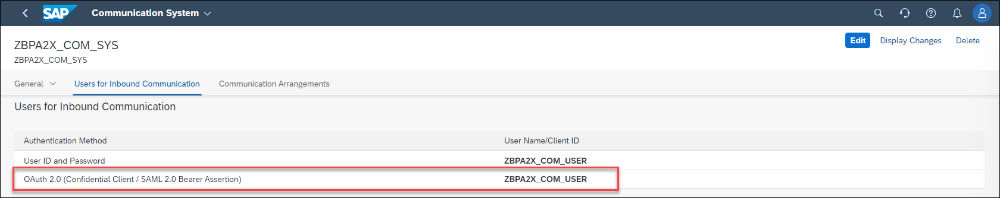

### Modify Communication Arrangement in SAP S/4HANA Cloud, public edition to use Authentication OAuth 2.0

As an administrator in SAP S/4HANA Cloud, public edition, configure your communication arrangement to use the authentication method **OAuth 2.0** for inbound connectivity.

1. Open communication arrangement `ZBPA2X_CA_INBOUND`

2. Choose button **Edit**

3. In the **Inbound Communication** section select newly maintained inbound communication user of type OAuth 2.0 for Inbound Communication

    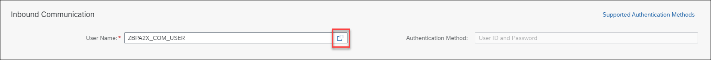

    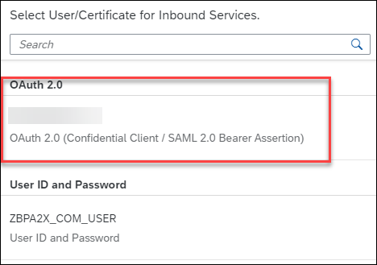

4. Choose **Save** to save the Communication Arrangement

5. A new button appears: **OAuth 2.0 Details**, this will be needed in the next step

    

### Determine Business Catalogs for Service Authorization

Now you must determine the business catalogs, which enable your S/4HANA Cloud business user for business partner creation. The determination is done as follows:

1. In the communication arrangement **Inbound Communication** section, choose button **OAuth 2.0 Details**

2. In the OAuth 2.0 Details Popup, mark `API_BUSINESS_PARTNER_0001` OAuth 2.0 Scope ID

3. Choose button **Granted by Business Catalogs**

    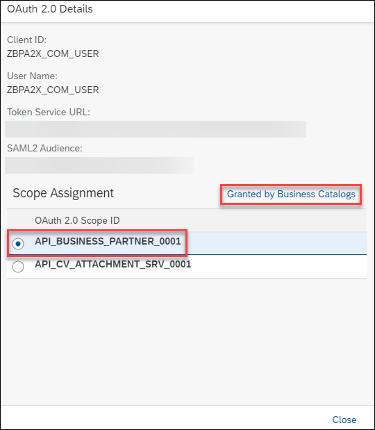

4. In the OAuth 2.0 Details popup you can see the business catalogs, which enable your S/4HANA Cloud business user for business partner creation.

    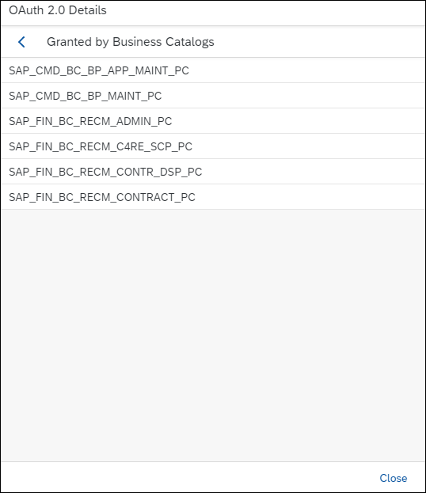

    E.g. business catalog `SAP_CMD_BC_BP_MAINT_PC` is contained in business role `BR_BUPA_MASTER_SPECIALIST`. This business role is used in this tutorial to authorize the business user to create a business partner.

5. Choose button **Close**

### Execute Business Partner Service Call

As a developer in **SAP BTP, ABAP environment**, you can now execute the console application.

1. In ADT, open the project for your SAP BTP ABAP environment system

2. Navigate to the Console Application `ZBPA2X_CL_CLASSRUN`

3. If you have previously executed your code, change it to create a business partner with different properties

4. Right click on the class and choose **Run As** > **ABAP Application (Console)**

5. Note down the Business Partner number that is written to the Console for later use

    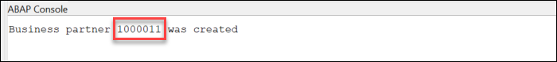

### Verify Business Partner

You should now verify that the business partner was successfully created in your SAP S/4HANA Cloud, public edition system.

1. Open the SAP Fiori Launchpad of your SAP S/4HANA Cloud, public edition system.

2. Access the Manage Business Partner Master Data app

3. Enter the created Business Partner number in the related field and press the **Go** button. Check data of the created business service.

    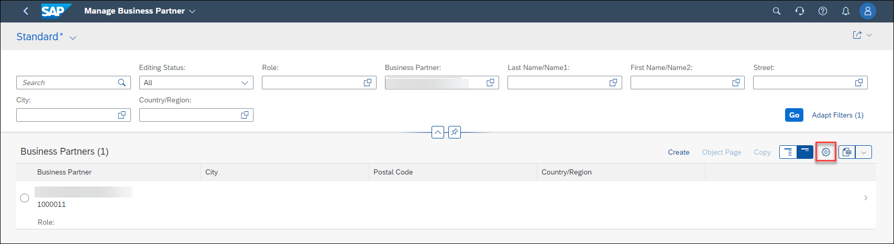

4. Display column **Created By** via the settings button.

    

    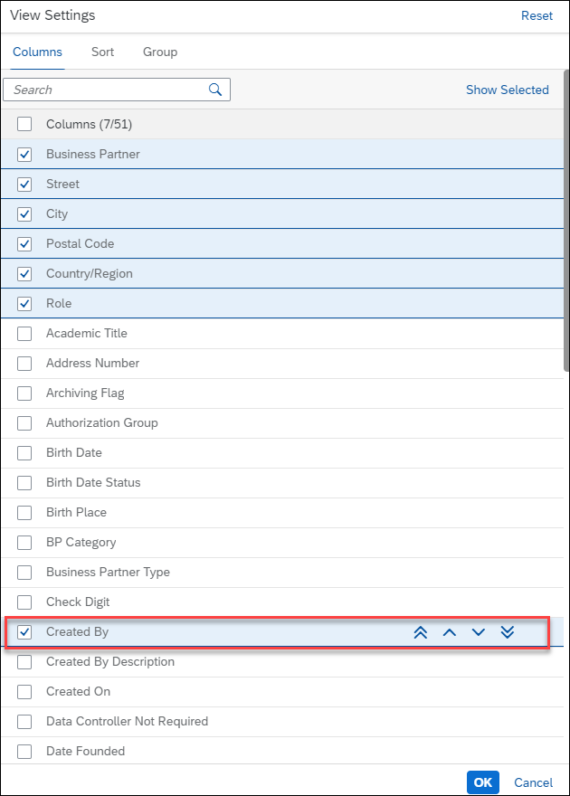

5. Check the data of the created business partner. See that the user was created by the technical communication user, and not by your own business user

    

You have now verified that the integration of SAP BTP, ABAP environment and your SAP S/4HANA Cloud, public edition system, using the OAuth 2.0 SAML Bearer Assertion authentication flow, indeed works.

You will see that the business partner was created by your business user in that system, and not by a technical communication user. Your identity is thus propagated from SAP BTP ABAP environment to the SAP S/4HANA Cloud, public edition system and used to consume the service. For this reason, it is necessary for your S/4HANA Cloud business user to be authorized for business partner creation, which is achieved by assigning business role `BR_BUPA_MASTER_SPECIALIST` to the user. Without the role assignment, the remote service call fails with an authorization error.

### Test yourself
