# Implement an Outbound Service Call in SAP BTP, ABAP environment for an OData Service via Service Consumption Model

<!-- description --> As an ABAP developer, implement an outbound service call from an SAP BTP, ABAP Environment system to an SAP S/4HANA Cloud, public edition system. Use the Business Partner (A2X) API to create business partners in the SAP S/4HANA Cloud system remotely.

## Prerequisites

- Your business User in the SAP BTP, ABAP environment system must be assigned to business role `SAP_BR_DEVELOPER`.
- You have downloaded and installed the latest ABAP Development Tools (ADT) on the latest Eclipse platform.
- You have created an ABAP Cloud project for your SAP BTP ABAP environment system in ADT.

## You will learn

- How to create a custom communication scenario.
- How to create a service consumption model for an OData service.
- How to implement a console application.
- How to execute remote calls from your ABAP code.

### Create a Development Package

Create your own ABAP development package, which will serve as the basis for the development artifacts to be created.

1. Open Eclipse and connect to your system.

2. Right click the main package `ZLOCAL` and choose **New > ABAP Package**.

3. Create your own ABAP development package as a sub package of `ZLOCAL` using Software Component `ZLOCAL`. Create a new Transport Request for this purpose.
  <ol type="a"><li>Name: `ZBPA2X`
  </li><li>Description: `BP A2X Outbound Call Tutorial`</li></ol>

### Create an Outbound Service

Create an outbound service object, which models the outbound call that will be implemented. The outbound service will be part of a custom communication scenario.

1. Mark the created package under `ZLOCAL` or in Favorite Packages and click on **File** and choose **New > Other... > Outbound Service**:

    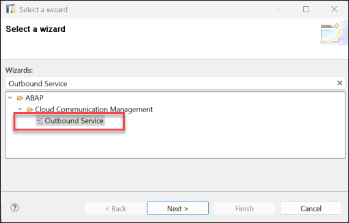

2. Provide:
    <ol type="a"><li>Outbound Service: `ZBPA2X_OBS_BUPA`
    </li><li>Description: `Business Partner Outbound Service`
    </li><li>Service Type: `HTTP Service`

      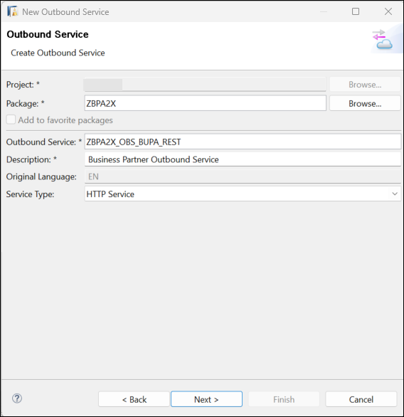</li></ol>

3. Choose **Next**

4. Use the transport request created before and choose **Finish**.

### Create a Communication Scenario

Create a communication scenario and assign the outbound service to it. This will be the basis for the outbound communication arrangement, which will be configured by an administrator at a later point. Keep in mind that the developer defines which authentication methods are supported, while the administrator decides which authentication method is ultimately used at runtime.

1. In ADT, mark the created package under `ZLOCAL` or in Favorite Packages and click on **File** and choose **New > Other... > Communication Scenario**:

    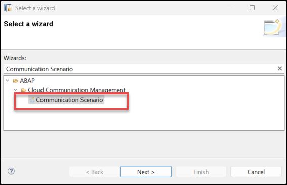

2. Provide:
    <ol type="a"><li>Name: `ZBPA2X_CS_BUPA`
    </li><li>Description: `Business Partner Outbound Service Call`

      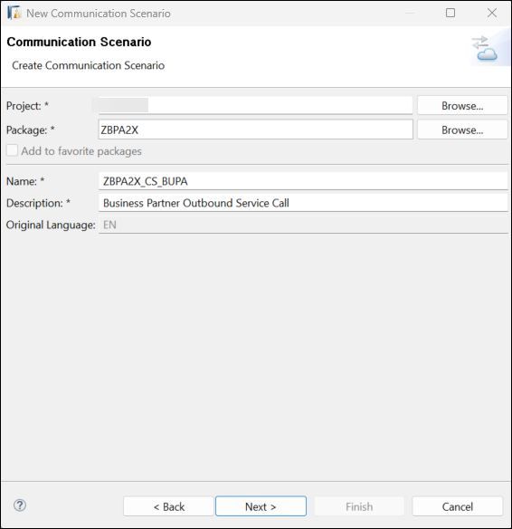</li></ol>

3. Use the transport request created before and choose **Finish**

4. Select "One instance per client" from the **Allowed Instances** dropdown list

    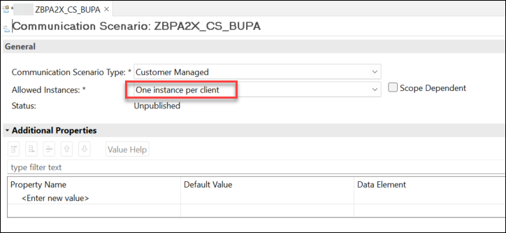

5. Choose Tab **Outbound** and Add the Outbound Service created before: `ZBPA2X_OBS_BUPA_REST`

6. Verify that the Authentication Methods **Basic** and **OAuth 2.0** are selected and choose **SAML 2.0 Bearer Assertion** from the dropdown list of the **OAuth 2.0 Grant Type**

    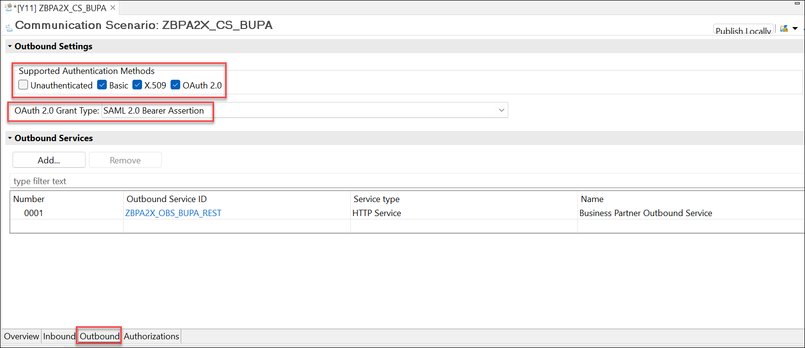

7. Save the communication scenario.

8. Choose **Publish Locally**.

### Download Service Metadata File

Obtain the service metadata file to be able to create the service consumption model in the next step.

1. In the browser access the business Partner API directly in the SAP Business Accelerator Hub. Use [Business Partner (A2X)](https://api.sap.com/api/API_BUSINESS_PARTNER/overview)

2. Choose API Specification

3. Choose to download the EDMX file

  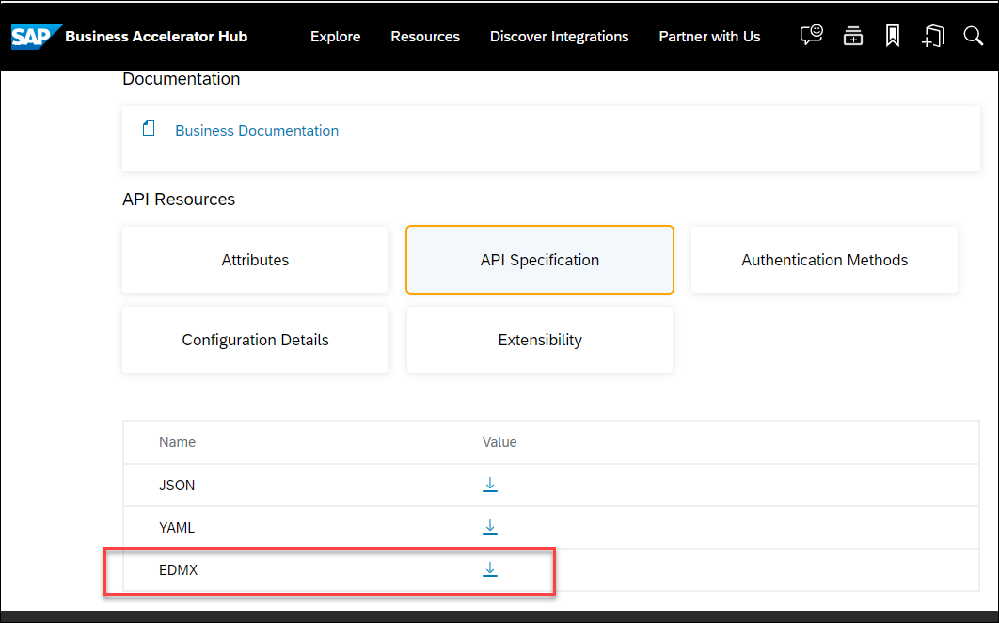

### Create a Service Consumption Model

Create a service consumption model for the targeted OData service from the metadata file. This generates a number of proxy objects and greatly simplifies the remote service call in your ABAP code.

1. In ADT, mark the package created in the previous tutorial of this tutorial group (`ZBPA2X`) under `ZLOCAL` or in Favorite Packages and click on **File** and choose **New > Other... > Service Consumption Model**:
  
    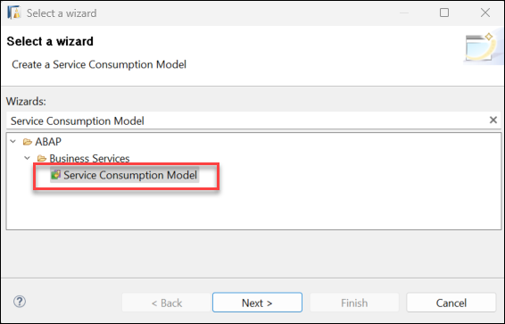

2. Provide:
    <ol type="a"><li>Name: `ZBPA2X_SCM_BUPA`  
    </li><li>Description: `Service Consumption Model Business Partner`
    </li><li>Remote Consumption Mode: `OData`

      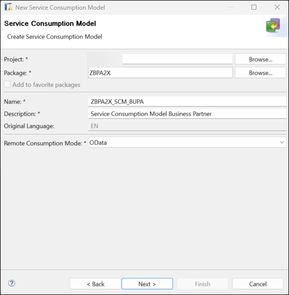</li></ol>

3. Choose **Next**

4. Provide the Service Metadata File of the OData service, that you downloaded in the previous step

    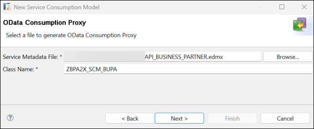

5. Choose **Next**

6. On the **Components of OData Service** screen, Choose **Next**

7. On the **ETag Support** screen, choose **Next**

8. Select a transport request and choose **Finish**

The creation of the Service Consumption Model can take a few seconds. Save and activate the Service Consumption Model.

### Create Console Application

Create a console application, which consists of an ABAP class implementing the interface `if_oo_adt_classrun`. The distinctive feature of this interface is that it allows to execute code directly in ADT.

1. In ADT, mark the created package under `ZLOCAL` or in Favorite Packages and click on **File** and choose **New > Other... > ABAP Class**:
  
    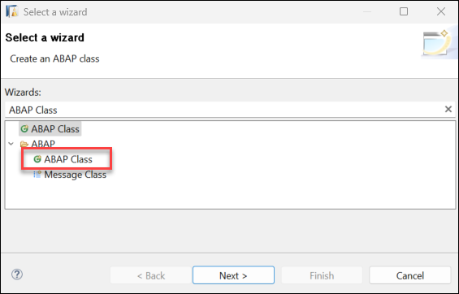

2. Provide:
    <ol type="a"><li>Name: `ZBPA2X_CL_CLASSRUN`
    </li><li>Description: `Create S/4HANA Business Partner via console app`
    </li><li>Interface: `IF_OO_ADT_CLASSRUN`

      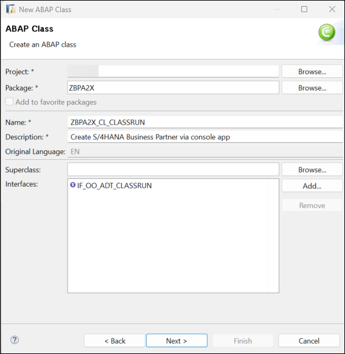</li></ol>

3. Choose **Next**

4. Select a Transport Request and choose **Finish**

### Implement Business Partner Service Call

You will now implement the outbound service call in your console application. The previously maintained communication artifacts are used together with the service consumption model to create compact and understandable code.

1. Open the Service Consumption Model `ZBPA2X_SCM_BUPA`
      <ol type="a"><li>Mark Entity Set **A_BusinessPartner**  
      </li><li>Make sure Operation **Create** is set
      </li><li>Choose **Copy to Clipboard**

      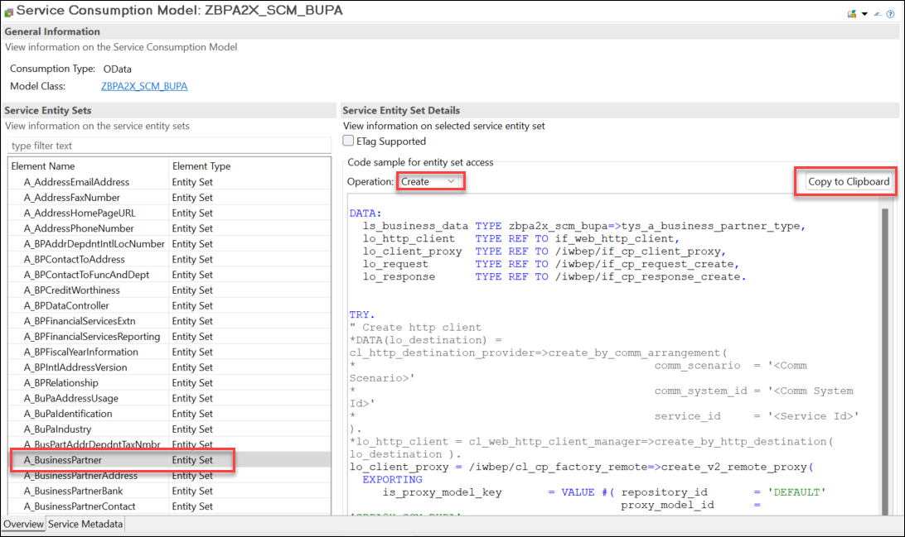</li></ol>  

2. Paste the code into the implementation part of the `if_oo_adt_classrun~main` method of the `ZBPA2X_CL_CLASSRUN` class you created in the previous step.

3. Adjust the class as follows:

```ABAP
" Test stuff
CLASS zbpa2x_cl_classrun DEFINITION

  PUBLIC
  FINAL
  CREATE PUBLIC .

  PUBLIC SECTION.
    TYPES:
      BEGIN OF tys_a_business_partner_ty,
        business_partner          TYPE c LENGTH 10,
        business_partner_category TYPE c LENGTH 1,
        first_name                TYPE c LENGTH 40,
        last_name                 TYPE c LENGTH 40,
      END OF tys_a_business_partner_ty.

    INTERFACES if_oo_adt_classrun .
  PROTECTED SECTION.
  PRIVATE SECTION.
ENDCLASS.

CLASS zbpa2x_cl_classrun IMPLEMENTATION.

  METHOD if_oo_adt_classrun~main.
    DATA:
      ls_business_partner TYPE tys_a_business_partner_ty,
      lo_http_client      TYPE REF TO if_web_http_client,
      lo_client_proxy     TYPE REF TO /iwbep/if_cp_client_proxy,
      lo_request          TYPE REF TO /iwbep/if_cp_request_create,
      lo_response         TYPE REF TO /iwbep/if_cp_response_create.

    TRY.
        " Create http client
        DATA(lo_destination) = cl_http_destination_provider=>create_by_comm_arrangement(
                                 comm_scenario  = 'ZBPA2X_CS_BUPA'
                                 service_id     = 'ZBPA2X_OBS_BUPA_REST' ).

        lo_http_client = cl_web_http_client_manager=>create_by_http_destination( lo_destination ).
        lo_client_proxy = /iwbep/cl_cp_factory_remote=>create_v2_remote_proxy(
          EXPORTING
            is_proxy_model_key = VALUE #( repository_id = 'DEFAULT'
            proxy_model_id = 'ZBPA2X_SCM_BUPA'
            proxy_model_version = '0001' )
            io_http_client = lo_http_client
            iv_relative_service_root = ''
"            iv_relative_service_root = '/sap/opu/odata/sap/API_BUSINESS_PARTNER'
            ).

        ASSERT lo_http_client IS BOUND.
        " Navigate to the resource and create a request for the create operation
        lo_request = lo_client_proxy->create_resource_for_entity_set( zbpa2x_scm_bupa=>gcs_entity_set-a_business_partner )->create_request_for_create( ).

        DATA(lv_userid) = cl_abap_context_info=>get_user_technical_name( ).

        SELECT SINGLE *
        FROM i_businessuser
            WITH PRIVILEGED ACCESS
        WHERE userid = @lv_userid INTO
        @DATA(ls_businessuser).

        IF sy-subrc <> 0.
          out->write( |Error retrieving business user { lv_userid }| ).
          RETURN.
        ENDIF.

        ls_business_partner = VALUE #(
           business_partner_category = '1'
           first_name = ls_businessuser-firstname
           last_name = ls_businessuser-lastname

         ).

        " Set the business data for the created entity
        lo_request->set_business_data( ls_business_partner ).
        " Execute the request
        lo_response = lo_request->execute( ).
        " Get the after image
        lo_response->get_business_data( IMPORTING es_business_data = ls_business_partner ).
        out->write( |Business partner { ls_business_partner-business_partner } was created| ).

      CATCH cx_root INTO DATA(lx_exception).
        " Handle remote Exception
        " It contains details about the problems of your http(s) connection
        out->write( lx_exception->get_text( ) ).
    ENDTRY.

  ENDMETHOD.
ENDCLASS.
```

  Remember to replace the name of all objects created in the tutorial unless you did not use the suggested names. Here the object names and the suggested names:
  <ol type="a"><li>Communication Scenario: `ZBPA2X_CS_BUPA`
  </li><li>Outbound Service: `ZBPA2X_OBS_BUPA_REST`
  </li><li>Service Consumption Model: `ZBPA2X_SCM_BUPA`</li></ol>
4. Save and activate your class.

The implementation uses the custom communication scenario and outbound service to create a destination object. This is in turn used to instantiate an HTTP client, which is used to handle the HTTP communication. The service consumption model is used to instantiate a client proxy, which offers standard methods to easily build the request payload directly from your ABAP code. In this example, the request creates a single business partner in the target system and writes its ID to the console.

### Test the ABAP Console Application

The ABAP Console Application you created in the previous step cannot be executed just yet, as an administrator still needs to configure the outbound connectivity, specifying a target system and a communication user. This will be done in the next tutorial of this group.

You can check this by running the class: right click on the class and choose **Run As** > **ABAP Application (Console)**:

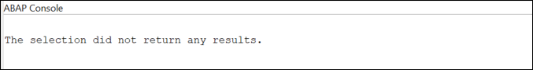

Since the outbound connectivity has not been set up yet, the class cannot create a Business Partner yet.

### Test yourself

---
