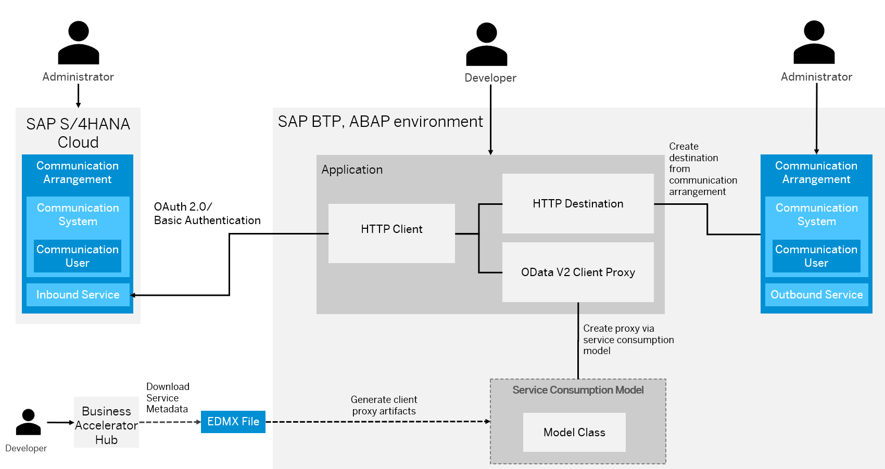

# Learn the basic concepts required for the integration of SAP BTP, ABAP environment and SAP S/4HANA Cloud, public edition
<!-- description --> Understand what the underlying scenario is, and the concept how to integrate the SAP BTP, ABAP environment with SAP S/4HANA Cloud, public edition.

## You will learn
- What the example business scenario is,
- How communication management works in public cloud-based ABAP products,
- How the OAuth 2.0 authentication mechanism works,
- How the subsequent tutorials are structured.

### Understand the example scenario

The example scenario used in the tutorial group assumes that developers want to use a service that creates, reads, updates, and deletes master data related to business partners, suppliers, and customers in an SAP S/4HANA Cloud, public edition system. To achieve this, the developer makes an outbound service call from SAP Business Technology Platform to the SAP S/4HANA Cloud, public edition service.

The desired functionality is offered by the **Business Partner (A2X)** service, which is part of the standard communication scenario `SAP_COM_0008`. For more information, see [Business Partner (A2X) - Overview](https://api.sap.com/api/API_BUSINESS_PARTNER/overview).

The scenario is successfully implemented when an SAP S/4HANA Cloud, public edition business partner is created remotely from the SAP BTP, ABAP environment. Over the course of the tutorial group, the authentication methods **Basic Authentication** and **OAuth 2.0** are used.

### Understand cloud-based communication management

Familiarize yourself with the relevant communication management concepts by reading through the overview page [Communication Management](https://help.sap.com/docs/sap-btp-abap-environment/abap-environment/communication-management).

In the scenario that we are considering, an SAP S/4HANA Cloud, public edition service is called from SAP BTP, ABAP environment. In other words, SAP S/4HANA Cloud, public edition is the **inbound** communication partner, while SAP BTP, ABAP environment is the **outbound** communication partner.

Since we are considering a scenario where a standard, SAP-delivered service is consumed, no development activity is needed on SAP S/4HANA Cloud, public edition side, only administrative steps are required. On SAP BTP, ABAP environment side, both development and administration activities are required.

### Understand the implementation flow of the subsequent tutorials

To optimize the learning experience and minimize the possibility of errors, the required steps are divided into three parts.

In the first part, an SAP BTP, ABAP environment developer implements the outbound service call, which upon execution should create a business partner in the SAP S/4HANA Cloud, public edition system.  

In the second part, the two communication partners are integrated using the authentication method **Basic Authentication**. In other words, a technical communication user can be used to call from the SAP BTP, ABAP environment and authenticate at the SAP S/4HANA Cloud, public edition system. Since Basic Authentication is used, the logs will show that the business partner creation is executed by the technical communication user.

In the final part, the existing scenario is adapted to use **OAuth 2.0** as the authentication mechanism (using the SAML Bearer Assertion flow), instead of **Basic Authentication**. This only requires administrative changes; no changes to the development objects are needed. With this approach, the identity of the executing business user is propagated from SAP BTP, ABAP environment to SAP S/4HANA Cloud, public edition. The logs will show that the business partner creation is executed by a business user, and not by a technical communication user. For this reason, it is necessary for the relevant business user to be authorized for business partner creation in the target system.

The advantage of this overall sequence is that the integration can first be validated using **Basic Authentication**. If successful, the more complex **OAuth 2.0** integration can be enabled.

### Test Yourself

---
