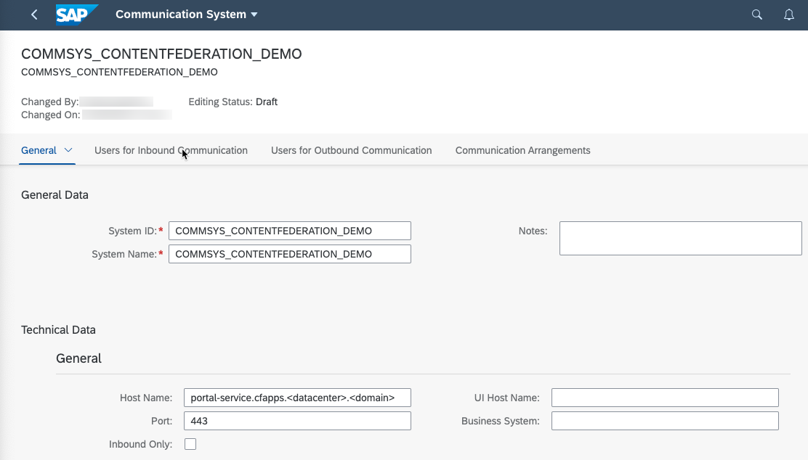

# Create Communication between SAP BTP, ABAP Environment and SAP BTP
<!-- description --> Create a communication arrangement to enable the communication between SAP BTP, ABAP system and SAP Launchpad Service

In this group of tutorials, the target is to provide the content of a SAP BTP, ABAP environment system to the SAP Launchpad Service of a subaccount on SAP BTP.

## Prerequisites
 - Subscribe to the SAP Launchpad Service in the same subaccount the content shall be consumed. Follow the steps of tutorial
 ["Set Up the SAP Launchpad Service"](cp-portal-cloud-foundry-getting-started) in your subaccount.
 **Authorizations:** Your SAP BTP, ABAP environment user needs a business role with business catalogs **Administrator** (ID: `SAP_BR_ADMINISTRATOR role`) assigned.
  - **Authorizations:** User needs to be a subaccount administrator user in the SAP BTP cockpit, in the same subaccount where the destinations for Content Federation will be created .

## You will learn
  - How to create a communication system
  - How to create communication users
  - How to setup a communication scenario
  - How to setup a communication arrangement
  - How to expose roles to the SAP Launchpad Service

---

### Create the Communication System

- Open the `Communication Systems` app from the Fiori Launchpad in your SAP BTP, ABAP environment system.

- Create a new Communication system.

- Specify the System ID and System Name for the new System.

- In the field `Host Name` optionally enter the callback URL. This is needed for setting up content change notifications. For example portal-service.cfapps.eu10.hana.ondemand.com.

  <!-- border -->

- Add a technical user for inbound communication.

  <!-- border -->

  <!-- border -->

- Authentication method is `User Name and Password`. Let the System generate a Password.
Do not forget to note the password down. It will be used in Tutorial [Create destinations in SAP BTP cockpit](abap-environment-destinations).

<!-- border -->

- Similarly add a technical user for outbound communication with `Authentication Method` `None`.

  <!-- border -->

### Create the Communication Arrangement

- Open the `Communication Arrangements` app from the SAP Fiori launchpad and select `New`.

- In the `New Communication Arrangement` app choose Communication Scenario `SAP_COM_0647` for creation.

- Press `Create`.

- In the "Common Data" section set the Communication System created before using the value help.

<!-- border -->

- Enter the job execution details for scheduling the exposure job daily and press `Save`.

### Select Roles for exposure to Launchpad Service

- Open the `SAP_BR_ADMINISTRATOR` app.

- Search for Business Role `SAP_BR_ADMINISTRATOR`.

- Mark Business Role `SAP_BR_ADMINISTRATOR`.

- Click `Expose to SAP Launchpad Service`.

<!-- border -->

> The content related to the Business Role, such as groups, catalogs, pages, or spaces can then be consumed by the SAP Launchpad service.

### Configure communication in the tenant of the cloud solution

    - In the SAP BTP cockpit download the trust certificate of the subaccount runtime destinations, by navigating to Connectivity -> Destinations. Press the `Download Trust` button.

    - Open the `Communication Systems` app from the Fiori Launchpad in your SAP BTP, ABAP environment system.

    - Create a new Communication system.

    - Specifiy the System ID and System Name for the new System.

    - Select `Inbound only`.

    - Set `SAML Bearer Assertion Provider` to `ON`.

    - Upload the certificate file that you downloaded from your subaccount as the Signing Certificate.

    - Specify a unique Provider Name in the following format:
      `cfapps.<**region**>.hana.ondemand.com/<unique_name>`

    - Save the communication system.

---
