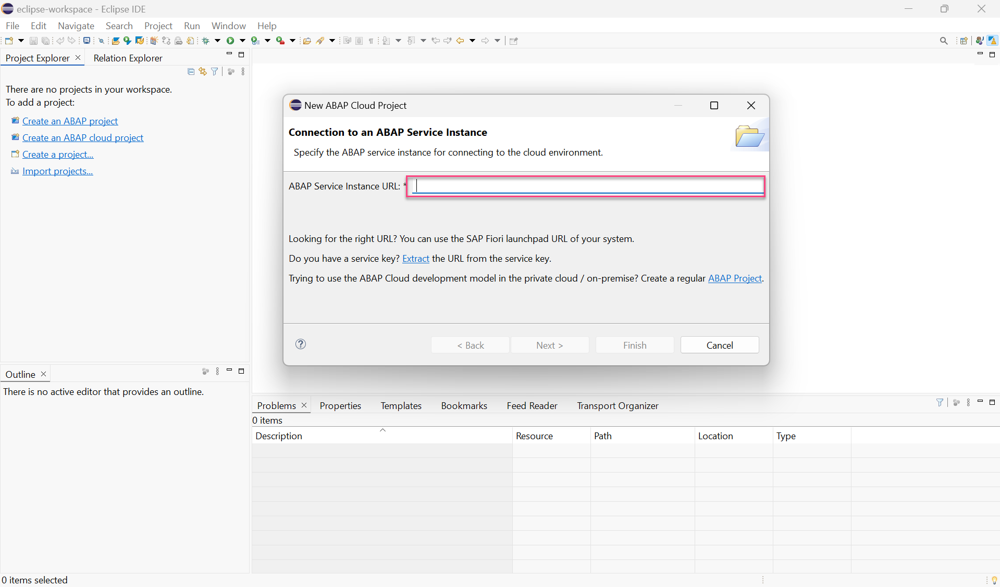

# Create an ABAP Cloud Project 
<!-- description --> Create an ABAP cloud project with SAP BTP ABAP environment.

## Prerequisites
- You have finished the [Create an SAP BTP ABAP Environment Trial User](abap-environment-trial-onboarding) tutorial or you have your own user in a licensed system.

## You will learn  
  - How to create an ABAP Cloud project

---

### Open ABAP Development Tools

Open Eclipse. Make sure you have installed ADT in your Eclipse. Find [here](abap-install-adt) the Eclipse installation instruction.

### Create ABAP cloud project

  1. Select **File** > **New** > **Other** > **ABAP Cloud Project** and click **Next >**.

      

  2. Select **SAP BTP ABAP Environment** > **Use a Service Key** and click **Next >**.

     

    >**Hint:** You have downloaded the service key in [Create an SAP BTP ABAP Environment Trial User](abap-environment-trial-onboarding).

  3. Import your service key and click **Next >**.

      

  4. Click **Open Logon Page in Browser**.

      

    >**Hint:** If you are already logged on in the default browser with a user which you do not want to use for this project, then use the **Copy Logon URL to Clipboard** option and paste the URL in a browser started in private or incognito mode or a non defaulted browser.

  5. Now you've been authenticated automatically. Provide your credentials if requested. The credentials are the same you used to create your trial account on SAP BTP.
 
     Go back to ADT.

      

      Click **Finish**.

  6. Your trial system appears on the project explorer.

      

### Test yourself
