# Create a RAP Business Event in SAP BTP ABAP Environment
<!-- description --> Create a RAP business event in SAP BTP ABAP Environment and test it using a local event handler

## Prerequisites
- You have access to a SAP BTP ABAP environment system, either free-tier or you have a license.

 For more information, see:

- [Get started with SAP BTP ABAP Environment: Trial Account vs. Free Tier Option | SAP Community](https://community.sap.com/t5/technology-blogs-by-sap/get-started-with-sap-btp-abap-environment-trial-account-vs-free-tier-option/ba-p/13663694)
- [Try and buy SAP Business Technology Platform](https://www.sap.com/products/technology-platform/pricing.html)


## You will learn 
  - How to create a RAP Business Event inSAP BTP ABAP Environment
  - How to create a local event handler class for local consumption of the event created

## Introduction

The ABAP RESTful Application Programming Model (RAP) now supports the native consumption and exposure of business events. For exposure, an event can be defined and raised in a RAP business object or in the behavior extension and then published via Event Bindings.

Always replace `###` with your initials or group number.

---

### Create package and database table for RAP business object

To produce and raise an event you need first to define your RAP Business Object (BO) that produces the event. For this, you will create a simple online shop application. The event will be sent whenever a new order is created.
  
1. In ADT, open your SAP BTP ABAP environment system and create a new package for this tutorial, by choosing **New > ABAP Package**.

    <!-- border -->
    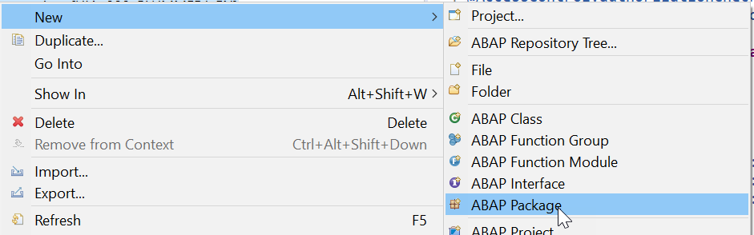

2. Enter the following, then follow the wizard, choosing a **new** transport request:

    - Name: **`Z_BUSINESS_EVENT_###`**
    - Description **Define a Business Event**

      <!-- border -->
      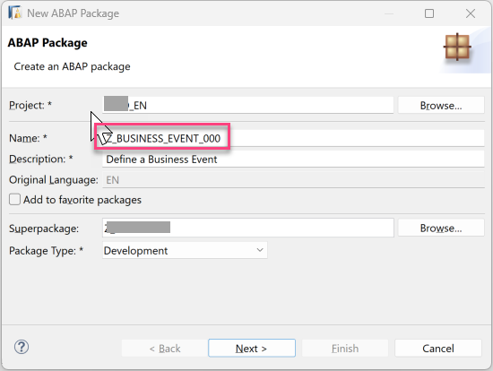
      <!-- border -->
      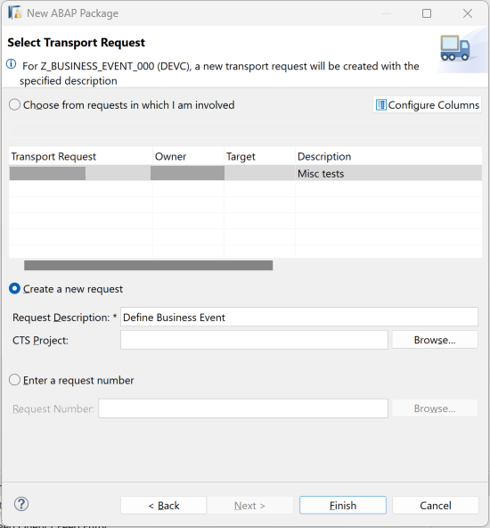

  3. Select your package and choose **New > Other Repository object > Database table** from the context menu. Enter the following.

      - Name: `ZONLINESHOP_###`
      - Description: `Database table for Online Shop`

      <!-- border -->
      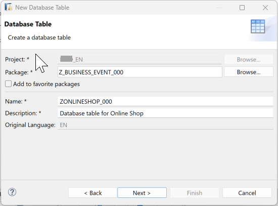


  4. Copy the code below to the Database and replace `###` with your number. 
      
  > You need the Admin field(s) for `local_last_changed` and `last_changed` in the table, in order to use the ABAP Repository Objects Generator later. These fields are used to provide optimistic concurrency control, using ETags. For more information, see: [ETag Definition | SAP Help](https://help.sap.com/docs/ABAP_PLATFORM_NEW/fc4c71aa50014fd1b43721701471913d/74b16803910d4939a83f354259fca4fc.html)

      ```ABAP
    
      define table zonlineshop_### {
      key client     : abap.clnt not null;
      key order_uuid : sysuuid_x16 not null;
      order_id       : abap.char(10) not null;
      ordereditem    : abap.char(10) not null;
      deliverydate   : abap.dats;
      creationdate   : abap.dats;
      local_created_by      : abp_creation_user;
      local_created_at      : abp_creation_tstmpl;
      local_last_changed_by : abp_locinst_lastchange_user;
      local_last_changed_at : abp_locinst_lastchange_tstmpl;
      last_changed_at       : abp_lastchange_tstmpl;

      }

    ```

5. Format, save, and activate your table ( `Shift+F1, Ctrl+S, Ctrl+F3` ).


### Generate RAP BO and UI service from table

You can avoid many manual steps by applying the wizard **Generate ABAP Repository Objects** to your database table.
The end result is a full-blown RAP UI service or Web API.

1. Select your table **'zonlineshop_###'** and choose **Generate ABAP Repository Objects** from the context menu.

    <!-- border -->
    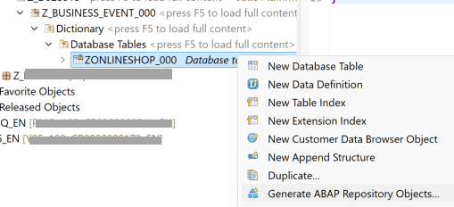

2. Since you later want to create a Fiori app, i.e. a user interface, choose **OData UI Service**.

    <!-- border -->
    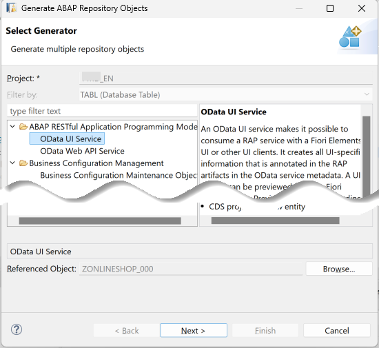

3. Enter a package, e.g. **`Z_BUSINESS_EVENT_###`**.

4. Since the prefix `Z_` and the suffix `_000` will be added automatically, leave these fields blank.

    <!-- border -->
    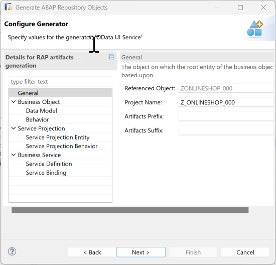

5. The next step in the wizard shows you the objects that will be generated, along with previews for some. At present, you cannot change individual names. Choose **Next**.

    <!-- border -->
    

6. Follow the instructions in the wizard, choose your existing transport request, then choose **Finish**.

The wizard generates the objects; you can display them in the Project Explorer.

<!-- border -->
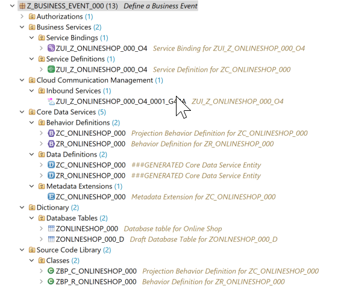


<!-- 
    (Optional): Test generated app

    1. Open the service binding. 

    2. Choose **Publish**.

    3. Select the entity, then choose **Fiori Preview**.

    SHOTS
 -->

### Define business event in behavior definition

You will now enhance the behavior definition of the BO entity, by adding the business event `ItemIsOrdered`. This event will be raised to send a message each time a new item is created in an order.

1. First create a parameter, **`ZA_ItemOrdered_###`** as a data definition (abstract entity). You can then provide more information in the message, such as the name of the item ordered. To do this, select **Core Data Services > Data Definition** in your package, choose **New > Data Definition** from the context menu. Then enter the following.

  - Name: **`ZA_ItemOrdered_###`**
  - Description: **Item Ordered Abstract Entity**

2. Copy the code below in this definition. Save and activate.

    ```CDS
      @EndUserText.label: 'event parameter'
      define abstract entity ZA_ItemOrdered_###
      {
        ItemName : abap.char(25);
        created_at : abp_creation_tstmpl;
      }
    ```

3. Select the behavior definition **`ZR_ONLINESHOP_###`**    

    Business events must be raised in the save sequence at runtime. Therefore, you need to enable the additional save for our managed BO by adding the statement **with additional save**. You will also add the keywords **with full data** to  always have access to all the data of the relevant `OnlineShop` entity instances without having to read them.
    Replace the code in the business definition with the code below; replace `###` with your number or initials.
   

    ```CDS     
      managed with additional save with full data
      implementation in class ZBP_R_ONLINESHOP_### unique;
      strict ( 2 );
      with draft;

      define behavior for ZR_ONLINESHOP_### alias ZrOnlineshop###
      persistent table ZONLINESHOP_###
      draft table ZONLNESHOP_###_D
      etag master LocalLastChangedAt
      lock master total etag LastChangedAt
      authorization master( global )

      {
        field ( readonly )
        Creationdate, orderId, deliverydate,
        LocalCreatedBy,
        LocalCreatedAt,
        LocalLastChangedBy,
        LocalLastChangedAt,
        LastChangedAt;

        field ( numbering : managed, readonly )
        OrderUuid;

        field ( mandatory )
        OrderedItem;

        create;
        update;
        delete;

        draft action Activate optimized;
        draft action Discard;
        draft action Edit;
        draft action Resume;
        draft determine action Prepare;

        mapping for ZONLINESHOP_###
        {
          OrderUuid = order_uuid;
          OrderId = order_id;
          Ordereditem = ordereditem;
          Deliverydate = deliverydate;
          Creationdate = creationdate;
          LocalCreatedBy = local_created_by;
          LocalCreatedAt = local_created_at;
          LocalLastChangedBy = local_last_changed_by;
          LocalLastChangedAt = local_last_changed_at;
          LastChangedAt = last_changed_at;
        }
      }
    ```

4. Now add a new event with a parameter, **`ItemIsOrdered_###`**  to the business object. 
This event will be raised when a new item is ordered and will pass the values in the parameter `ZA_ItemOrdered_###`. 

Add the following code, just after `delete;` and before `draft action Activate optimized:`

  ```
  event ItemIsOrdered parameter ZA_ItemOrdered_###;
  ```


Save and activate your behavior definition **`ZR_ONLINE_SHOP_###`**.


### Raise business event in behavior implementation class

1. In your behavior definition `ZR_ONLINESHOP_###`, set the cursor on the statement **`with additional save with full data`** and start **Quick Fix** by choosing **`Ctrl+1`**.

2. Select Add required method save_modified in new local saver class in the Quick Assist view to update the behavior pool accordingly.

    > The adjusted local saver class of the behavior implementation class ZBP_R_ONLINESHOP### is now opened in Local Types tab of the editor.

    > Please check the name of your behavior pool in the BO behavior definition, as it may be different. Don't forget that all artifacts of your application are generated by the wizard.

3. Now implement the additional save method to raise the entity event.

    ```ABAP

    METHOD save_modified.

   IF create-zronlineshop### IS NOT INITIAL.
   RAISE ENTITY EVENT ZR_ONLINESHOP_###~ItemIsOrdered
   FROM VALUE #( FOR zronlineshop### IN create-zronlineshop### (
                      %key              = zronlineshop###-%key
                      %param-ItemName   = zronlineshop###-Ordereditem ) ).
   ENDIF.
   ENDMETHOD.

    ```

3. Save and activate your class.


### Create local event handler

Now, you will implement the event handler class **`ZEH_ITEM_ORDERED_###`** to enable local consumption of the event **`ItemIsOrdered_###`** raised by the BO entity, `ZR_ONLINE_SHOP_###`.

First, you will create a database table **`ZITEMORDERD_###`** with a UUID-based primary key to store the received event information.

1. In your package `Z_BUSINESS_EVENT_###`, navigate to **Dictionary > Database Tables**, select it, choose **New Database Table** from the context menu then enter the following:
  - Name: **`ZITEMORDERD_###`** (compare the name of your abstract entity `ZA_ItemOrdered_###`)
  - Description: **Event data for new item ordered**

2. Select a transport request and choose **Finish**.

3. Replace the default table definition with the source code provided below and replace all occurrences of the placeholder `###` with your suffix.

    ```ABAP
      @EndUserText.label : 'Event handler - New item ordered'
      @AbapCatalog.enhancement.category : #EXTENSIBLE_ANY
      @AbapCatalog.tableCategory : #TRANSPARENT
      @AbapCatalog.deliveryClass : #A
      @AbapCatalog.dataMaintenance : #RESTRICTED
      define table ZITEMORDERD_### {

        key mandt   : mandt not null;
        key uuid    : sysuuid_x16 not null;
        ItemName    : abap.char(25);
        created_at  : abp_creation_tstmpl;

      }

    ```

4. Save (Ctrl+S) and activate (Ctrl+F3).


Now you will create and implement the event handler class **`ZEH_ITEM_ORDERED_###`** for local consumption of the event **`ItemIsOrdered_###`** raised by the BO entity, `ZR_ONLINE_SHOP_###`.

5. In **Project Explorer** select your package **`Z_BUSINESS_EVENT_###`** select **Source Code Library > Classes** and choose **New ABAP Class** from the context menu. Enter the following, select the transport request, then choose **Finish**.
    - Name: **`ZEH_ITEM_ORDERED_###`**, where `###` is your suffix 
    - Description: Event handler for a new order item

    <!-- border -->
    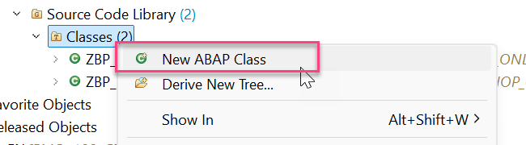

6. Specify the class as event handler class pool for your RAP BO by adding the statement `FOR EVENTS OF <entity_name>` of the class definition section on the Global Class tab, directly after the keyword FINAL 

    ```ABAP

    FOR EVENTS OF ZR_ONLINESHOP_###

    ```

    <!-- border -->
    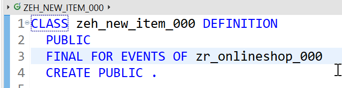

7. Now you will define and implement the **local** event handler class, **`lhe_item`** for the *OnlineShop* BO. Go to the ❗**Local Types** tab. 


    > For more details on the classes `cl_abap_behavior_event_handler` and `cl_abap_tx` used in the implementation, see the ABAP Keyword documentation ( **F1** ).

    ```ABAP
    *"* use this source file for the definition and implementation of
    *"* local helper classes, interface definitions and type
    *"* declarations

    *"* use this source file for the definition and implementation of
    *"* local helper classes, interface definitions and type
    *"* declarations

    CLASS lhe_item DEFINITION INHERITING FROM cl_abap_behavior_event_handler.
      PRIVATE SECTION.
        METHODS get_uuid RETURNING VALUE(uuid) TYPE sysuuid_x16.

        METHODS on_item_is_ordered FOR ENTITY EVENT
            created FOR zronlineshop###~ItemIsOrdered.
    ENDCLASS.


    CLASS lhe_item IMPLEMENTATION.

      METHOD get_uuid.
        TRY.
            uuid = cl_system_uuid=>create_uuid_x16_static( ) .
          CATCH cx_uuid_error.
        ENDTRY.
      ENDMETHOD.

      METHOD on_item_is_ordered.
        "close the active modify phase
        cl_abap_tx=>save( ).

        " assign values in abstract entity ZA_ITEMORDERED_### to table for event handler
        " loop over transfered instances and do the needful ;)
        LOOP AT created REFERENCE INTO DATA(lr_created).
          DATA lr_item_is_ordered TYPE ZITEMORDERD_###.
          MOVE-CORRESPONDING lr_created->* TO lr_item_is_ordered.
          lr_item_is_ordered-uuid        = get_uuid( ).
          lr_item_is_ordered-itemname   = lr_created->ItemName.
          lr_item_is_ordered-created_at  = lr_created->created_at.

          "insert to db
          INSERT ZITEMORDERD_### FROM @lr_item_is_ordered.
        ENDLOOP.
      ENDMETHOD.
   ENDCLASS.
    ```

The local event handler class must inherit from the superclass `cl_abap_behavior_event_handler`.

Our current local event handler contains a RAP event handler method to handle `on_item_is_ordered()` for the event `item_is_ordered`.

In the method signature, the importing parameter, the entity, as well as the event to be consumed are specified.
> Note: An event can only be handled by one method within an event handler class. However, method handling across multiple handler classes is possible.

In this exercise, the method get_uuid() is used for convenience to centrally generate UUIDs for the new database records to be persisted.

About the implementation of the RAP event handler method  `on_item_is_ordered()`: 

Because we are doing an insert on a database, we must first close the active modify phase of the RAP LUW by calling the method 
`cl_abap_tx=>save()` . Loop over the transfered event instances and perform the insert.

Save (Ctrl+S) and activate (Ctrl+F3) the class.


### Test the Enhanced App

1. First, start the Data Preview (F8) of the new database table **`ZITEM_E_###`** to store the received event information. No data should appear because no new item has been ordered and therefore the event **``**ItemIsOrdered**``** has not been raised yet.

2. Now, open the Fiori Elements preview (from the Service Binding) and create a new order item.

    <!-- border -->
    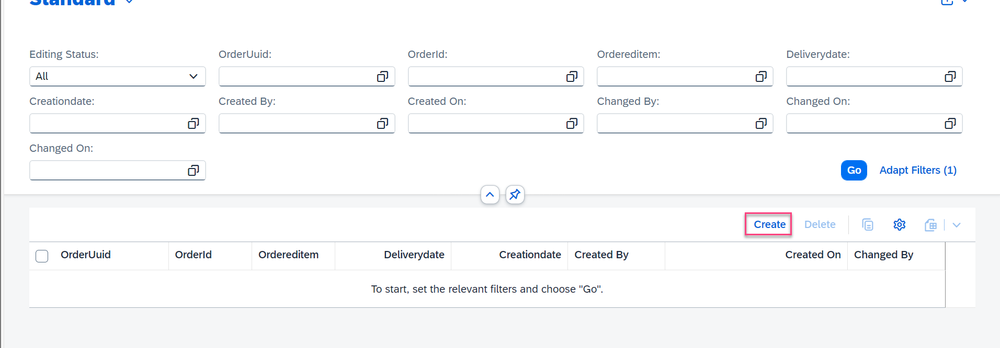

3. Go back to the ABAP Development Tools and refresh the Data Preview of the database table `ZITEM_E_###` or start the Data Preview again (F8). You should now see a new entry for the newly created Agency record in the database table.

    <!-- border -->
    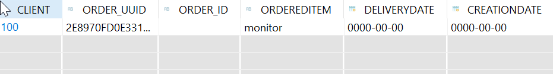


### Test yourself


## More information
[Generating a RAP Business Service with the Generate ABAP Repository Objects Wizard | SAP Help](https://help.sap.com/docs/abap-cloud/abap-rap/generating-rap-business-service-with-generate-abap-repository-objects-wizard)
