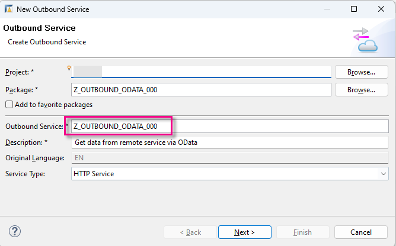
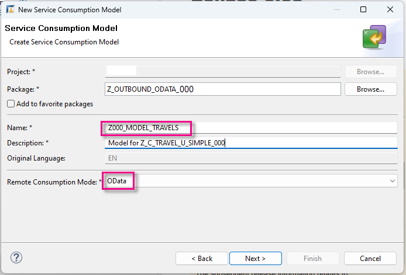
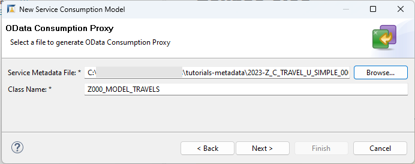
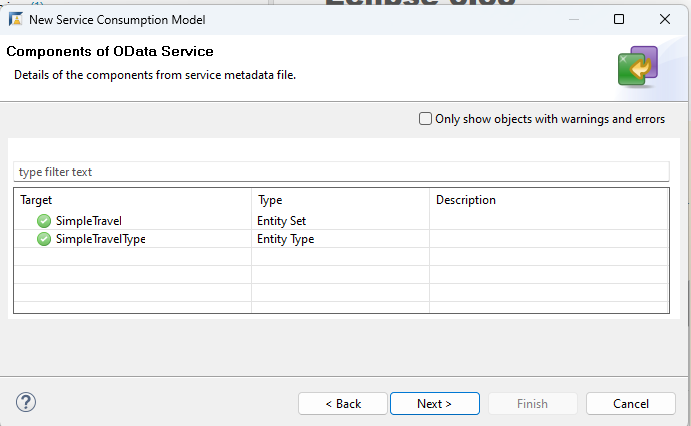
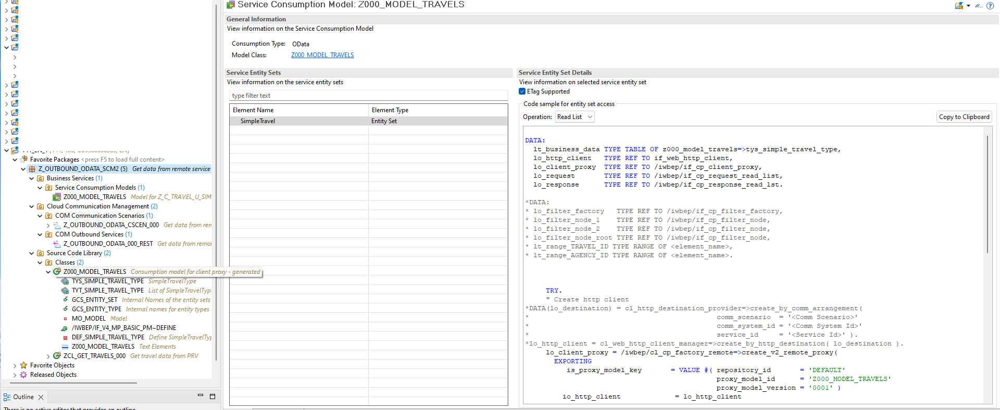

# Prepare Consuming System and Service Consumption Model
<!-- description --> In the consuming system, create the necessary artifacts for remote communication; then create a service consumption model from an XML metadata file; then test your connection to the provisioning system using an ABAP Console app.

## Prerequisites 
  
- **IMPORTANT**: This tutorial cannot be completed on a trial account
- **IMPORTANT**: This tutorial is part two of a mission, [Connect Two Instances of SAP BTP, ABAP Environment](https://developers.sap.com/mission.abap-env-connect-2-environments.html). You cannot complete it standalone; it will not work

## You will learn
- In the **consuming** system: How to create a new destination with an HTTP connection, pointing to the provisioning system
- How to create proxy artifacts representing the remote service, using the `metadata` file you created previously

This tutorial mission was written for SAP BTP ABAP Environment. However, you should also be able to use it in SAP S/4HANA Cloud Environment in the same way.
The tutorial is based on:

- SAP Help Portal: [Preparing Access to the Remote OData Service](https://help.sap.com/viewer/923180ddb98240829d935862025004d6/Cloud/en-US/59a91c95137e4c42946d50b25dba3fd7.html)
- SAP Help Portal: [SAP Help Portal: Creating a Service Consumption Model](https://help.sap.com/viewer/923180ddb98240829d935862025004d6/Cloud/en-US/96132822b3554016b653d3601bb9ff1a.html)

Throughout this tutorial, replace `###` or `000` with your initials or group number.

---

### Create package in consuming system in ADT

1. As in the previous tutorial, create a package in your `ZLOCAL` package, this time in the **consuming** system: `Z_OUTBOUND_ODATA_###`.

2. Create a new transport request.

3. Add it to **Favorite Packages**.

### Create outbound service

1. Select your package and choose **New > Other Repository Object...** from the context menu.

2. Add the filter **outbound**, choose **Outbound Service**, then choose **Next**.  

3. Enter the following, then choose **Next**.
    - Outbound Service: **`Z_OUTBOUND_ODATA_###`**
    - Description: **Get data from remote service via OData**
    - Service Type: **HTTP Service**
        <!-- border -->
        
 
4. Choose the transport request, then choose **Finish**.

Your service appears in a new editor. The system adds the suffix **`_REST`** automatically.

### Create outbound Communication Scenario

1. Select your package and choose **New > Other Repository Object...** from the context menu.

2. Add the filter **`scen`**, choose **Communication Scenario**, then choose **Next**.

3. Enter the following, choose a transport request, then choose **Finish**.
    - Name: **`Z_OUTBOUND_ODATA_CSCEN_###`**
    - Description **Get data from remote service via OData**
            
    Your Communication Scenario appears in a new editor.
        <!-- border -->
        

4. On the **Overview** tab, select **Allowed Instances: One instance per client**.

5. On the **Outbound** tab, add the authorization type **Basic**.

6. Then, in the **Outbound Services** panel, choose **Add...**.

    <!-- border -->
    

6. Browse for your service, **`Z_OUTBOUND_ODATA_###_REST`**, (the suffix REST is added automatically), then choose **Finish**.

    The **Communication Scenario** appears in a new editor.

7. Choose **Save**, then choose **Publish locally**.

    <!-- border -->
    

### Create communication system in Fiori launchpad

1. In Fiori launchpad, open the app **Communication Systems**, then choose **New**.

    <!-- border -->
    
     
    <!-- border -->
       

2. Enter a system ID, then accept the (identical) system name:
    - **`Z###_TO_PRV_CSYS`** *where `PRV` is the name of your provisioning system*

        <!-- border -->
        

 <!--  -->    

3. In **Technical Data**:
    - Switch **Destination Service** to **OFF**.

    - In **Host Name**, enter the base URL of your provisioning system in the form **`<GUID>.abap.<region>.hana.ondemand.com`**. Again, you can find the URL for the dashboard by selecting your system (that is, ABAP Project in Project Explorer), then choosing **Properties > ABAP Development** from the context menu.

        > IMPORTANT:  
         
        Remove the protocol (e.g. `https://`) from the start and `/` from the end of the host name.
         
        Make sure the domain starts with `abap`, not `abap-web`

    - Port = **443**

    <!-- border -->
      

4. In **Users for Outbound Communication**, add a new user by choosing the **+** symbol.

    <!-- border -->
     

5. Choose the authentication method **User Name and Password**. 

6. From the dropdown, choose the user from the provisioning system, **`INBOUND_TRAVELPRO`**; paste the password you generated previously (if necessary); then choose **Create**.

    <!-- border -->
    

7. Choose **Save**.

### Create communication arrangement

1. Similarly, open the app **Communication Arrangements**, then choose **New**.

2. From the dropdown, choose your **Communication Scenario**, **`Z_OUTBOUND_CSCEN_###`**; accept the generated (identical) **Arrangement Name**, then choose **Create**.

3. From the dropdown, select your **Communication System**. 

4. The system fills in the **User Name** and **Outbound Service** automatically. Choose **Save**.

    <!-- border -->
    

5. In the **Outbound Services** panel, check the connection.

    <!-- border -->
    

You should get a result like this.

<!-- border -->

### Create Service Consumption Model in ADT

You will now create the Service Consumption Model in ADT, using the `EDMX` file - i.e. the **`$metadata.xml`** file that you stored locally.

1. Select your package and choose **New > Other ABAP Repository Object** from the context menu.

2. Enter the filter text **service** and choose **Service Consumption Model**.

3. Enter the following and choose **Next**.
        
    - Name: **`Z###_MODEL_TRAVELS`**
    - Description **`Model for Z_C_TRAVEL_U_SIMPLE_###`**
    - Remote Consumption Mode: **`OData`**

    <!-- border -->
      

4. Using **Browse...**, navigate to your `$metadata` file, choose **Open**, enter a **Class Name**, then choose **Next**. 

    <!-- border -->
    

5. The **Entity Set** and **Entity Type** appear; choose **Next**.

    <!-- border -->
    

5 Choose **`ETag` Support**, then choose **Next**.

1. Choose the above transport request and choose **Finish**.

The Service Consumption Model appears in a new editor, showing the model class, entity set name, and sample code for 5 basic operations. 

<!-- border -->

You will later create an ABAP class based on the operation **Read List**. The class will display the retrieved data to an ABAP Console application, then to a Fiori Elements preview.

### Test yourself
<!-- Ask Bernhard -->

### More Information

- SAP Help Portal: [Service Consumption via Communication Arrangements](https://help.sap.com/docs/btp/sap-business-technology-platform/service-consumption-via-communication-arrangements)

- SAP Community blog post: [Service Consumption Model 2 for OData Client Proxy](https://blogs.sap.com/2023/11/06/service-consumption-model-2-for-odata-client-proxy/)

---
