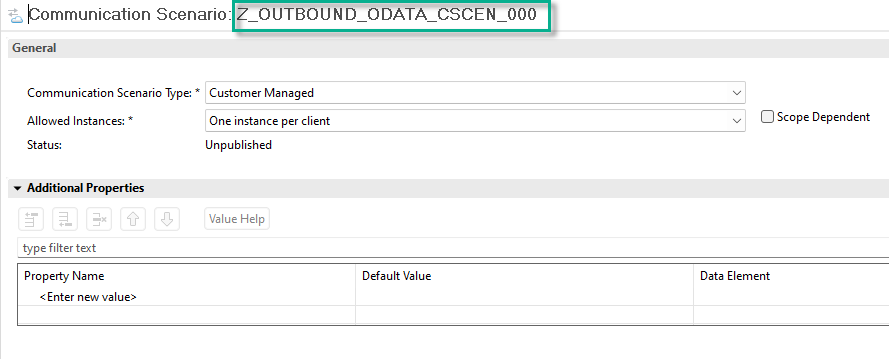
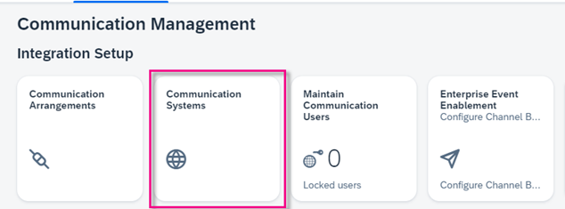
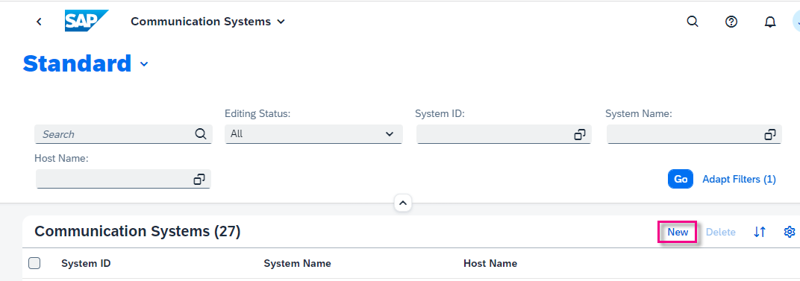
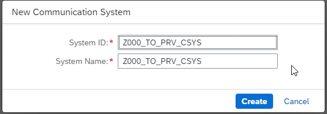
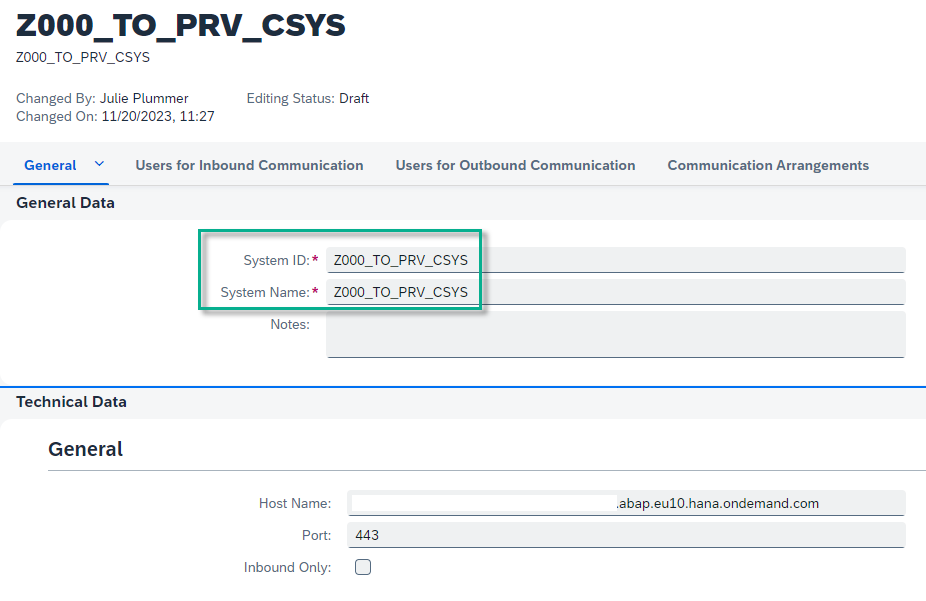
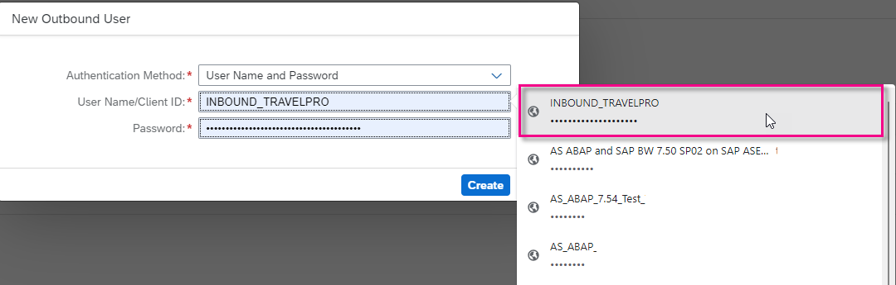
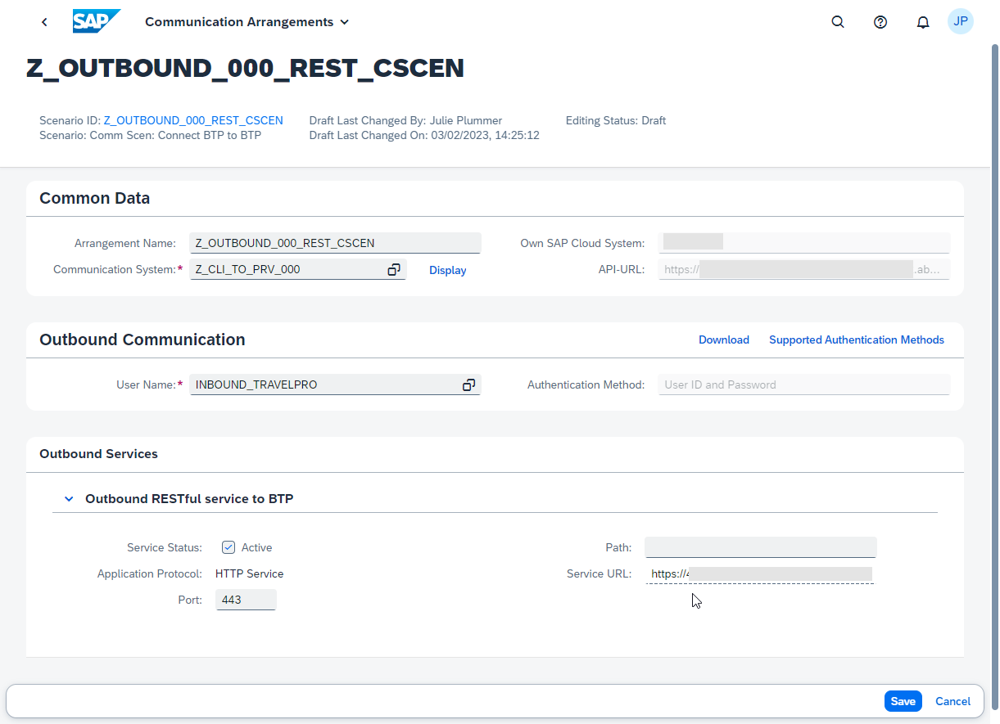
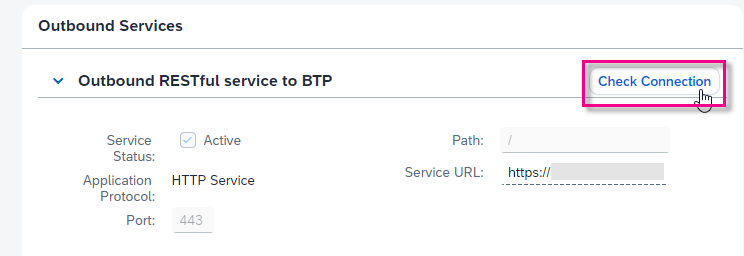
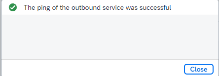
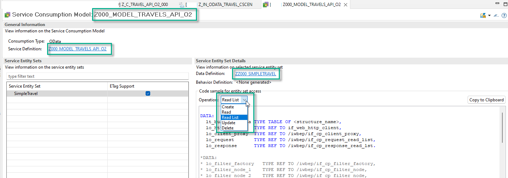

# Prepare Consuming System and Service Consumption Model
<!-- description --> In the consuming system, create the necessary artifacts for remote communication; then create a service consumption model from an XML metadata file; then test your connection to the provisioning system using an ABAP Console app.


## Prerequisites
  
- **IMPORTANT**: This tutorial cannot be completed on a trial account
- **IMPORTANT**: This tutorial is part two of a mission, [Connect Two Instances of SAP BTP, ABAP Environment](https://developers.sap.com/mission.abap-env-connect-2-environments.html). You cannot complete it standalone; it will not work


## You will learn
- In the **consuming** system: How to create a new destination with an HTTP connection, pointing to the provisioning system
- How to create proxy artifacts representing the remote service, using the `metadata` file you created previously

This tutorial mission was written for SAP BTP ABAP Environment. However, you should also be able to use it in SAP S/4HANA Cloud Environment in the same way.
The tutorial is based on:

- SAP Help Portal: [Preparing Access to the Remote OData Service](https://help.sap.com/viewer/923180ddb98240829d935862025004d6/Cloud/en-US/59a91c95137e4c42946d50b25dba3fd7.html)
- SAP Help Portal: [SAP Help Portal: Creating a Service Consumption Model](https://help.sap.com/viewer/923180ddb98240829d935862025004d6/Cloud/en-US/96132822b3554016b653d3601bb9ff1a.html)

---


### Create package in consuming system in ADT

1. As in the previous tutorial, create a package in your `ZLOCAL` package, this time in the **consuming** system: `Z_BTP_2_BTP_000`.

2. Create a new transport request.

3. Add it to **Favorite Packages**.


### Create outbound service

1. Select your package and choose **New > Other Repository Object...** from the context menu.

2. Add the filter **outbound**, choose **Outbound Service**, then choose **Next**.
    
    <!-- border -->
    [step1a-new-outbound-service](step1a-new-outbound-service.png)

3. Enter the following, then choose **Next**.
    - Outbound Service: **`Z_OUTBOUND_BTP_000`**
    - Description: **Outbound RESTful service to BTP**
    - Service Type: **HTTP Service**

    <!-- border -->
    [step1b-outbound-service-details](step1b-outbound-service-details.png)

4. Choose the transport request, then choose **Finish**.

Your service appears in a new editor. The system adds the suffix **`_REST`** automatically.


### Create outbound Communication Scenario

1. Select your package and choose **New > Other Repository Object...** from the context menu.

2. Add the filter **`scen`**, choose **Communication Scenario**, then choose **Next**.

3. Enter the following, choose a transport request, then choose **Finish**.
    - Name: **`Z_OUTBOUND_000_REST_CSCEN`**
    - Description **Comm Scen: Connect BTP to BTP**
    </br>       
    Your Communication Scenario appears in a new editor.
        <!-- border -->
        

4. On the **Outbound** tab, add the authorization type **Basic**.

5. Then, in the **Outbound Services** panel, choose **Add...**.

    <!-- border -->
    


6. Browse for your service, **`Z_OUTBOUND_BTP_000_REST`**, (the suffix REST is added automatically), then choose **Finish**.

    The **Communication Scenario** appears in a new editor.

7. Choose **Save**, then choose **Publish locally**.

    <!-- border -->
    


### Create communication system in Fiori launchpad

1. In Fiori launchpad, open the app **Communication Systems**, then choose **New**.

    <!-- border -->
    
    </br>
    <!-- border -->
       

2. Enter a system ID, then accept the (identical) system name:
    - **`Z000_TO_PRV_CSYS`**

        <!-- border -->
        
    

3. In **Technical Data**:
    - Switch **Destination Service** to **OFF**.

    - In **Host Name**, enter the base URL of your provisioning system in the form **`<GUID>.abap.<region>.hana.ondemand.com`**. Again, you can find the URL for the dashboard by selecting your system (that is, ABAP Project in Project Explorer), then choosing **Properties > ABAP Development** from the context menu.

        > IMPORTANT:  
        </br>
        Remove the protocol (e.g. `https://`) from the start and `/` from the end of the host name.
        </br>
        Make sure the domain starts with `abap`, not `abap-web`

    - Port = **443**

    <!-- border -->
      

4. In **Users for Outbound Communication**, add a new user by choosing the **+** symbol.

    <!-- border -->
     


5. Choose the authentication method **User Name and Password**. 

6. From the dropdown, choose the user from the provisioning system, **`INBOUND_TRAVELPRO`**; paste the password you generated previously (if necessary); then choose **Create**.

    <!-- border -->
    

7. Choose **Save**.


### Create communication arrangement

1. Similarly, open the app **Communication Arrangements**, then choose **New**.

2. From the dropdown, choose your **Communication Scenario**, **`Z_OUTBOUND_000_REST_CSCEN`**; accept the generated (identical) **Arrangement Name**, then choose **Create**.

3. From the dropdown, select your **Communication System**. 

4. The system fills in the **User Name** and **Outbound Service** automatically. Choose **Save**.

    <!-- border -->
    

5. In the **Outbound Services** panel, check the connection.

    <!-- border -->
    

You should get a result like this.

<!-- border -->



### Create Service Consumption Model in ADT

You will now create the necessary ABAP proxy artifacts in the consuming system in ADT, using the `EDMX` file - i.e. the **`$metadata.xml`** file that you stored locally.

1. Select your package and choose **New > Other ABAP Repository Object** from the context menu.

2. Enter the filter text **service** and choose **Service Consumption Model**.

3. Enter the following and choose **Next**.
        
    - Name: **`Z000_MODEL_TRAVELS`**
    - Description **`Model for Z_C_TRAVEL_U_SIMPLE_000`**
    - Remote Consumption Mode: **`OData`**

4. Using **Browse...**, navigate to your `$metadata` file, choose **Open**, add your namespace prefix, here **`Z000_`** then choose **Next**. 

> Your artifact names will be more readable if your prefix includes an underscore **`_`**.

5. Make sure **`ETag` Support** is selected, then choose **Next**.

6. The same list of ABAP artifacts appears. Choose **Next**.

7. Choose the above transport request and choose **Finish**.

Again, the Service Consumption Model appears in a new editor with links to:
- Service Definition = **`Z000_MODEL_TRAVELS`**
- Data Definition, i.e. Abstract Entity = **`ZZ000_SIMPLETRAVEL`**.

It also provides sample code for 5 basic operations. You will later create an ABAP class based on the operation **Read List**.

<!-- border -->



### IMPORTANT: Edit code for abstract entity

Open your abstract entity. In the two currency fields, change the length property from **3** to **2** as follows:

    ```CDS
     BookingFee : abap.curr( 16, 2 ) ;
     ...
     TotalPrice : abap.curr( 16, 2 ) ; 
    
    ```

The code should look like this.


```CDS

/********** GENERATED on 06/21/2023 at 07:39:23 by **************/
 @OData.entitySet.name: 'SimpleTravel' 
 @OData.entityType.name: 'SimpleTravelType' 
 define root abstract entity ZZ000_SIMPLETRAVEL { 
 key TravelID : abap.numc( 8 ) ; 
 @Odata.property.valueControl: 'AgencyID_vc' 
 AgencyID : abap.numc( 6 ) ; 
 AgencyID_vc : RAP_CP_ODATA_VALUE_CONTROL ; 
 @Odata.property.valueControl: 'CustomerID_vc' 
 CustomerID : abap.numc( 6 ) ; 
 CustomerID_vc : RAP_CP_ODATA_VALUE_CONTROL ; 
 @Odata.property.valueControl: 'BeginDate_vc' 
 BeginDate : RAP_CP_ODATA_V2_EDM_DATETIME ; 
 BeginDate_vc : RAP_CP_ODATA_VALUE_CONTROL ; 
 @Odata.property.valueControl: 'EndDate_vc' 
 EndDate : RAP_CP_ODATA_V2_EDM_DATETIME ; 
 EndDate_vc : RAP_CP_ODATA_VALUE_CONTROL ; 
 @Odata.property.valueControl: 'BookingFee_vc' 
 @Semantics.amount.currencyCode: 'CurrencyCode' 
 BookingFee : abap.curr( 16, 2 ) ; 
 BookingFee_vc : RAP_CP_ODATA_VALUE_CONTROL ; 
 @Odata.property.valueControl: 'TotalPrice_vc' 
 @Semantics.amount.currencyCode: 'CurrencyCode' 
 TotalPrice : abap.curr( 16, 2 ) ; 
 TotalPrice_vc : RAP_CP_ODATA_VALUE_CONTROL ; 
 @Odata.property.valueControl: 'CurrencyCode_vc' 
 @Semantics.currencyCode: true 
 CurrencyCode : abap.cuky ; 
 CurrencyCode_vc : RAP_CP_ODATA_VALUE_CONTROL ; 
 @Odata.property.valueControl: 'Memo_vc' 
 Memo : abap.char( 1024 ) ; 
 Memo_vc : RAP_CP_ODATA_VALUE_CONTROL ; 
 @Odata.property.valueControl: 'Status_vc' 
 Status : abap.char( 1 ) ; 
 Status_vc : RAP_CP_ODATA_VALUE_CONTROL ; 
 @Odata.property.valueControl: 'LastChangedAt_vc' 
 LastChangedAt : tzntstmpl ; 
 LastChangedAt_vc : RAP_CP_ODATA_VALUE_CONTROL ; 
 ETAG__ETAG : abap.string( 0 ) ; 
 
 } 
```


### Create CDS custom entity

Since you are implementing the query manually, you need to use a custom entity as your data model.

1. Select your package and choose **New > Other > Core Data Services > Data Definition** from the context menu.

2. Enter the following, then choose **Next**. **DO NOT** enter a referenced object.

    - Name: **`ZCE_TRAVEL_DATA_000`**
    - Description: **Travel data custom entity cons. sys**

3. Accept the transport request and choose **Next** - not **Finish**.

4. Choose the template **Define custom entity with Parameters**, then choose **Finish**.

    The CDS custom entity appears in a new editor.

5. Comment out the parameters statement and paste in the code below, between the curly brackets. Afterwards, your custom entity should now look as follows. 
    > Make sure that the **``abap.curr``** fields are specified as **`(16, 2)`**, NOT `(16, 3)`.

    > Also, make sure that the types of the fields match those in the abstract entity, omitting the **`_vc`** fields.

    > Custom entities do not come with a select on the data source. Therefore, you will later implement the data retrieval logic in a new ABAP class, referenced in an entity annotation.


        ```CDS    
        key TravelID         : abap.numc( 8 );

            AgencyID         : abap.numc( 6 );
            CustomerID       : abap.numc( 6 );
            BeginDate        : rap_cp_odata_v2_edm_datetime;
            EndDate          : rap_cp_odata_v2_edm_datetime;

            @Semantics.amount.currencyCode: 'CurrencyCode'
            BookingFee       : abap.curr( 16, 2 );
            @Semantics.amount.currencyCode: 'CurrencyCode'
            TotalPrice       : abap.curr( 16, 2 );
            @Semantics.currencyCode: true
            CurrencyCode     : abap.cuky;

            Memo             : abap.char( 1024 );
            Status           : abap.char( 1 );
            LastChangedAt    : tzntstmpl;
            ETAG__ETAG       : abap.string( 0 );
        
    ```

### Refine UI

UI annotations enable your app to represent a semantic view of data by using defined patterns, which are independent of any specific UI technology - such as position or selection field.

1. Make the first five column headers appear automatically when the app appears (without your having to select them in settings), by adding the following annotations. For convenience, replace the first five fields with the following code:

    ```CDS
      @UI           : {
      lineItem      : [{position: 10, importance: #HIGH}],
      identification: [{position: 10}],
      selectionField: [{position: 10}]
      }
      key TravelID         : abap.numc( 8 );

          @UI           : {
          lineItem      : [{position: 20, importance: #HIGH}],
          identification: [{position: 20}],
          selectionField: [{position: 20}]
          }        
          AgencyID         : abap.numc( 6 );

          @UI           : {
          lineItem      : [{position: 30, importance: #HIGH}],
          identification: [{position: 30}],
          selectionField: [{position: 30}]
          }              
          CustomerID       : abap.numc( 6 );
          
          @UI           : {
          lineItem      : [{position: 40, importance: #HIGH}],
          identification: [{position: 40}],
          selectionField: [{position: 40}]
          }            
          BeginDate        : rap_cp_odata_v2_edm_datetime;
          
          @UI           : {
          lineItem      : [{position: 50, importance: #HIGH}],
          identification: [{position: 50}],
          selectionField: [{position: 50}]
          }   
          EndDate          : rap_cp_odata_v2_edm_datetime;

    ```

2. The two headings **`RESTful` ABAP Programming: Data Type...** are ugly. Change them to **Begin Date** and **End Date** by adding labels, as follows:

    ```CDS
    @UI.lineItem: [ { position: 40, label: 'Start Date'} ]
    BeginDate              : rap_cp_odata_v2_edm_datetime;

    @UI.lineItem: [ { position: 50, label: 'End Date'} ]      
    EndDate                : rap_cp_odata_v2_edm_datetime;

    ```


### Test yourself


### More Information

SAP Help Portal: [UI Annotations](https://help.sap.com/docs/ABAP_PLATFORM_NEW/cc0c305d2fab47bd808adcad3ca7ee9d/f8af07bb0770414bb38a25cae29a12e9.html)
---
