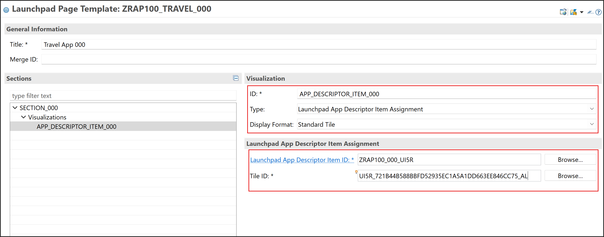
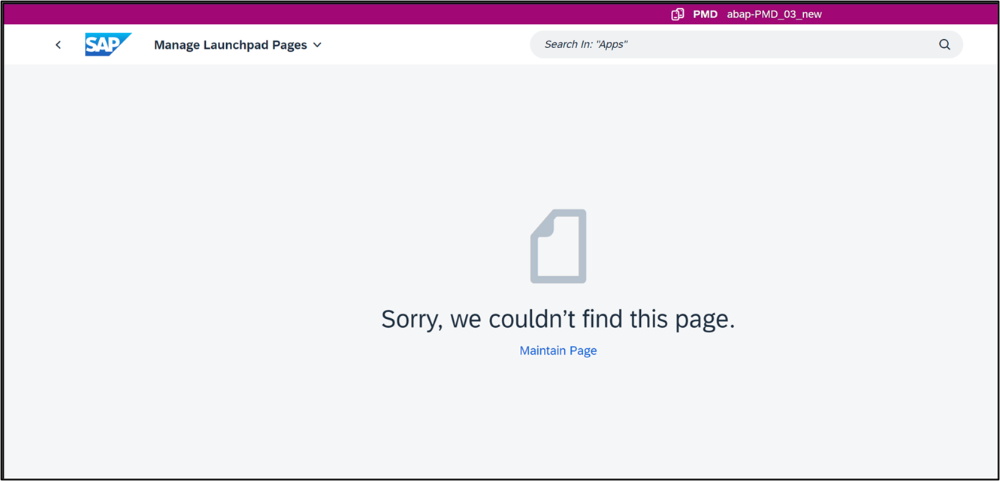

# Create SAP Fiori Launchpad Space and Page Templates
<!-- description --> Deliver predefined SAP Fiori Launchpad spaces and pages for your app by developing templates.

## You will learn 
- How to create a space template
- How to create a page template
- How to scope page and space template 
- How to authorize business users for space app
- How to use predefined spaces and pages


## Prerequisites
- You need an SAP BTP, ABAP environment license.
- You have followed the group [Build an SAP Fiori elements App Using the ABAP RESTful Application Programming Model (RAP) – Beginner [RAP100]](group.abap-build-fiori-element-rap) in a licensed system.
- You have followed the group [Create, Deploy and Integrate an SAP Fiori elements App into SAP Fiori Launchpad for SAP BTP, ABAP Environment [RAP100]](group.abap-create-fiori-element-btp) in a licensed system.
  - To manage the predefined launchpad pages and spaces in Fiori Launchpad and maintain business roles, you need to have a role with business catalogs **User Interface - Fiori Launchpad Design** (ID: `SAP_CORE_BC_UI_FLD`) and **Identity and Access Management - Role Management** (ID: `SAP_CORE_BC_IAM_RM`)
  

---

Replace ### with your own ID.

### Create launchpad page template

 1. Open your package **`ZRAP100_###`** in ADT, right-click **Fiori User Interface** and select **New** > **Launchpad Page Template**.

     

 2. Create a new launchpad page template:    
    - Name: `ZRAP100_TRAVEL_###` 
    - Description: Page for travel ###
    - Title in Launchpad: Travel App ###
                 
     
      
     Click **Next >**.

 3. Select your transport request and click **Finish**.

     

 4. In your launchpad page template right-click the list area in sections and select **Add Child** > **Section**.

     

 5. Create a new section:
     - ID: `SECTION_###`
     - Title: Section ###

 6. Right-click **`SECTION_###`** and select **Add Child** > **Visualizations**.

     

 7. Right-click **Visualizations** and select **Add Child** > **Visualization**.

     

 8. Create a new visualization and add the launchpad app descriptor item assignment: 
     - ID: `APP_DESCRIPTOR_ITEM_###`
     - Type: Launchpad App Descriptor Item Assignment
     - Display Format: Standard Tile
     - Launchpad App Descriptor Item ID:`ZRAP100_###_UI5R` 
     - Title ID: <your_title_id>

     

     You can press `CTRL` + Space to load the existing data, to fill in your field entries.

 9. Activate your launchpad page template.

### Check Template availability in manage launchpad pages app

  1. Click the symbol to open the launchpad page template.

      

  2. The launchpad page template will not be loaded. The page template needs to be scoped still in order to be able to use it.
  
      


### Scope page and space templates

For more information see documentation [SAP BTP, ABAP environment > Development in the ABAP Environment > UI Development > SAP Fiori Applications in the ABAP Environment > Scoping Space and Page Templates](https://help.sap.com/docs/sap-btp-abap-environment/abap-environment/scoping-space-and-page-templates).

  1. Right-click **Classes** and select **New ABAP Class**.

      

  2. Create a new class:
    - ID: `ZCL_SCOPE_PAGE_SPACE_###`
    - Title: Class for calling the scoping API
  
      

      Click **Next >**.

  3. **Finish** the ABAP class creation wizard after transport request selection.

      

  4. The snippet scopes the page template. Scoping a space template is still commented out. Therefore copy and paste the code snippet in your class. Change ### with your own ID.
    
    ```ABAP
    CLASS zcl_scope_page_space_### DEFINITION
    PUBLIC
    FINAL
    CREATE PUBLIC .

    PUBLIC SECTION.
        INTERFACES if_oo_adt_classrun.
    PROTECTED SECTION.
    PRIVATE SECTION.
    ENDCLASS.


    CLASS zcl_scope_page_space_### IMPLEMENTATION.
    METHOD if_oo_adt_classrun~main.


        DATA(lo_scope_api) = cl_aps_bc_scope_change_api=>create_instance( ).

        lo_scope_api->scope(
        EXPORTING it_object_scope = VALUE #(
        pgmid = if_aps_bc_scope_change_api=>gc_tadir_pgmid-R3TR
        scope_state = if_aps_bc_scope_change_api=>gc_scope_state-ON

    * Space template
    *   ( object = if_aps_bc_scope_change_api=>gc_tadir_object-UIST obj_name = 'ZRAP100_TRAVEL_###' )

    * Page template
        ( object = if_aps_bc_scope_change_api=>gc_tadir_object-UIPG obj_name = 'ZRAP100_TRAVEL_###' )
        )

                iv_simulate = abap_false
                iv_force = abap_false
        IMPORTING et_object_result = DATA(lt_results)
                et_message = DATA(lt_messages) ).
    ENDMETHOD.

    ENDCLASS.   
    ```

  5. Save and activate.
   
  6. Right-click `ZCL_SCOPE_PAGE_SPAGE_###` and select **Run As** > **ABAP Application (Console)** or press F9 to run your application.

      
 

### Open launchpad page template

  1. Click the symbol to open the launchpad page template in manage launchpad pages app. The link can be found in the upper right corner of the editor.

      

  2. Now the launchpad page template will be loaded with the page and section content. 
  
      

  3. Navigate to the **Home** screen, select **Administration** > **Launchpad**.

      

  4. Open the **Manage Launchpad Pages** app.

      

  5. Select **Predefined** and search for `ZRAP100_Travel_###`. Now you can see your launchpad page template under the predefined tab.
   
      


### Create launchpad space template

  1. Open your package **`ZRAP100_###`** and right-click **Fiori User Interface** and select **New** > **Launchpad Space Template**.

      

  2. Create a new launchpad space template:  
     - Name: `ZRAP100_TRAVEL_###`
     - Description: Space for travel ###
     - Title in Launchpad: Travel App ###

     

     Click **Next >**.

  3. Select your transport request and click **Finish**.

      

  4. Add general information:
     - Sort Priority: 100 

     

     A higher sort priority number will let the space appear more on the right side of the tab overview on the home screen in SAP Fiori launchpad.

     Click **Add** and select `ZRAP100_TRAVEL_###` as launchpad page template.

  5. Activate your changes.


### Check template availability in manage launchpad spaces app

  1. In your SAP Fiori launchpad, navigate to the **Home** screen > **Administration** > **Launchpad**.

      

  2. Open the **Manage Launchpad Spaces** app.
  
      

  3. Select **Predefined** and search for `ZRAP100_Travel_###`. 

      

     You will not be able to find an entry. The page template needs to be scoped still in order to be able to use it.

### Scope space template

  1. Open your ABAP class `ZCL_SCOPE_PAGE_SPACE_###` and uncomment the following line:

    ```ABAP
    ( object = if_aps_bc_scope_change_api=>gc_tadir_object-UIST obj_name = 'ZRAP100_TRAVEL_000' )
    ```

  2. Save and activate.
   
  3. Right-click `ZCL_SCOPE_PAGE_SPAGE_###` and select **Run As** > **ABAP Application (Console)** or press F9 to run your application.

      
  
### Check launchpad space 


  1. Refresh your **Manage Launchpad Spaces** page and search for `ZRAP100_Travel_###` under **Predefined**.

     

     Now you are able to see the launchpad space.


### Authorize business user for space

  1. Navigate to the **Home** screen, select **Administration** > **Identity and Access Management**.

      

  2. Open the **Maintain Business Roles** app.
   
      
    
  3. Search for your business role `BR_Z_Travel_###` and open it.
   
      

  4. Navigate to **Launchpad Spaces** tab and click **Edit**.
   
      

  5. Click **Add**.

      

  6. Add your predefined space **`ZRAP100_Travel_###`** to your business role and click **Assign Space**.

      

  7. Click **Save**.

      

### Open predefined space in SAP Fiori launchpad
 
  1. Go to your **Home** screen and select **`Travel ###`**.
   
      

     You can see the page with its section and app now.

### Test yourself


### More Information
Here you can find more information about [Working with Launchpad Page Templates (UIPG)](https://help.sap.com/docs/abap-cloud/abap-development-tools-user-guide/working-with-page-templates-uipg), [Working with Launchpad Space Templates (UIST)](https://help.sap.com/docs/abap-cloud/abap-development-tools-user-guide/working-with-space-templates-uist) and [Scoping Space and Page Templates](https://help.sap.com/docs/sap-btp-abap-environment/abap-environment/scoping-space-and-page-templates).


