# Create a Simple Database Table for ABAP Environment
<!-- description --> Create a database table in SAP BTP, ABAP Environment and pre-fill it with data.

## Prerequisites  
- You need an SAP BTP, ABAP environment [trial user](abap-environment-trial-onboarding) or license.

## You will learn
- How to create a database table
- How to `prefill` your database table with data

## Intro
In this tutorial, wherever `###` appears, use a number (e.g. `000`).

---

### Create package

In this tutorial 000 is used as a group ID instead of ###.

  1. Open Eclipse, right-click on `ZLOCAL` and select **New** > **ABAP Package**.

      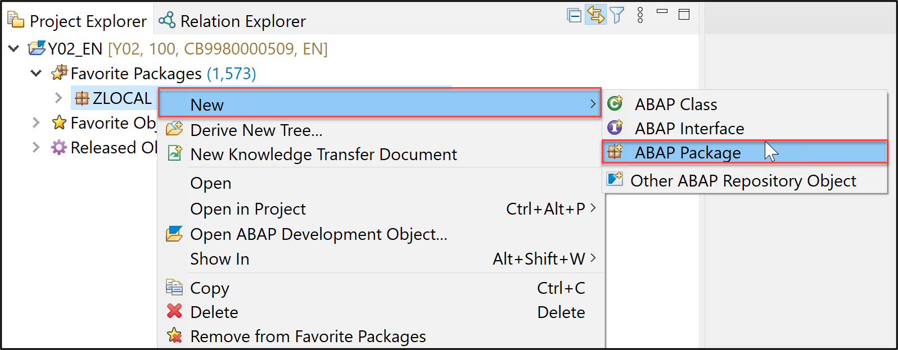

  2. Maintain following information in the appearing dialog and  click **Next >**.

      - Name: **`Z_Booking_###`**
      - Description: **Package Booking ###**
      - `Superpackage:` `ZLOCAL`
      - Add to favorite packages: checked
      - Package Type: development

      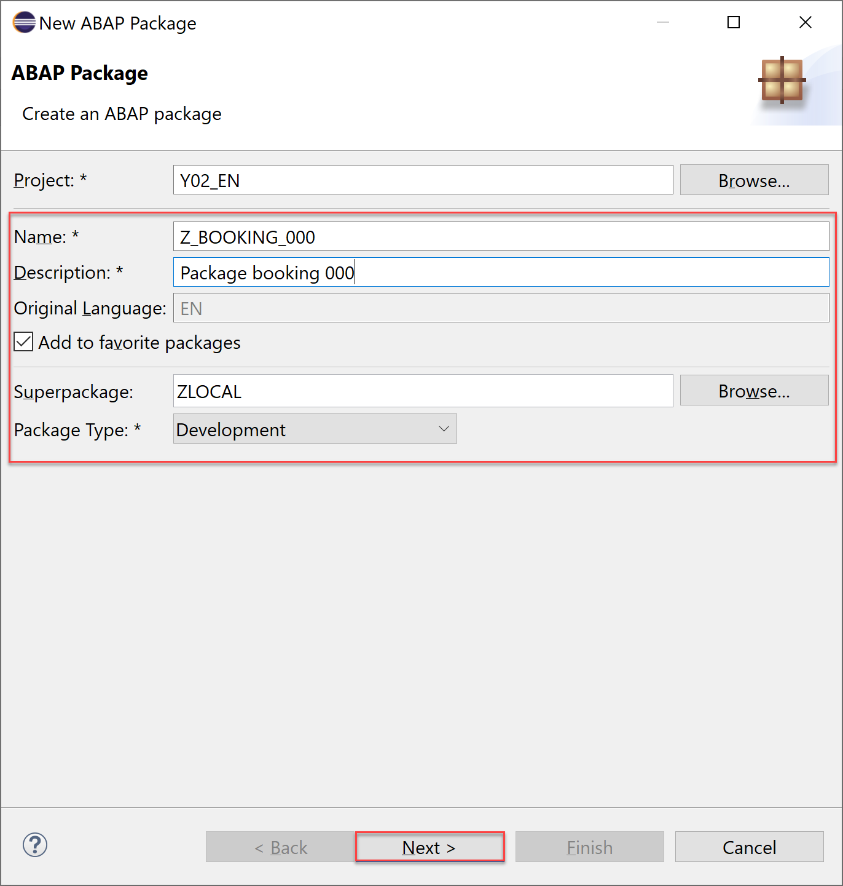 

  3. Click **Next >**.

      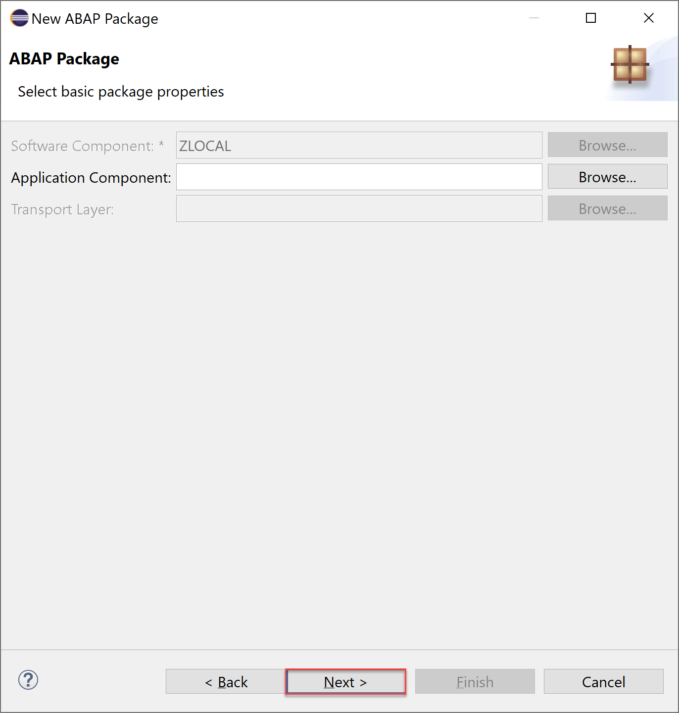

  4. Create a new request and click **Finish**.

      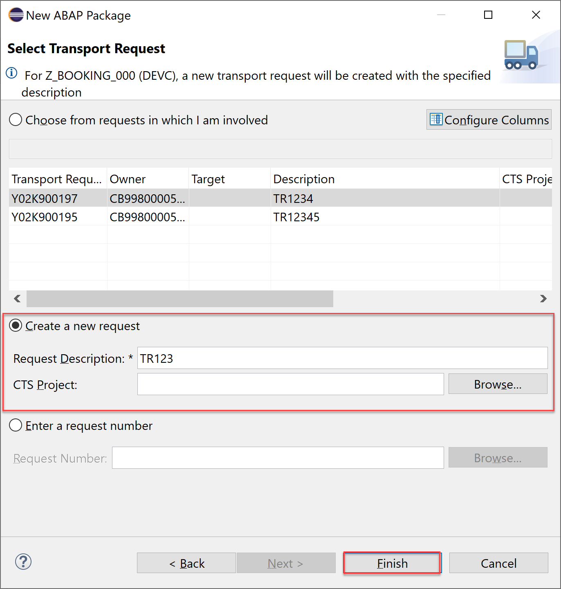


### Create database table

  1. Right-click on your package and navigate to **New** > **Other ABAP Repository Object** from the appearing context menu.

      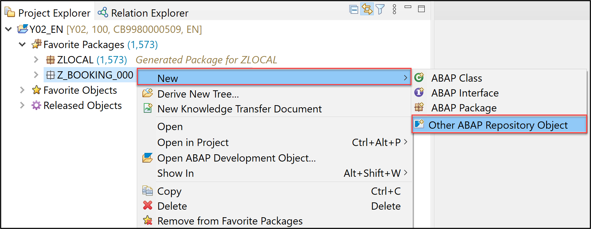

  2. Search for **database table**, select the appropriate entry and click **Next >**.

      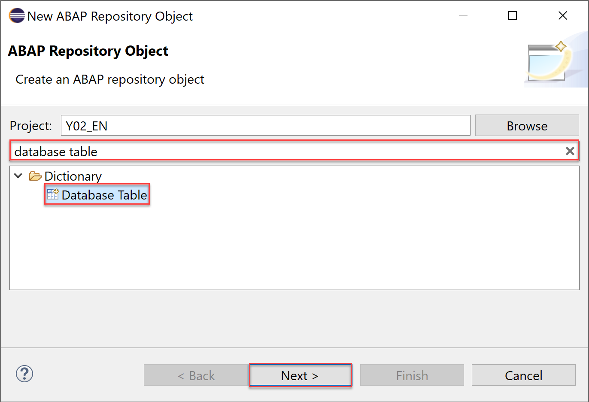

  3. Maintain the required information and click **Next >**.

      - Name: **`ZABOOKING_###`**
      - Description: **Database table for booking ###**

      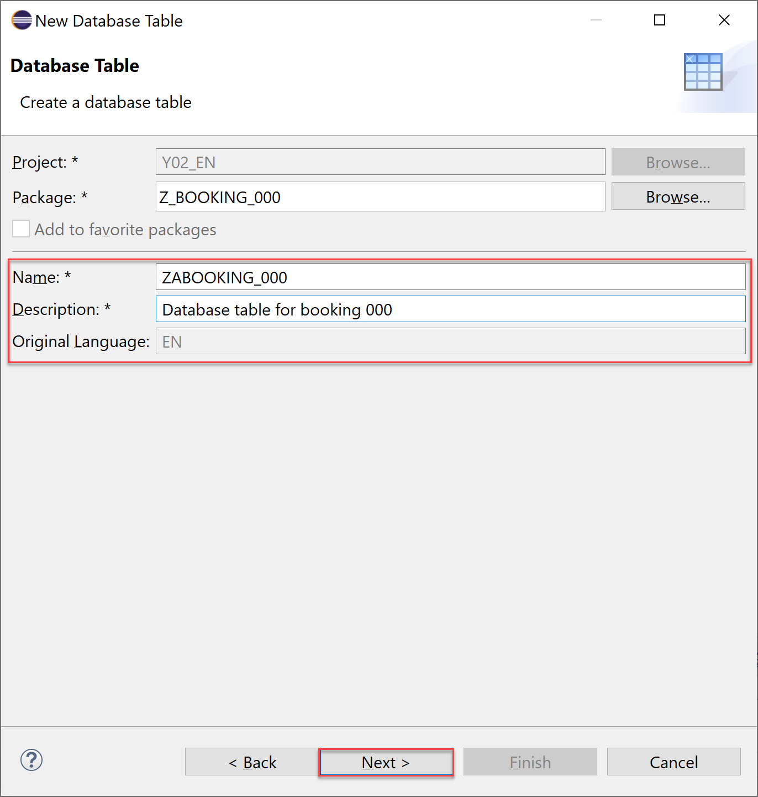

  5. Click **Finish**.

      

  6. Check result. An empty table is now created.

      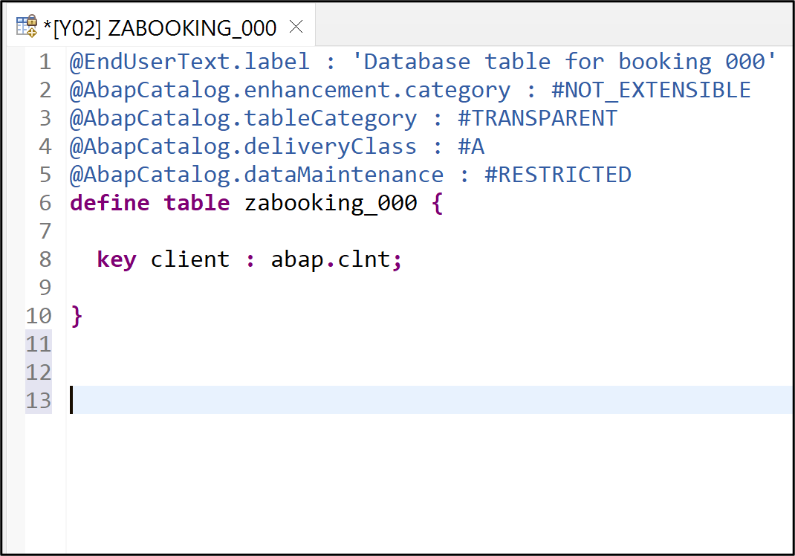


  6. Define the table columns (client, booking, `customername`, `numberofpassengers`, …). Specify client and booking as key fields, and the field `currencycode` as currency key for cost as displayed below. The table annotations (beginning with @) remain unchanged. For that, you can copy the database table definition provided below.

    ```ABAP
    @EndUserText.label : 'Database table for booking ###'
    @AbapCatalog.enhancement.category : #NOT_EXTENSIBLE
    @AbapCatalog.tableCategory : #TRANSPARENT
    @AbapCatalog.deliveryClass : #A
    @AbapCatalog.dataMaintenance : #RESTRICTED
    define table zabooking_### {

      key client         : abap.clnt not null;
      key booking        : abap.int4 not null;
      customername       : abap.char(50);
      numberofpassengers : abap.int2;
      emailaddress       : abap.char(50);
      country            : abap.char(50);
      dateofbooking      : timestampl;
      dateoftravel       : timestampl;
      @Semantics.amount.currencyCode : 'zabooking_###.currencycode'
      cost               : abap.curr(15,2);
      currencycode       : abap.cuky;
      lastchangedat      : timestampl;

    }
    ```

  7. Save and activate the database table.

      


### Create ABAP class

  1. Create a class in order to `prefill` our created database table. Right-click on your package and navigate to **New** > **ABAP Class** in the appearing context menu.

      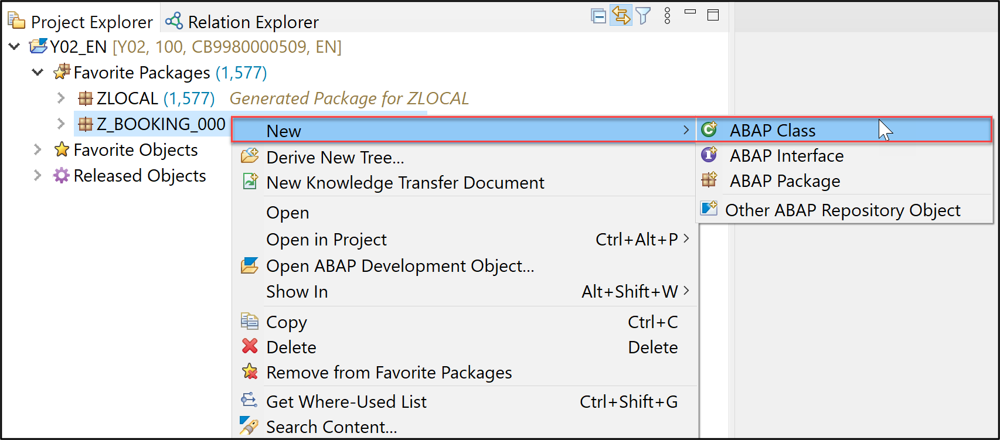

  2. Provide the required information and click **Next >**.

      - Name: **`ZBP_GENERATE_BOOKINGSTP_###`**
      - Description: **Class to generate bookings**

      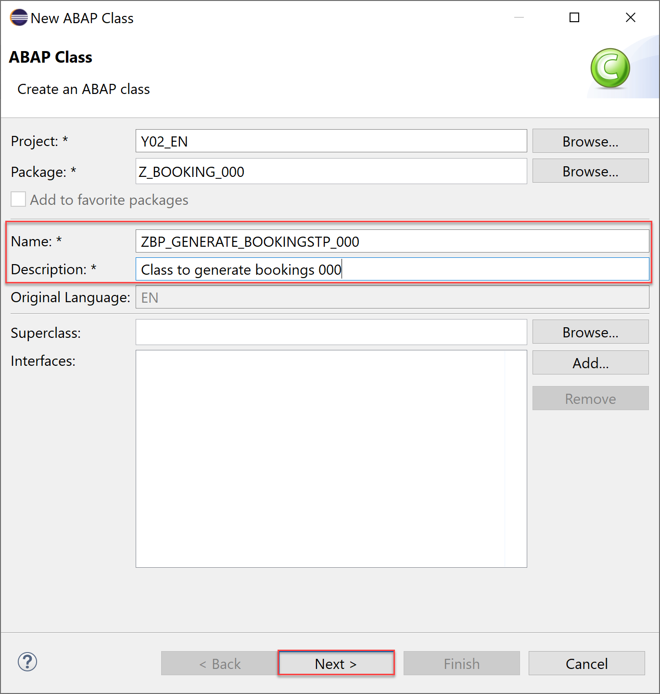

  3. Click **Finish**.

      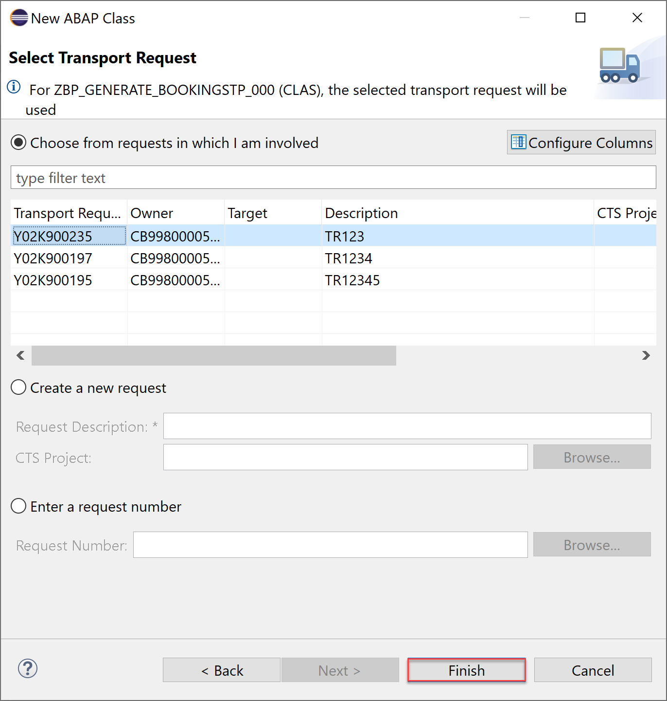

  4. Replace the source code of your class with the one provided below:

    ```ABAP
    CLASS zbp_generate_bookingstp_### DEFINITION
      PUBLIC
      FINAL
      CREATE PUBLIC .

      PUBLIC SECTION.
        INTERFACES if_oo_adt_classrun.
      PROTECTED SECTION.
      PRIVATE SECTION.
    ENDCLASS.


    CLASS zbp_generate_bookingstp_### IMPLEMENTATION.

      METHOD if_oo_adt_classrun~main.
        DATA:it_bookings TYPE TABLE OF zabooking_###.

    *    read current timestamp
        GET TIME STAMP FIELD DATA(zv_tsl).
    *   fill internal table (itab)
        it_bookings = VALUE #(
            ( booking  = '1' customername = 'Buchholm' numberofpassengers = '3' emailaddress = 'tester1@flight.example.com'
              country = 'Germany' dateofbooking ='20180213125959' dateoftravel ='20180213125959' cost = '546' currencycode = 'EUR' lastchangedat = zv_tsl )
            ( booking  = '2' customername = 'Jeremias' numberofpassengers = '1' emailaddress = 'tester2@flight.example.com'
              country = 'USA' dateofbooking ='20180313125959' dateoftravel ='20180313125959' cost = '1373' currencycode = 'USD' lastchangedat = zv_tsl )
        ).

    *   Delete the possible entries in the database table - in case it was already filled
        DELETE FROM zabooking_###.
    *   insert the new table entries
        INSERT zabooking_### FROM TABLE @it_bookings.

    *   check the result
        SELECT * FROM zabooking_### INTO TABLE @it_bookings.
        out->write( sy-dbcnt ).
        out->write( 'data inserted successfully!' ).

      ENDMETHOD.

    ENDCLASS.
    ```

  5. Save and active your class.

      


### Run ABAP application

  1. Run your class as an ABAP application (console) or press **F9**.

      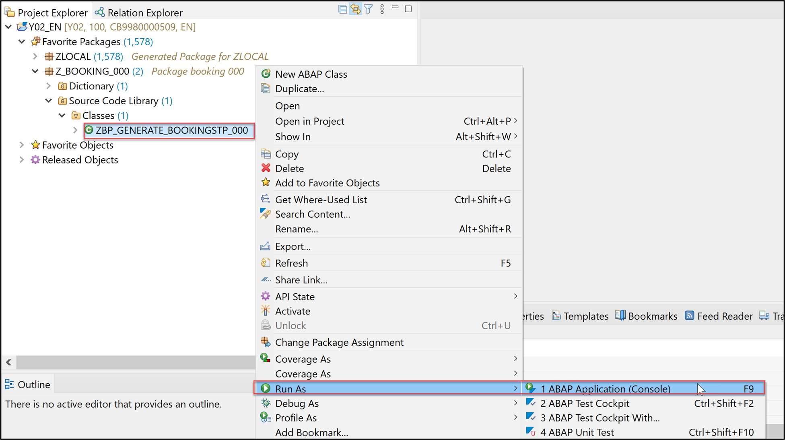

  2. Check console output.

      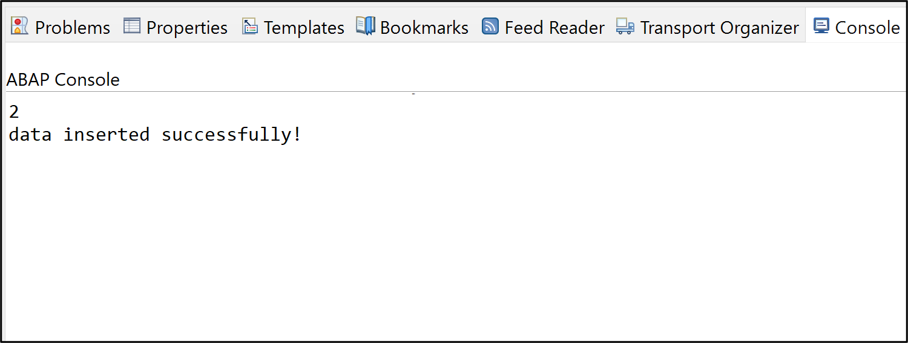

  3. Switch back to your data definition and press **F8** to see the inserted data.

      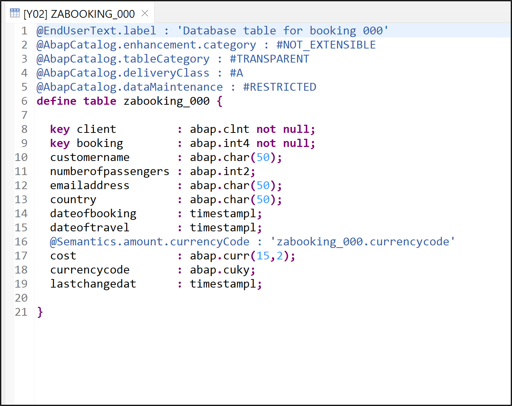

  4. Now check your result.

      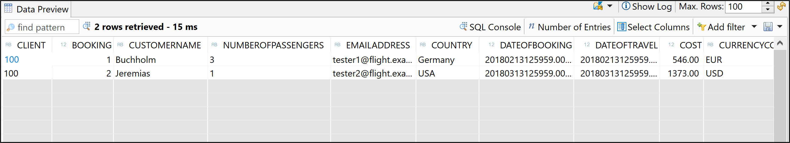


### Test yourself
