# Define and Expose a CDS-Based Travel Data Model
<!-- description --> Define CDS-based data model and create projection view.

## Prerequisites  
<<<<<<< HEAD
- You need an SAP BTP, ABAP environment [trial user](abap-environment-trial-onboarding) or a license.
- You have downloaded and installed the [latest ABAP Development Tools (ADT)] (https://tools.hana.ondemand.com/#abap).
=======
- You need to have access to an SAP BTP, ABAP environment, or SAP S/4HANA Cloud, ABAP environment or SAP S/4HANA (release 2021 or higher) system.
For example, you can create [free trial user on SAP BTP, ABAP environment](abap-environment-trial-onboarding).
- You have downloaded and installed the [latest ABAP Development Tools (ADT)] (https://tools.hana.ondemand.com/#abap) on the latest Eclipse© platform.
- If you are using a **licensed system** make sure, that the flight scenario is available in your system. If not, you should follow these [steps](https://help.sap.com/docs/btp/sap-abap-restful-application-programming-model/downloading-abap-flight-reference-scenario) in your licensed system. The flight scenario is already in the trial systems.
>>>>>>> 59f95048a11e62962d5c8eb49e89b6f027533a25

## You will learn   
  - How to create CDS based data model
  - How to create projection view
  - How to create service definition
<<<<<<< HEAD
  - How to create service binding

## Intro
In this tutorial, wherever XXX appears, use a number (e.g. 000).
=======
  - How to create service binding  

## Intro
In this tutorial, wherever ### appears, use a number (e.g. 000).
>>>>>>> 59f95048a11e62962d5c8eb49e89b6f027533a25

---

>**If you also want to deploy your SAP Fiori application, please finish this tutorial first and then continue with** [ Develop a Fiori App Using the ABAP RESTful Application Programming Model (Managed Scenario)](group.abap-env-restful-managed) **starting with following tutorial** [Create Behavior Definition for Managed Scenario](abap-environment-behavior).
 
### Define CDS-based travel data model

<<<<<<< HEAD
  1. Right-click on your package `ZTRAVEL_APP_XXX`, select **New** > **Other ABAP Repository Object**.

      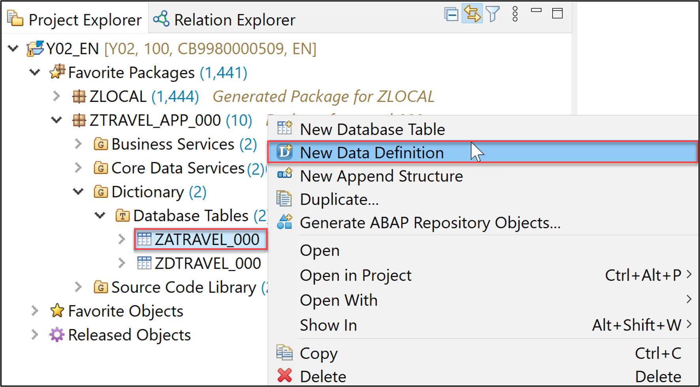

  2. Search for data definition, select it and click **Next >**.

      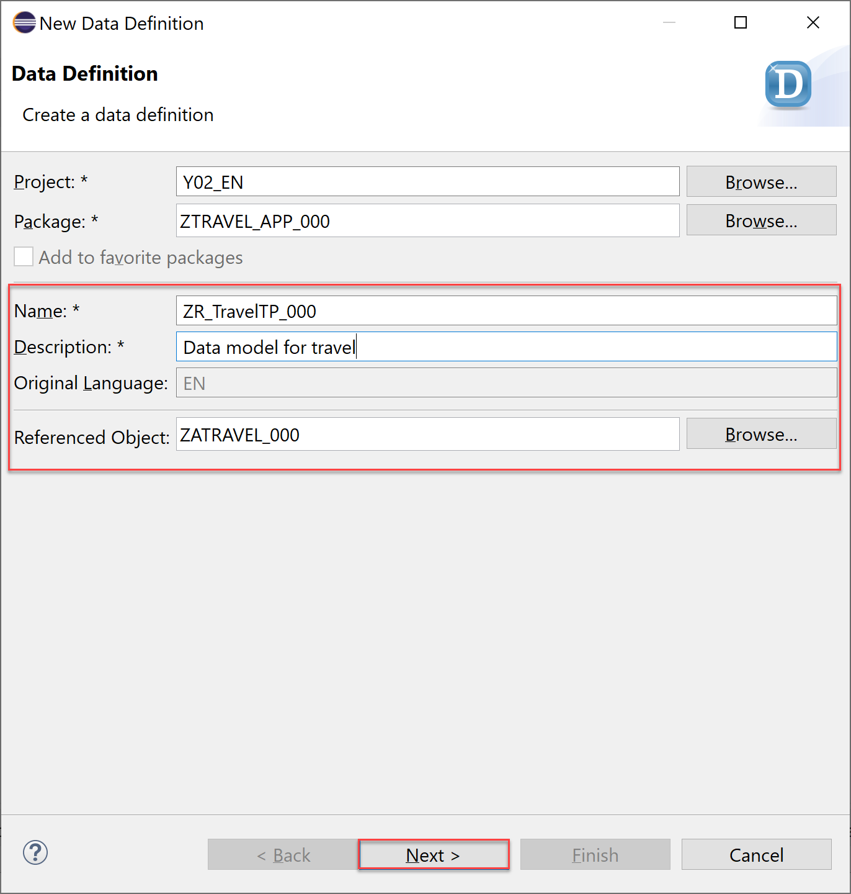

  3. Create a data definition:

     - Name: `ZI_TRAVEL_M_XXX`
=======
  1. Right-click on database table `ZATRAVEL_###` and select **New Data Definition**.

      

  2. Create a data definition:

     - Name: `ZR_TravelTP_###`
>>>>>>> 59f95048a11e62962d5c8eb49e89b6f027533a25
     - Description: `Data model for travel`

     Click **Next >**.

<<<<<<< HEAD
      

  4. Click **Finish** to use your transport request.

      


  5. Add associations, fields, UI semantics and the `root` node to your data definition. Therefore replace your code with following:

    ```ABAP
    @EndUserText.label: 'Travel data XXX'
    @AccessControl.authorizationCheck: #CHECK
    define root view entity ZI_TRAVEL_M_XXX

      as select from ztravel_xxx as Travel

      /* Associations */
      association [0..1] to /DMO/I_Agency   as _Agency   on $projection.agency_id = _Agency.AgencyID
      association [0..1] to /DMO/I_Customer as _Customer on $projection.customer_id = _Customer.CustomerID
      association [0..1] to I_Currency      as _Currency on $projection.currency_code = _Currency.Currency

    {

      key mykey,
          travel_id,
          agency_id,
          customer_id,
          begin_date,
          end_date,
          @Semantics.amount.currencyCode: 'currency_code'
          booking_fee,
          @Semantics.amount.currencyCode: 'currency_code'
          total_price,
          currency_code,
          overall_status,
          description,

          /*-- Admin data --*/
          @Semantics.user.createdBy: true
          created_by,
          @Semantics.systemDateTime.createdAt: true
          created_at,
          @Semantics.user.lastChangedBy: true
          last_changed_by,
          @Semantics.systemDateTime.lastChangedAt: true
          last_changed_at,
=======
      

  3. Click **Finish** to use your transport request.

      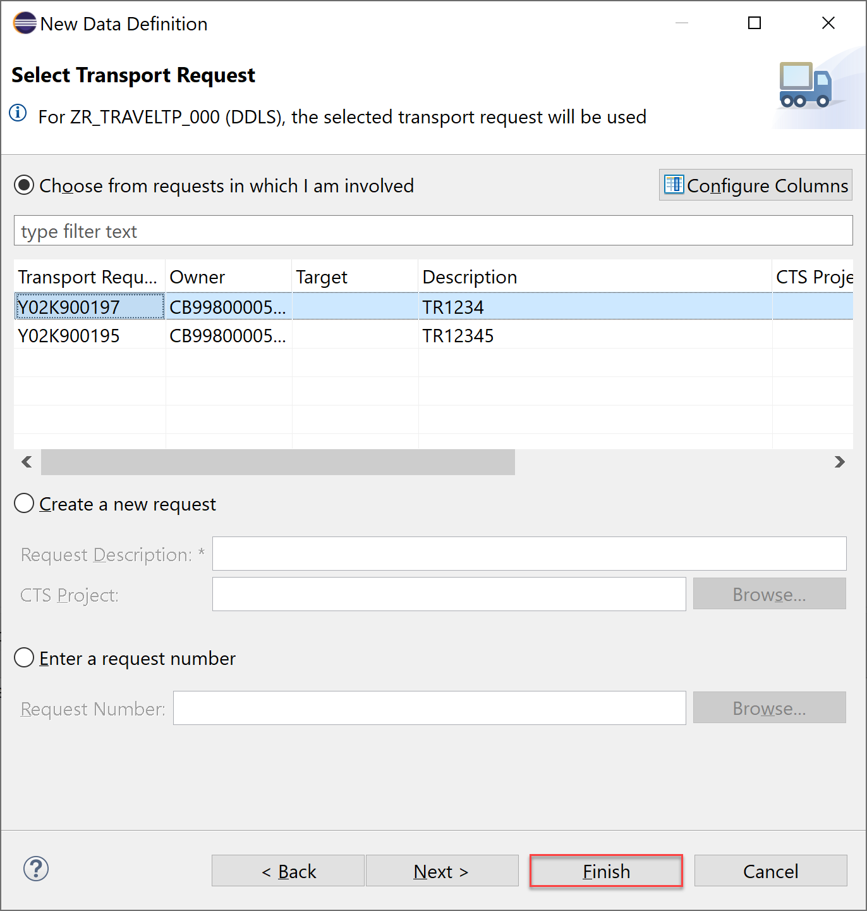
 

  4. Add associations, fields, UI semantics and the `root` node to your data definition. Therefore replace your code with following:

    ```ABAP
    @EndUserText.label: 'Travel data ###'
    @AccessControl.authorizationCheck: #CHECK
    define root view entity ZR_TravelTP_### as select from zatravel_### 

      /* Associations */
      association [0..1] to /DMO/I_Agency   as _Agency   on $projection.AgencyID = _Agency.AgencyID
      association [0..1] to /DMO/I_Customer as _Customer on $projection.CustomerID = _Customer.CustomerID
      association [0..1] to I_Currency      as _Currency on $projection.CurrencyCode = _Currency.Currency

    {
      key mykey                 as Mykey,
          travel_id             as TravelID,
          agency_id             as AgencyID, 
          customer_id           as CustomerID,
          begin_date            as BeginDate,
          end_date              as EndDate,
          @Semantics.amount.currencyCode: 'CurrencyCode'
          booking_fee           as BookingFee,
          @Semantics.amount.currencyCode: 'CurrencyCode'
          total_price           as TotalPrice,
          currency_code         as CurrencyCode,
          description           as Description,
          overall_status        as OverallStatus,
          created_by            as CreatedBy,
          created_at            as CreatedAt,
          last_changed_by       as LastChangedBy,
          @Semantics.systemDateTime.localInstanceLastChangedAt: true
          last_changed_at       as LastChangedAt,
          @Semantics.systemDateTime.lastChangedAt: true
          local_last_changed_at as LocalLastChangedAt,
>>>>>>> 59f95048a11e62962d5c8eb49e89b6f027533a25

          /* Public associations */
          _Agency,
          _Customer,
          _Currency
<<<<<<< HEAD
    }
    ```

  6. Save and activate.
=======
    } 
    ```

  5. Save and activate.
>>>>>>> 59f95048a11e62962d5c8eb49e89b6f027533a25

      

     Your CDS view for travel booking is defined now. You can use and manipulate data that is persisted in your database.

<<<<<<< HEAD

### Create projection view for travel

  1. Right-click on your package `ZTRAVEL_APP_XXX`, select **New** > **Other ABAP Repository Object**.

      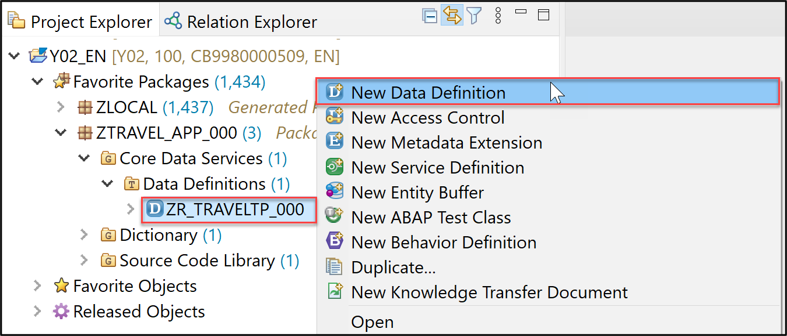

  2. Search for data definition, select it and click **Next >**.

      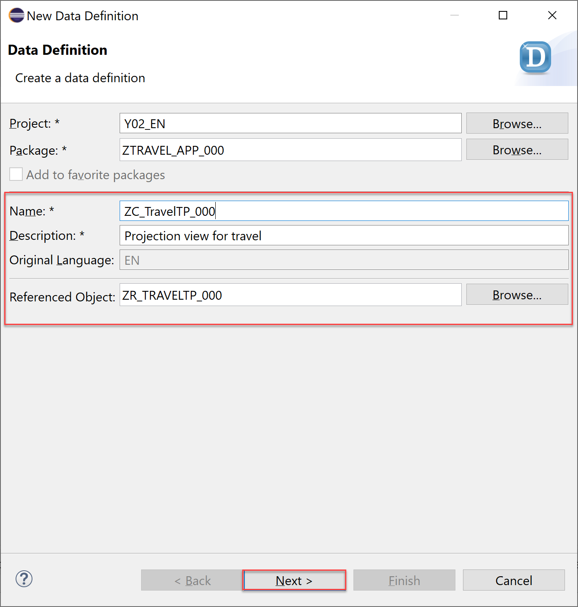

  3. Create a data definition:

     - Name: `ZC_TRAVEL_M_XXX`
=======
 
### Create projection view for travel

  1. Right-click on data definition `ZR_TRAVELTP_###` and select **New Data Definition**.

      

  2. Create a data definition:

     - Name: `ZC_TRAVELTP_###`
>>>>>>> 59f95048a11e62962d5c8eb49e89b6f027533a25
     - Description: `Projection view for travel`

     Click **Next >**.

<<<<<<< HEAD
      

  4. Click **Finish** to use your transport request.

      

  5. Replace your code with following:

    ```ABAP
    @EndUserText.label: 'Travel projection view - Processor'
    @AccessControl.authorizationCheck: #NOT_REQUIRED

    @UI: {
     headerInfo: { typeName: 'Travel', typeNamePlural: 'Travels', title: { type: #STANDARD, value: 'TravelID' } } }

    @Search.searchable: true

    define root view entity ZC_TRAVEL_M_XXX
      as projection on ZI_TRAVEL_M_XXX
    {
          @UI.facet: [ { id:              'Travel',
                         purpose:         #STANDARD,
                         type:            #IDENTIFICATION_REFERENCE,
                         label:           'Travel',
                         position:        10 } ]

          @UI.hidden: true
      key mykey              as TravelUUID,
=======
      

  3. Click **Finish** to use your transport request.

      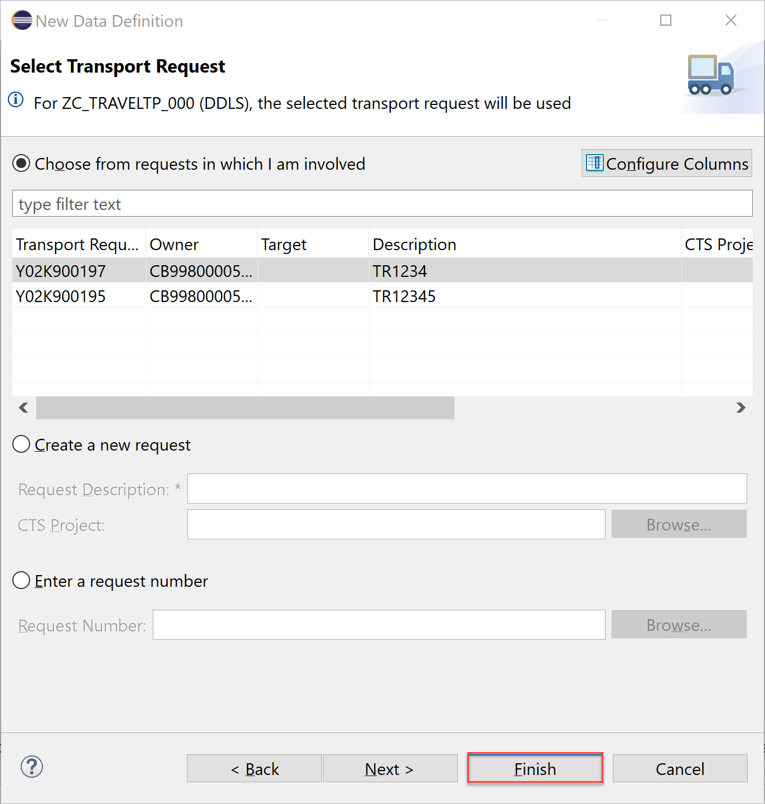

  4. Replace your code with following:

    ```ABAP
    @AccessControl.authorizationCheck: #NOT_REQUIRED
    @EndUserText.label: 'Projection view for travel'

    @UI: {
    headerInfo: { typeName: 'Travel', typeNamePlural: 'Travels', title: { type: #STANDARD, value: 'TravelID' } } }

    @Search.searchable: true

    define root view entity ZC_TravelTP_###
      as projection on ZR_TravelTP_###
    {
          @UI.facet: [ { id:              'Travel',
                        purpose:         #STANDARD,
                        type:            #IDENTIFICATION_REFERENCE,
                        label:           'Travel',
                        position:        10 } ]

          @UI.hidden: true
      key Mykey              as TravelUUID,
>>>>>>> 59f95048a11e62962d5c8eb49e89b6f027533a25


          @UI: {
              lineItem:       [ { position: 10, importance: #HIGH } ],
              identification: [ { position: 10, label: 'Travel ID [1,...,99999999]' } ] }
          @Search.defaultSearchElement: true
<<<<<<< HEAD
          travel_id          as TravelID,
=======
          TravelID          as TravelID,
>>>>>>> 59f95048a11e62962d5c8eb49e89b6f027533a25

          @UI: {
              lineItem:       [ { position: 20, importance: #HIGH } ],
              identification: [ { position: 20 } ],
              selectionField: [ { position: 20 } ] }
          @Consumption.valueHelpDefinition: [{ entity : {name: '/DMO/I_Agency', element: 'AgencyID'  } }]

          @ObjectModel.text.element: ['AgencyName'] ----meaning?
          @Search.defaultSearchElement: true
<<<<<<< HEAD
          agency_id          as AgencyID,
=======
          AgencyID          as AgencyID,
>>>>>>> 59f95048a11e62962d5c8eb49e89b6f027533a25
          _Agency.Name       as AgencyName,

          @UI: {
              lineItem:       [ { position: 30, importance: #HIGH } ],
              identification: [ { position: 30 } ],
              selectionField: [ { position: 30 } ] }
          @Consumption.valueHelpDefinition: [{ entity : {name: '/DMO/I_Customer', element: 'CustomerID'  } }]

          @ObjectModel.text.element: ['CustomerName']
          @Search.defaultSearchElement: true
<<<<<<< HEAD
          customer_id        as CustomerID,
=======
          CustomerID        as CustomerID,
>>>>>>> 59f95048a11e62962d5c8eb49e89b6f027533a25

          @UI.hidden: true
          _Customer.LastName as CustomerName,

          @UI: {
              lineItem:       [ { position: 40, importance: #MEDIUM } ],
              identification: [ { position: 40 } ] }
<<<<<<< HEAD
          begin_date         as BeginDate,
=======
          BeginDate         as BeginDate,
>>>>>>> 59f95048a11e62962d5c8eb49e89b6f027533a25

          @UI: {
              lineItem:       [ { position: 41, importance: #MEDIUM } ],
              identification: [ { position: 41 } ] }
<<<<<<< HEAD
          end_date           as EndDate,
=======
          EndDate           as EndDate,
>>>>>>> 59f95048a11e62962d5c8eb49e89b6f027533a25

          @UI: {
              lineItem:       [ { position: 50, importance: #MEDIUM } ],
              identification: [ { position: 50, label: 'Total Price' } ] }
          @Semantics.amount.currencyCode: 'CurrencyCode'
<<<<<<< HEAD
          total_price        as TotalPrice,

          @Consumption.valueHelpDefinition: [{entity: {name: 'I_Currency', element: 'Currency' }}]
          currency_code      as CurrencyCode,
=======
          TotalPrice        as TotalPrice,

          @Consumption.valueHelpDefinition: [{entity: {name: 'I_Currency', element: 'Currency' }}]
          CurrencyCode      as CurrencyCode,
>>>>>>> 59f95048a11e62962d5c8eb49e89b6f027533a25

          @UI: {
          lineItem:       [ { position: 60, importance: #HIGH },
                            { type: #FOR_ACTION, dataAction: 'acceptTravel', label: 'Accept Travel' } ],
          identification: [ { position: 60, label: 'Status [O(Open)|A(Accepted)|X(Canceled)]' } ]  }
<<<<<<< HEAD
          overall_status     as TravelStatus,

          @UI.identification: [ { position: 70, label: 'Remarks' } ]
          description        as Description,

          @UI.hidden: true
          last_changed_at    as LastChangedAt

    }

    ```

  6. Save and activate.
=======
          OverallStatus     as TravelStatus,

          @UI.identification: [ { position: 70, label: 'Remarks' } ]
          Description        as Description,

          @UI.hidden: true
          LastChangedAt    as LastChangedAt

    }
    ```

  5. Save and activate.
>>>>>>> 59f95048a11e62962d5c8eb49e89b6f027533a25

      

     The **projection** is created and includes UI annotations. The projection is the subset of the fields of the travel data model, which are relevant for the travel booking application.


### Create service definition

<<<<<<< HEAD
  1. Right-click on your data definition `ZC_TRAVEL_M_XXX` and select **New Service Definition**.
=======
  1. Right-click on projection view `ZC_TRAVELTP_###` and select **New Service Definition**.
>>>>>>> 59f95048a11e62962d5c8eb49e89b6f027533a25

      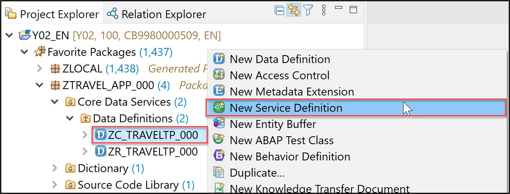

  2. Create a new service definition:

<<<<<<< HEAD
     - Name: `ZUI_C_TRAVEL_M_XXX`
=======
     - Name: `ZUI_TRAVEL_###`
>>>>>>> 59f95048a11e62962d5c8eb49e89b6f027533a25
     - Description: `Service definition for travel`

     Click **Next >**.

<<<<<<< HEAD
      
=======
      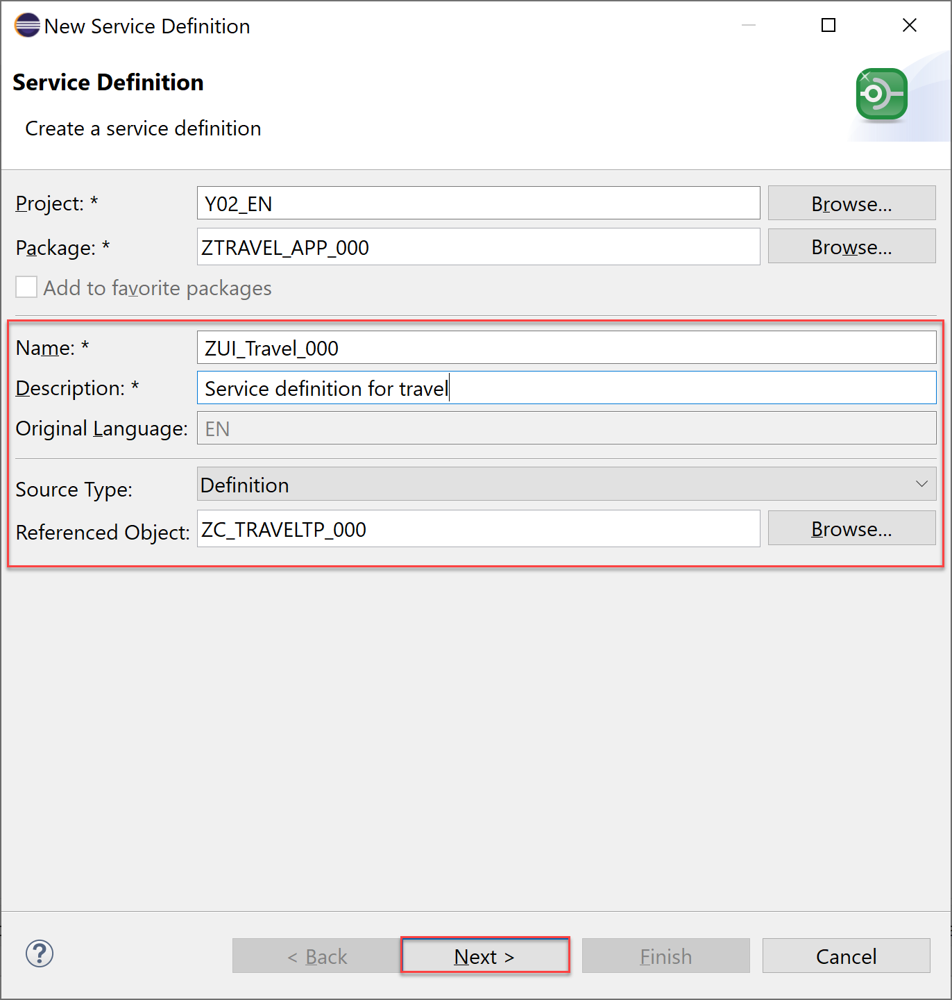
>>>>>>> 59f95048a11e62962d5c8eb49e89b6f027533a25

  3. Click **Finish** to use your transport request.

      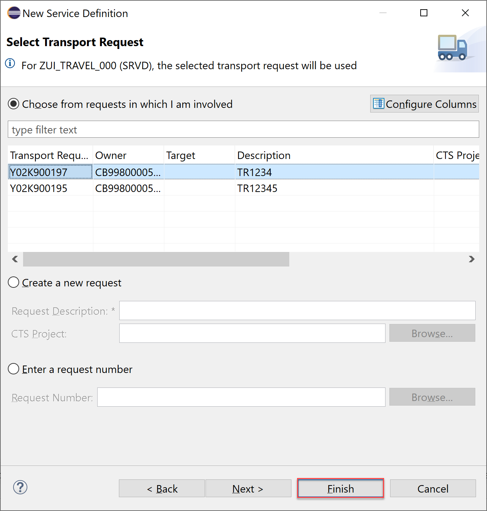

<<<<<<< HEAD
  4. Replace your code with following:

    ```ABAP
    @EndUserText.label: 'Service Definition for ZC_Travel_M_XXX'
    define service ZUI_C_TRAVEL_M_XXX
    {
      expose ZC_TRAVEL_M_XXX as TravelProcessor;
=======
  4. Expose these entities:

    ```ABAP
    @EndUserText.label: 'Service definition for travel'
    define service ZUI_Travel_### {
      expose ZC_TravelTP_### as TravelProcessor;
>>>>>>> 59f95048a11e62962d5c8eb49e89b6f027533a25
      expose /DMO/I_Customer as Passenger;
      expose /DMO/I_Agency as TravelAgency;
      expose /DMO/I_Airport as Airport;
      expose I_Currency as Currency;
      expose I_Country as Country;
<<<<<<< HEAD
    }   
=======
    }  
>>>>>>> 59f95048a11e62962d5c8eb49e89b6f027533a25
    ```

  5. Save and activate.

      

     With the **service definition** you are able to define which data is exposed as a business service in your travel booking application.


### Create service binding

<<<<<<< HEAD
  1. Right-click on your service definition `ZUI_C_TRAVEL_M_XXX` and select **New Service Binding**.
=======
  1. Right-click on service definition `ZUI_TRAVEL_###` and select **New Service Binding**.
>>>>>>> 59f95048a11e62962d5c8eb49e89b6f027533a25

      

  2. Create a new service binding:

<<<<<<< HEAD
     - Name: `ZUI_C_TRAVEL_M_XXX`
     - Description: `Service binding for travel`
     - Binding Type: `ODATA V2 - UI`

=======
     - Name: `ZUI_TRAVEL_O4_###` 
     - Description: `Service binding for travel`
     - Binding Type: `ODATA V4 - UI`
 
>>>>>>> 59f95048a11e62962d5c8eb49e89b6f027533a25
     Click **Next >**.

      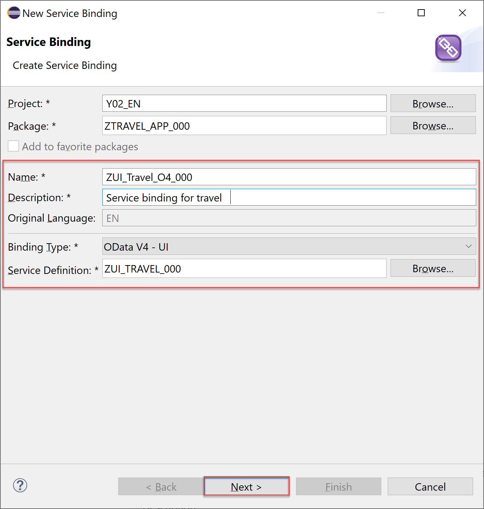

  3. Click **Finish** to use your transport request.

      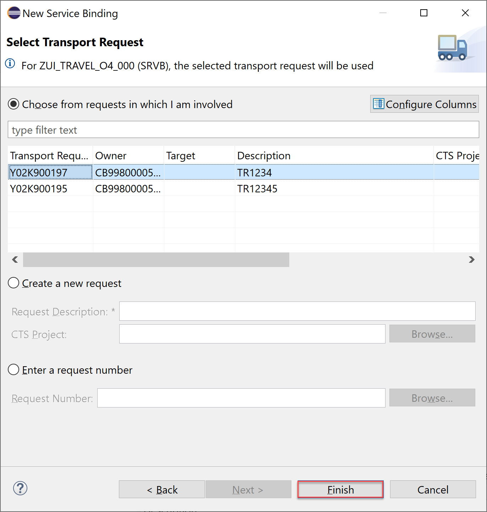

  4. **Activate** your service binding and then **publish** it.

      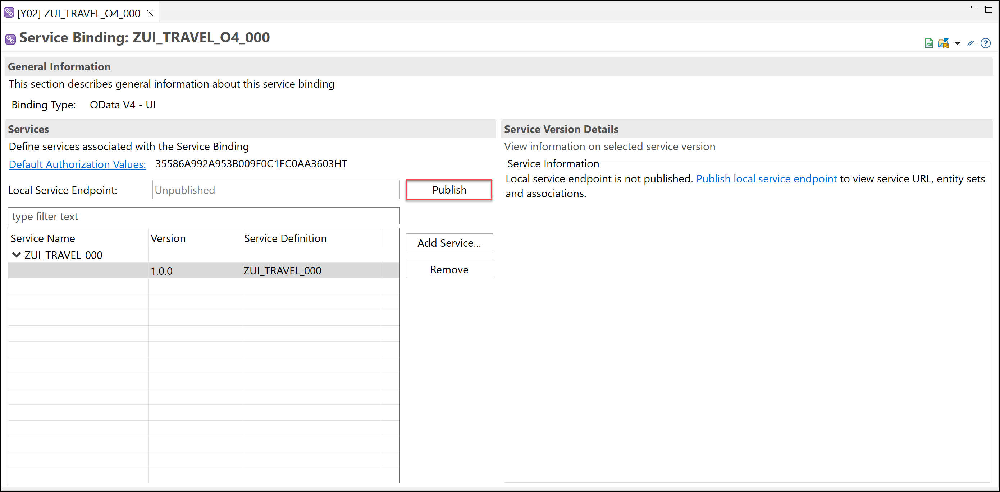

     Now your service binding is created and you are able to see your service with its entities and associations.

<<<<<<< HEAD
     The **service binding** allows you to bind the service definition to an ODATA protocol. Therefore you are able to see the travel booking application on the UI.


### Test yourself


---

If you want to deploy your SAP Fiori application, please continue with
[Develop a Fiori App Using the ABAP RESTful Application Programming Model (Managed Scenario)](group.abap-env-restful-managed) **starting with following tutorial** [Create Behavior Definition for Managed Scenario](abap-environment-behavior).

After completing this mission, you might be interested in the next in the series: [Level Up with SAP BTP, ABAP Environment](mission.abap-env-level-up)

---
=======
      

     The **service binding** allows you to bind the service definition to an ODATA protocol. Therefore you are able to see the travel booking application on the UI.

### Test yourself

---
>>>>>>> 59f95048a11e62962d5c8eb49e89b6f027533a25
