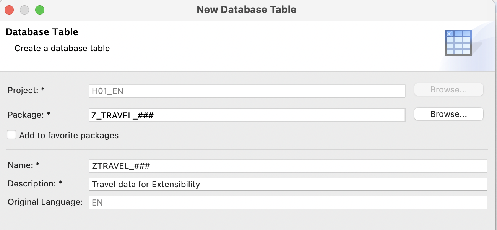

# Extend a Custom Core Data Service in ABAP Environment
<!-- description --> Explore developer extensibility by creating a CDS view and extending it in ABAP Environment.

## Prerequisites  
- You need to have access to an SAP BTP, ABAP environment, or SAP S/4HANA Cloud, ABAP environment or SAP S/4HANA (release 2022 or higher) system. 
  For example, you can create a free [trial user](https://developers.sap.com/tutorials/abap-environment-trial-onboarding.html) on SAP BTP, ABAP environment.
- You have downloaded and installed the [latest ABAP Development Tools (ADT)] (https://tools.hana.ondemand.com/#abap) on the latest Eclipse© platform.
- You have created an [ABAP Cloud Project](https://developers.sap.com/tutorials/abap-environment-create-abap-cloud-project.html).
- Your system has the ABAP flight reference scenario. If your system hasn't this scenario. You can download it [here](https://github.com/SAP-samples/abap-platform-refscen-flight). The trial systems have the flight scenario included.
  
## You will learn

  - How to extend SAP or custom table using Extensibility model
  - How to extend a CDS view by adding a new field
  - How to implement custom logic 
  - How to consume fields from other exposed CDS view using Associations 

## Intro

This tutorial was written for SAP BTP ABAP Environment. However, you should also be able to use it in SAP S/4HANA Cloud Environment in the same way. 
Always replace `###` with your initials or group number.

---

### Create your own ABAP package

  1. Open Eclipse and connect to your system. 

  2. Right-click on the package `ZLOCAL` and choose **New** > **ABAP Package** from the context menu.

  3. Create your own ABAP development package `Z_Travel_###` as a sub package of `ZLOCAL`.
      - Name: `Z_Travel_###`
      - Description: `My travel package`

  4. Click **Next**.
 
      

      - Add your package to **Favorite Packages**.

  5. Select package properties and click **Next**.
      - Software Component: `ZLOCAL`
 
      
 
  6. Select a transport request or create new and click **Finish**.
 
       
 
### Create a Structure

Create a Structure with a field `Description`.

  1. Right-click on your ABAP package `Z_Travel_###` and select **New** > **Other ABAP Repository Object** from the context menu.

      

  2. Enter the filter text **Structure > Structure**, then choose **Next**.

  3. Enter a name such as `ZTravel_struc_###` - always replacing `###` with your initials or group number - and a description, then choose **Next**.
   
     

  4. Accept the proposed transport request and click **Finish**.
  
  5. Replace the default code with the code snippet provided below and replace all occurrences of the placeholder `###` with your group ID using the **Replace All** function (CTRL+F). 

    ```ABAP
    @EndUserText.label : 'Structure of Travel Data'
    @AbapCatalog.enhancement.category : #EXTENSIBLE_ANY
    @AbapCatalog.enhancement.fieldSuffix : 'ZAC'
    @AbapCatalog.enhancement.quotaMaximumFields : 350
    @AbapCatalog.enhancement.quotaMaximumBytes : 3500
    define structure ztravel_struc_### {

      description : /dmo/description;

    }
    ```
  
  6. Save  and activate  the changes.
  
### Create a database table

Create a database table to store the Travel data. This Travel table contains `Travel ID`, `Total Price` and `Currency Code`.

1. Right-click on your ABAP package `Z_Travel_###` and select **New** > **Other ABAP Repository Object** from the context menu.
  
    

2. Enter the filter text **Table > Database table**, then choose **Next**.
 
3. Enter a name such as `ZTravel_###` - always replacing `###` with your initials or group number - and a description, then choose **Next**.

    
 
4. Accept the proposed transport request and click **Finish**.
  
5. Replace the default code with the code snippet provided below and replace all occurrences of the placeholder `###` with your group ID using the **Replace All** function (CTRL+F). 
  
    ```ABAP
    @EndUserText.label : 'Travel data for Extensibility'
    @AbapCatalog.enhancement.category : #EXTENSIBLE_ANY
    @AbapCatalog.tableCategory : #TRANSPARENT
    @AbapCatalog.deliveryClass : #A
    @AbapCatalog.dataMaintenance : #RESTRICTED
    define table ztravel_### {

      key client    : abap.clnt not null;
      key travel_id : /dmo/travel_id not null;
      @Semantics.amount.currencyCode : 'ztravel_###.currency_code'
      total_price   : /dmo/total_price;
      currency_code : /dmo/currency_code;
      include ztravel_struc_###;

    }

    ```

  6. Save  and activate  the changes.

### Create data generator class

Create an ABAP class to generate demo **travel** data.
 
  1. Right-click on your ABAP package `Z_Travel_###` and select **New** > **ABAP Class** from the context menu.
 
  2. Enter a name such as `ztravel_fill_data_###` - always replacing `###` with your initials or group number - and a description, then choose **Next**.
    
     
 
  3. Accept the proposed transport request and click **Finish**.
 
  4. Replace the default code with the code snippet provided below and replace all occurrences of the placeholder `###` with your group ID using the **Replace All** function (CTRL+F). 

    ```ABAP
    CLASS ztravel_fill_data_### DEFINITION
      PUBLIC
      FINAL
      CREATE PUBLIC .

      PUBLIC SECTION.
        INTERFACES if_oo_adt_classrun.
      PROTECTED SECTION.
      PRIVATE SECTION.
    ENDCLASS.

    CLASS ztravel_fill_data_### IMPLEMENTATION.

      METHOD if_oo_adt_classrun~main.

    *   clear data
        DELETE FROM ztravel_###.

        "insert travel demo data

        INSERT ztravel_### FROM (
        SELECT
          FROM /dmo/travel AS travel
          FIELDS
          travel~travel_id AS travel_id,
          travel~total_price AS total_price,
          travel~currency_code AS currency_code,
          travel~description AS description
        ).
        COMMIT WORK.
        out->write( | Data generated for table ztravel_### | ).
      ENDMETHOD.
    ENDCLASS.
    ```
  5. Save  and activate  the changes.
 
  6. Run your console application. For that, select your ABAP class `ztravel_fill_data_###`, select the run button > **Run As** > **ABAP Application (Console) F9** or press **F9**. 

       

### Create a CDS view

Create a CDS view `ZITravel_###` based on the database table `ZTravel_###`

  1. Right-click on your ABAP package `Z_Travel_###` and select **New** > **Data Definition** from the context menu.

      
 
  2. Enter a Name such as `ZITravel_###` - always replacing `###` with your initials or group number - and a description, then choose **Next**.
 
     
 
  3. Accept the proposed transport request and click **Finish**.
  
  4. Replace the default code with the code snippet provided below and replace all occurrences of the placeholder **`###`** with your group ID using the **Replace All** function (CTRL+F). 

    ```ABAP
        @AbapCatalog.viewEnhancementCategory: [#PROJECTION_LIST]
        @AccessControl.authorizationCheck: #NOT_REQUIRED
        @EndUserText.label: 'Travel View Entity'
        @Metadata.ignorePropagatedAnnotations: true
        @AbapCatalog.extensibility: {
          extensible: true,
          elementSuffix: 'ZAC',
          quota: {
            maximumFields: 500,
            maximumBytes: 5000
          },
          dataSources: [ '_Travel' ]
        }
        define view entity ZITRAVEL_###
          as select from ztravel_### as _Travel
        {
          key travel_id     as TravelId,
              description   as Description,
              @Semantics.amount.currencyCode: 'CurrencyCode'
              total_price   as TotalPrice,
              currency_code as CurrencyCode
        }
    ```
5. Save  and activate  the CDS view. 

6. Click anywhere in the editor and choose **Open With > Data Preview** from the context menu.

    

### Extend the database table 

Let us consider a database table that is defined by a software provider, for example, SAP. A customer or partner wants to add fields to this database table. 

Instead of adding the fields to the database table definition in the dictionary, they create an append structure. The append structure is a separate dictionary object, owned and maintained by the customer or partner. 

  1. Right-click on the structure `ZTravel_struc_###` and select **New** > **Append Structure** from the context menu.

      
  
  2. Enter a Name such as `ZTravel_struc_ext_###`- always replacing `###` with your initials or group number - and a description, then choose Next.

     

  3. Accept the proposed transport request and choose Finish.
  
  4. Replace the default code with the code snippet provided below and replace all occurrences of the placeholder `###` with your group ID using the **Replace All** function (CTRL+F). 
  
    ```ABAP
    @EndUserText.label : 'Structure for Travel table extension'
    @AbapCatalog.enhancement.category : #NOT_EXTENSIBLE
    extend type ztravel_struc_### with ztravel_struc_ext_### {

    zztraveltype_zac : /dmo/carrier_name;

    }
    ```
  
  5. Save  and activate .


### Create a new ABAP class to generate the values for the newly added field 

The new field `zztraveltype_zac` should be filled with the below logic in the ABAP class.

    If `total_price` > 4500, set Travel Type to 'Business'.
    Else, if `total_price` > 3000, set Travel Type to 'Premium Economy'.
    Otherwise, set Travel Type to 'Economy'

  1. Right-click on your ABAP package `Z_Travel_###` and select **New** > **ABAP Class** from the context menu.
 
  2. Enter a Name such as `ztravel_ext_data_###` - always replacing `###` with your initials or group number - and a description, then choose Next.
          
  3. Accept the proposed transport request and click **Finish**.
 
  4. Replace the default code with the code snippet provided below and replace all occurrences of the placeholder `###` with your group ID using the **Replace All** function (CTRL+F). 

    ```ABAP
      CLASS ztravel_ext_data_### DEFINITION
      PUBLIC
      FINAL
      CREATE PUBLIC .

      PUBLIC SECTION.
        INTERFACES if_oo_adt_classrun.
      PROTECTED SECTION.
      PRIVATE SECTION.
    ENDCLASS.

    CLASS ztravel_ext_data_### IMPLEMENTATION.

      METHOD if_oo_adt_classrun~main.
        DATA: lt_travel TYPE TABLE OF ztravel_###,
              ls_travel TYPE ztravel_###.

        " Select existing data from the table
        SELECT * FROM ztravel_### INTO TABLE @lt_travel.

        " Loop through the data and update the new field based on the logic
        LOOP AT lt_travel INTO ls_travel.
          IF ls_travel-total_price > 4500.
            ls_travel-zztraveltype_zac = 'Business'.
          ELSEIF ls_travel-total_price > 3000 AND ls_travel-total_price < 4500.
            ls_travel-zzTravelType_zac = 'Premium Economy'.
          ELSE.
            ls_travel-zzTravelType_zac = 'Economy'.
          ENDIF.

          " Update the table with the new value
          MODIFY ztravel_### FROM @ls_travel.
        ENDLOOP.
        out->write( |Table updated| ).
      ENDMETHOD.
    ENDCLASS.
    ```
  5. Save  and activate  the changes.
 
  6. Run your console application. For that, select your ABAP class `ztravel_ext_data_###`, select the run button > **Run As** > **ABAP Application (Console) F9** or press **F9**. 

### Extend the CDS View to consume the newly created custom field

  1. Right-click on the CDS View `ZITravel_###` and select **New** > **Data Definition** from the context menu.

  2. Enter a Name such as `ZITravel_Ext_###` - always replacing `###` with your initials or group number - and a description, then choose **Next**.
 
     
 
  3. Accept the proposed transport request and click **Finish**.
  
  4. Replace the default code with the code snippet provided below and replace all occurrences of the placeholder `###` with your group ID using the **Replace All** function (CTRL+F). 

    ```ABAP
        extend view entity ZITRAVEL_### with {
        _Travel.zztraveltype_zac as ZZTravelTypeZAC
        }
    ```

5. Save  and activate  the changes. 

6. Click anywhere in the editor and choose **Open With > Data Preview** from the context menu. The newly added field comes up in the data preview with the data filled.

### Add a new calculated field to the extended CDS view

While in the previous step, we added the logic in the ABAP class which updates the database table, in this step we will check how to dynamically calculate the values and add in a new field in the extended CDS view.

1. Add a new field `ZZDiscPriceZAC` with the condition: If `total_price` > 1000, apply a 10% discount.

2. Copy the below code snippet and add below the exposed field `ZZTravelTypeZAC`

    ```ABAP
      @Semantics.amount.currencyCode: 'CurrencyCode'
      case
        when _Travel.total_price > 1000
          then  cast( _Travel.total_price as abap.dec(15,1) ) * cast( '0.9' as abap.dec(2,1) )
        else cast( _Travel.total_price as abap.dec(15,1) )
      end                      as ZZDiscPriceZAC
    ```

3. Save  and activate  the changes. 

4. Click anywhere in the editor and choose **Open With > Data Preview** from the context menu. A new field `ZZDiscPriceZAC` comes up with the dynamic calculation.

### Extend the view with an association to CDS view entity

You will expose `FlightDate` field from `/DMO/I_BOOKING_U` and calculate the number of days left from today until the flight date.

1. Below is the complete code of the extended view entity . Replace all occurrences of the placeholder `###` with your group ID using the **Replace All** function (CTRL+F). 

    ```ABAP
      extend view entity ZITRAVEL_### with

      association [1..1] to /DMO/I_Booking_U as _ZZBooking on $projection.TravelId = _ZZBooking.TravelID
      {
        _Travel.zztraveltype_zac as ZZTravelTypeZAC,

        @Semantics.amount.currencyCode: 'CurrencyCode'
        case
          when _Travel.total_price > 1000
            then  cast( _Travel.total_price as abap.dec(15,1) ) * cast( '0.9' as abap.dec(2,1) )
          else cast( _Travel.total_price as abap.dec(15,1) )
        end                      as ZZDiscPriceZAC,

        _ZZBooking.FlightDate    as ZZFlightDateZAC,

        case
          when _ZZBooking.FlightDate > $session.system_date then

          dats_days_between( _ZZBooking.FlightDate, $session.system_date )

        else 0
        end                      as ZZDaysRemainingZAC
      }
      
    ```

3. Save  and activate  the changes. 

4. Click anywhere in the editor and choose **Open With > Data Preview** from the context menu. There will be 4 custom fields added through Developer Extensibility.

### Test yourself

### More Information

- [Learning Journey](https://learning.sap.com/learning-journeys/acquire-core-abap-skills/extending-dictionary-objects_b0c9bfa6-d415-408c-baed-2f15fb3a977f)

- [Develop Extensibility-Enablement](https://help.sap.com/docs/abap-cloud/abap-rap/develop-extensibility-enablement?locale=en-US)