# Creating SAP Fiori App Using Quick Fiori Application Generator
<!-- description --> You can create a List Report based SAP Fiori application from service binding using the quick Fiori application generator.
This tutorial was written for SAP BTP ABAP Environment. However, you should also be able to use it in SAP S/4HANA Cloud Environment in the same way. 
Always replace `###` with your initials or group number.

## Prerequisites  
- You need an SAP BTP, ABAP Environment [trial user](abap-environment-trial-onboarding) or a license.
- You have completed [Create Database Table and Generate UI Service](https://developers.sap.com/tutorials/abap-environment-rap100-generate-ui-service.html).
- Your system has the ABAP flight reference scenario. If your system hasn't this scenario. You can download it [here](https://github.com/SAP-samples/abap-platform-refscen-flight). The trial systems have the flight scenario included.
  
## You will learn

  - How to create a List Report based SAP Fiori Application from service binding using the quick Fiori application generator.
  
### Create SAP Fiori application

1. In the service binding editor, select an entity and choose **Create Fiori App....**

    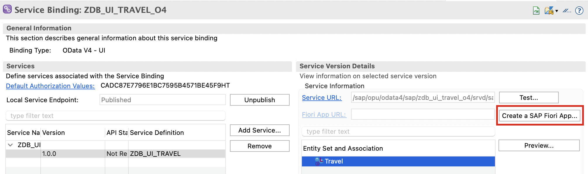

2. To create SAP Fiori application using the Quick Fiori Application generator, choose the option **Create SAP Fiori app with Quick Fiori Application generator in ADT** and choose **Create**

    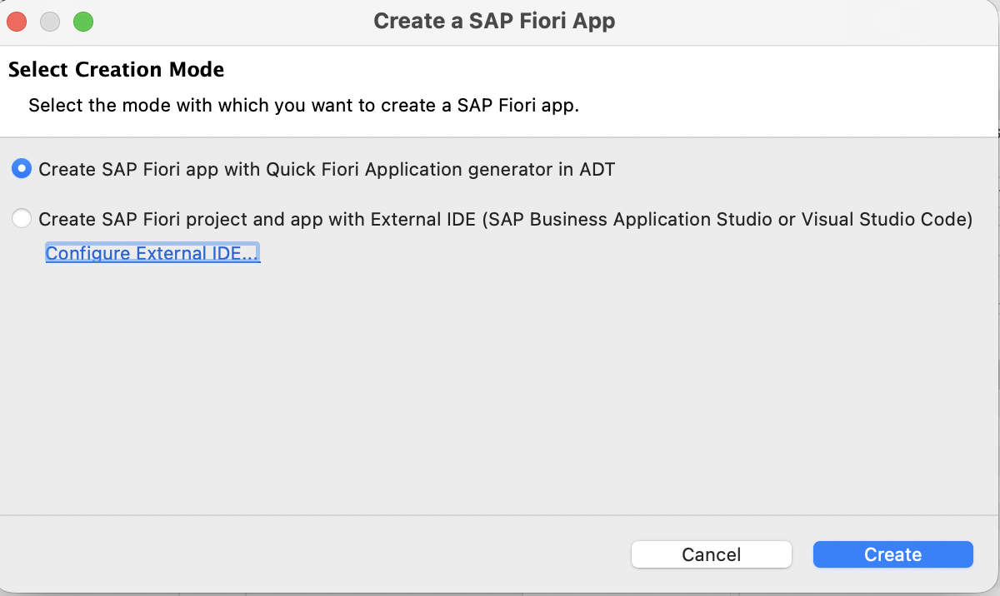

3. In the Generate ABAP Repository Object dialog, enter the Package.

    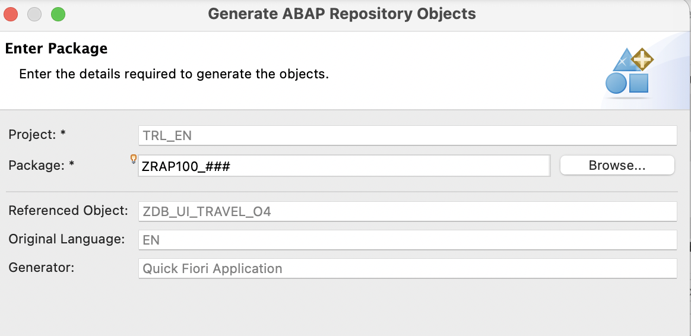

4. In the Configure Generator dialog, enter the details in the fields. Ensure the repository name is unique and within 15 characters including namespace. Like in SAP Business Application Studio, the repository name corresponds to the name of the BSP application that gets generated post deployment.

    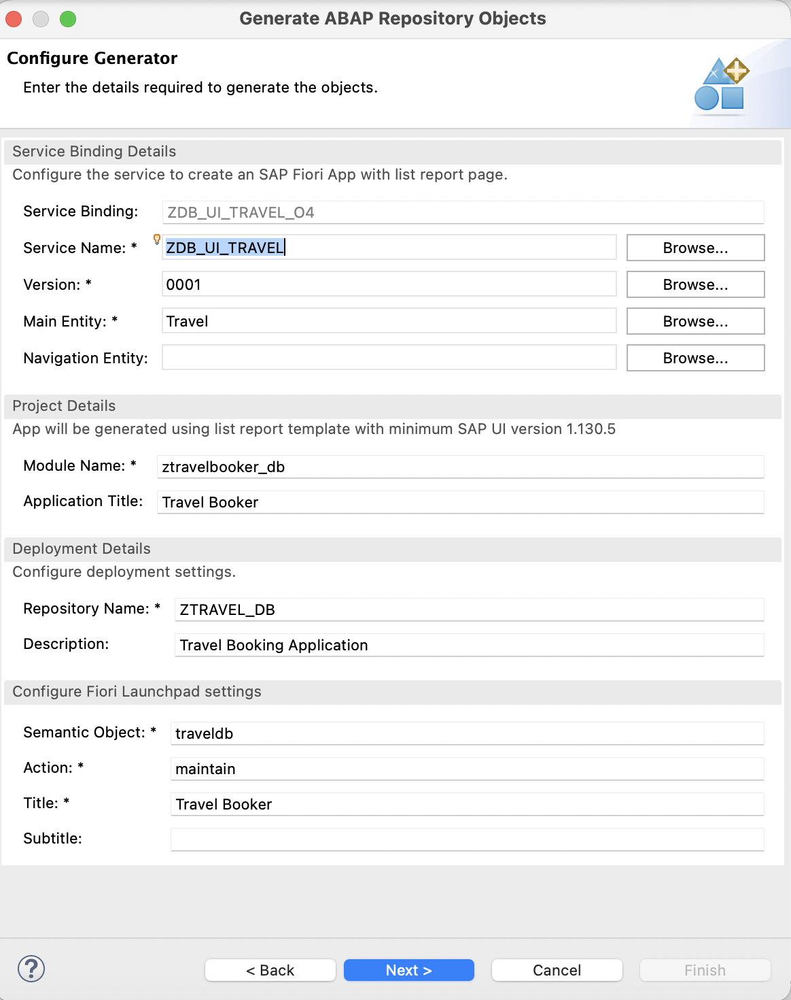

5. Choose Next. You can see the list of objects that will be generated.

6. Choose a transport request if required and choose Finish. 

7. The ABAP repository objects will be generated in the background, and you get a popup message once the objects are generated successfully. Choose Open to open or refresh the service binding.

    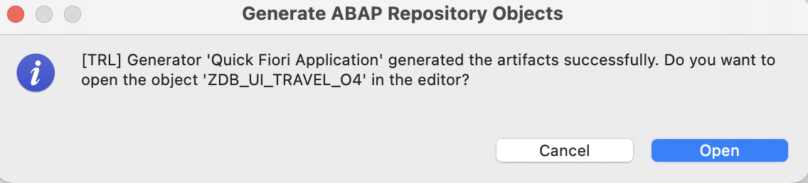
 
8. In the service binding editor, you now see a clickable Fiori App URL. 

    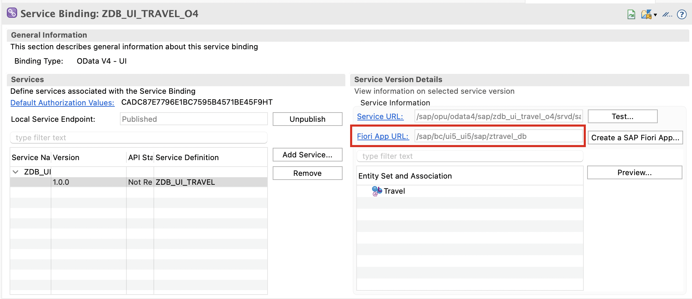

        **Note** that the Fiori App URL will not work immediately after creation in cloud systems. The app needs to be part of an IAM App and Business Catalog before the URL works.

### Check BSP library and SAP Fiori Launchpad app descriptor item in Eclipse

1. The BSP application and Fiori Launchpad App Descriptor item are generated in the chosen package along with two SICF objects. You now have a basic deployed Fiori app. If you are not able to see BSP applications and SAP Fiori Launchpad app description items, refresh your package by pressing  `F5`.

    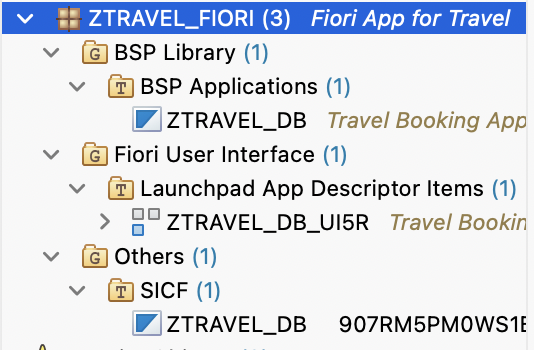

### Create IAM App and Business Catalog

1. In Eclipse right-click your package and select **New** > **Other Repository Object**.

2. Search for **IAM App**, select it and click **Next >**.

      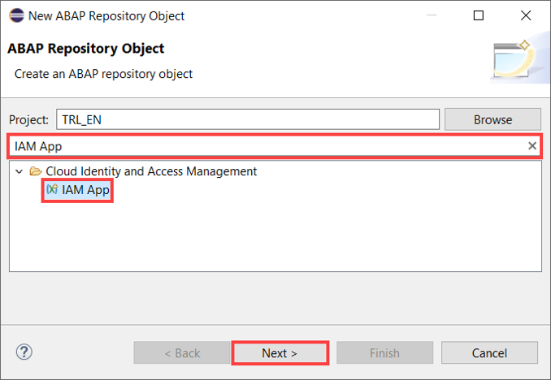

3. Create a new IAM App:
     - Name: **`ZTRAVEL_IAM_XXX`**
     - Description: IAM App

      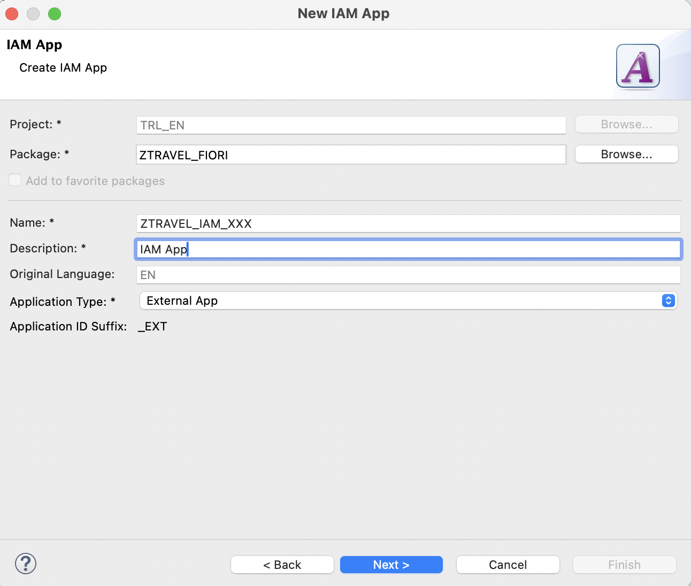

      Click **Next >**.

4. Click **Finish**.

5. Select **Services** and add a new one.
      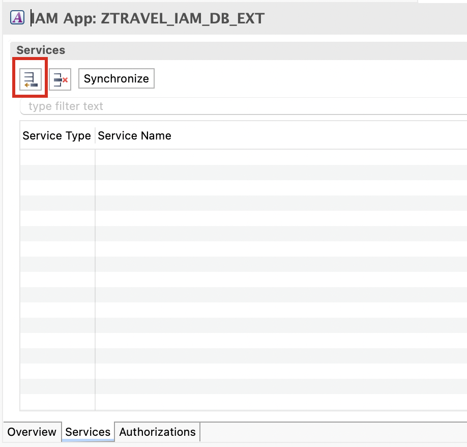

6. Select following:

      - Service Type: `OData V4`
      - Service Name: `<your_service_definition>`  

      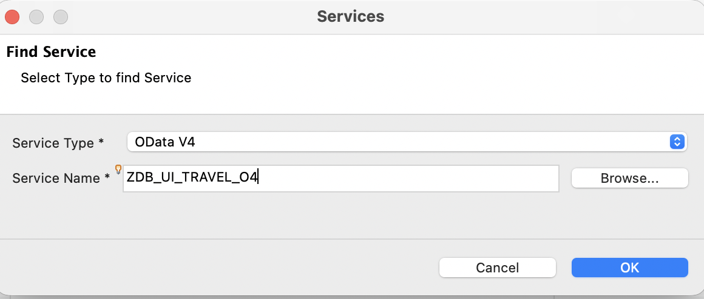

      Click **OK**.

      **Save** and choose **Publish Locally** to Activate your IAM app.

      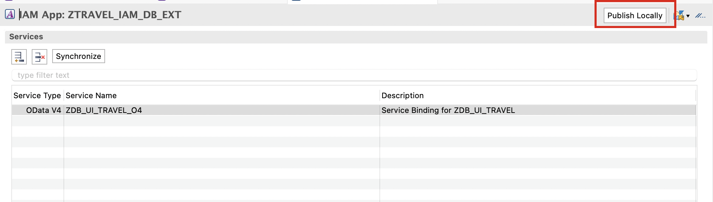

7. Right-click your package **`ZTRAVEL_APP_XXX`** and select  **New** > **Other Repository Object**.

8. Search for **Business Catalog**, select it and click **Next >**.

      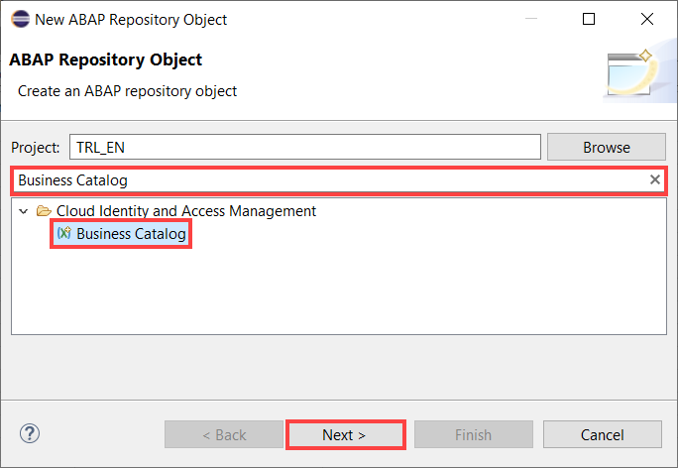

9. Create a new Business Catalog:
     - Name: **`ZTRAVEL_BC_XXX`**
     - Description: Business catalog

      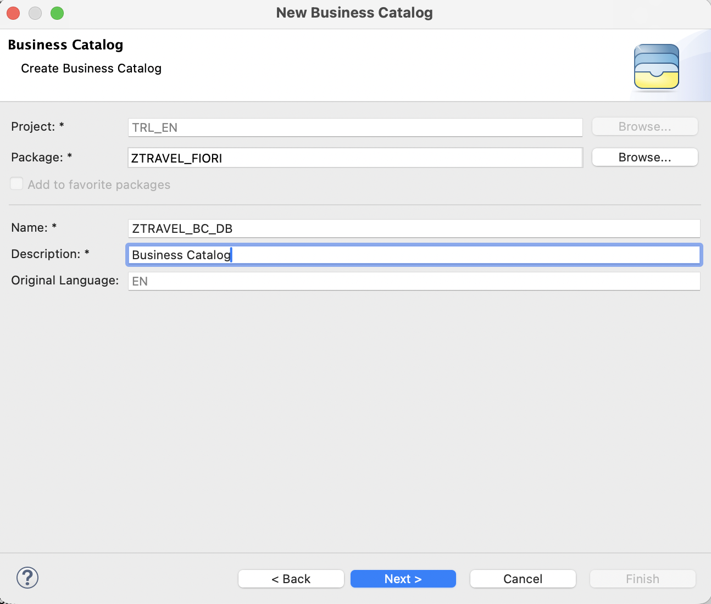 

      Click **Next >**.

10. Choose Transport Request is required and Click **Finish**.

11. Select **Apps** and add a new one.

      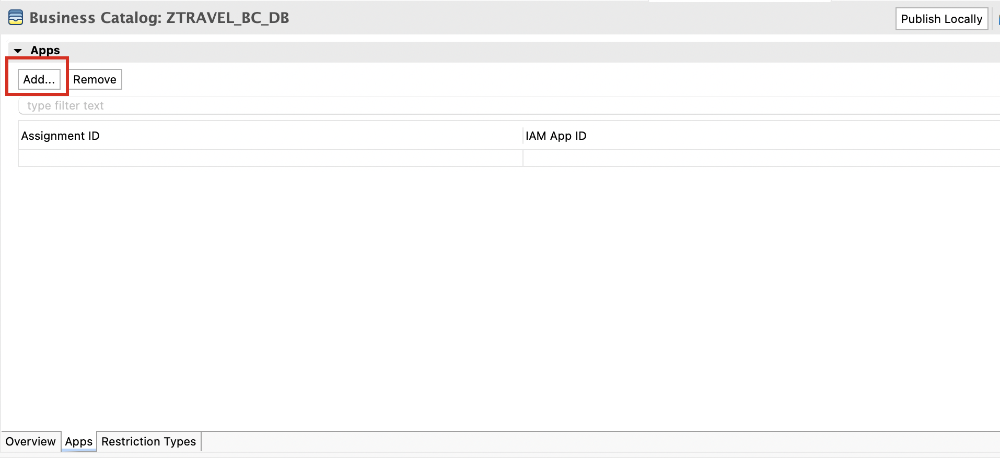 

12. Create a new Business Catalog:
     - IAM App: `ZTRAVEL_IAM_XXX_EXT`
     - Name: `ZTRAVEL_BC_XXX_0001`

      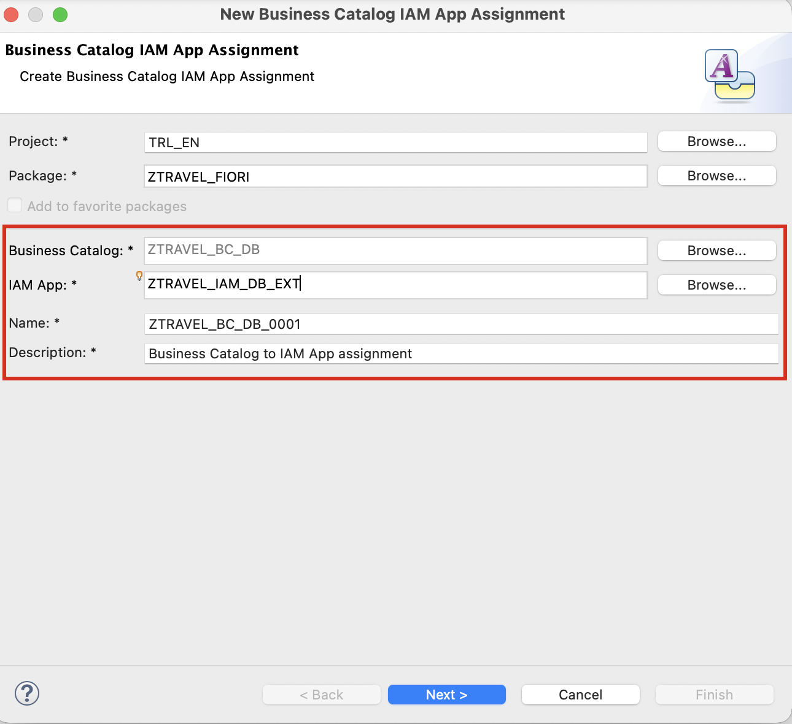

      Click **Next >**.

13. Click **Finish**.

14. Click **Publish Locally** to publish your business catalog.

       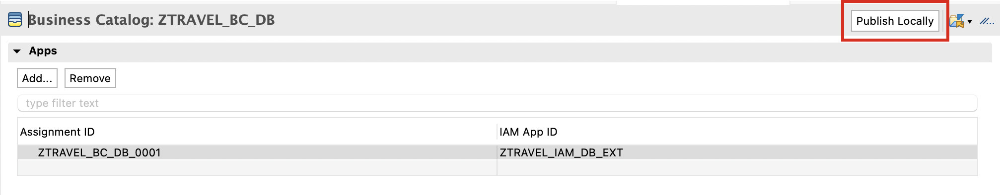 

### Launch the Fiori App URL

1. In the service binding editor, click on the Fiori App URL. 

    
2. This will launch the preview of the Fiori Application.

### Test yourself
