# Transport a Software Component Between two Systems Using Any Git Repository (BYOG)

<!-- description --> Connect your own Git repositories to two instances of SAP BTP ABAP Environment, using the Fiori app Manage Software Components


## Prerequisites 

- You have two service instances of SAP BTP ABAP Environment on the same global account
- In the source system, you have assigned the copies of the business role templates **`SAP_BR_ADMINISTRATOR`** and **`SAP_BR_DEVELOPER`** to your user
- In the target system, you have assigned a copy of the business role template **`SAP_BR_ADMINISTRATOR`** to your user 
- You have installed the latest version of [ABAP in Eclipse (ADT)](https://tools.hana.ondemand.com/#abap)
- You have created a new empty repository with the preferred git provider. The repository must be publicly accessible on the internet - repositories hosted on a private company network are currently not supported
- You have administrative authorizations to push, pull and clone from this repository; credentials must include a username and a password or token


## You will learn 

- How to create and clone a remote repository
- How to create a software component and link the remote repository
- How to clone the software component
- How to create a branch
- How to delete a software component
- How to create and delete tags

This will give you a better overview of your own code, branches, and commits.

Throughout this tutorial, replace `###` or `000` with your initials or group number.


### Introduction

Until now, the ABAP repositories in Steampunk were managed by the [SAP Help Portal: Manage Software Components](https://help.sap.com/docs/btp/sap-business-technology-platform/manage-software-components) app. This was the only interface where you could see the status of your remote repository. **Bring Your Own Git (BYOG)** allows you to connect your own Git repositories with the **Manage Software Components** app. 

However, you are not allowed to make code changes in your remote Git repository and then import these changes into the local SAP system, since this could violate any guidelines for cloud development. 

> For more information on these guidelines, see [C0 Developer Extensibility for CDS Data Models](https://blogs.sap.com/2022/08/18/c0-developer-extensibility-for-cds-data-models/)

<!--
??? [Development Constraints](https://help.sap.com/docs/ABAP_PLATFORM_NEW/b5670aaaa2364a29935f40b16499972d/e7ef991d579047fd88fcd5261c8f4a55.html?locale=en-US)  
-->


### Create remote repository

First, open your preferred Git provider, such as GitHub, and create a new repository.

> IMPORTANT: Create a branch at the same time. In Github, adding a readme file will automatically create a main branch for the repository.
> 
<!-- border -->
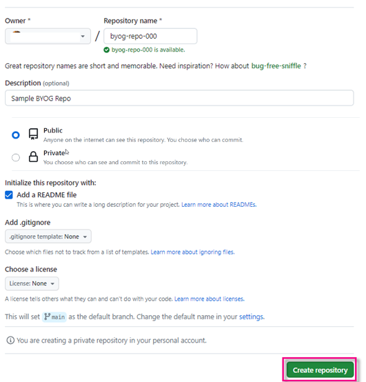


### Create a software component and clone the remote repository

1. In **Manage Software Components**, create a new software component. Enter the following and choose **Create**:
   
   - Namespace: *For test purposes, usually **Z**.*
   - Name: *Based on remote repo name, here **`BYOG_REPO_###`**.*
   - Description: Bring your own git
   - Repository URL: *Github repo from previous step*
   - Type: **Development**

   <!-- border -->
   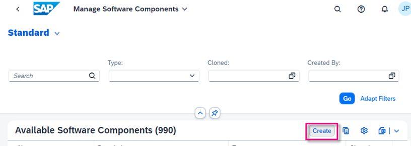
   
   <!-- border -->
   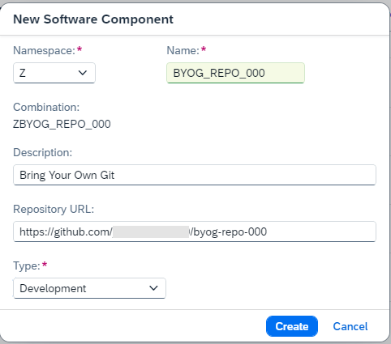

2. Choose **Clone** in the top right corner.

    <!-- border -->
    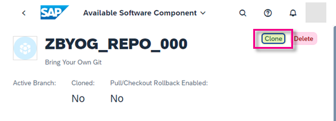   

3. Enter the following and choose **Next**.
    - *User name and the password or token of your git credentials*
    - *Appropriate radio button for your authentication method, either password or OAuth token.
   
    > **Important**: The credentials must be for a user who has administrative rights to the repository and is allowed to push and pull changes.


4. From the dropdown select the name of the branch you want to clone and choose **Clone**.

    <!-- border -->
    

When the cloning is finished, the status changes to **Success**. 

<!-- border -->
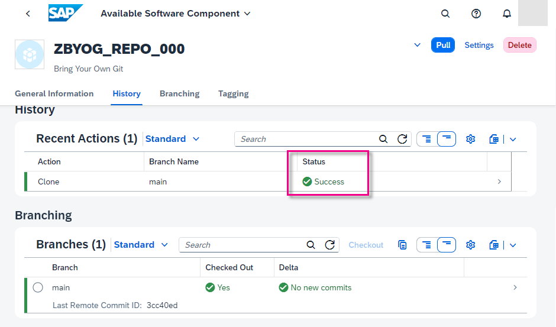 

In the remote repository, a new commit has been generated  from noreply@example.com and a new file added.

<!-- border -->
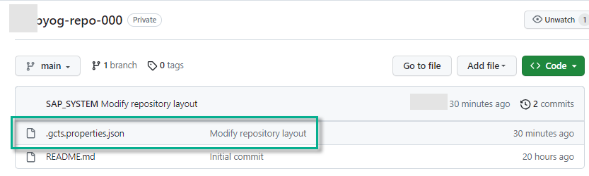 

> **Important**: This file is necessary for pushing and pulling changes into the SAP system. **Therefore this file should never be deleted or modified at any time.** 


### Create ABAP development package

1. Open ABAP in Eclipse (ADT.) You will see that a structure package has been automatically created, with the same name as the software component.
   
2. Create an ABAP package of type development: Select your structure package, then choose **New > ABAP Package** from the context menu. 
   
3. Enter the following, then choose **Next**.

    - Name: **`ZBYOG_TEST_GITHUB_###`** *if you are using Github*
    - Description: **Test gCTS with GitHub**
    - Superpackage: *Should be added automatically*
    - Package Type: Development

    <!-- border -->
    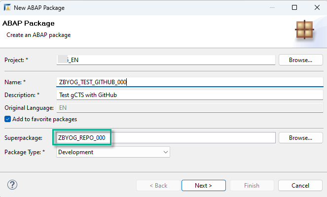

 4. The software component and transport layer are automatically derived from the generated structure package. Choose **Next**, then **Finish**.

    <!-- border -->
    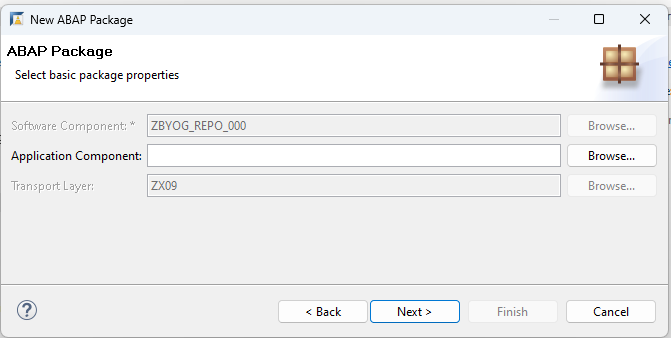

    <!-- border -->
    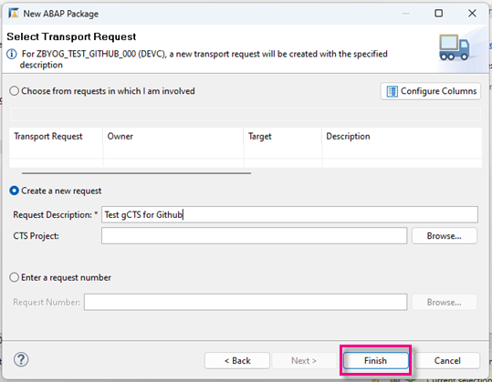


### Create ABAP class

1. Create a new ABAP class: Choose **File > New > Other... > ABAP Class**.

2. Enter the following for your class, then choose **Next**. 
    - Name: **`ZCL_HELLO_WORLD_###`**
    - Description for your class, e.g. **Test gCTS with GitHub** 
    - Interface: **`if_oo_adt_classrun`**. *This enables you to run the class in the console.*

3. Choose the same transport request.

4. Add the following code to your class:

    ```ABAP
    CLASS zcl_hello_world_### DEFINITION
    PUBLIC
    FINAL
    CREATE PUBLIC .

    PUBLIC SECTION.

        INTERFACES if_oo_adt_classrun .
    PROTECTED SECTION.
    PRIVATE SECTION.
    ENDCLASS.

    CLASS zcl_hello_world_### IMPLEMENTATION.

        METHOD if_oo_adt_classrun~main.
            out->write( 'Hello' ).
        ENDMETHOD.
    ENDCLASS.

    ```

5. Format, save, and activate your class (**`Sh+F1`, `Ctrl+S`, `Ctrl+F3`**). 
   
6. Run your class as a console application. The output should look roughly like this:

    <!-- border -->
    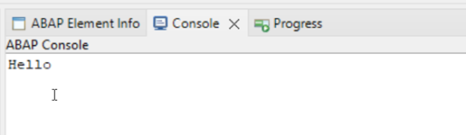


### Release transport task and request

1. Release the transport task (**F9**).
   
2. Release the transport request (**F9**).

    <!-- border -->
    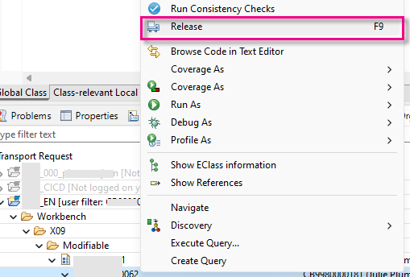

The transport request number and the transported objects are now visible in your remote repository.


### Pull ABAP class into target system

To import your released transport into a target system (e.g., your test or production system), you must clone the same repository into this target system. 

1. Repeat step 3.2 to 3.4. The only difference is the “Repository Role”, which now must be set to “Target”. 

    <!-- border -->
    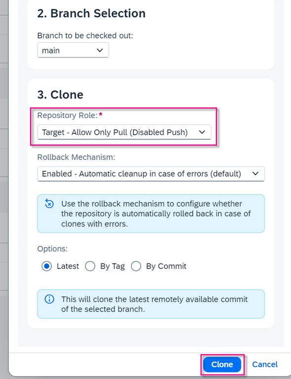

2. Open the target system in ADT. You can see the transported objects.

    <!-- border -->
    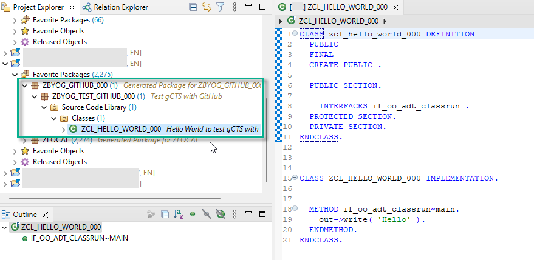


### Optional: Create a branch

Currently, creating a new branch for BYOG is not supported in **Manage Software Components**.  Therefore, create the branch using the native interface of your git provider linked to your repository.

<!-- border -->
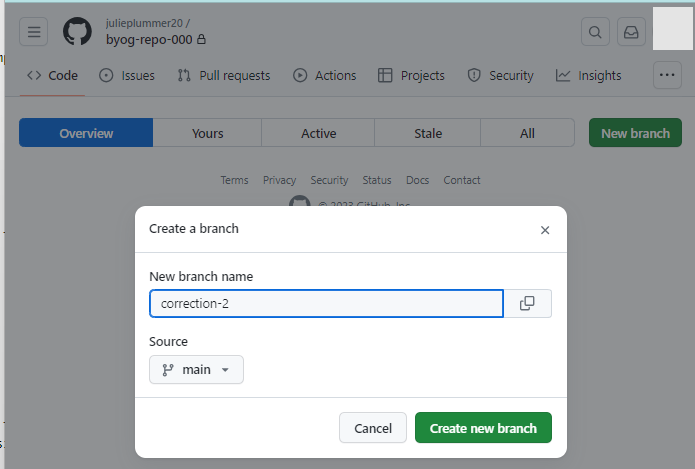

In **Manage Software Components**, you can see the new branch by refreshing the **Branches** table. You can then proceed as usual with checkout.

<!-- border -->


### Optional: Create a tag

The **Tag** function is the same as in non BYOG software components.

To create a tag, go to the commit view of your selected branch.
The created tag will also be visible on your remote repository.
Deleting a tag will also delete the tag in the remote repository.


### Optional: Delete a software component

Deleting a software component in **Manage Software Components** will unlink the component to the remote repository, but will **not** delete the remote repository in Github. The local software component will be marked as **not editable**; releasing transport requests will no longer be possible. 

> **Important**: Deleting the software component is an irreversible action. 

To delete the component simply choose **Delete**.


### Test yourself


### More Information

- Blog post: [Bring your own Git for SAP BTP ABAP Environment](https://community.sap.com/t5/technology-blogs-by-sap/bring-your-own-git-for-sap-btp-abap-environment/ba-p/13585439)

- SAP Help Portal: [How to Configure Your Git Repository](https://help.sap.com/docs/sap-btp-abap-environment/abap-environment/how-to-configure-your-git-repository)

---
