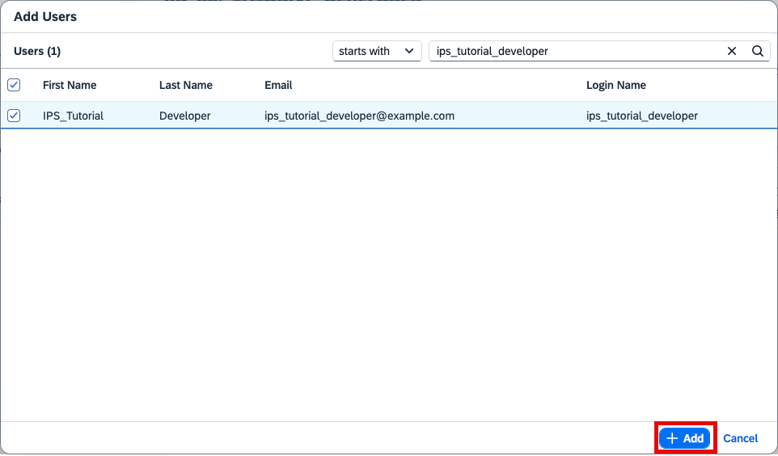

# Provision Users into your SAP BTP ABAP Environment
<!--done in https://rapworkshop.accounts.ondemand.com/admin with D20 (not existing any more) -->
<!-- description --> Provision and authorize users for ABAP development via Cloud Identity Services in one or more target systems

## Prerequisites
 - You have installed and set up ABAP Development Tools for Eclipse, see <https://tools.hana.ondemand.com/#abap>
 - You have an **SAP Business Technology Platform** customer subaccount and have prepared the following
    - Subscription to **SAP Cloud Identity Services**
    - Established trust to your **SAP Cloud Identity Services tenant**, see [SAP BTP ABAP Environment Documentation: Setup of a Custom Identity Service](https://help.sap.com/viewer/65de2977205c403bbc107264b8eccf4b/Cloud/en-US/550251abaf49432bbaa65147b65a1f39.html)
    - Created an **SAP BTP ABAP Environment** service instance for custom development with
        - An SAP Fiori launchpad business role for custom ABAP development created from template `SAP_BR_DEVELOPER`, as for example in this tutorial `BR_IPS_TUTORIAL_DEVELOPER`
        - A service key for ADT integration
 - You have one or more users with authorization for
    - User and Group Management in your **SAP Cloud Identity Services tenant**
    <!--- Space development in your ABAP system service instance's Cloud Foundry space-->
    - **Communication Management** in your SAP BTP ABAP Environment service instance (business catalog ID `SAP_CORE_BC_COM` or business role from template ID `SAP_BR_ADMINISTRATOR`)

## You will learn
  - How to create and group developer identities in your **SAP Cloud Identity Services tenant**
  - How to enable identity provisioning in your SAP Cloud Identity Services tenant
  - How to configure and run identity provisioning
  - How to connect Eclipse with the SAP BTP ABAP Environment

**Additional information**

  - In this use case the **SAP Cloud Identity Services tenant** is used as an identity provider and not as a proxy to another identity provider.
  - [Documentation: SAP Cloud Identity Services – Identity Provisioning](https://help.sap.com/viewer/f48e822d6d484fa5ade7dda78b64d9f5/Cloud/en-US/2d2685d469a54a56b886105a06ccdae6.html)

>Tutorial last updated with SAP S/4HANA Cloud Release 2302

---

### Create User in SAP Cloud Identity Service Tenant

As the SAP Cloud Identity service tenant serves as the identity provider, we first ensure that there is an identity for the developer, that shall get a user provisioned in a SAP BTP ABAP Environment.

1. Log on with your User Management Administrator to your SAP Cloud Identity Services tenant's administration UI (URL ends with path `/admin`, for example `https://rapworkshop.accounts.ondemand.com/admin`).
   
2. Navigate to **Users & Authorizations** > **User Management**.

    

3. Select **Add** to start the creation process of a user.
   
4. Fill the personal information for the user and select **Add**.

    

5. The new user is now displayed in the list of users.

    

>Note that the SAP Cloud Identity Services user will receive an email to activate the account before being able to log on with a local user in some other connected system for the first time.


### Create Developer Group and Assign User

To bundle developer users, create a corresponding user group in the SAP Cloud Identity Services tenant and assign the users to it.

1. Navigate to **Users & Authorizations** > **Groups** and select **Create**.

    

2. In the Create Group dialog enter a **Name** and **Display Name** and select **Next Step**.

    > For the group name, please use the identical name you have set for the business role in your SAP BTP ABAP Environment (created from template `SAP_BR_DEVELOPER`, see prerequisites).

    
3. Leave Application details empty and select **Next Step**
4. To add users to the group select **Add**.

    

5. Search for the user that you have created earlier, select it, and choose **Add**.

    

6. The user is now displayed in the user group list.

    


### Authorize Identity Provisioning Manager

Authorize an Administrator user for Identity Provisioning Management.

Navigate to **Users & Authorizations** > **Administrators** choose the Administrator user, slide the toggle button for **Manage Identity Provisioning** to **ON** and select **Save**.


### Configure Identity Provisioning Source

Identity provisioning requires to configure a so-called source system which is used as a data source for users and user groups that can be provisioned to other systems. We simply need to maintain the used SAP Cloud Identity Service tenant itself as source.

1. Logon with your Identity Provisioning Manager user to your SAP Cloud Identity service tenant's administration UI (URL ends with path `/admin`, for example `https://rapworkshop.accounts.ondemand.com/admin`).

2. Navigate to **Identity Provisioning** > **Source Systems** 

    

3. To start the creation, select **Add**.    

4. To simplify the system creation and to reduce the risk of errors, this tutorial provides a template JSON file for the source system. Download [`ips_system_template_source.json`](https://raw.githubusercontent.com/sap-tutorials/abap-core-development/master/tutorials/abap-environment-ips/ips_system_template_source.json) locally.

5. Define the system by uploading the JSON file via **Browse** in the Identity Provisioning source system UI.

6. Adapt the values to your needs and provide the mandatory value for `URL` as shown below.

    Alternatively, you can configure everything manually.

    Details:

    |  Label     | Value
    |  :------------- | :-------------
    |  Type           | Identity Authentication
    |  System Name           | For example **`My Identity Authentication service ABAP Developers`**

    Properties:

    |  Name     | Value
    |  :------------- | :-------------
    |  **`Type`**           | **`HTTP`**
    |  **`ProxyType`**           | **`Internet`**
    |  **`URL`**          | your SAP Cloud Identity service tenant URL, for example <https://rapworkshop.accounts.ondemand.com>
    |  **`Authentication`** | **`ClientCertificateAuthentication`**
    |  **`ias.user.filter`**   | **`groups.display eq "BR_IPS_TUTORIAL_DEVELOPER"`**
    |  **`ias.group.filter`**   | **`displayName eq "BR_IPS_TUTORIAL_DEVELOPER"`**

7. **Save** your changes.

8. Switch to the **Outbound C...** (C... like Certificate) tab and **Download** the certificate (which was automatically generated during creation of the system) for later usage.

    

9. **Save** again.


### Configure Access to Source via Technical User

In this example the provisioning SAP Cloud Identity Services tenant itself is used as the source for users and user groups that can be provisioned to other systems. But still to allow identity provisioning to read users and groups, you need a technical user with corresponding permissions.

1. Navigate to **Users & Authorizations** > **Administrators**.

2. Select **Add** and choose **System**.

    

3. Provide a **Name** for the system, for example `ips_tutorial_admin`.
   
    
   
4. Make sure to have set authorizations for **Read Users** and **Manage Groups** which are both needed to read users and groups during identity provisioning.
   
5. **Save** your changes.

6. Navigate to **Configure System Authentication** >  **Certificate**.

    

7. **Browse** for the certificate of the source system and **Save** the technical user again.

    

Now the source system can be authenticated via the certificate sent by Identity Provisioning, be mapped to the technical user and via that has the authorizations to read users and groups.


### Configure Identity Provisioning Target

Identity provisioning requires to configure a so-called target system to provision user and user group data to. In this example, the target systems is an ABAP system in SAP BTP.

1. Logon with your Identity Provisioning Manager user to your SAP Cloud Identity Services tenant's administration UI (URL ends with path `/admin`, for example `https://rapworkshop.accounts.ondemand.com/admin`).

2. Navigate to **Identity Provisioning** > **Target Systems** 

    

3. To start the creation, select **Add**.    

4. To simplify the system creation and reduce the risk of errors, this tutorial provides a template JSON file for the target system. Download [`ips_system_template_target.json`](https://raw.githubusercontent.com/sap-tutorials/abap-core-development/master/tutorials/abap-environment-ips/ips_system_template_target.json) locally.

5. Define the system by uploading the JSON file via **Browse** in the Identity Provisioning target system UI.

6. Adapt the values to your needs and provide the mandatory value for `Source System` and `URL` as shown below.

    Alternatively, you can configure everything manually.

    Details:

    |  Label     | Value
    |  :------------- | :-------------
    |  Type           | SAP BTP ABAP environment
    |  System Name           | For example **`My ABAP instance`**
    |  Description           | For example **`System to receive provisioned Developer Users`**
    |  Source System           | Choose the one created earlier from the dropdown

    Properties:

    |  Name     | Value
    |  :------------- | :-------------
    |  **`Type`**           | **`HTTP`**
    |  **`ProxyType`**           | **`Internet`**
    |  **`URL`**          | The API URL of your SAP BTP ABAP Environment
    |  **`Authentication`** | **`ClientCertificateAuthentication`**
    |  **`Identity Provisioning ips.date.variable.format`**   | **`yyyy-MM-dd`**

7. **Save** your changes.

8. Switch to the **Outbound C...** (C... like Certificate) tab and **Download** the certificate (which was automatically generated during creation of the system) for later usage.

    

9.  **Save** again.


### Configure Access to Target via Communication Management

To enable Identity Provisioning to create users and assign business roles in the target system, that system has to know it and provide the corresponding authorization to it. The Identity Provisioning will be represented and authenticated as a communication user and system, the required authorizations for Business User operations will be given to it via the corresponding communication scenario in a communication arrangement. 

1. Enter your ABAP environment's Fiori Launchpad with the user that is authorized to use the **Communication Management** apps.

2. Start typing **Maintain Communication Users** in the Launchpad search and open the App from the results.

    

3. Select **New**.

    

4. Enter a **User Name** for example, `IPS_TUTORIAL_USER`, enter a **Description**, **Upload** the certificate from the Identity Provisioning target system, and select **Create**.

    

5. Start typing **Communication Systems** in the Launchpad search and open the App from the results.

    

6. Select **New**.

7. Enter a **System ID** and **System Name**, for example `IPS_TUTORIAL_SYSTEM` in the opening pop up and select **Create**.

    

8.  In the object page of the new communication system under **General** > **Technical Data**, mark the checkbox to make the communication system **Inbound Only**.

    

9.  Under **Users for Inbound Communication**, select the **+** to add a user. In the opening pop up, select the communication user you created earlier and choose **OK** so that the pop up closes.

    

10. **Save** the system.

11. Start typing **Communication Arrangements** in the Launchpad search and open the App from the results.

    

12. Select **New**.

13. A pop up for the creation of a new communication arrangement opens, where you have to select scenario **Identity Provisioning Integration** `SAP_COM_0193`. This communication scenario exposes all the needed services for identity provisioning integration.

    

14. Select **Create**.

    

15. Set the Communication System

    

16. **Save** the communication arrangement.

Now the communication user can be authenticated via the certificate sent by Identity Provisioning and has the authorization to create users and assign roles.

<!--service key version--->
<!--1. Navigate to **Services > Instances and Subscriptions** in your SAP BTP subaccount, search for your ABAP environment instance and select **Create Service Key**

    

2. In the **New Service Key** dialog, provide a name and copy & paste the following JSON code:


    ```JSON
    {
      "scenario_id":"SAP_COM_0193",
      "type":"basic"
    }
    ```

3. **Create** the new service key.

    

    >This service key creation automatically creates a communication user (1), communication system (2) and communication arrangement (3) for communication scenario `SAP_COM_0193` (4) in the ABAP environment instance.
    >
    
    >
    Communication scenario `SAP_COM_0193` exposes all the needed services for identity provisioning integration. With the communication user credentials, you can make inbound calls to that system to provision users and assign roles per groups.

4. The credentials created for the communication user are also available in the subaccount. To view them, navigate to **Services > Instances and Subscriptions** and select your service instance.

    

5. From the Actions menu, choose **View Credentials**.

    

6. Choose the credentials that you have set earlier as service key for Identity Provisioning.
Copy the **`username`**, **`password`** and **`url`** value for the next step.     

    -->


### Run Identity Provisioning

Now you can run the Identity provisioning.


1. Switch to **Identity Provisioning** > **Source Systems**.

2. Open your source system.
   
3. Select the **Jobs** tab.

4. Choose **Run Now**.

5. To check the status of the job run, select **Identity Provisioning** > **Provisioning Logs** from the navigation pane.

    

6. Search for your log by checking the source system name and time and make sure the status is **Success**.

>If the run did not finish successfully, you can navigate to the log and follow the instructions there to analyze and solve the problem. See also [Guided Answers: Identity Provisioning Troubleshooting](https://ga.support.sap.com/dtp/viewer/#/tree/2065/actions/26547:29111:29114:27412).


### Log On to SAP BTP ABAP Environment in Eclipse

Now that the Developer user has been provisioned and authorized in the SAP BTP ABAP Environment for ABAP development, you can connect the user to the system by using ABAP Development Tools for Eclipse.

1. Open your Eclipse and navigate to **File > New > Project**.

    

2. Choose **ABAP Cloud Project** and select **Next**.

    

3. Choose **SAP BTP ABAP Environment** > **Use a Service Key**  and select **Next**.

    

4. Paste the service key for Eclipse integration (see prerequisites).

    

5. **Copy Logon URL to Clipboard**.

    

6. Enter the credentials of the Developer User and log on.

    

7. A success message is displayed and the browser window can be closed.

    

8. In the project wizard in Eclipse, check the SAP BTP ABAP Environment and user data, that are displayed in the **Service Instance Connection** dialog and select **Finish**.

    

9. The new project is displayed and you can start developing.

    


### Test yourself


---
