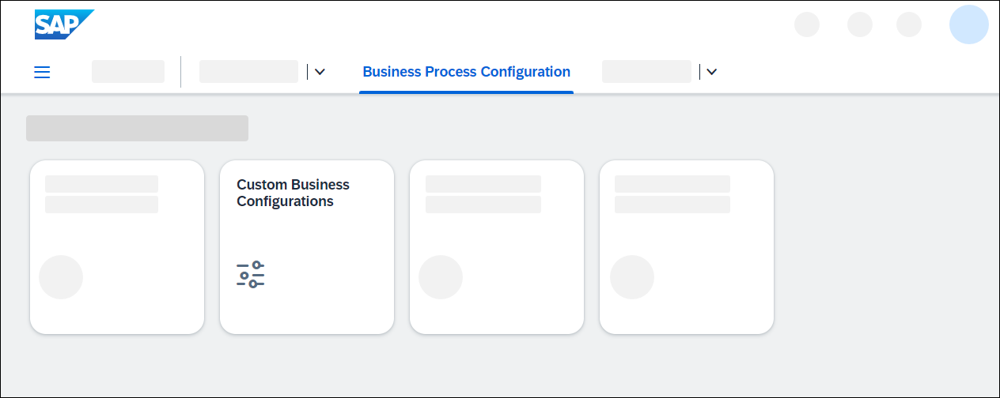
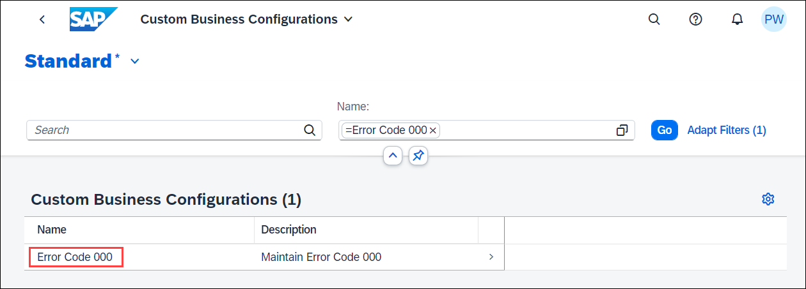
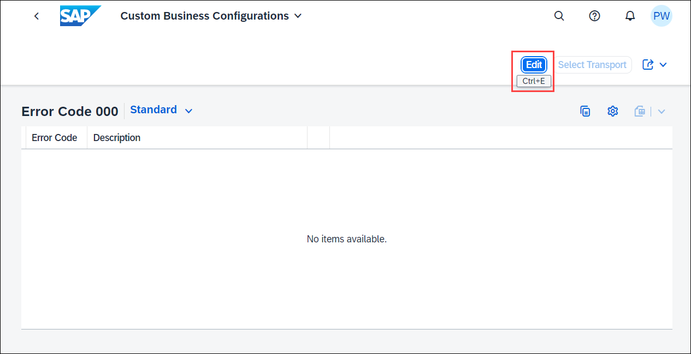
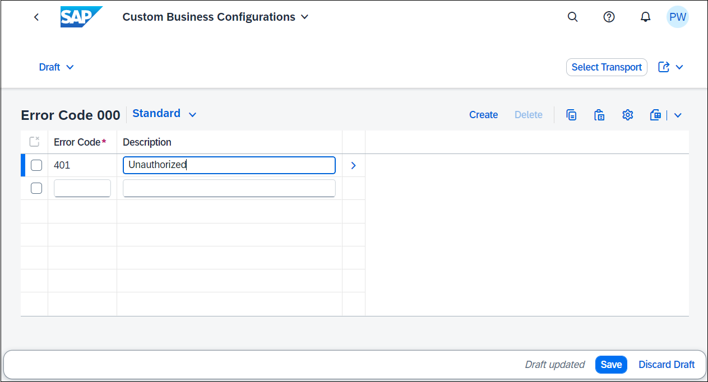
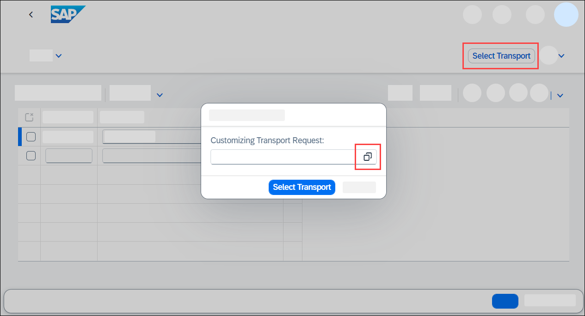
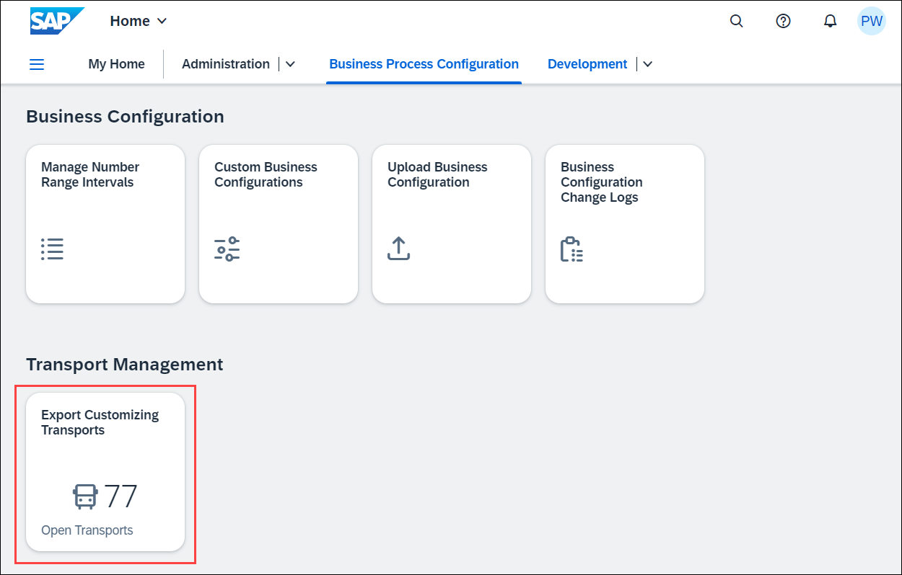
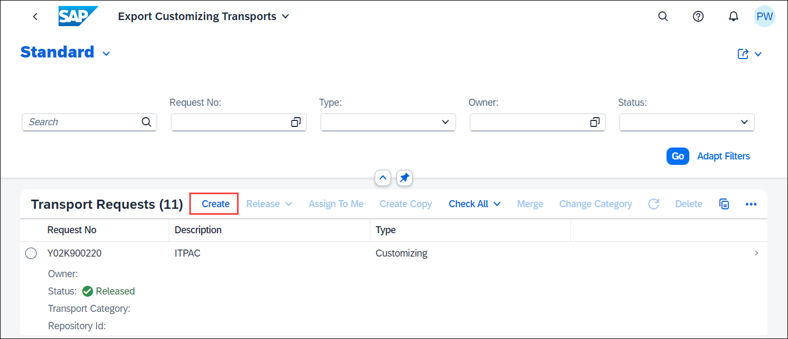
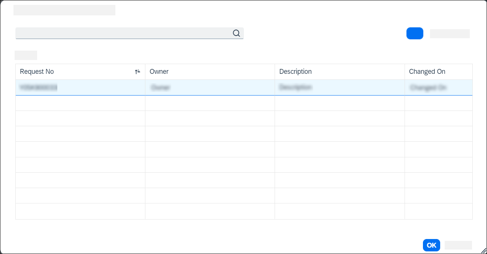

# Use Custom Business Configurations app
<!-- description --> Learn how to use the Custom Business Configurations app to maintain configurations.

## Prerequisites  
- You need an SAP BTP, ABAP environment license or a [trial user](abap-environment-trial-onboarding).
- This tutorial also works in an SAP S/4HANA Cloud, public edition system.
- This is the third tutorial of group [Create a SAP Fiori based Table Maintenance app](group.abap-env-factory). You must complete the tutorials in the given order.

## You will learn  
- How to use the Custom Business Configurations app to maintain configurations

## Intro
The [**Custom Business Configurations**](https://help.sap.com/viewer/65de2977205c403bbc107264b8eccf4b/Cloud/en-US/76384d8e68e646d6ae5ce8977412cbb4.html) app serves as an entry point to the configuration objects provided by different applications or partners. You can use the app to adjust these configuration objects to change and influence the system behavior.

The required business catalog is included in the `SAP_BR_BPC_EXPERT (Configuration Expert - Business Process Configuration)` business role template. Make sure that this role is assigned to the user who is responsible for maintaining the error codes.

>**Hint:** The trial user in SAP BTP ABAP trial system already has the required catalog.

---
### Custom Business Configurations

  1. Launch SAP Fiori Launchpad.

  2. Log on with the user who is responsible for maintaining the error codes.

  3. Select **Custom Business Configurations** tile.

      

  4. Select your business configuration.

      

  5. Click **Edit**. When the Edit action is performed, a customizing transport request is determined automatically. You can see the determined transport request in the header area. You can find the determination logic in the ABAP documentation of method `get_transport_request` of interface `if_mbc_cp_rap_tdat_cts`.

      

  6. Enter the following:
     - Error Code: **`401`**
     - Description: **`Unauthorized`**

     

     Click **Save**.

  7. If the system was able to automatically determine a customizing request, or if you only have a SAP BTP trial account and have made the adjustments mentioned in the first tutorial, the save process is successful and you can now set this step to **Done** and proceed to the next step **Test yourself**. 
  If not, you are prompted to select a transport request.

8. Click on the input help button. If a task of a modifiable transport request is assigned to your user, you can select the transport request and then continue with saving by clicking on **Select Transport Request**. If this is not the case, you must first create a new one.

     

9. To create a transport request, return to the SAP Fiori Launchpad home page and choose the [**Export Customizing Transports**](https://help.sap.com/viewer/65de2977205c403bbc107264b8eccf4b/Cloud/en-US/fa7366c3888848bd94566104ac52e627.html) app.

     

10. Click **Create**.

     

11. Create a transport request:
    - Description: **`New Error Codes ###`**
    - Technical Type: **`Customizing Request`**

    Click **Create**.

12. In the **Custom Business Configurations** app, save again. Use the input help to select a transport request. Then click **Select Transport Request**. If you do not find a transport request, try reloading the **Custom Business Configurations** app.

    

13. The data was recorded on the transport request. Business configuration content can be recorded in both business configuration and development software components. For the transport request, the attribute `SAP_CUS_TRANSPORT_CATEGORY` must be set to `DEFAULT_CUST` or `MANUAL_CUST`.

### Test yourself

---
