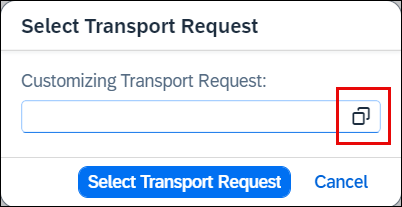

# Use Custom Business Configurations app
<!-- description --> Learn how to use the Custom Business Configurations app to maintain configurations.

## Prerequisites  
- You need an SAP BTP, ABAP environment license or a [trial user](abap-environment-trial-onboarding).
- This tutorial also works in an SAP S/4HANA Cloud, public edition system.
- This is the third tutorial of group [Create a SAP Fiori based Table Maintenance app](group.abap-env-factory). You must complete the tutorials in the given order.

## You will learn  
- How to use the Custom Business Configurations app to maintain configurations

## Intro
The [**Custom Business Configurations**](https://help.sap.com/viewer/65de2977205c403bbc107264b8eccf4b/Cloud/en-US/76384d8e68e646d6ae5ce8977412cbb4.html) app serves as an entry point to the configuration objects provided by different applications or partners. You can use the app to adjust these configuration objects to change and influence the system behavior.

The required business catalog is included in the `SAP_BR_BPC_EXPERT (Configuration Expert - Business Process Configuration)` business role template. Make sure that this role is assigned to the user who is responsible for maintaining the error codes.

>**Hint:** The trial user in SAP BTP ABAP trial system already has the required catalog.

---
### Custom Business Configurations

  1. Start SAP Build Work Zone. You can launch SAP Build Work Zone from ADT by right-clicking your ABAP system in the Project Explorer and selecting **Properties**, selecting **ABAP Development**, and clicking the system URL.

  2. Log on with the user who is responsible for maintaining the error codes.

  3. Select **Custom Business Configurations** tile.

      

  4. Select your business configuration.

      

  5. Click **Edit**.

      

  6. Enter the following:
     - Error Code: **`401`**
     - Text: **`Unauthorized`**

     

     Click **Add Row**.

  7. Click **Save**.

     

  8. If you only have a SAP BTP trial account and have made the code adjustments mentioned in the first tutorial, the save process is successful and you can now set this step to **Done** and proceed to the next step **Test yourself**. If not, you get an error message that the transport request is missing. Click **Close**.

      

9. Click on **Select Transport**.

    

10. If a task of a modifiable transport request is assigned to your user, you can select the transport request and continue with saving. If this is not the case, you must first create a new one.

    

11. To create a transport request, return to the SAP Build Work Zone home page and choose the [**Export Customizing Transports**](https://help.sap.com/viewer/65de2977205c403bbc107264b8eccf4b/Cloud/en-US/fa7366c3888848bd94566104ac52e627.html) tile.

     

12. Click **Create**.

     

13. Create a transport request:
    - Description: **`New Error Codes ###`**
    - Technical Type: **`Customizing Request`**

    Click **Create**.

14. If you get an error message that a default transport request already exists, choose **Cancel**, go back and search for the default customizing request.

    

    Select the default transport request and create a new task for your user.

    

    Create new task:
    - Description: **`New Error Codes`**
    - Owner: **`<User responsible for maintaining error codes>`**

    

    Click **Create**.

15. In the **Custom Business Configurations** app, click the **Select Transport** action again. Use the input help to select a transport request and click **OK** and then **Select Transport**. The selected transport request is now displayed in the **Transport** section. If you do not find a transport request, try reloading the **Custom Business Configurations** app.

    

16. Click **Save**. The data was recorded on the transport request.

17. If you have enabled `Log Changes` for the database table, you can navigate to the **Business Configuration Change Logs** app by clicking **Display Change Logs** in the **Custom Business Configurations** app.

    
     
>Business configuration content can be recorded in both business configuration and development software components. The former is recommended, see also [Business Configuration for SAP Cloud Platform ABAP Environment | SAP Blogs](https://blogs.sap.com/2019/12/20/business-configuration-for-sap-cloud-platform-abap-environment/). For the transport request, the attribute `SAP_CUS_TRANSPORT_CATEGORY` must be set to `DEFAULT_CUST` or `MANUAL_CUST`.

### Test yourself

---
