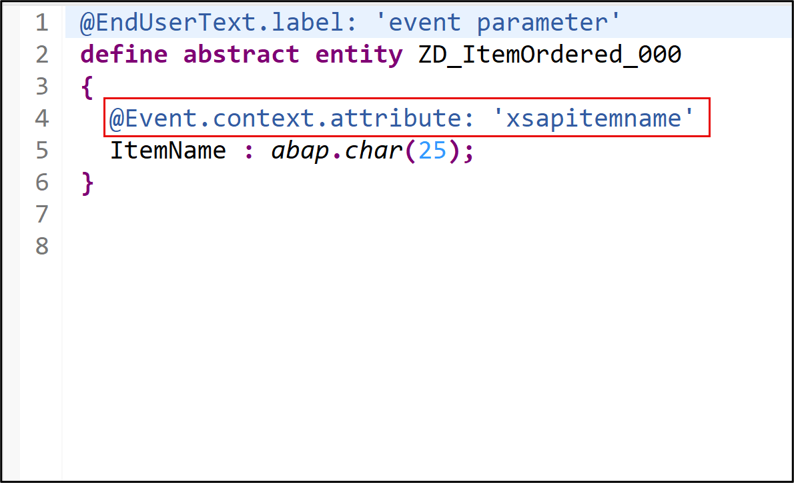
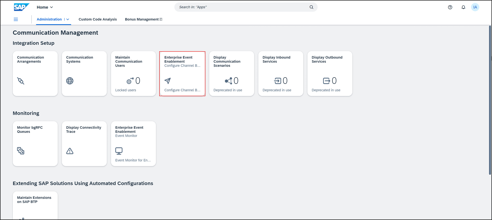
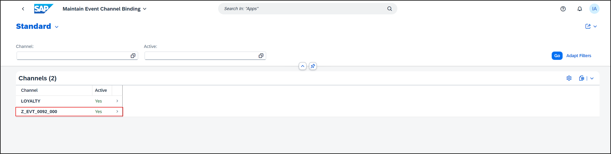
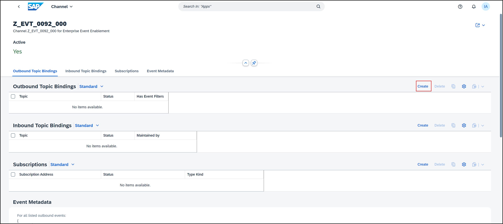
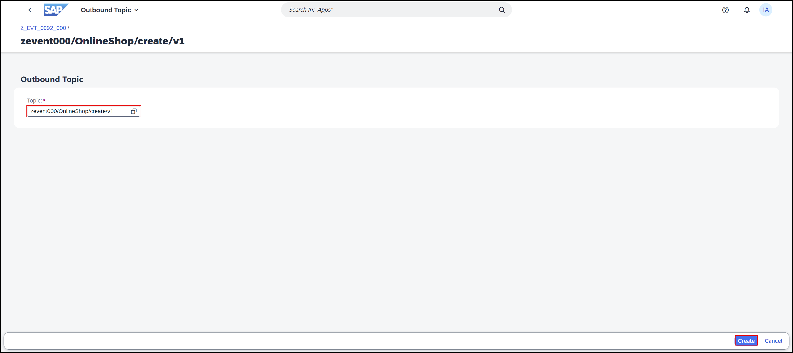
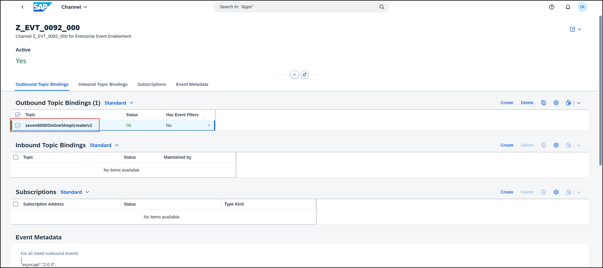
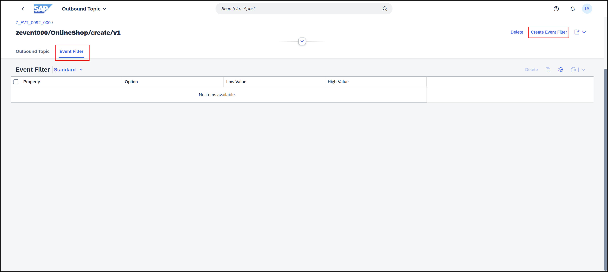
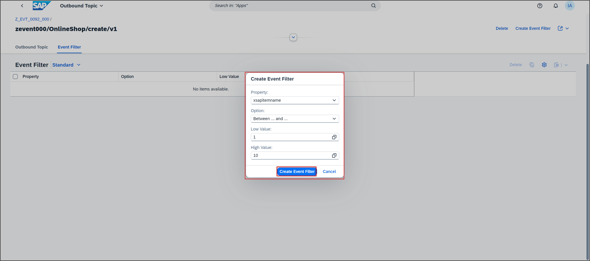
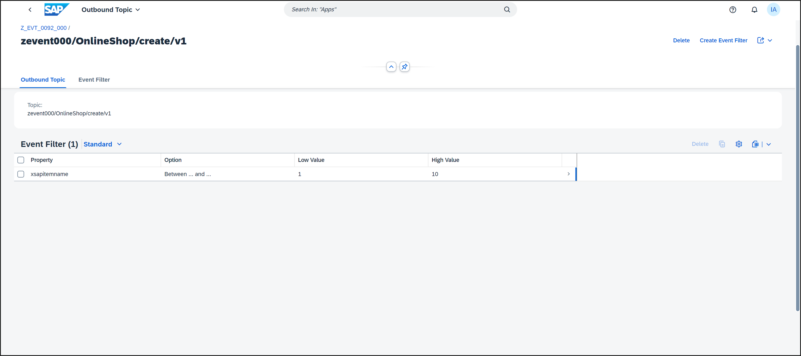

# Maintain Filters for Outbound Event Topics
<!-- description --> Maintain filters for outbound event topics. You can filter the events that should be sent via a channel by defining filters per channel and topic.


## You will learn
- How to add event filters to abstract entity 
- How to create an event filter 


## Prerequisites
- You need to have access to a licensed SAP BTP ABAP environment system 
- You need a user with access to maintain communication arrangement
- You have finished following tutorial: [How to Create RAP Business Events in SAP BTP ABAP Environment](abap-environment-create-rap-business-events)

>**Hint:** Event filters for event topics containing wildcards are not supported.


You can define filters for context and custom extension context attributes defined for the corresponding event type. In the RESTful Application Programming framework (RAP), you can define a custom context attribute for your RAP business object (only for events) with the CDS annotation `@event.context.attribute`.

For more information on the CDS annotation, see: [Event Annotations](https://help.sap.com/docs/abap-cloud/abap-rap/event-annotations)

The custom defined context attribute is then available as a property in the event filter creation wizard in the **Enterprise Event Enablement ‒ Configure Channel Binding** app.

Always replace `###` with your initials or group number.

---

 
### Add event filter annotation to abstract entity

  1. Open your abstract entity `ZD_ItemOrdered_###` in Eclipse and add the event annotation to `ItemName`:
   
    ```ABAP
     @EndUserText.label: 'event parameter'
     define abstract entity ZD_ItemOrdered_###
     {
     @Event.context.attribute: 'xsapitemname'
     ItemName : abap.char(25);
     }
    ```
   
     

  2. Save and activate.

### Create event filter

  1. Log on to the SAP Fiori launchpad in the SAP S/4HANA Cloud system.

  2. Select the **Enterprise Event Enablement ‒ Configure Channel Binding**, in the **Communication Management** app.
   
      

  3. Choose your channel `Z_EVT_0092_000`. 

      

      In the Outbound Topics table, the column Has Event Filters indicates whether filters are defined for the outbound topic.

  4. Create a new outbound topic binding, therefore select **Create**.
      
      
   
  5. Select the outbound topic binding `zevent000/OnlineShop/create/v1` and click **Create**. 

      
  
  6. Go back and select your outbound topic binding `zevent000/OnlineShop/create/v1`.
   
      

  7. Select the **Event Filter** tab to display existing filters for the outbound topic. To add a filter to the outbound topic, choose **Create Event Filter**.
   
      
  
  8. On the Create Event Filter dialog box, proceed as follows:
   
     Select a Property from the dropdown menu. The properties available in the dropdown menu are defined by the extension attributes.
     You can either choose your own defined property `xsapitemname` or use the standard context attributes. 
     Select **`xsapitemname`**.

     Choose an Option from the dropdown menu to define the filter behavior. You can select **Between ... and ...** for **`xsapitemname`**.

     Define a Low Value. You can use the value help, if available for the respective property.

     If applicable, define a High Value.

     Click **Create Event Filter**.
   
      

     The new filter is added to the outbound topic. In accordance with existing filters, the new filter is added with an OR logic for inclusive options such as EQUALS. New filters are added with an AND logic for exclusive options such as NOT EQUALS. Different Properties are always AND connected.

      

     To delete a filter from an outbound event topic, select one or more filters and choose the Delete button.

### More Information

For more information on the usage of event filters, refer to [3343266](https://help.sap.com/docs/link-disclaimer?site=https://me.sap.com/notes/3343266) Information published on SAP site.


### Test yourself


