# Create Table Persistence and Generate Data
<!-- description --> Create table persistence and generate data for it.

## Prerequisites  
<<<<<<< HEAD
- You need an SAP BTP, ABAP environment [trial user](abap-environment-trial-onboarding) or a license.
- You have downloaded and installed the [latest ABAP Development Tools (ADT)] (https://tools.hana.ondemand.com/#abap).
- You have done the [theoretical ABAP RESTful Application Programming Model tutorial](abap-environment-restful-programming-model).

## You will learn  
  - How to create an ABAP package
  - How to create a database table
  - How to create an ABAP class to generate data

## Intro
In this tutorial, wherever XXX appears, use a number (e.g. 000).

=======
- You need to have access to an SAP BTP, ABAP environment, or SAP S/4HANA Cloud, ABAP environment or SAP S/4HANA (release 2021 or higher) system.
For example, you can create [free trial user on SAP BTP, ABAP environment](abap-environment-trial-onboarding).
- You have downloaded and installed the [latest ABAP Development Tools (ADT)] (https://tools.hana.ondemand.com/#abap) on the latest Eclipse© platform.
- You have done the [theoretical ABAP RESTful Application Programming Model tutorial](abap-environment-restful-programming-model).
- If you are using a **licensed system** make sure, that the flight scenario is available in your system. If not, you should follow these [steps](https://help.sap.com/docs/btp/sap-abap-restful-application-programming-model/downloading-abap-flight-reference-scenario) in your licensed system. The flight scenario is already in the trial systems.

## You will learn  
  - How to create an ABAP package
  - How to create a database table 
  - How to create a draft table
  - How to create an ABAP class to generate data 
 
## Intro 
In this tutorial, wherever **###**  appears, use a number (e.g. 000).
 
>>>>>>> 59f95048a11e62962d5c8eb49e89b6f027533a25
---

### Create ABAP package

<<<<<<< HEAD
=======
In this example the group ID 000 is used instead of `###`. Please make sure to change `###` to your own group ID.

>>>>>>> 59f95048a11e62962d5c8eb49e89b6f027533a25
  1. Open **ABAP Development Tools (ADT)** and select your **ABAP Cloud Project** you created in [Create an SAP BTP ABAP Environment Trial User](abap-environment-trial-onboarding).

     Right-click on `ZLOCAL` and select **New > ABAP Package**.

<<<<<<< HEAD
      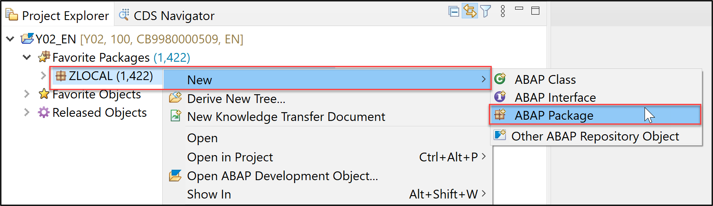

  2. Create a new ABAP package:
     - Name: `ZTRAVEL_APP_XXX`
     - Description: `Package for travel XXX`
     - `Superpackage`: `ZLOCAL`
     - **Check** Add to favorite packages.

     Use your number instead of `XXX`.

      

      Click **Next >**.

  3. Select **Create new request** and enter a request description.
=======
       

  2. Create a new ABAP package:
     - Name: `ZTRAVEL_APP_###`
     - Description: `Travel App ###`
     - `Superpackage`: `ZLOCAL`
     - **Check** Add to favorite packages.

     Use your number instead of `###`.

      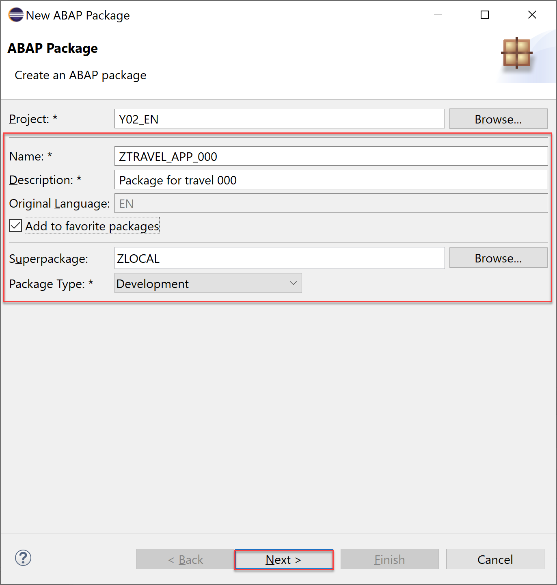

      Click **Next >**.

  3. Click **Next >**.

      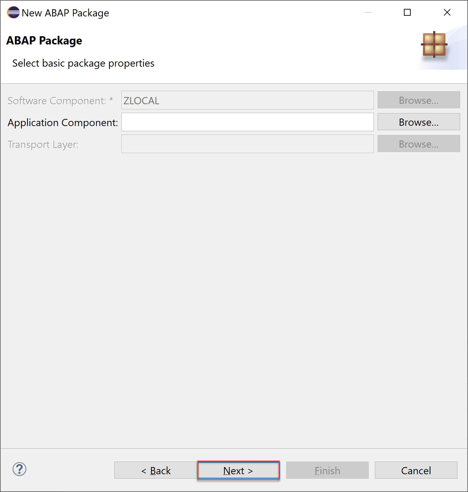
        
  
  4. Select **Create new request** and enter a request description.
>>>>>>> 59f95048a11e62962d5c8eb49e89b6f027533a25

      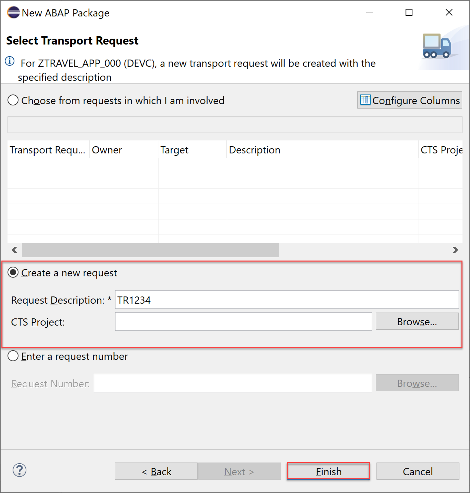

      Click **Finish**.

<<<<<<< HEAD
  4. Now your package is added to favorites objects.

      


### Create database table

  1. Right-click on your package `ZTRAVEL_APP_XXX`, select **New** > **Other ABAP Repository Object**.
=======

### Create database table

  1. Right-click on package `ZATRAVEL_APP_###`, select **New** > **Other ABAP Repository Object**.
>>>>>>> 59f95048a11e62962d5c8eb49e89b6f027533a25

      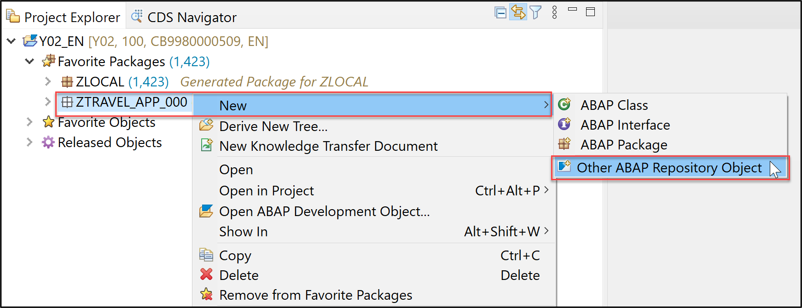

  2. Search for database table, select it and click **Next >**.

      

  3. Create a new database table:

<<<<<<< HEAD
       - Name: `ZTRAVEL_XXX`
       - Description: `Database table for travel data XXX`
=======
       - Name: `ZATRAVEL_###`
       - Description: `Database table for travel data ###`
>>>>>>> 59f95048a11e62962d5c8eb49e89b6f027533a25

     Click **Next >**.

      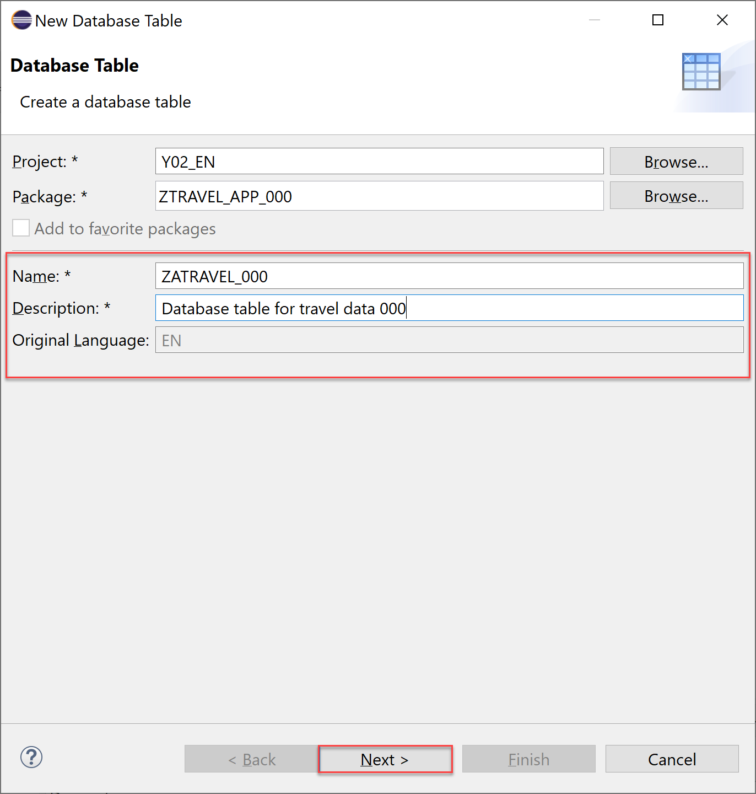

  4. Click **Finish** to create your transport request.

      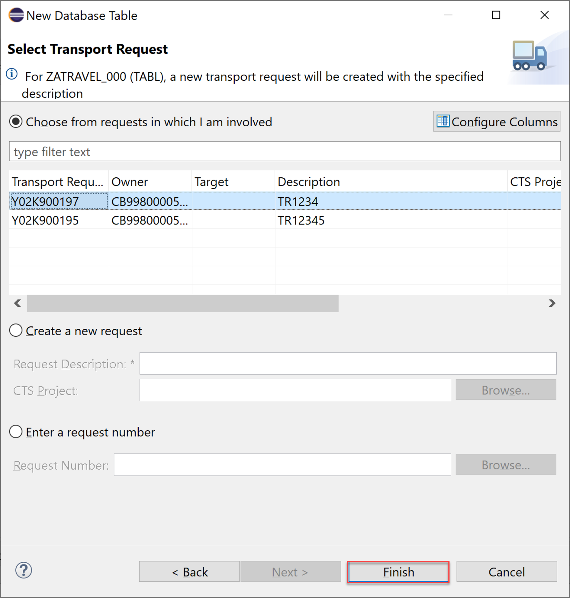

  5. Replace your code with following:

    ```ABAP
<<<<<<< HEAD
    @EndUserText.label : 'Database table for travel data XXX'
    @AbapCatalog.enhancementCategory : #NOT_EXTENSIBLE
    @AbapCatalog.tableCategory : #TRANSPARENT
    @AbapCatalog.deliveryClass : #A
    @AbapCatalog.dataMaintenance : #RESTRICTED
    define table ztravel_xxx {
      key client      : abap.clnt not null;
      key mykey       : sysuuid_x16 not null;
      travel_id       : /dmo/travel_id;
      agency_id       : /dmo/agency_id;
      customer_id     : /dmo/customer_id;
      begin_date      : /dmo/begin_date;
      end_date        : /dmo/end_date;
      @Semantics.amount.currencyCode : 'ztravel_xxx.currency_code'
      booking_fee     : /dmo/booking_fee;
      @Semantics.amount.currencyCode : 'ztravel_xxx.currency_code'
      total_price     : /dmo/total_price;
      currency_code   : /dmo/currency_code;
      description     : /dmo/description;
      overall_status  : /dmo/overall_status;
      created_by      : syuname;
      created_at      : timestampl;
      last_changed_by : syuname;
      last_changed_at : timestampl;

    }   
=======
    @EndUserText.label : 'Database table for travel data ###'
    @AbapCatalog.enhancement.category : #NOT_EXTENSIBLE
    @AbapCatalog.tableCategory : #TRANSPARENT
    @AbapCatalog.deliveryClass : #A
    @AbapCatalog.dataMaintenance : #RESTRICTED
    define table zatravel_### {

      key client            : abap.clnt not null;
      key mykey             : sysuuid_x16 not null;
      travel_id             : /dmo/travel_id;
      agency_id             : /dmo/agency_id;
      customer_id           : /dmo/customer_id;
      begin_date            : /dmo/begin_date;
      end_date              : /dmo/end_date;
      @Semantics.amount.currencyCode : 'zatravel_###.currency_code'
      booking_fee           : /dmo/booking_fee;
      @Semantics.amount.currencyCode : 'zatravel_###.currency_code'
      total_price           : /dmo/total_price;
      currency_code         : /dmo/currency_code;
      description           : /dmo/description;
      overall_status        : /dmo/overall_status;
      created_by            : syuname;
      created_at            : timestampl;
      last_changed_by       : syuname;
      last_changed_at       : abp_locinst_lastchange_tstmpl;
      local_last_changed_at : abp_lastchange_tstmpl;

    }
>>>>>>> 59f95048a11e62962d5c8eb49e89b6f027533a25
    ```

  6. Save and activate.

      

     Now the dictionary tables are defined. The dictionary tables are the basis of our travel booking data model.


<<<<<<< HEAD
### Create ABAP class

  1. Right-click on your package `ZTRAVEL_APP_XXX`, select **New** > **ABAP Class**.
=======
### Create draft table

  1. Right-click on database tables and select **New Database Table**.

      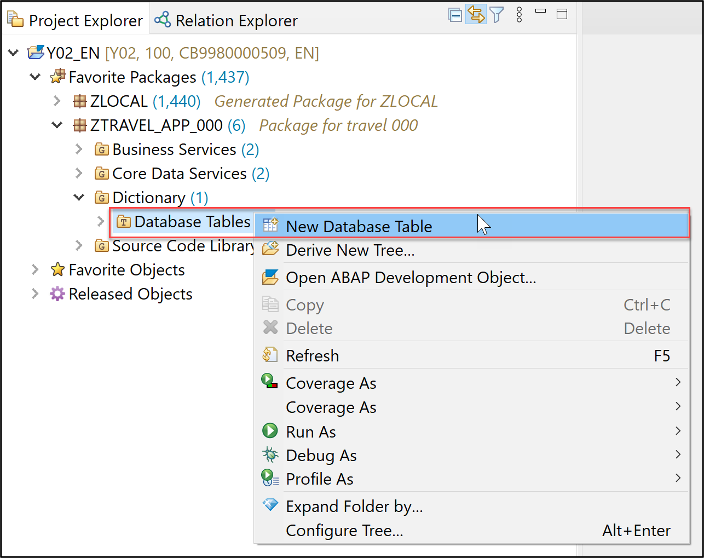

  2. Create a new database table:

       - Name: `ZDTRAVEL_###`
       - Description: `Draft table for travel` 

     Click **Next >**.

      

  3. Click **Finish** to create your transport request.

      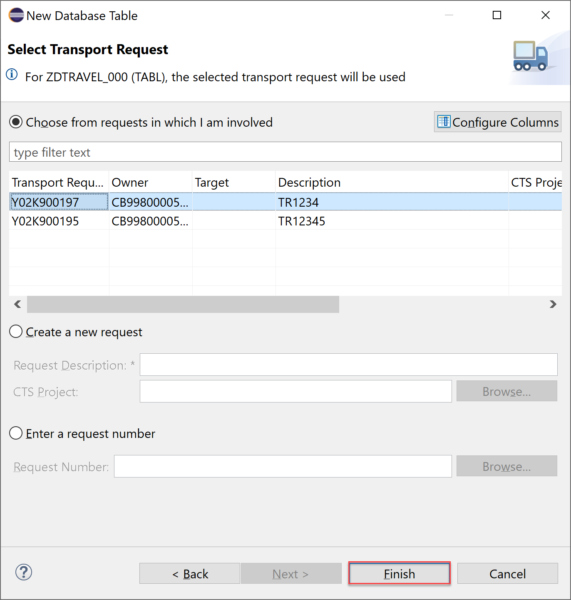

  5. Replace your code with following:

    ```ABAP
    @EndUserText.label : 'Draft table for travel'
    @AbapCatalog.enhancement.category : #NOT_EXTENSIBLE
    @AbapCatalog.tableCategory : #TRANSPARENT
    @AbapCatalog.deliveryClass : #A
    @AbapCatalog.dataMaintenance : #RESTRICTED
    define table zdtravel_### {

      key mandt          : mandt not null;
      key mykey          : sysuuid_x16 not null;
      travelid           : /dmo/travel_id;
      agencyid           : /dmo/agency_id;
      customerid         : /dmo/customer_id;
      begindate          : /dmo/begin_date;
      enddate            : /dmo/end_date;
      @Semantics.amount.currencyCode : 'zdtravel_###.currencycode'
      bookingfee         : /dmo/booking_fee;
      @Semantics.amount.currencyCode : 'zdtravel_###.currencycode'
      totalprice         : /dmo/total_price;
      currencycode       : /dmo/currency_code;
      description        : /dmo/description;
      overallstatus      : /dmo/overall_status;
      createdby          : syuname;
      createdat          : timestampl;
      lastchangedby      : syuname;
      lastchangedat      : abp_locinst_lastchange_tstmpl;
      locallastchangedat : abp_lastchange_tstmpl;
      "%admin"           : include sych_bdl_draft_admin_inc;

    }
    ```

  6. Save and activate.

      

     Now the dictionary tables are defined. The dictionary tables are the basis of our travel booking data model.

### Create ABAP class

  1. Right-click on your package `ZTRAVEL_APP_###`, select **New** > **ABAP Class**.
>>>>>>> 59f95048a11e62962d5c8eb49e89b6f027533a25

      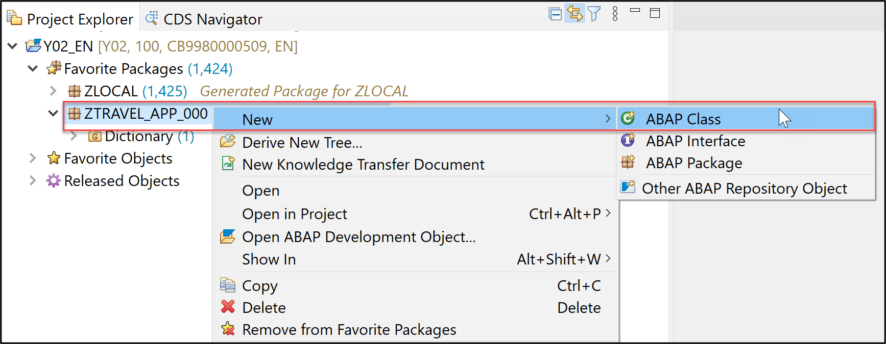

  2. Create a new ABAP class:

<<<<<<< HEAD
     - Name: `ZCL_GENERATE_TRAVEL_DATA_XXX`
=======
     - Name: `ZBP_GENERATE_TRAVEL_DATATP_###`
>>>>>>> 59f95048a11e62962d5c8eb49e89b6f027533a25
     - Description: `Class for generating travel data`

     Click **Next >**.

<<<<<<< HEAD
      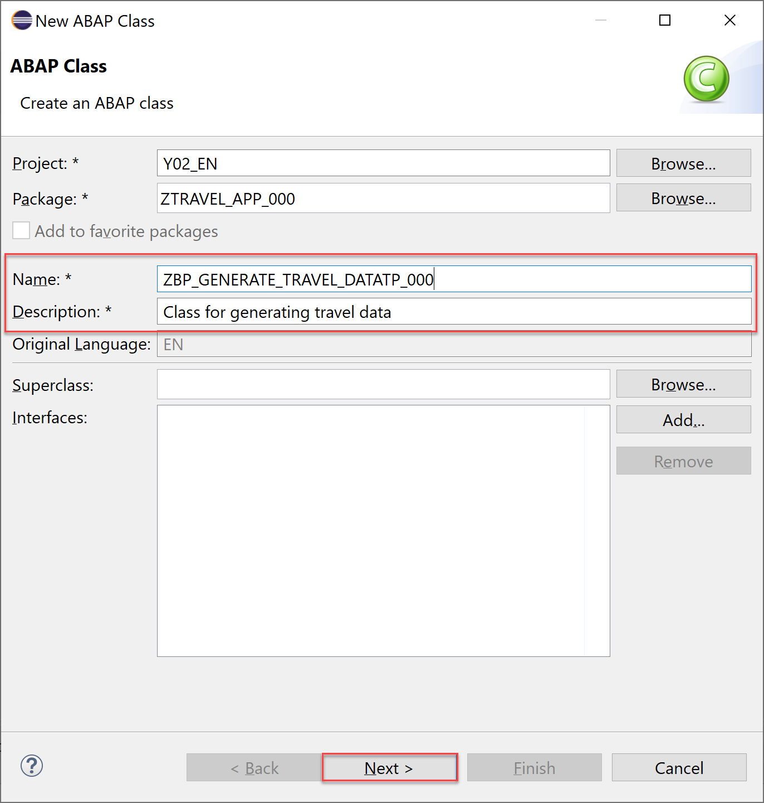
=======
       
>>>>>>> 59f95048a11e62962d5c8eb49e89b6f027533a25

  3. Click **Finish** to create your transport request.

      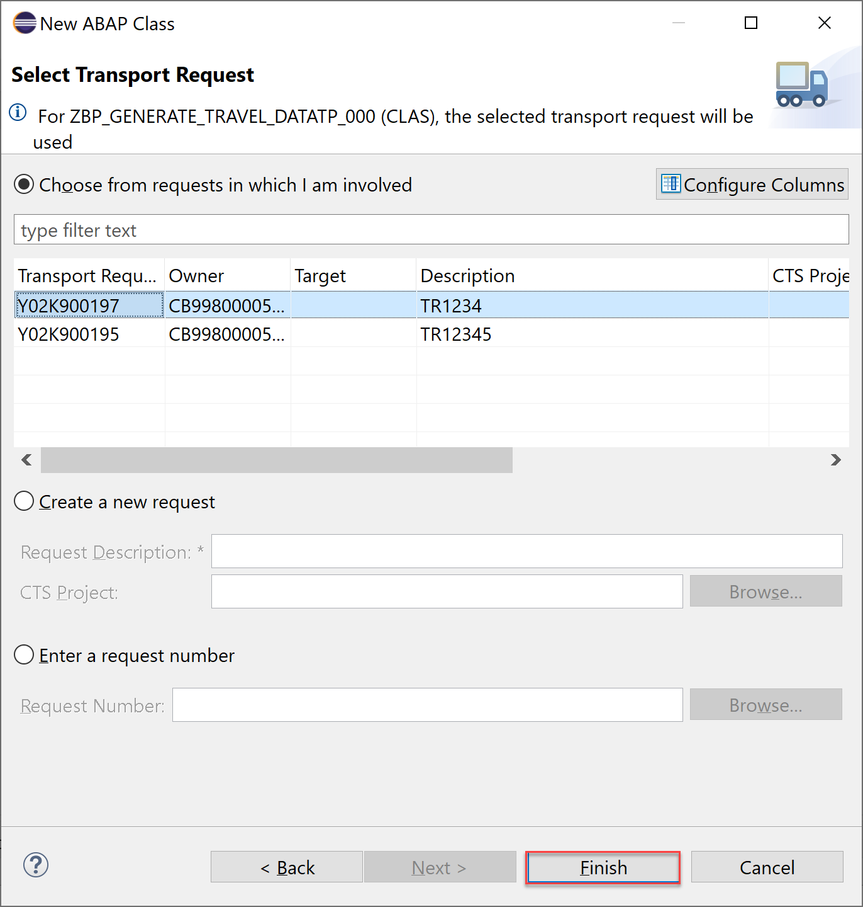

  4. Replace your code with following:

    ```ABAP
<<<<<<< HEAD
    CLASS zcl_generate_travel_data_xxx DEFINITION
=======
    CLASS zbp_generate_travel_datatp_### DEFINITION
>>>>>>> 59f95048a11e62962d5c8eb49e89b6f027533a25
      PUBLIC
      FINAL
      CREATE PUBLIC .

      PUBLIC SECTION.
        INTERFACES if_oo_adt_classrun.
      PROTECTED SECTION.
      PRIVATE SECTION.
    ENDCLASS.


<<<<<<< HEAD
    CLASS zcl_generate_travel_data_xxx IMPLEMENTATION.
      METHOD if_oo_adt_classrun~main.

        DATA itab TYPE TABLE OF ztravel_xxx.
=======
    CLASS zbp_generate_travel_datatp_### IMPLEMENTATION.
      METHOD if_oo_adt_classrun~main.

        DATA itab TYPE TABLE OF zatravel_###.
>>>>>>> 59f95048a11e62962d5c8eb49e89b6f027533a25

    *   fill internal travel table (itab)
        itab = VALUE #(
          ( mykey = '02D5290E594C1EDA93815057FD946624' travel_id = '00000022' agency_id = '070001' customer_id = '000077' begin_date = '20190624' end_date = '20190628' booking_fee = '60.00' total_price =  '750.00' currency_code = 'USD'
            description = 'mv' overall_status = 'A' created_by = 'MUSTERMANN' created_at = '20190612133945.5960060' last_changed_by = 'MUSTERFRAU' last_changed_at = '20190702105400.3647680' )
          ( mykey = '02D5290E594C1EDA93815C50CD7AE62A' travel_id = '00000106' agency_id = '070005' customer_id = '000005' begin_date = '20190613' end_date = '20190716' booking_fee = '17.00' total_price = '650.00' currency_code = 'AFN'
            description = 'Enter your comments here' overall_status = 'A' created_by = 'MUSTERMANN' created_at = '20190613111129.2391370' last_changed_by = 'MUSTERMANN' last_changed_at = '20190711140753.1472620' )
          ( mykey = '02D5290E594C1EDA93858EED2DA2EB0B' travel_id = '00000103' agency_id = '070010' customer_id = '000011' begin_date = '20190610' end_date = '20190714' booking_fee = '17.00' total_price = '800.00' currency_code = 'AFN'
            description = 'Enter your comments here' overall_status = 'X' created_by = 'MUSTERFRAU' created_at = '20190613105654.4296640' last_changed_by = 'MUSTERFRAU' last_changed_at = '20190613111041.2251330' )
        ).

    *   delete existing entries in the database table
<<<<<<< HEAD
        DELETE FROM ztravel_xxx.

    *   insert the new table entries
        INSERT ztravel_xxx FROM TABLE @itab.
=======
        DELETE FROM zatravel_###.

    *   insert the new table entries
        INSERT zatravel_### FROM TABLE @itab.
>>>>>>> 59f95048a11e62962d5c8eb49e89b6f027533a25

    *   output the result as a console message
        out->write( |{ sy-dbcnt } travel entries inserted successfully!| ).

      ENDMETHOD.
    ENDCLASS.
    ```

  5. Save, activate and click `F9` to run your ABAP class.

      

<<<<<<< HEAD
  6. Check your result. Therefore open your database table **`ZTRAVEL_XXX`** and press `F8` to see your data.
     Now the dictionary tables are filled with data.

      

=======
  6. Check your result. Therefore open your database table **`ZATRAVEL_###`** and press `F8` to see your data.
     Now the dictionary tables are filled with data.

      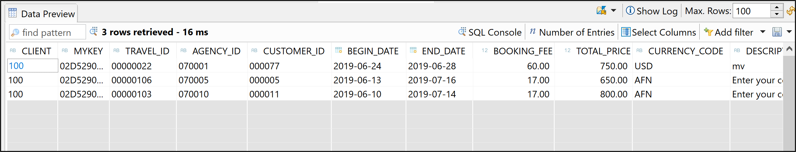
 
>>>>>>> 59f95048a11e62962d5c8eb49e89b6f027533a25

### Test yourself


---
