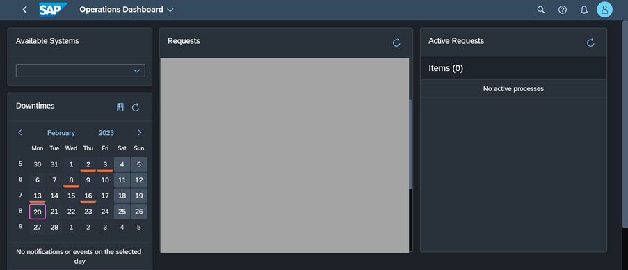
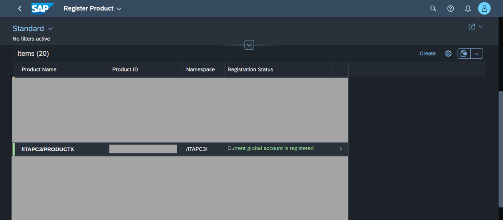
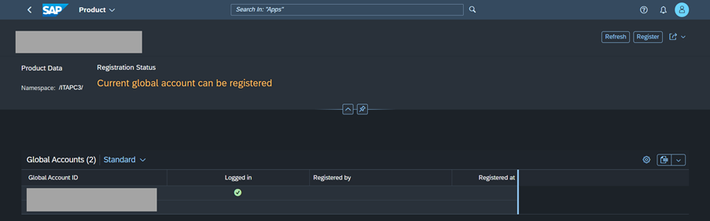
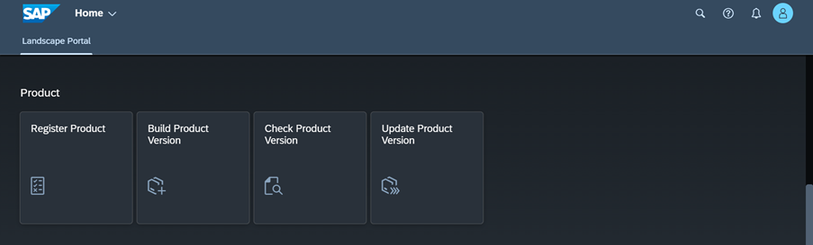
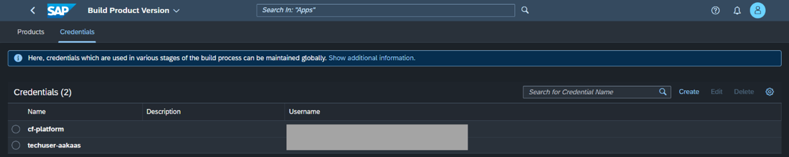

# Configure Users and Product Registration to Facilitate Add-On Build

<!-- description --> Configure users for cloud foundry access and register your product to the SAP Business Technology Platform global account to facilitate add-on build.

## You will learn

- How to create users to be used during add-on build
- How to check for planned downtimes and register an add-on product

## Prerequisites

- The Landscape Portal Application has been subscribed to and your user has the landscape portal admin role collection assigned
- Entitlements for the CI/CD service in the sub-account where the landscape portal application is subscribed
- Cloud Foundry Technical Platform user with space developer role in Build/Assemble and Build/Test sub-accounts
- Technical user for ABAP Add-on Kit as a service (AAKaaS)

## Intro

### Understand the different stages of an add-on build pipeline

This system is used in later stages to import software components, run ATC checks, and build delivery packages for the add-on.

The add-on build pipeline in the above image contains the following steps:

**Initial Checks:**

This stage runs preliminary checks for the Build stage of the pipeline.
Some steps include:

- Check of add-on product version

- Check of software component version

**Prepare System:**

In this stage, the SAP BTP, ABAP environment system is created. This system could be used in a later step to run ATC checks

**Clone Repositories:**

Once the system is set up, it is required to clone the necessary software components in to the system before we can run tests

**Test:**

Please keep in mind that the ATC needs to be configured. By default, this stage will not run ATC checks if it is not configured

In this stage, ATC checks can be executed using [ABAP Environment Run ATC Check](https://www.project-piper.io/steps/abapEnvironmentRunATCCheck/)

**Build:**

This stage is responsible for building an ABAP add-on for the SAP BTP, ABAP environment. The build process of the add-on is done on a Steampunk system (using SAP\_COM\_0582) with the help of the SAP Add-On Assembly Kit as a Service. After executing this stage successfully, the add-on is ready to be tested

**Integration Tests:**

This stage creates an SAP BTP, ABAP environment system and installs the add-on product, that was built in the Build stage

**Confirm:**

This stage asks for a manual confirmation before releasing the add-on product in the Publish stage

**Publish:**

This stage publishes an add-on for the SAP BTP, ABAP environment. The add-on product is now ready to be installed in productive systems on SAP BTP, ABAP Environment

**Post Stage:**

This stage deletes the SAP BTP, ABAP environment system created in the Prepare System stage

### Overview of user setup

**Add Technical Platform User to Space in Subaccount 03 Build/Assemble:**

To trigger an import in the assembly system, communication scenario SAP\_COM\_0510 is used.
To trigger the build process in assembly system, communication scenario SAP\_COM\_0582 is used.
The credentials for these 2 scenarios are retrieved by creating a service key in the system

As operator, assign a technical Cloud Foundry platform user as a space developer in subaccount 03 Build/Assemble. Later, this user's credentials are used to create service key

**Add Technical Platform User to Space in Subaccount 04 Build/Test:**

For the add-on installation test, a test system is created in the space in subaccount 04 Build/Test

As an operator, assign a technical Cloud Foundry platform user as a space developer in the space in subaccount 04 Build/Test. Later, this user's credentials are used similar to earlier step in Build/Assemble

**Create a Technical Communication User for Access to the Add-on Assembly Kit as a Service(`AAKaaS`):**

As part of the add-on build process, the Add-on Assembly Kit is used. With `AAKaaS`, the on-premise tooling is now available as a cloud service that is used by the build pipeline
To access the service that is offered via SAP Support Launchpad, a [technical communication user](https://launchpad.support.sap.com/#/notes/2532813) is used. [Create such a technical communication user](https://launchpad.support.sap.com/#/notes/2174416)

### Open Landscape Portal

1.As a user with the Landscape Portal Administrator role, in the Global Account for Development, navigate to the sub-account where you have the Landscape Portal application subscribed.

2.Click on the “Instances and Subscriptions” menu item. Under the “Subscriptions” section, find the Landscape Portal application and open it.

### Check for planned downtimes

1.Open the Operations Dashboard application of the Landscape Portal

2.Use the Calendar under the Downtimes section of the screen to ensure there are no planned downtimes at the time you are building the new version of your add-on product.

### Register your product against the Global Account for Development

1.Open the “Register Product” application of the landscape portal. Check if your product is already listed here. If not, create a new product entry using the “Create” button.

2.If the Registration Status does not reflect “Current Global Account is Registered”, open the product entry and click the “Register” button.

### Set up credentials to build your add-on product

1.Open the “Build Product Version” application of the Landscape Portal.

2.Open the Credentials Section and maintain the credentials of your cloud foundry technical user(“cf-platform”) and the AAKaaS technical user(“techuser-aakaas”).

