# Create Business Users, Configure Roles and Business Configurations
<!-- description -->Create business roles, assign them to business users and configure data for business configurations

## You will learn

- How to create business users in the consumer tenant and manage business configuration entries

### Create Business Roles for the Custom Application

Navigate to the Maintain Business Roles application in the Fiori Launchpad of the consumer tenant as initial administrator user.

1. Create a new role by clicking on "New", enter a business role ID and description. Click "Create"
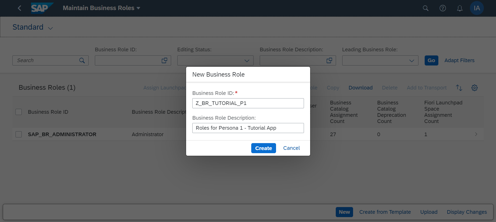
2. Under the "Assigned Business Catalogs" section, add the relevant business catalogs for the application.
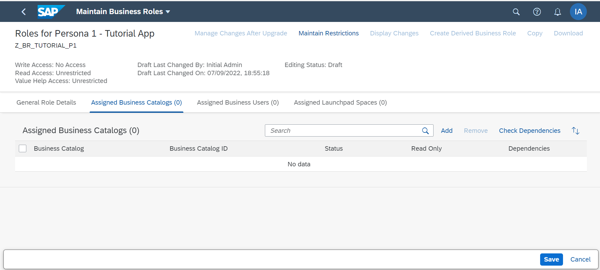
3. Click "Maintain Restrictions" and set the appropriate restriction levels for the new role
4. Save the role.
5. Repeat these 4 steps until all necessary roles for your application are created  

### Create Employees

Before we can assign roles to business users, we need to create employees in the system.  
To do this, as the administrator, logon to the Fiori Launchpad for the consumer tenant using the URL shared by the provider (the route for the consumer)

1. Open the Maintain Employees app

    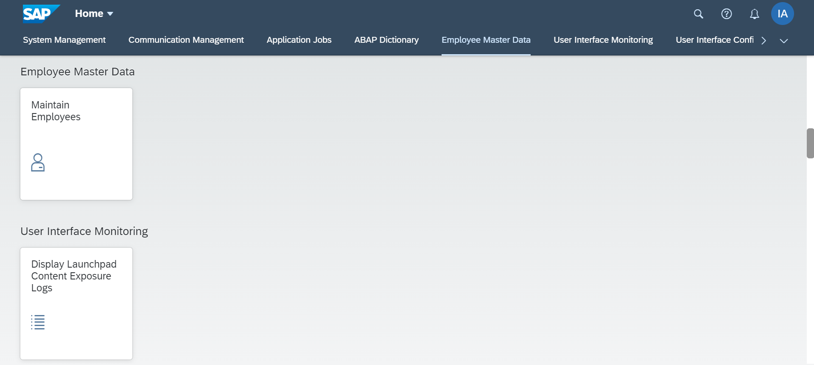

2. To create employees in the app, there are 2 options.

    [OPTION BEGIN [Create Individual Employee Record]]

    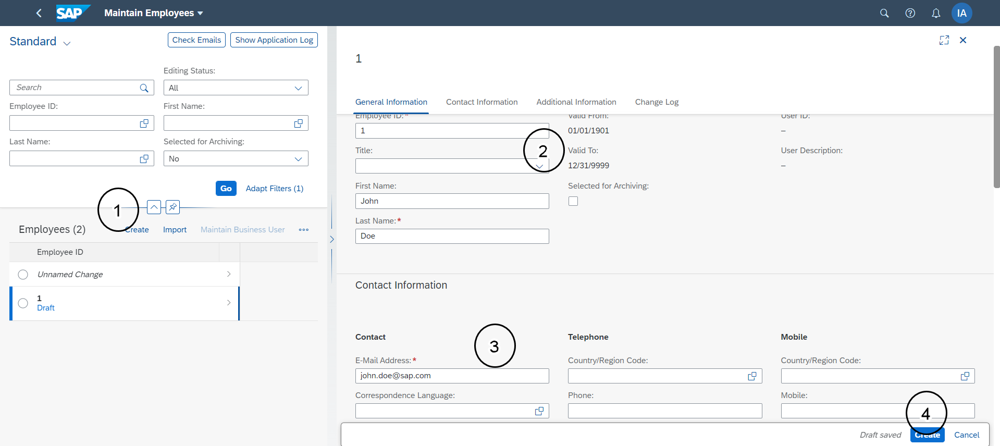

    The first option is to create individual employees

    1. Click the Create button in the app.

    2. Enter at least the mandatory fields in the form under both the "General Information" and "Contact Information" sections

    3. Click "Create"

    [OPTION END]

    [OPTION BEGIN [Import Employee Records from Excel]]

    The second option is to import employee records from Excel
    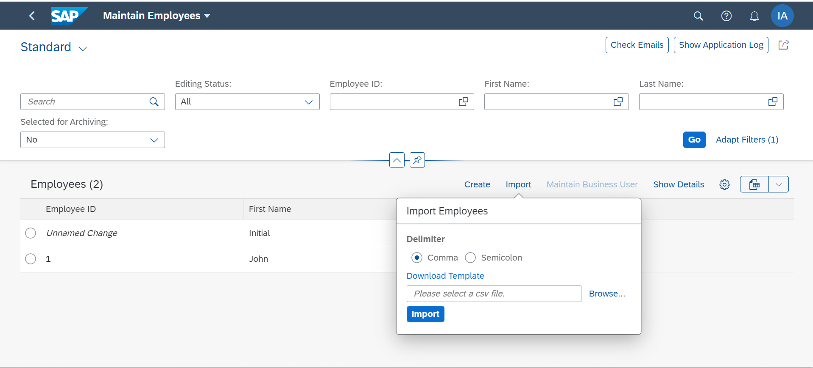

    1. Click the Import button in the app

    2. Download the template with a delimiter of your choice

    3. Fill in the downloaded excel with employee details conforming to the template specified

    4. Use the browse button to find and upload the excel file

    5. Click Import

    [OPTION END]

### Create Business Users and Assign Business Roles

Next we create a business user for the employee.  

To do this, select the radio button against the employee record created in step 2 and click "Maintain Business User".

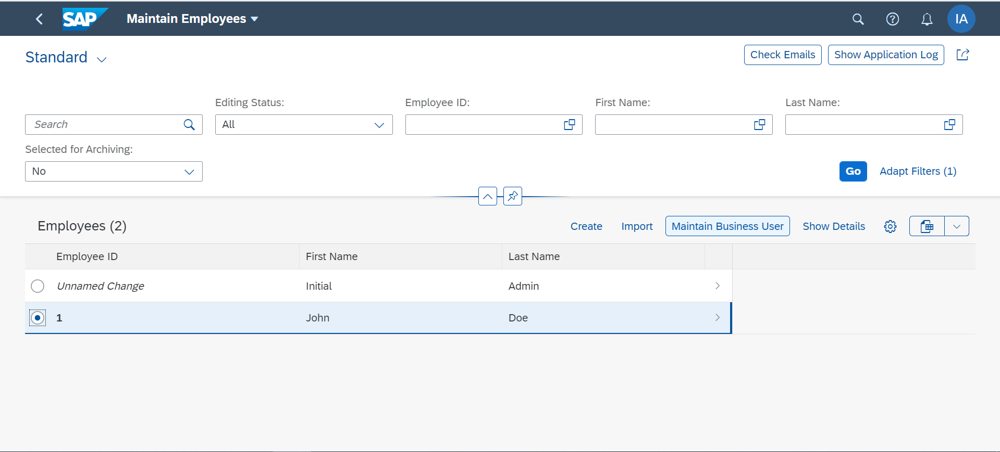

Once the business user is created, we can assign roles to the users.

You should be navigated to the "Maintain Business User" app automatically after creation of the business user. Here, click "Add" under the "Assigned Business Roles" section or alternately, click "Add Business Roles" to add relevant roles to this user

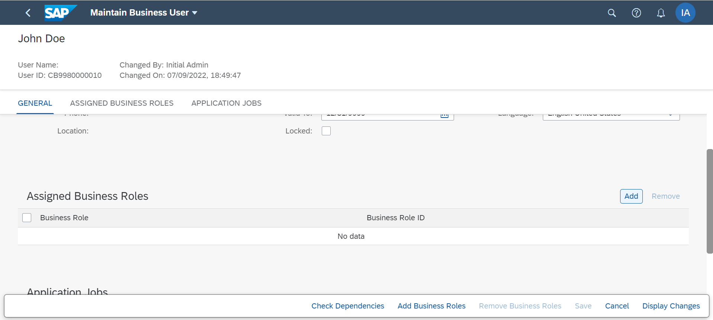

### Create Role From Template for Business Configurations

To handle business configuration entries, we have apps provided under the "Business Configuration" group on the Fiori Launchpad. To gain access to this group, a user needs to have the "BPC\_EXPERT" role assigned.

1. As administrator in the Fiori Launchpad for the consumer, open the "Maintain Business Roles" app
2. Click the "Create from Template" button and use the value help for template selection to choose "SAP\_BR\_BPC\_EXPERT"
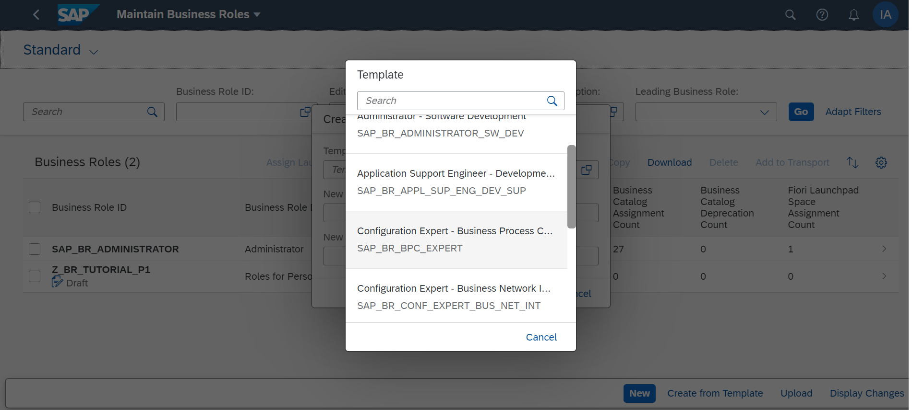
3. This creates a new role with the required catalogs already assigned. Add the relevant business users to whom this role shall be assigned under the "Assigned Business Users" tab
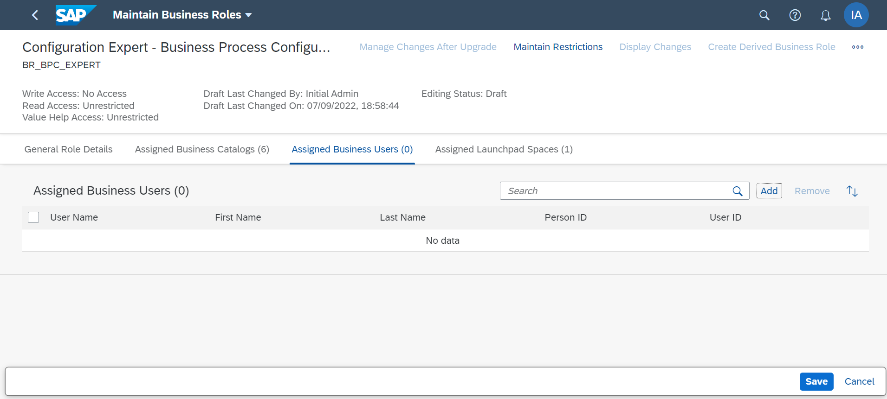
4. Maintain relevant restrictions for read/write using the "Maintain Restrictions" button
5. Save the role

### Custom Business Configurations

The users with assigned  SAP\_BR\_BPC\_EXPERT role should now be able to see the applications under the "Business Configuration" group of the Fiori Launchpad.

    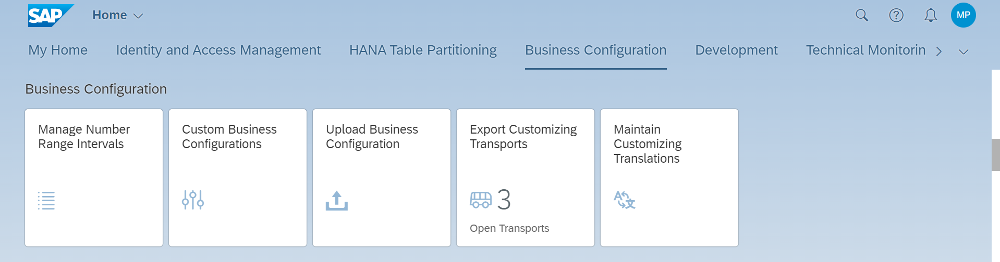

[OPTION BEGIN [Custom Business Configurations]]

The "Custom Business Configurations app" can be used to maintain data for configuration tables in the SaaS application if a business configuration maintenance object is registered. Refer [documentation](https://help.sap.com/docs/BTP/65de2977205c403bbc107264b8eccf4b/508d406ac92043dba95f694144803c26.html?locale=en-US) for more details

[OPTION END]

[OPTION BEGIN  [Upload Business Configuration]]

The "Upload Business Configuration" app can be used to upload data via excel import for various configuration tables of the SaaS application.

    1. Open the "Upload Business Configuration" app.
    2. Use the value help to select the object for which data has to be maintained.
    3. Under the "Upload File" section, download the file template.
    4. Fill in the downloaded template with suitable data conforming to the provided template.
    5. Add attachment, review the data and confirm deployment.

        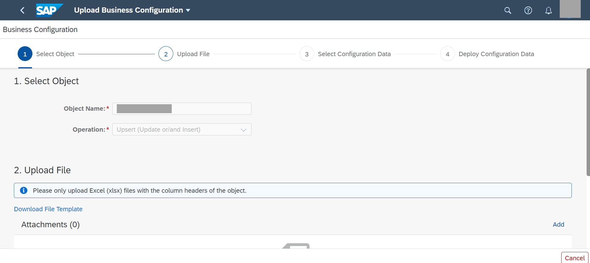

[OPTION END]

### Test yourself

---
