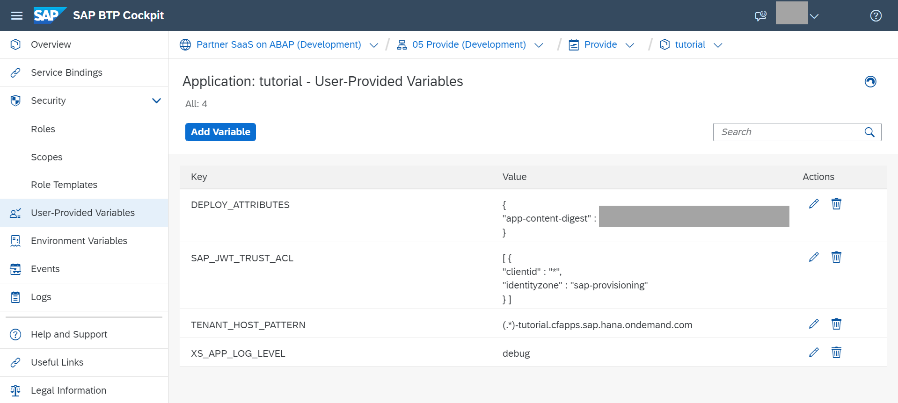
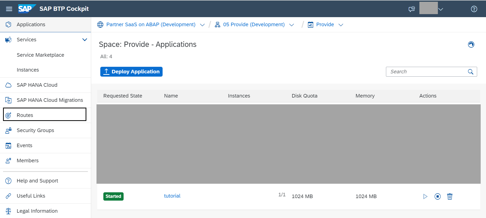
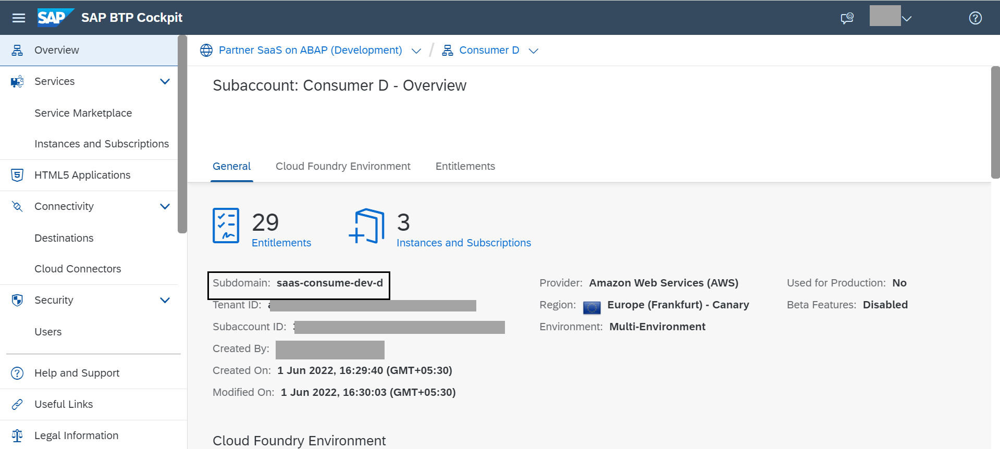
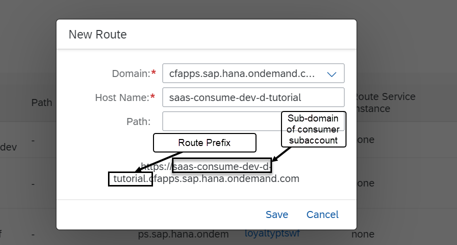
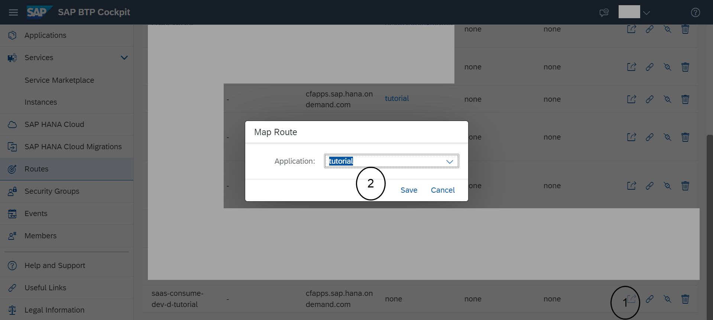
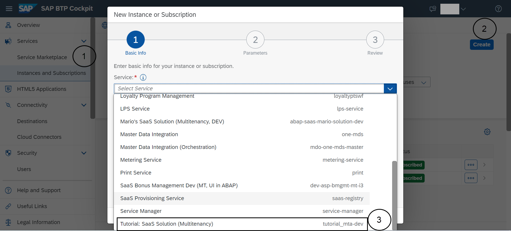
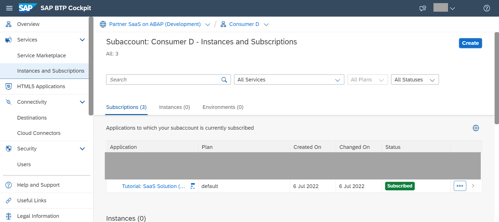
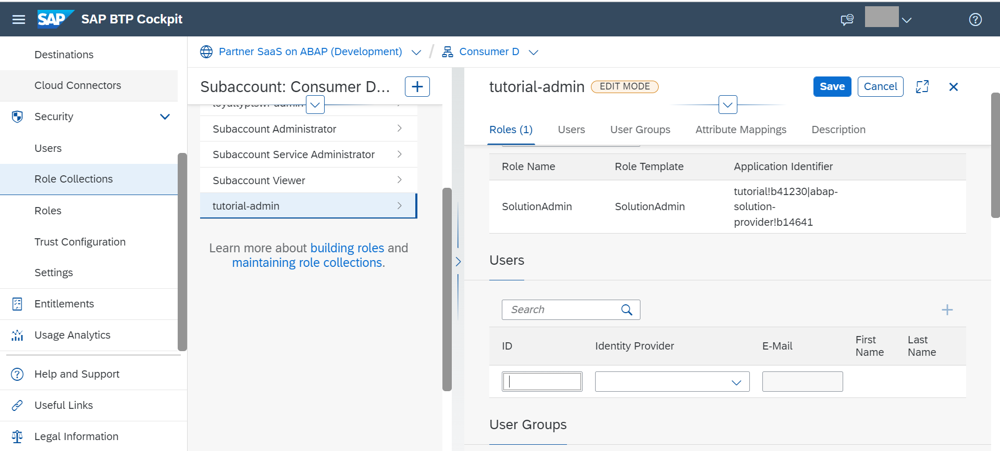
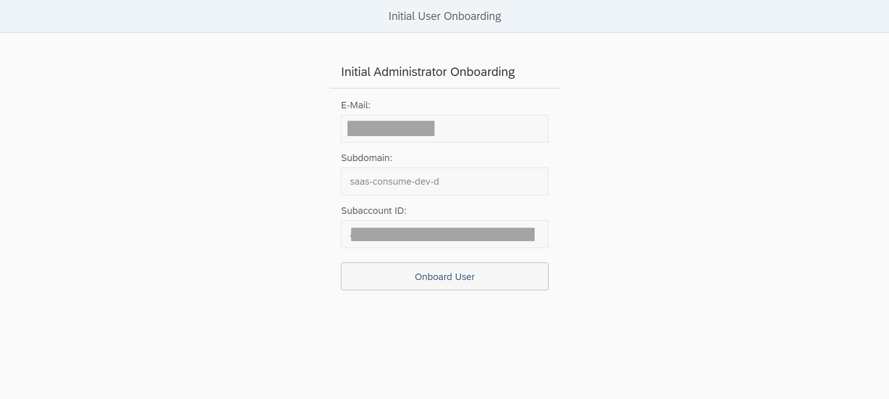
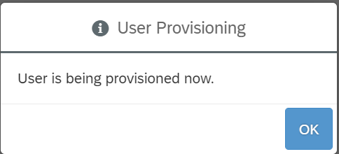

# Subscribe Your First Consumer to the SaaS Application

<!-- description --> Subscribe the first consumer to the SaaS application and onboard initial administrator

## Prerequisites

- A SaaS application is deployed and available for subscription as described in previous groups of this mission

## You will learn

- How to subscribe to a SaaS solution from a consumer subaccount

---

### Create a new route for your consumer

Before the consumer can access the SaaS application, they need a dedicated URL to access this. To create this, we create a new route and bind it to the approuter as an administrator for the 05 provide subaccount.

For more information refer to the note in the [Help Portal](https://help.sap.com/docs/BTP/65de2977205c403bbc107264b8eccf4b/72b0b1130ee243179b0905ea2cd5adb1.html#prerequisites-0).

1. Navigate to the "Provide" space where the application is deployed. Open the application deployed in previous tutorials and navigate to the "User-Provided Variables" section. Notice the TENANT\_HOST\_PATTERN.  This provides a wildcard that has to match all routes of the application
  

2. Now navigate to the "Routes" section in the space "Provide"
  

3. Create a new route by choosing the domain from the dropdown that matches the           TENANT\_HOST\_PATTERN.  
  The "Host Name" is derived out of the subdomain of the consumer subaccount and the  TENANT\_HOST\_PATTERN we noticed above.  
  The first part of this name is the subdomain of the consumer subaccount. This can be found in the overview section of the consumer subaccount.  
    
  The second part is the route prefix in the TENANT\_HOST\_PATTERN. This is the part between the wildcard (.*) and the domain (selected above). The path can be left empty.
    

4. Save the newly created route

### Map the newly created route to the application router

Next, we need to create a linkage between this new route for the consumer and the application router we created in previous tutorials.

To do this, under "Routes" in the space "Provide":

1. Click the "map route" button.

2. Select the application deployed in previous tutorials.

3. Save.

### Subscribe to the SaaS application from consumer subaccount

1. Navigate to the consumer subaccount and go to the "Instances and Subscriptions" tab.
2. Click "Create" and choose the SaaS application deployed in previous tutorials.
  
3. Wait for the status to change to "Subscribed". The initial subscription initiates the creation   of an ABAP system and the installation of the add-on product in this system. Therefore, this step may take a few hours.
  

### Assign Solution Admin role to user

To enable the onboarding of the initial administrator follow the below steps:

  1. Navigate to the consumer subaccount.
  2. Go to the "Role Collections" section.
  3. Add your user to the role collection containing the solution admin role for the  application deployed by you in previous tutorials.

### Onboard initial administrator

To access your provider's SaaS application for the first time, you, as consumer, need to go through an onboarding process.

1. Open the URL your provider has sent you to get access to their SaaS application. This is the URL added as a route for the consumer subaccount in step 1 of this tutorial.

2. On the initial administrator onboarding screen, you can see your email address, subdomain and subaccount id. Click `Onboard User` to start the onboarding process.

    

  Click OK in the confirmation dialog

    

This might take a few minutes. Once the process is finished, you will be redirected to the Fiori Launchpad of the new ABAP tenant/system. This onboarding process only needs to be done once per consumer.

From now on, the consumer can access the SaaS application via the consumer-specific URL.

### Test yourself

---
