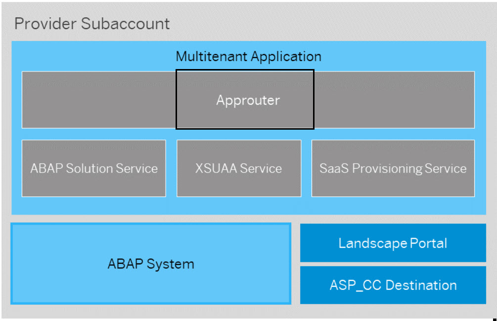
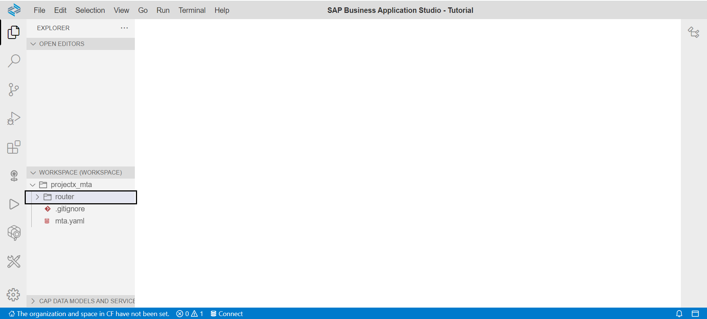
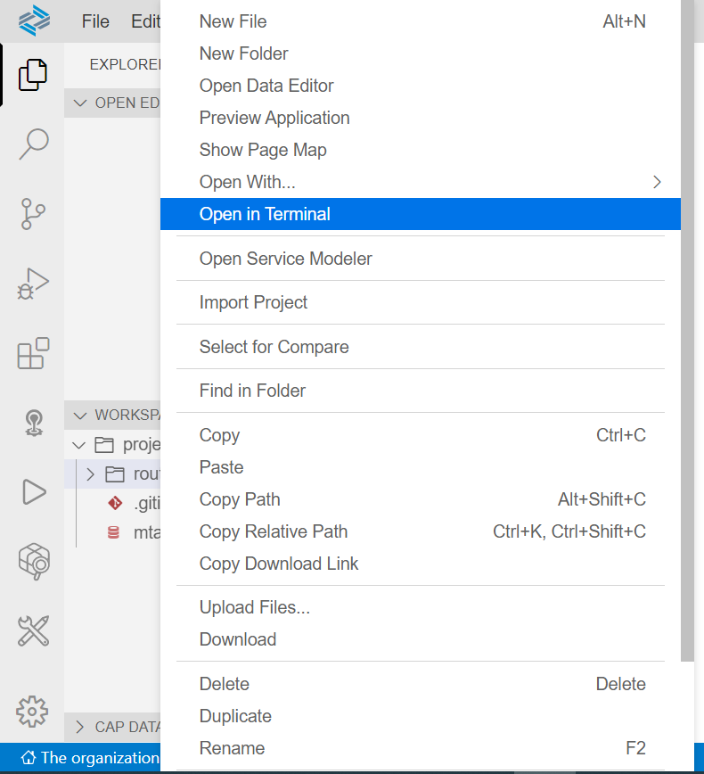
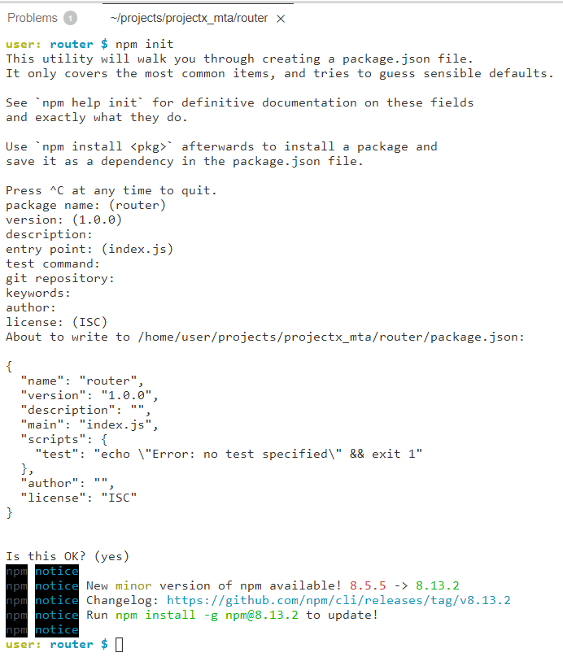
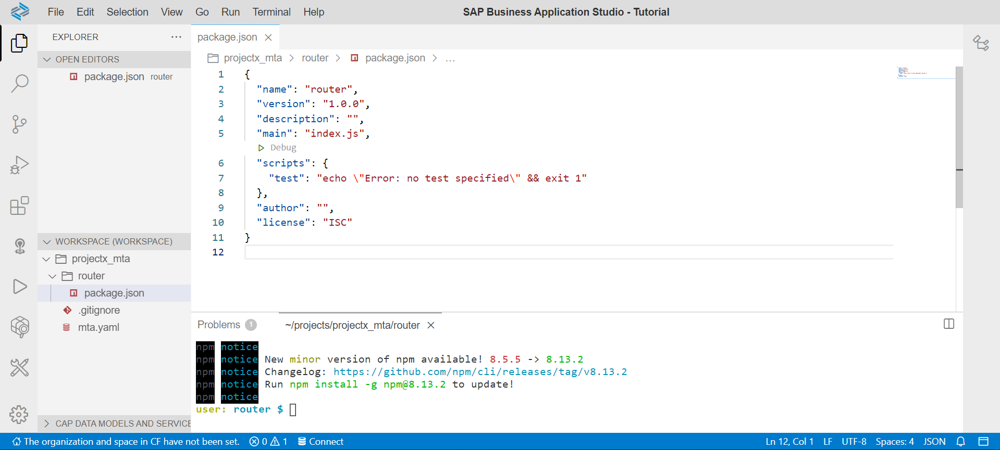
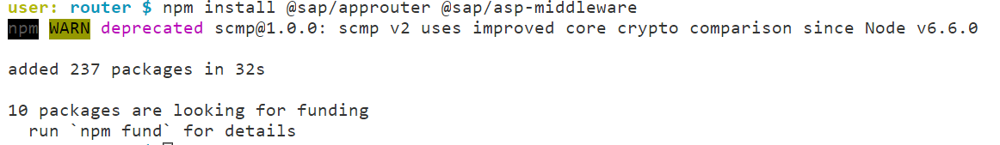
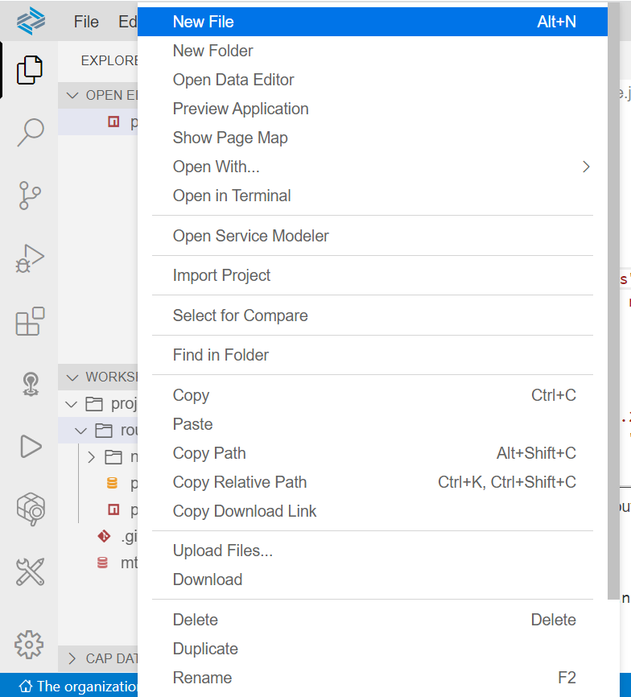
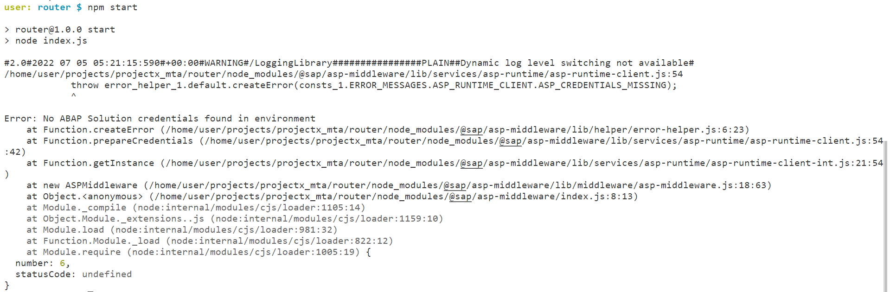

# Develop and Configure an approuter application for the multitenant application of the SaaS solution

<!-- description --> Develop and configure the approuter application for the multitenant application of the solution

## Prerequisites

- You have created an MTA project for the Multitenant Application in the Business Application Studio as per the previous tutorial of this group

## You will learn

- How to configure an approuter application.

---

### Create a Node.js project for the router

To authenticate business users of the application at runtime, use the tenant-aware approuter application and the XSUAA service in SAP Business Technology Platform. This will also provide the necessary callbacks for the SaaS Provisioning Service. In addition, we provide the middleware `@sap/asp-middleware` component that enhances the approuter to also take care of automatically routing the consumer to their ABAP tenant.

   

 1. Create a new folder called 'router'. This step happens in the Business Application Studio, in the project folder created in the previous tutorial

      
  
 2. Open a command prompt (terminal) in this folder

    

 3. Create a new project by executing the following command  

    ```Shell/Bash
    npm init
    ```

    In the upcoming wizard flow you can leave the defaults or define your own values if preferred

    

    Result: After the project is initialized, the package contains a package.json file  

    

 4. The `package.json` should have the following content (if the defaults are kept):  

 5. Replace your code
  
    ```JSON
    { 
      "name": "router",
      "version": "1.0.0",
      "description": "",
      "main": "index.js",
      "scripts": {
      "test": "echo \"Error: no test specified\" && exit 1"
      },
      "author": "",
      "license": "ISC",
    } 
    ```

### Install necessary dependencies

The '@sap/approuter' and the '@sap/asp-middleware' must be installed so that they can be used in the start script.

 1. Execute the following command in the terminal:

    ```Shell/Bash
    npm install @sap/approuter @sap/asp-middleware 
    ```

    

 2. Result: The two modules will be listed in the package.json as 'dependencies' and are downloaded into the node\_modules folder.

    Updated package.json (versions might differ):

    ```JSON
    {
       "name": "router",
       "version": "1.0.0",
       "description": "",
       "main": "index.js",
       "scripts": {
       "test": "echo \"Error: no test specified\" && exit 1"
       },
       "author": "",
       "license": "ISC",
       "dependencies": {
       "@sap/approuter": "^11.2.1",
       "@sap/asp-middleware": "^1.0.9"
       }
    }
    ```

### Add a start script

A start script needs to be added to prepare the application for execution in the Cloud Foundry Environment.

 1. To add a start script, add the following property under the `scripts` section of package.json

    ```JSON
    "start": "node index.js",
    ```

 2. The updated package.json looks as follows:

    ```JSON
    {
     "name": "router",
     "version": "1.0.0",
     "description": "",
     "main": "index.js",
     "scripts": {
     "start": "node index.js",
     "test": "echo \"Error: no test specified\" && exit 1"
     },
     "author": "",
     "license": "ISC",
     "dependencies": {
     "@sap/approuter": "^11.2.1",
     "@sap/asp-middleware": "^1.0.9"
     }
    }
    ```

### Create the start script index.js

 1. Create the file `index.js`. The  `index.js` file must be created in the `router` folder.

    

 2. The JavaScript code for the application must be written here. The minimum code required is the following:

    ```JavaScript
    const approuter = require('@sap/approuter');
    const ar = approuter();

    ar.start({
      extensions: [ require('@sap/asp-middleware') ]
    });
    ```

    It will load the approuter and the asp-middleware and ensures that both components are wired. Additionally, the approuter is started.

### Configure the routes

To make sure that the approuter routes all relevant requests to the ABAP Solution, a routing configuration file needs to be created and configured.

 1. Create a file named xs-app.json in the same folder where you created the index.js file. Add ABAP endpoint to both the routes.

    It should have the following content:

    ```JSON
    {
      "authenticationMethod": "route",
      "welcomeFile": "/ui",
      "logout": {
      "logoutEndpoint": "/sap/public/bc/icf/logoff",
      "logoutPage": "/ui"
      },
      "routes": [
      {
      "source": "^/sap/(.*)$",
      "target": "/sap/$1",
      "authenticationType": "xsuaa",
      "service": "com.sap.cloud.abap.solution",
      "csrfProtection": false,
      "endpoint": "abap"
      },
      {
      "source": "^/ui(.*)$",
      "target": "/ui$1",
      "authenticationType": "xsuaa",
      "service": "com.sap.cloud.abap.solution",
      "csrfProtection": false,
      "endpoint": "abap"
      }
      ]
    }
    ```

### Test the router

 1. To test that everything works, execute the below in your command prompt

    ```Shell/Bash
    npm start
    ```

    As a result, you should see the following error message: 'Error: No ABAP Solution credentials found in environment'.

    

    This tells us that the middleware was loaded as a dependency and that the start command is correct.

### Test yourself

---
