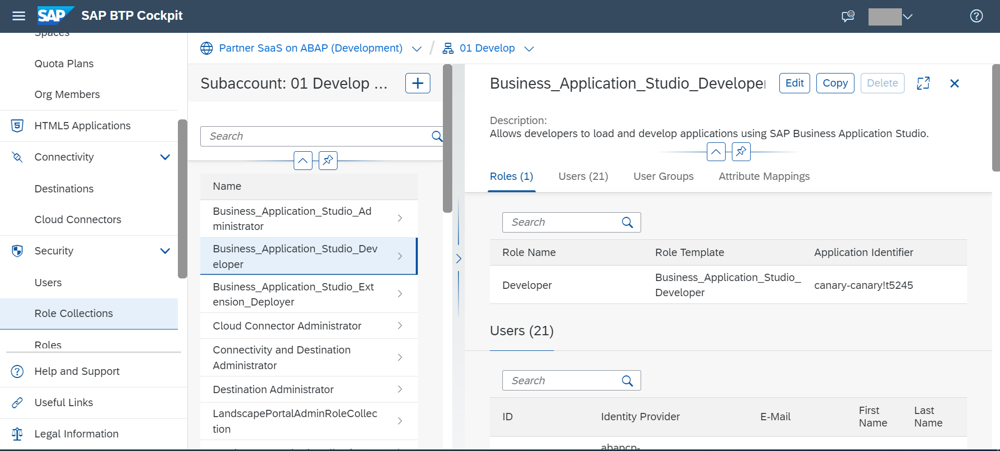

# Create an MTA project for the multitenant application using SAP Business Application Studio
<!-- description --> Create a new MTA project for the multitenant application of the solution using the SAP Business Application Studio

## Prerequisites
 - A user with Subaccount Administrator access to the 05 Provide sub-account

## You will learn
  - How to create an MTA project in the Business Application Studio

---

### Add Business Application Studio Developer role

As subaccount administrator of the 05 Provide sub-account, go to Security→role Collections

1. Select the `Business_Application_Studio_Developer` role collection.
2. Click Edit
3. Add the relevant users for development and MTA deployment
4. Save the changes

### Create a new dev space

1. Create a new Dev Space by clicking on "New"

2. Give a suitable name and add the MTA tools plugin (You may see a slightly different name depending on when you refer this tutorial)

3. Once the space is shown as "Running", open it.
You should see a welcome page

### Create New MTA Project from Template

1. Create a new Basic Multi-target Application Project from Template

2. Provide a unique project name to identify the application in your workspace  

3. Click Finish. You should see a project created with a generated "mta.yaml" file.

### Test Yourself

---
