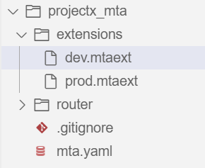

# Define your MTA resources and extension descriptors

<!-- description --> Configure the MTA.yaml file and  MTA extension descriptors for deployment to cloud foundry

## You will learn

- How to define modules and resources for a multitarget application
- The different services involved in SaaS enabling an add-on on SAP BTP, ABAP Environment

---

### Overview of necessary services

To SaaS enable an ABAP Solution, we use the following BTP services alongside the services needed for creation of ABAP systems (`abap/standard`) or  (`abap/saas_oem`)


1. ABAP Solution:

    ABAP Solution Service is used to enable multi-tenancy for ABAP Environment systems: Instead of creating the ABAP system manually it is created by the ABAP Solution service during the first subscription of an application consumer.

    Credentials provided in the ASP\_CC destination are used by ABAP Solution Service to authenticate at the Cloud Foundry Cloud Controller API endpoint and to create required ABAP service instances.

2. XSUAA:

    The XSUAA service instance acts as an OAuth 2.0 client to the Multitenant Application and to the ABAP Solution service instance. It provides access to the SaaS Provisioning service for calling callbacks and getting the dependencies API by granting corresponding scopes.

    A role collection is defined as part of the XSUAA configuration which provides authorization for the initial user onboarding in the new ABAP tenant after a subscription was done.

3. SaaS Provisioning Service:

    The SaaS Provisioning service allows application providers to register applications and services in the Cloud Foundry environment in SAP Business Technology Platform.

### Define parameters

In your Business Application Studio dev space, access the project you created in the tutorial 'Create an MTA project for the Multitenant Application using SAP Business Application Studio' and open the mta.yaml file. The MTA file starts with the schema version, ID of the MTA and the MTA version. You can pick your own ID and version, the schema-version should be kept as is.

```YAML
_schema-version: "3.1"
ID: tutorial_mta
version: 0.0.1
```

To define parameters which can be reused in further sections, add the following snippet to the mta.yaml file

```YAML
parameters:
  app-domain: ${default-domain}
  route-prefix: -${appname}
  appname: 
  addon-product-name:
  provider-admin-email:
  saas-display-name:
  saas-description:
  tenant-mode:
  enable-parallel-deployments: true
```

|Field Name    | Description|
|--------------|------------|
|appname    | Name of your SaaS Application|
|addon-product-name | Name of your registered add-on product |
|saas-display-name | Name what your consumer shall see while subscribing |
|tenant-mode | Define whether you have a single/multi mode  - which defines whether you    shall have multiple tenants  |
|provider-admin-email | Email id of your administrator |

The resultant mta.yaml file shall look as follows:

```YAML
_schema-version: "3.1"
ID: tutorial_mta
version: 0.0.1

parameters:
  app-domain: ${default-domain}
  route-prefix: -${appname}
  appname: ProductX
# The registered add on product name
  addon-product-name: /NAMESPC/PRODUCTX
# Administrator for the SaaS Solution
  provider-admin-email: administrator@example.com
# What your consumer shall see while subscribing
  saas-display-name: Product X
  saas-description: Do A, B, C
# Single/Multi - To define whether you shall have multiple tenants/consumers in one ABAP system v/s a single tenant/consumer per system
  tenant-mode: multi
  enable-parallel-deployments: true
```

### Define MTA module for the approuter

The modules for our SaaS application must be defined. In our case, that's only the 'approuter'. Keep in mind that all values under 'properties' will be available as environment variables to the application once deployed

Furthermore, it is assumed that the source code to the approuter is in the folder 'router' next to the `'mta.yaml'` as defined by the 'path' property

The syntax defined with "${name}" is picked from the parameters of the same name. For example, `${appname}` shall pick `"ProductX"` as per the parameter value defined in the previous step

```YAML
modules:
  - name: approuter
    type: javascript.nodejs
    path: router
    parameters:
      keep-existing-routes: true
      routes:
        - route: cis${route-prefix}.${app-domain}
      app-name: ${appname}
      memory: 1024MB
    properties:
      TENANT_HOST_PATTERN: (.*)${route-prefix}.${app-domain}
      XS_APP_LOG_LEVEL: error
      SAP_JWT_TRUST_ACL:
        - clientid: "*"
          identityzone: sap-provisioning
    requires:
      - name: tutorial_xsuaa
      - name: tutorial_saas-registry
      - name: tutorial_abap-solution
        parameters:
          config:
           abap_endpoint_timeout: 6000
```

The resultant mta.yaml file looks similar to the following with property values reflecting your context. Here, some values are also added for the various parameters defined earlier:

```YAML
_schema-version: "3.1"
ID: tutorial_mta
version: 0.0.1

parameters:
  app-domain: ${default-domain}
  route-prefix: -${appname}
  appname: TutorialSample  
  addon-product-name: /NAMESPC/ProductX
  provider-admin-email: administrator@example.com
  saas-display-name: Tutorial
  saas-description: Sample SaaS Application for Tutorial
  tenant-mode: multi
  enable-parallel-deployments: true

modules:
  - name: approuter
    type: javascript.nodejs
    path: router
    parameters:
      keep-existing-routes: true
      routes:
        - route: cis${route-prefix}.${app-domain}
      app-name: ${appname}
      memory: 1024MB
    properties:
      TENANT_HOST_PATTERN: (.*)${route-prefix}.${app-domain}
      XS_APP_LOG_LEVEL: error
      SAP_JWT_TRUST_ACL:
        - clientid: "*"
          identityzone: sap-provisioning
    requires:
      - name: tutorial_xsuaa
      - name: tutorial_saas-registry
      - name: tutorial_abap-solution
        parameters:
          config:
           abap_endpoint_timeout: 6000
```

### Define MTA resources

Define the resources for XSUAA, SaaS Registry and the ABAP Solution Service

1. XSUAA instance needs parameters to be configured as described [here](https://help.sap.com/docs/BTP/65de2977205c403bbc107264b8eccf4b/6069e4efa8bc456997c9a25abdb69a43.html?version=Cloud)

2. The SaaS Provisioning Service needs the parameters as described [here](https://help.sap.com/docs/BTP/65de2977205c403bbc107264b8eccf4b/8be9a3a51232402082480914e020b2d3.html?version=Cloud)

3. The ABAP Solution Service needs the parameters as described [here](https://help.sap.com/docs/BTP/65de2977205c403bbc107264b8eccf4b/4370115a59a248cd876f0721303eaaab.html?version=Cloud)

The resources section could look as follows:

```YAML
resources:
  - name: tutorial_xsuaa
    type: com.sap.xs.uaa
    requires:
      - name: tutorial_abap-solution
    parameters:
      service-plan: application
      service-name: xsuaa
      config:
        xsappname: ${appname}
        tenant-mode: shared
        scopes:
          - name: $XSAPPNAME.Callback
            description: With this scope set, the callbacks for tenant onboarding, offboarding and getDependencies can be called.
            grant-as-authority-to-apps:
              - $XSAPPNAME(application,sap-provisioning,tenant-onboarding)
        foreign-scope-references:
          - uaa.user
        role-collections:
          - name: ${appname}-admin
            role-template-references:
              - $XSSERVICENAME(tutorial_abap-solution).SolutionAdmin

  - name: tutorial_saas-registry
    type: org.cloudfoundry.managed-service
    parameters:
      service: saas-registry
      service-plan: application
      service-name: saas-registry
      config:
        xsappname: ${appname}
        appName: ${appname}
        appUrls:
          getDependencies: https://cis${route-prefix}.${app-domain}/callback/v1.0/dependencies
          onSubscription: https://cis${route-prefix}.${app-domain}/callback/v1.0/tenants/{tenantId}
        displayName: ${saas-display-name}
        description: ${saas-description}

  - name: tutorial_abap-solution
    type: org.cloudfoundry.managed-service
    parameters:
      service: abap-solution
      service-plan: standard
      service-name: abap-solution
      config:
        name: ${appname}
        addon_product_name: ${addon-product-name}
        size_of_runtime: 1
        size_of_persistence: 4
        tenant_mode: ${tenant-mode}
        consumer_id_pattern: ([^-]*).*
        provider_admin_email: ${provider-admin-email}
        usage: prod
        xs-security:
          xsappname: ${appname}
```

The full MTA descriptor (mta.yaml file) looks as follows (customized to your context):

```YAML
_schema-version: "3.1"
ID: tutorial_mta
version: 0.0.1

parameters:
  app-domain: ${default-domain}
  route-prefix: -${appname}
  appname: TutorialSample  
  addon-product-name: /NAMESPC/ProductX
  provider-admin-email: administrator@example.com
  saas-display-name: Tutorial
  saas-description: Sample SaaS Application for Tutorial
  tenant-mode: multi
  enable-parallel-deployments: true

modules:
  - name: approuter
    type: javascript.nodejs
# Path to the folder where the approuter module is defined with package.json, index.js and xs-app.json    
    path: router
    parameters:
      keep-existing-routes: true
# Routes for various subscriptions/callbacks
      routes:
        - route: cis${route-prefix}.${app-domain}
# Name of the application that shall be seen in the space under the applications tab in BTP cockpit
      app-name: ${appname}
# Run-time memory of the application - Value should be less than (1024 * units of entitlements for cloud foundry runtime-memory in the provider sub-account)
      memory: 1024MB
    properties:
# The application router derives the tenant from the URL(cf route) and calls the tenant-aware XSUAA
# Then, the XSUAA delegates the authentication to the configured IdP, and creates a JSON Web Token (JWT) that contains
# the tenant, the current user, and the authorization scopes of the user.
# The JWT is then sent back to the application router, and from there to the application.
      TENANT_HOST_PATTERN: (.*)${route-prefix}.${app-domain}
# The approuter contains logs which can be referred in case of errors/failures. The XS_APP_LOG_LEVEL defines the level of detail of this log
      XS_APP_LOG_LEVEL: error
      SAP_JWT_TRUST_ACL:
        - clientid: "*"
          identityzone: sap-provisioning
    requires:
      - name: tutorial_xsuaa
      - name: tutorial_saas-registry
      - name: tutorial_abap-solution
        parameters:
          config:
           abap_endpoint_timeout: 6000
resources:
  - name: tutorial_xsuaa
    type: com.sap.xs.uaa
    requires:
      - name: tutorial_abap-solution
    parameters:
      service-plan: application
# The service-name of the service instance that shall be created in the provider sub-account. Must be unique   
      service-name: tutorial_xsuaa
      config:
        xsappname: ${appname}
        tenant-mode: shared
# Provide access to the SaaS Provisioning service (saas-registry) for calling
# callbacks and getting the dependencies API by granting scopes
        scopes:
          - name: $XSAPPNAME.Callback
            description: With this scope set, the callbacks for tenant onboarding, offboarding and getDependencies can be called.
            grant-as-authority-to-apps:
              - $XSAPPNAME(application,sap-provisioning,tenant-onboarding)
# To ensure a token exchange will be possible and the ABAP systems can be called
        foreign-scope-references:
          - uaa.user
# Provides authorization for the initial user onboarding in the new ABAP tenant after a subscription was done.
# It must reference the 'SolutionAdmin' Role Template of the ABAP Solution service instance
        role-collections:
          - name: ${appname}-admin
            role-template-references:
              - $XSSERVICENAME(tutorial_abap-solution).SolutionAdmin

  - name: tutorial_saas-registry
    type: org.cloudfoundry.managed-service
    parameters:
      service: saas-registry
      service-plan: application
      service-name: tutorial_saas-registry
      config:
        xsappname: ${appname}
        appName: ${appname}
        appUrls:
          getDependencies: https://cis${route-prefix}.${app-domain}/callback/v1.0/dependencies
          onSubscription: https://cis${route-prefix}.${app-domain}/callback/v1.0/tenants/{tenantId}
        displayName: ${saas-display-name}
        description: ${saas-description}

  - name: tutorial_abap-solution
    type: org.cloudfoundry.managed-service
    parameters:
      service: abap-solution
      service-plan: standard
      service-name: tutorial_abap-solution
      config:
        name: ${appname}
        addon_product_name: ${addon-product-name}
        size_of_runtime: 1
        size_of_persistence: 4
        tenant_mode: ${tenant-mode}
        consumer_id_pattern: ([^-]*).*
        provider_admin_email: ${provider-admin-email}
        usage: prod
        xs-security:
          xsappname: ${appname}
```

### Define MTA extension descriptors

The parameters defined in the MTA can be adapted for the corresponding landscape using MTA extension descriptor files. These files extend the original MTA descriptor file (mta.yaml) and allow it to change certain values during deployment.

- Create a folder named "extensions" alongside the mta.yaml file

- Create a file in the extensions folder named "dev.mtaext". This is our development descriptor. It could have the following content (customize to your context):  

```YAML
ID: tutorial_mta-dev
_schema-version: "3.1"
extends: tutorial_mta-solution

parameters:
  addon-product-name:  /NAMESPC/PRODUCTX
# Avoid special characters or mixed casing in the name. Alternately, the TENANT_HOST_PATTERN parameter needs to be adapted to accommodate special characters
  appname: tutorial
  provider-admin-email: administrator@example.com
  saas-description: "ABAP based SaaS solution with an ABAP tenant per subscription"
  saas-display-name: "SaaS Solution (Multitenancy)"
  tenant-mode: multi

modules:
  - name: approuter
    properties:
      XS_APP_LOG_LEVEL: debug
```

- Similarly, create a file named "prod.mtaext" in the extensions folder with the following content:

```YAML

ID: tutorial_mta-prod
_schema-version: "3.1"
extends: tutorial_mta

parameters:
  addon-product-name: /NAMESPC/PRODUCTX
  appname: tutorial_mta
  provider-admin-email: administrator@example.com
  saas-description: "ABAP based SaaS solution with an ABAP tenant per subscription"
  saas-display-name: "SaaS Solution (Multitenancy)"
  tenant-mode: multi
  route-prefix: ""
  app-domain: mydomain.com

modules:
  - name: approuter
    parameters:
      routes:
        - route: "cis${route-prefix}.${app-domain}"
        - route: "*${route-prefix}.${app-domain}"
```

Depending on the stage of implementation of the multitenant application, a different approuter configuration is being used. This is controlled via different extension descriptor files used during MTA deployment.

The workspace looks as follows after both files are created:



### Test yourself

---
