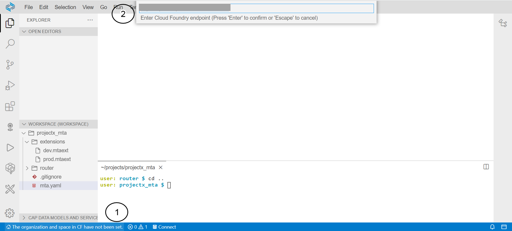
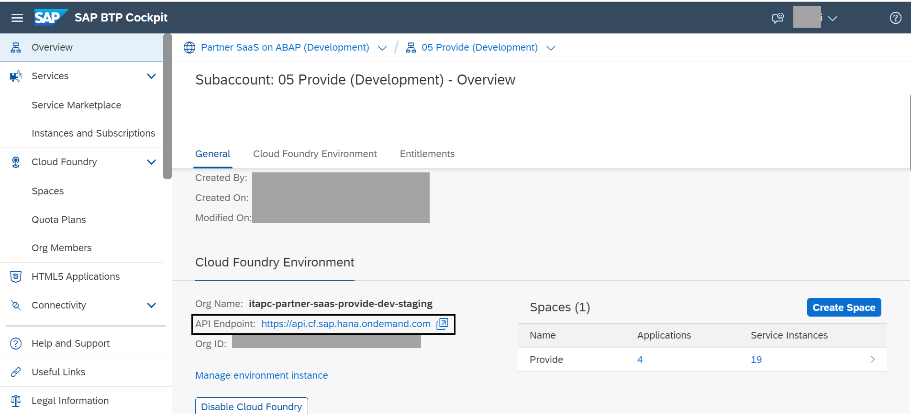
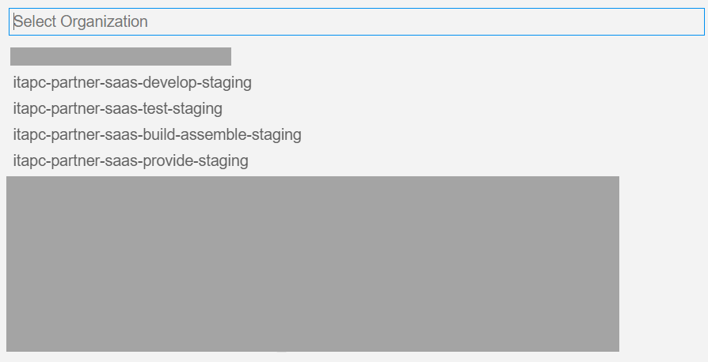
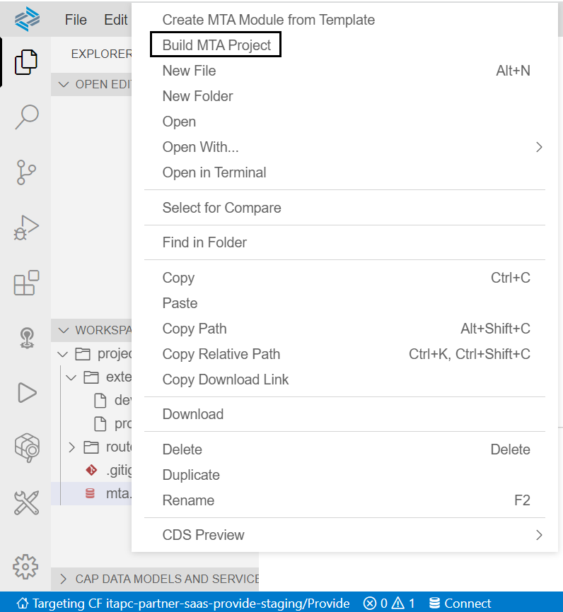
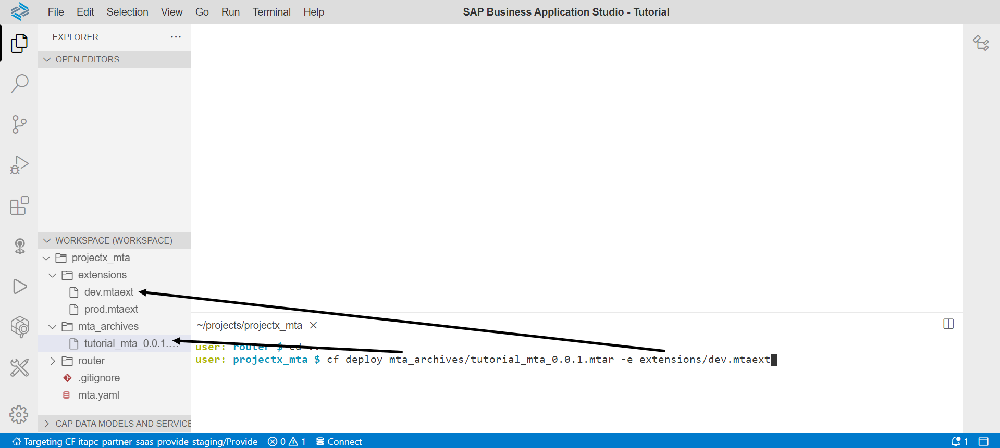
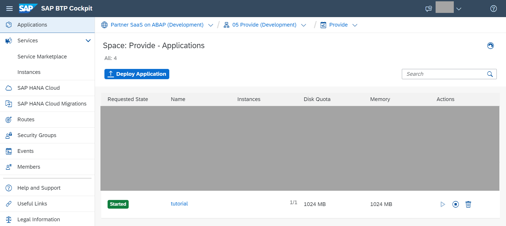
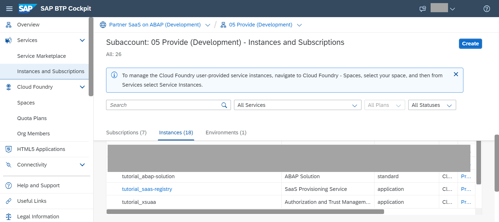
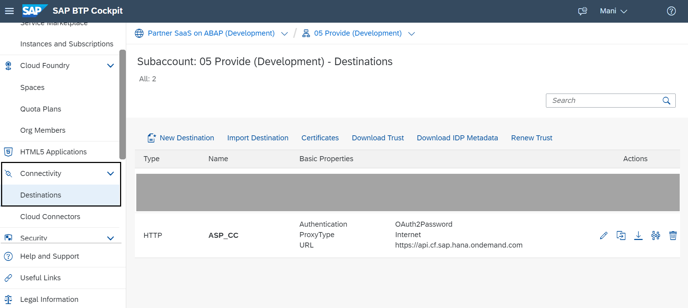
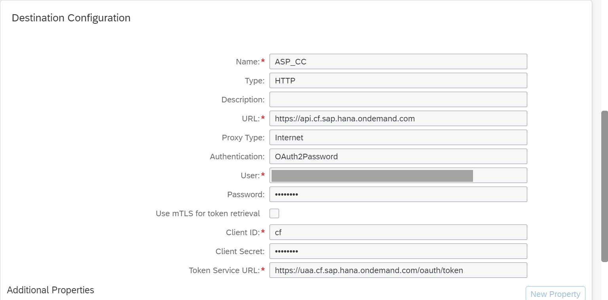

# Deploy and enable the SaaS application for consumer access

<!-- description --> Build and deploy the MTA, configure destinations to enable the SaaS application for consumer access

## Prerequisites

- Entitlements for `abap/saas_oem` system, Cloud Foundry Runtime, ABAP Solution service, SaaS Registry, XSUAA.

## You will learn

- How to deploy your MTA application to cloud foundry
- Verify the services created via MTA deployment

---

### Connect to the provider subaccount from the Business Application Studio

Before we can deploy the services, we need to connect to the right subaccount and space.

1. Click the banner at the bottom of the Business Application Studio with text "The organization and space in CF have not been set"
    

2. Enter your Cloud Foundry API endpoint. This can be found in the BTP cockpit in the overview section of your 05 Provide subaccount in the global account for development
    

3. Enter your Cloud Foundry username and password

4. Select the organization from the list. This information is also available in the BTP    cockpit where you found the Cloud Foundry API endpoint
    

5. Select the space within the organization where the services shall be created
    

### Build and deploy your MTA project

1. Right click on the mta.yaml file and select 'Build MTA Project' and wait for it to be built.
    

2. In the terminal, navigate to the folder which contains your mta.yaml file. If you are in the router folder, this can be achieved with the command.

    ```Shell/Bash
    cd .. 
    ```.

    > Note: The terminal from the build cannot be re-used and a new one needs to be opened

3. Execute the following command to deploy to Cloud Foundry. During the MTA build, an MTA archive file is automatically created with the MTA ID acting as the file name. A similar process could be followed using the prod extension descriptor in the global account for production after tests are satisfactory in the global account for development.

    ```Shell/Bash
    cf deploy mta_archives/tutorial_mta_0.0.1.mtar -e extensions/dev.mtaext
    ```. 
    

### Verify the services are created and the approuter is started

Verify that the services and approuter are created and that the approuter has started.

The approuter can be found by navigating to the space connected with the Business Application Studio.



The services can be found by navigating to the 'Instance and Subscriptions' section of the BTP cockpit in the subaccount connected to the Business Application Studio (here the subaccount would be '05 Provide' and the space would be 'Provide')



### Create a destination for the Cloud Foundry Cloud Controller access

As a provider, you need to create a destination to the Cloud Foundry Cloud Controller API. The destination will be used to enable the creation of service instances, service keys etc.

> Note: The user maintained in the destination needs to have 'Space Developer' role assigned. It is recommended to use a technical user instead of a personal user.

1. Navigate to the provider subaccount (05 Provide)

2. Navigate to Connectivity → Destinations
    
3. Create a new destination named ASP\_CC

    ```JSON
    Name: ASP_CC
    Type: HTTP
    Description: <optional>
    URL: <enter the API Endpoint domain of your cloud foundry landscape. You can find it under your subaccount > Overview. Example: https://api.cf.eu10.hana.ondemand.com
    Proxy Type: Internet
    Authentication: OAuth2Password
    User: <User ID/E-mail>
    Password: <password>
    Client ID: cf
    Client Secret <needs to be left blank>
    Token Service URL: http://uaa.<landscape-host>/oauth/token Example: https://uaa.cf.eu10.hana.ondemand.com/oauth/token 
    ```

For more information around the token service URL, see [Regions and API Endpoints for the ABAP Environment](https://help.sap.com/docs/BTP/65de2977205c403bbc107264b8eccf4b/879f37370d9b45e99a16538e0f37ff2c.html)
    
4. Save

### Test yourself

---
