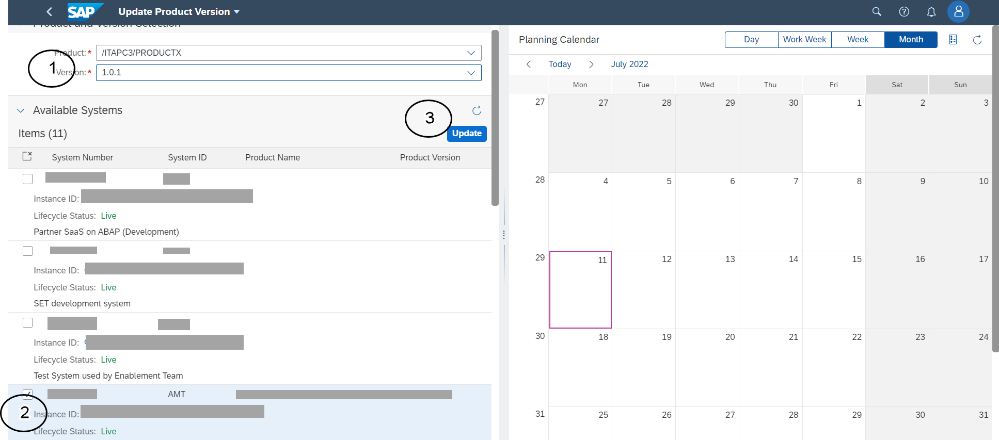
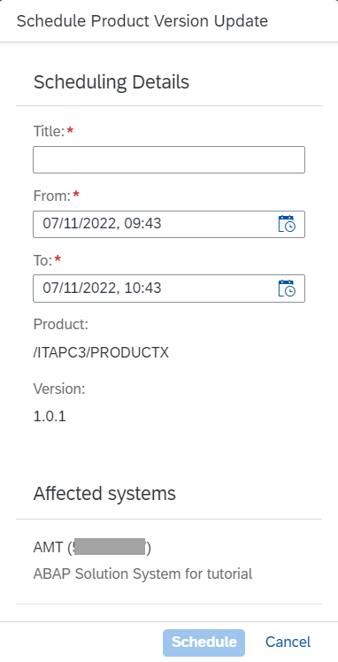
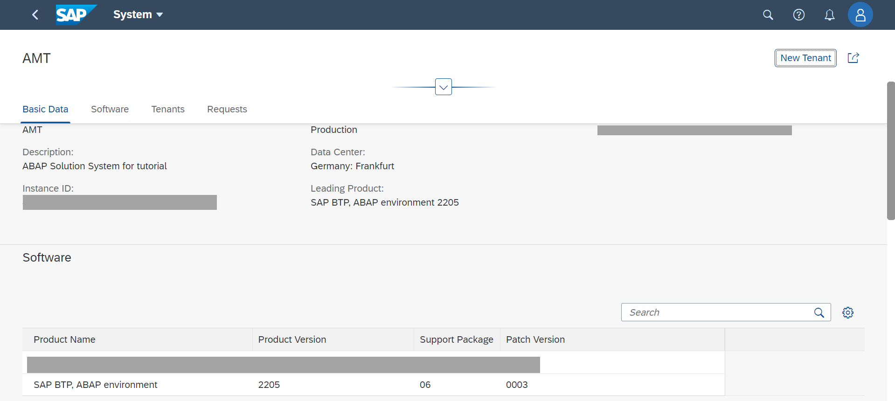
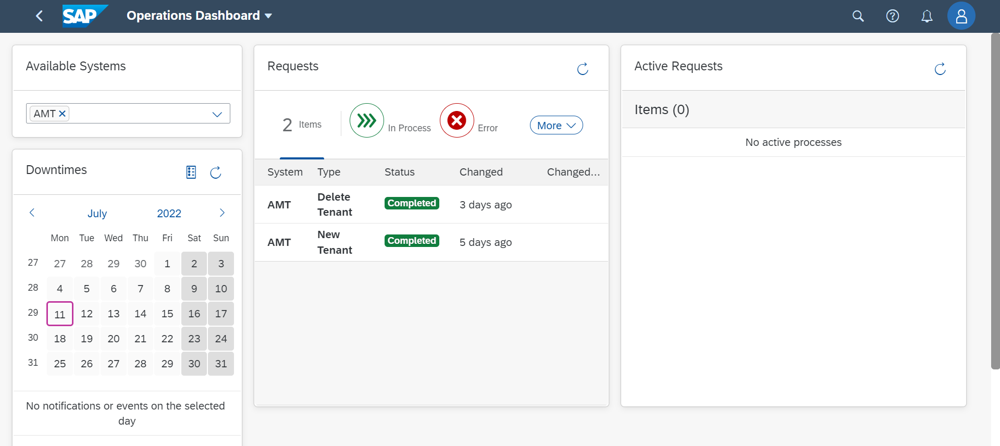
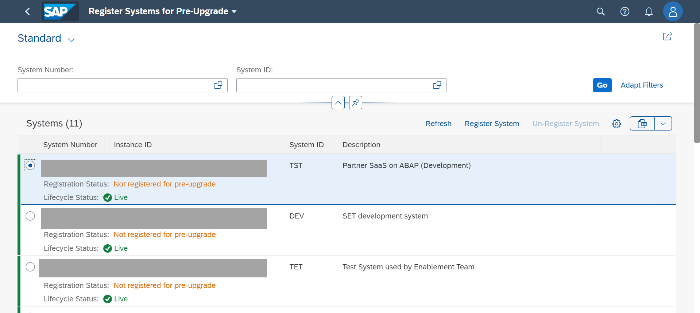
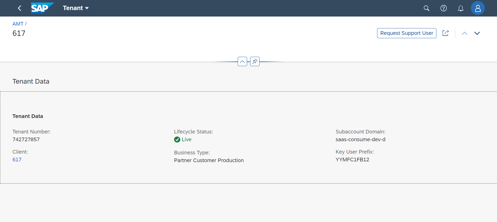
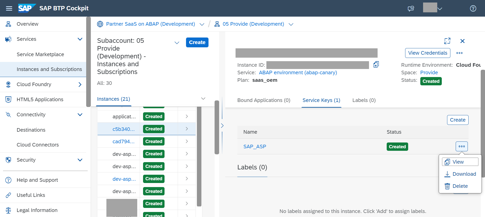

# Maintain and support your SaaS solution

<!-- description --> Overview of tools to maintain the landscape and support consumers of the SaaS solution

## Prerequisites

- You are subscribed to the Landscape Portal
- You have a user with the Landscape Portal Admin role collection assigned

## You will learn

- About the available tools to support, maintain and operate the SaaS solution

---

### Create an updated version of your add-on product

You can update your solution with patches, support packages, or new releases. Create a new branch from the main branch in test system TST in your 01 Develop subaccount for every support package or new release. For minor changes, continue developing in the respective active maintenance branch.

[OPTION BEGIN [Create Patch Version]]

  Patch versions are used to deliver unplanned and urgent corrections that are required to keep the application up and running.

  1. Import maintenance branch v1.0.0 in ABAP correction system COR. This could be another system in the 01 Develop subaccount.

  2. Implement the bug fix in the ABAP correction system.

  3. Import maintenance branch v1.0.0 in ABAP quality assurance system QAS. This could be another system in the 02 Test subaccount.

  4. Test the bugfix in ABAP quality assurance system QAS.

  5. Maintain the corrections that have been developed and tested in ABAP correction system COR and quality assurance system QAS in the development system DEV (so called double-maintenance). For more details on the process, see [Double Maintenance of Corrections into Development](https://help.sap.com/docs/BTP/65de2977205c403bbc107264b8eccf4b/1241b144b83b4ca9a317db326e36950d.html?locale=en-US&version=Cloud)

  6. Use the Build Product Version app of the landscape portal as described in previous tutorials of this mission to build a new patch version.

[OPTION END]

[OPTION BEGIN [Create support package]]

Support package versions are used to deliver planned functional enhancements outside of new major releases. They are often used to bundle multiple patch versions.

   1. Implement the new feature in the main branch in ABAP development system DEV.

   2. Make sure the main branch is imported in ABAP test system TST.

   3. Test new feature in ABAP test system TST.

   4. In the Manage Software Components app, create a new maintenance branch v1.1.0 (for a support package).

   5. Use the Build Product Version app of the landscape portal as described in previous tutorials of this mission to build a new support package version.

[OPTION END]

[OPTION BEGIN [Create release version]]

Release versions are used to deliver new major, planned functional enhancements. Typically, they include multiple new implemented features. For example, multiple new apps could be introduced with such a major release.

  1. Implement the new feature in the main branch in ABAP development system DEV.

  2. Make sure the main branch is imported in ABAP test system TST.

  3. Test new feature in ABAP test system TST.

  4. In the Manage Software Components app, create a new maintenance branch v2.0.0 (for a release version) that is based on the main branch.

  5. Use the Build Product Version app of the landscape portal as described in previous tutorials of this mission to build a new release version.

[OPTION END]

### Update the add-on version in the multi-tenant system

Navigate to the Landscape Portal as a Landscape Portal Admin.

  1.Open the "Update Product Version" app

  2.On the right side of the screen, you can see the Planning Calendar. The planning calendar gives an overview of planned and unplanned downtimes of service-relevant infrastructure as well as already scheduled product version updates. You can use the calendar to help you find a fitting time slot for your product version update so as to make sure that it doesn't conflict with other downtimes

  3.On the left side, under Product and Product Version Selection, select which product and version you want to update from the drop-down menu

> The product version can only be updated to a higher version. It is not possible to update the product version to a lower version.

  4.In the Available Systems section, select at least one system in which you want to update the product version. You can also select multiple systems at once

    

  5.Click the Update button. Fill in the required details in the dialog

  6.Click Schedule

    

### Verify, update and monitor the process

1. Navigate to the "Systems Overview" app in the Landscape Portal
2. Click on the entry for the system that was created for your SaaS application. You could identify it from the system description "ABAP Solution System for `appname`" or via the SID. If a `sap_system_name` was defined in the configuration of the ABAP solution, systems are provisioned with same SID. If no `sap_system_name` was defined, systems are provisioned with SID = AST or SID = AMT, depending on whether the solution was created with tenant_mode = single or tenant_mode = multi.

3. Once the update scheduled in the previous step is complete, the "Software" section should reflect the new product version for the add-on

    

4. Under the "Requests" section, you could monitor the update process

### Monitor operations in your landscape

To monitor operations processes like add-on update or tenant provisioning in your system landscape

  1. Open the "Operations Dashboard" app of the Landscape Portal as a Landscape Portal Admin
  2. Use the dropdown to select the system(s) for which you want to monitor operations.
  3. The Requests section displays a list of all requests triggered for your systems as well as their current status.
  4. In the Active Requests section, you can view all active processes, their request IDs, execution date, systems, and their progress bars
    

### Register systems for pre-upgrade

When a quarterly platform upgrade of the ABAP Environment is planned for your systems, the "Register Systems for Pre-Upgrade" app of the Landscape Portal allows you to select specific test or development systems for an early upgrade. These systems will be upgraded two weeks before the official roll-out, giving you ample time to test your solution as a provider prior to the actual upgrade.

Only pre-upgrade dedicated test systems. Pre-upgrading development systems or systems used for add-on build could result in issues with minimum platform version determined for add-on product versions.

1. Select the system that you want to register for a pre-upgrade.

2. Click the "Register System" button.

3. Refresh the page by clicking on the Refresh button. The status of your system has changed from "Not registered for pre-upgrade" to "Registered for pre-upgrade".

4. If you change your mind and want to undo the registration of a system for pre-upgrade, simply select the system and click the "Un-Register System" button.

  

### Provide support for your SaaS solution

[OPTION BEGIN [Support via Fiori Launchpad]]

1. Log in to the Landscape Portal and open the "Systems Overview" app.

2. Select the system that contains the tenant for which you would like to create a support user.

3. Navigate to the tenant for which you would like to create a support user.

4. Click on the "Request Support User" button in the upper right corner of the page.

5. Once the user creation is done, you can log on to the Fiori Launchpad of the tenant via the link in the tenants overview.

>Note: You need to subscribe to the service "Web Access for ABAP" on the BTP cockpit in order to gain access

  

[OPTION END]

[OPTION BEGIN  [Support via ABAP Development Tools for Eclipse]]

To logon to ABAP Development Tools and provide support, we broadly perform the following activities:

- Retrieve the service key for the targeted ABAP System.
- Retrieve the tenant GUID of the targeted ABAP tenant.
- Create a tenant-specific service key.
- Use the created service key to login to the target tenant using an ABAP Cloud Project in ABAP   Development Tools.

Retrieve the service key for the targeted ABAP System:

  1. Navigate to the provider account's service instances.

  2. Select the ABAP service instance.

  3. Open and copy the SAP\_ASP service key.

    

Retrieve the tenant GUID of the targeted ABAP tenant:

  1. Sign in to the Landscape Portal.

  2. Copy the link of the client column of the target tenant.

  3. Extract the tenant GUID from the URL.

Create a tenant-specific service key-To do this, replace the GUID in the URL field of the service key from the "Retrieve the service key for the targeted ABAP System" step with the tenant GUID.

Use the created service key to login to the target tenant using an ABAP Cloud Project in ABAP Development Tools.

[OPTION END]

### Test yourself

---
